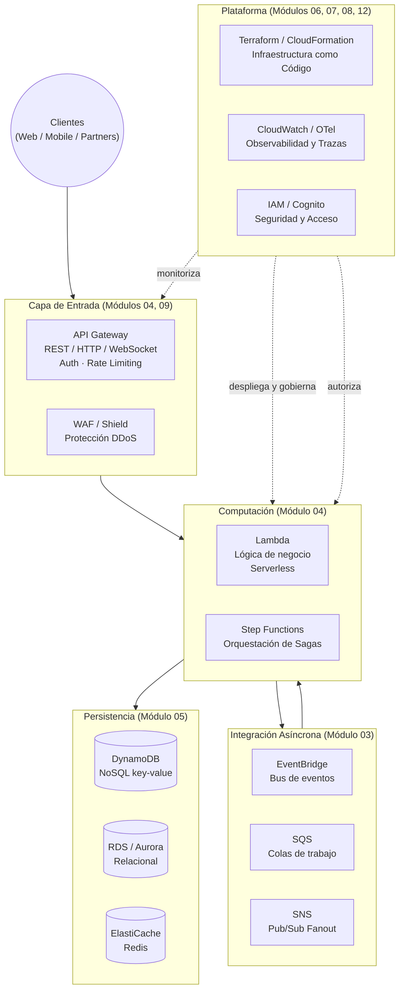
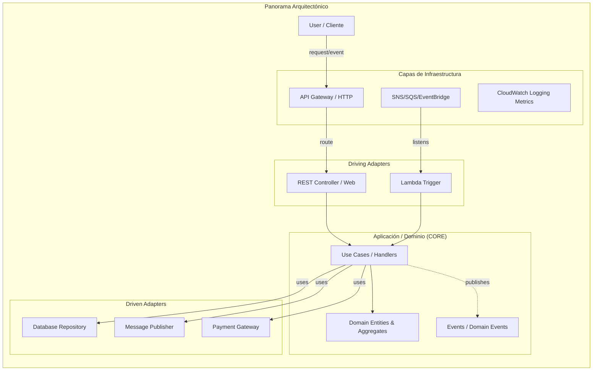

# Módulo 01 — Arquitectura de Software Moderna

> **Objetivo profesional:** Dejar de hablar de "Clean Architecture", "Microservicios" y "Vertical Slice" como modas o buzzwords. Aprender **cuándo, POR QUÉ y QUÉ PAGAS** por cada estilo, cómo se evalúan en un Software Architect real, cómo aparecen en entrevistas de empresas top-tier (Amazon, Stripe, Mercado Libre, AgileEngine) y cómo DEFENDER tus decisiones técnicas desde una lógica de negocio, no de dogma.

> Este módulo es el mapa inicial del libro. Los detalles de DynamoDB, Caching, Event-Driven, Serverless o IaC tendrán módulo propio (04–12). Aquí construimos el mapa de TODAS las arquitecturas y el framework de decisión que usarás en los 15 módulos restantes.

**Mecanismos suplementarios de este módulo:** Fitness Functions, Contract Testing, estrategias de despliegue internas, ADRs, comparativa SQL/NoSQL aplicada a arquitectura y testing piramidal se cubren en el **Apéndice A** (`01-Arquitectura-de-Software-Moderna-Apendice-A.md`), enlazado al final.

---

## Introducción

Si has trabajado en sistemas heredados, habrás notado que el código de **jueves a viernes** se comporta como un monstruo distinto al de lunes a miércoles. No es el humor del equipo: sucede porque **la arquitectura no es un artefacto técnico estático; es una negociación viva entre cambio constante, complejidad, trade-offs económicos y performance.**

En este módulo dejamos atrás el marketing de los vendors. Visualiza la arquitectura como el _"conjunto de decisiones que limitan lo que va a pasar después"_. Todo lo demás en la guía (Microservicios, DDD, Serverless, IaC, Observabilidad, Seguridad, System Design) descansa sobre estas bases. Si dominas los principios estructurales, elegir servicios específicos (por ejemplo, Amazon MSK en lugar de RabbitMQ para alto throughput de eventos, o EventBridge sobre SNS/SQS según latencia, routing y fan-out) se vuelve disciplina y no moda.

Contenido de este módulo: historia, evolución, monolitos, capas, SOA, microservicios, Clean, Hexagonal, Onion, **Vertical Slice**, arquitectura dirigida por eventos, **cómo elegir una arquitectura desde criterios prácticos**, y la psicología que diferencia a un Software Developer de un Software Architect (metodología de trade-offs y frameworks de pensamiento). Al terminar, no necesitarás preguntarle a nadie "¿tú qué usarías?" para un proyecto de pagos, pedidos, delivery o IoT: lo evaluarás tú mismo con requisitos de negocio claros.

---

## Conceptos

### ¿Qué es realmente la Arquitectura de Software?

Definición práctica que elimina ruido:

> **Arquitectura de software son las decisiones estructurales de un sistema que son difíciles, costosas o complejas de cambiar una vez implementadas, y que limitan o definen cómo los componentes colaboran para satisfacer funcionalidad, calidad, restricciones legales/técnicas y negocio.**

Nota los elementos clave:

- **Decisiones, no documentos.** Un wiki de 200 páginas no es arquitectura; lo que el código realmente hace, sí.
- **Costosas/difíciles de revertir.** Cambiar una conexión de REST a gRPC entre cinco servicios es mucho más caro que cambiar cuántas columnas tiene una tabla o cómo formateas un log.
- **Estructurales:** componentes, relaciones, colas, APIs internas, divisiones lógicas por dominio.
- **Limitan/comunican:** definen el entorno en el que el equipo codifica a lo largo del tiempo.

Una confusión crítica en entrevistas (y en la práctica) es mezclar:

| Concepto         | Qué es                                       | Ejemplos                                                                                                                                             | Reversibilidad                                   |
| ---------------- | -------------------------------------------- | ---------------------------------------------------------------------------------------------------------------------------------------------------- | ------------------------------------------------ |
| **Arquitectura** | Decisiones duras de cambiar                  | Comunicación entre servicios (REST vs gRPC vs eventos), modelo de datos (SQL vs NoSQL), propiedad (ownership) de los datos, estrategia de despliegue | Semanas/meses, a veces imposible sin reescritura |
| **Diseño**       | Decisiones ligeras dentro de la arquitectura | Patrones internos de clases, estilos CSS, formato de logs, librería de parsing CSV                                                                   | Días, a veces minutos                            |

**Pregunta de autodiagnóstico:** Si murieras mañana y otro equipo retomara este código en dos años, ¿qué decisiones les harían sudar o bendecirte? Eso es arquitectura. "¿Qué framework de React uso?" generalmente no lo es.

### Falacias de la Computación Distribuida

No son humor. Son ocho premisas falsas que causan _bugs y outages_ incontables. Llévalas al front-end de cualquier decisión:

1. **La red es confiable.** (No lo es. Usa retries, circuit breakers, timeouts.)
2. **La latencia es cero.** (No lo es. Una llamada intra-proceso vs inter-servicio puede ser 100x–1000x diferente.)
3. **El ancho de banda es infinito.** (No lo es. Payloads grandes saturan enlaces y encarecen cloud.)
4. **La red es segura.** (No lo es. Asume zero-trust, encripta en tránsito y reposo.)
5. **La topología no cambia.** (Cambia constantemente. IPs efímeras, auto-scaling, multi-AZ.)
6. **Hay un solo administrador.** (Falso en cloud. IAM, RBAC, múltiples equipos y cuentas.)
7. **El costo de transporte es cero.** (Falso. Cross-AZ y cross-region traffic cuestan dinero.)
8. **La red es homogénea.** (Falso, Múltiples protocolos, versiones, capacidades.)

Cada una se corrige con patrones de esta guía: service discovery (Módulo 02), retries/idempotencia (Módulo 03), Configuration as Code (Módulo 06), distributed tracing (Módulo 07), encryption/auth (Módulo 08), rate limiting (Módulo 09), circuit breakers (Módulo 10).

**El matiz de DDIA:** más allá de las 8 falacias, la mayoría de los fallos distribuidos se reduce a **tres fuentes recurrentes de problemas**: (1) **red no fiable**, (2) **relojes no fiables** y (3) **pausas de proceso**. Si no recibes respuesta de un nodo, es **imposible distinguir** si se perdió la petición, si el nodo cayó o si se perdió la respuesta; la red y los timeouts tienen _retrasos no acotados_ (un paquete puede tardar minutos), así que un timeout corto provoca falsos positivos y uno largo, esperas largas. Peor aún, un nodo **puede pausarse** (un GC "stop-the-world", una VM suspendida, un SIGSTOP, un page fault) durante segundos sin que su programa lo note: el resto del mundo puede declararlo muerto, y al despertar sigue actuando como líder o lock-holder con datos ya obsoletos. Por eso el reloj de pared no es fiable y se usan relojes monotónicos, leases y tokens de fencing. Exigir que el software funcione asumiendo estas tres cosas es lo que espera una entrevista senior de sistemas distribuidos.

> _Fuente: DDIA, Cap. 9, §§ "Unreliable Networks", "Unreliable Clocks / Process Pauses", "Distributed Locks and Leases"._

### Atributos de Calidad (Quality Attributes / "-ilities")

No se habla de "código bonito". Se habla de satisfacer requisitos que stakeholders reales (CTO, producto, usuarios, operaciones, seguridad, compliance) necesitan:

| Atributo                            | Qué mide                                                       | Métricas típicas                                                                                                                                      | Trade-off clásico                                                         |
| ----------------------------------- | -------------------------------------------------------------- | ----------------------------------------------------------------------------------------------------------------------------------------------------- | ------------------------------------------------------------------------- |
| **Scalability**                     | Capacidad de gestionar carga creciente sin degradación crítica | Capacidad de procesamiento (Throughput) (RPS), tiempo de respuesta bajo carga, costo por transacción                                                  | Escalabilidad horizontal vs complejidad operativa                         |
| **Disponibility**                   | % del tiempo operativo                                         | "Nines": 99.9% = ~43.8 min/mes; 99.99% = ~4.38 min/mes                                                                                                | Cada 9 adicional multiplica costo de redundancia y conmutación (failover) |
| **Modifiability / Maintainability** | Facilidad de cambiar                                           | Tiempo de ciclo de cambio, defectos por versión (release), tiempo de onboarding de nuevos devs                                                        | Abstracción excesiva vs código directo                                    |
| **Resilience**                      | Recuperación de fallos parciales                               | MTTR (Mean Time To Recovery), tasa de degradación gradual o elegante (graceful), radio de impacto (blast radius)                                      | Resiliencia alta vs simplicidad                                           |
| **Performance / Latency**           | Tiempo de respuesta realista                                   | p50, p95, p99; consistencia de tiempos bajo picos                                                                                                     | Latencia baja vs consistencia fuerte                                      |
| **Security**                        | Confidencialidad, integridad, autenticación, autorización      | Tiempo de parcheo, superficie de ataque, cumplimiento (PCI-DSS, SOC2, GDPR)                                                                           | Seguridad extrema vs usabilidad y velocidad de desarrollo                 |
| **Testability**                     | Facilidad de verificar comportamiento                          | Cobertura real, tiempo de ejecución de tests, % de tests que fallan por debilidad                                                                     | Pirámide de tests vs tests de integración lentos                          |
| **Observability**                   | Entender estado interno desde las salidas (outputs)            | MTTD (Mean Time To Detect), tiempo de investigación de incidentes, cardinalidad de métricas                                                           | Observabilidad detallada vs costo de almacenamiento y muestreo (sampling) |
| **Deployability / Releasability**   | Rapidez y seguridad de despliegue                              | Frecuencia de deploys, tiempo de entrega para los cambios (lead time for changes), tasa de fallos en los cambios (change failure rate) (DORA metrics) | Despliegue rápido vs rigor de validación                                  |

#### Matiz senior: la amplificación de la cola (tail latency amplification)

Un SLO de latencia no se mide con el promedio ni con p50: lo que degrada la experiencia real son los percentiles altos (p95, p99), conocidos como **tail latency**. El matiz que separa a un senior es entender la **amplificación de la cola**: cuando una petición dispara N llamadas internas (aunque sean en paralelo), el usuario espera por la **más lenta** de todas — basta UNA llamada lenta para que toda la petición sea lenta. Aunque solo un pequeño % de llamadas internas sea lento, la probabilidad de que una request toque al menos una llamada lenta crece con el número de llamadas que exige, de modo que la proporción de requests lentos se multiplica. Por eso importa más optimizar p99/p999 que la mediana, y por qué _promediar percentiles_ entre máquinas o a lo largo del tiempo es matemáticamente sin sentido: lo correcto es **agregar histogramas**, no medias.

> _Fuente: DDIA (Designing Data-Intensive Applications, Kleppmann), Cap. 2, "Use of Response Time Metrics"._

#### La compensación (trade-off) fundamental: los Atributos de Calidad no son gratuitos

Ya veremos hasta el extremo de "escalabilidad imposible" en sistemas extremos. La clave que separa a un Senior de un Mid-Level en una entrevista es decir con claridad:

1. **¿Qué atributo PRIORIZO?** (Ej: pedidos de delivery priorizan disponibilidad sobre consistencia fuerte instantánea; un sistema bancario prioriza consistencia sobre disponibilidad en particiones.)
2. **¿Qué SACRIFICO?** (Ej: si pones alta consistencia CAP, sacrificas latencia y simplicidad. Si pones solo performance, sacrificas facilidad de cambiar URLs porque optimizaste para un caché exacto.)
3. **¿Cómo lo MIDO?** (Métricas reales, no "será rápido".)

**Formación en empresas top:** Amazon, Netflix o Stripe no te preguntarán "¿sabes definir Availability?" sino "¿Dónde fallarías si le dieras a tus usuarios 99.9% pero tu base de datos está en una sola región?" o "Si un pago falla, ¿cómo comunicas el fallo a otro servicio causando idempotencia principal?". Eso es arquitectura moderna: pensar los trade-offs de RIESGO.

**Dato senior (DORA):** el desacoplamiento y la desplegabilidad de la arquitectura son el **factor que más predice la velocidad y fiabilidad de entrega** (State of DevOps 2017: _"architecture was the largest contributor to continuous delivery"_). Un arquitecto no diseña solo para escala o mantenibilidad, sino **para que los equipos puedan testear, desplegar y revertir de forma independiente y segura**. Si la arquitectura permite _small changes_ que se despliegan solos sin coordinación global, obtienes velocidad y fiabilidad; si es un monolito sobreacoplado, cada cambio acarrea _global failures_ y coordinación de días. Migra de forma **incremental** (patrón _strangler fig_): no existe una arquitectura perfecta para todo producto y escala.

> _Fuente: The DevOps Handbook (Kim, Humble, Debois, Willis, Forsgren), Cap. 13, "Architect for Low-risk Releases" (con la cita de DORA 2017)._

#### El lente que añade la IA generativa a los trade-offs (avance Módulo 13)

Cuando un componente del sistema es una llamada a un modelo de lenguaje (LLM), los trade-offs de **rendimiento y coste son de otra naturaleza** y un arquitecto debe saber enunciarlos:

- **Coste proporcional a los tokens, no a las peticiones.** Las APIs de modelos cobran por token de entrada y salida: "reducir el prompt" y "acortar la salida" son decisiones de arquitectura de coste, no solo de UX.
- **Latencia autorregresiva.** Un LLM genera _token a token_: cuanto más largo el output, mayor la latencia total. Las métricas relevantes dejan de ser p99/p95 del servicio y pasan a ser _time-to-first-token (TTFT)_ y _time-per-output-token (TPOT)_.
- **Multiobjetivo (Pareto) calidad/latencia/coste.** No se optimiza "calidad máxima": se fija el atributo que no se puede sacrificar (p. ej. latencia), se descartan los modelos que no lo cumplen y se elige el mejor del resto.
- **Online vs batch.** Las APIs "online" optimizan latencia; las "batch" optimizan coste (~50% más baratas) y sirven para trabajo asíncrono tolerante a horas de turnaround.
- **Escala cambia el build-vs-buy.** En una API externa el coste por token apenas baja al escalar; al auto-hospedar, el coste marginal se abarata mucho con volumen, reabriendo la decisión a cierta escala.

La lección: al diseñar un sistema que llama a modelos, enuncia explícitamente _tokens consumidos, TTFT, presupuesto de coste por request y si el camino es síncrono (latencia) o asíncrono (coste)_, igual que hoy enuncias RPS y p99.

> _Fuente: Chip Huyen, AI Engineering, Caps. 4 (Cost and Latency) y 9 (Inference Optimization)._

### Principios de Diseño de Software (Foundations)

Aunque los detalles de clases pertenecen a lenguajes específicos, estos principios universales atraviesan toda la guía:

1. **Ocultación de Información (Information Hiding):** cada módulo expone solo lo necesario; los mecanismos internos se ocultan.
2. **Separación de Responsabilidades (Separation of Concerns o SoC):** dividir el sistema en áreas distintas que abordan preocupaciones separadas.
3. **Cohesión:** los elementos dentro del mismo módulo deben unirse por un propósito común.
4. **Acoplamiento (Coupling):** cuán fuertemente dependen unos módulos de otros. Objetivo: _acoplamiento débil_ y _alta cohesión_.
5. **Abstracción:** manejar complejidad por niveles; `distancia = geo.haversine(a, b)` abstrae la matemática.
6. **Fuente Única de Verdad (Single Source of Truth o SSOT):** cada dato tiene un lugar definitivo; la duplicación genera inconsistencia.
7. **Principio Abierto/Cerrado (Open/Closed Principle o OCP):** abierto a extensión, cerrado a modificación (sin exagerar abstracciones — Módulo 11).
8. **Principio de Inversión de Dependencias (Dependency Inversion Principle o DIP):** _"Los módulos de alto nivel no deben depender de los módulos de bajo nivel. Ambos deben depender de abstracciones (High-level modules should not depend on low-level modules. Both should depend on abstractions)."_ Base de Clean, Onion, Hexagonal y DDD. Las dependencias del dominio no tocan infraestructura; el dominio depende de abstracciones.
9. **Principios Lean:** minimizar los _residuos (waste)_ — no construir features que no se usan, no añadir capas extra que solo crean ceremonia.

SOLID detallado está en Módulo 11 y se usa intensivamente en Módulo 03 (Event Sourcing/CQRS), Módulo 04 (Serverless), Módulo 05 (Persistencia Distribuida), Módulo 10 (Patrones de Resiliencia) y Módulo 12 (CI/CD).

### Pensamiento basado en componentes (Component-Based Thinking)

Un arquitecto no "ve" el sistema a nivel de clases, sino a nivel de **componentes lógicos**: las funciones mayores de negocio (inventario, envíos, pagos), representadas típicamente como _leaf nodes_ de la estructura de directorios o namespaces. Identificar y granular estos componentes es la base para elegir estilo, y se hace **de forma iterativa**, no "perfecto a la primera".

**Cómo identificar los componentes iniciales:**

- **Enfoque Workflow:** modela los _happy-path_ principales y crea un componente por paso (navegar catálogo → `Item Browser`; hacer pedido → `Order Placement`; pagar → `Order Payment`; notificar → `Customer Notification`). Pasos distintos pueden compartir componente.
- **Enfoque Actor/Action:** si hay varios actores, identifica las acciones principales de cada uno (cliente, operario, y el propio sistema como actor automático: billing, reposición de stock) y asigna componentes a esas acciones.
- **Evita el Entity Trap (antipatrón):** no derives componentes de _entidades_ ("Customer Manager", "Order Manager"). Sufijos como `Manager`, `Controller`, `Handler`, `Engine`, `Processor` delatan componentes "cajón de sastre"; prefiere nombres por _rol_: `Validate Order` dice más que `Order Manager`.

**El ciclo de refinamiento (feedback loop que nunca se detiene):** (1) identifica componentes iniciales; (2) asigna user stories a cada uno; (3) analiza roles y responsabilidades — conectores como "y", "además", "también" delatan un componente que hace demasiado y lo separan en piezas más finas; (4) analiza las **architecture characteristics** — si una parte exige escalabilidad y otra solo 2 usuarios concurrentes, o requieren distinta consistencia/disponibilidad, ese contraste justifica _partir_ componentes que una visión puramente funcional mantendría juntos; (5) **reestructura** continuamente, en colaboración con los desarrolladores.

> _Fuente: Richards & Ford, Fundamentals of Software Architecture (2nd ed.), Cap. 8, "Component-Based Thinking"._

---

## Arquitectura

Antes de recorrer los estilos, este es el panorama general de la arquitectura que construiremos a lo largo de la guía (cada bloque se profundiza en su módulo):



### Evolución histórica de la arquitectura

No hubo un salto mágico de Monolito a Microservicios. Cada estilo surgió arreglando un dolor real específico. Esta trayectoria cambia cómo piensas:

#### 1. Mainframe y procesamiento centralizado (hasta ~1980)

Todo (presentación, lógica, datos) en una máquina central.

- **Ventaja:** control absoluto, transacciones sencillas (todo en un nodo).
- **Desventaja:** cualquier fallo tumbaba todo. Rigidez total. No escalaba horizontalmente.

#### 2. Cliente-Servidor (1980s–1990s)

Presentación en un cliente individual (escritorio o terminal), lógica y datos en un servidor.

- **Ventaja:** separación visual, primer cliente rico.
- **Desventaja:** servidor único punto de fallo; mensajes pesados (proprietary protocols) que no escalaban con web de consumo masivo.

#### 3. Multi-tier / N-Tier Architecture (1990s–2000s)

Separación por "capas técnicas": Presentación (UI), Lógica de Negocio (BLL), Acceso a Datos (DAL) y DB. Popularizada por Java (J2EE), .NET, PHP y Python.

**La arquitectura en capas es una lección importante:**

- **Ventaja deseada:** claridad mental, separación de responsabilidades, equipos que entienden "UI team" / "Business team" / "DB team". Para aplicaciones grandes daba orden.
- **Problema crónico:** **Anemia** y **caída de la cohesión a largo plazo**. La lógica de negocio quedaba enterrada en clases interminables en la BLL, tan acopladas a la DAL y al modelo físico de datos que cambiar una columna mandaba cambios por toda la cadena.
- **Acoplamiento vertical:** cada capa se convirtió en una clase con "passthrough methods" constantes. Si el DAL cambiaba de LINQ to SQL a Entity Framework, todo el mundo arriba tenía que saberlo si el contrato era frágil.
- **God classes:** métodos `_FindAllUsersFromRegionWithCustomFilters()` en la DAL; `ValidateUserData()` en la BLL; mil desarrolladores distintos no entendían por qué un filter del endpoint API necesitaba 10 interfaces diferentes.

#### 4. Monolito Modular (2000s–hoy)

Ante el caos de N-tier sin límites, apareció un concepto clave que aquí introducimos profundamente y se mezcla con DDD en el Módulo 02:

> Un solo deployable, **pero organizado internamente en módulos explícitos basados en el dominio, no en términos puramente técnicos.**

Ejemplo: en lugar de dividir por `Controllers/`, `Services/`, `Repositories/`, separar por módulos de negocio: `Orders/`, `Payments/`, `Customers/`, `Warehousing/`. Cada módulo tiene sus propias capas internas, pero ningún otro módulo depende directamente de las capas internas de otro (solo por interfaces públicas de módulo o eventos).

**El Modular Monolith es probablemente la solución no reconocida que debería estar presente en el 70% de los startups antes de saltar a Microservicios.** Pocas veces se enseña sistemáticamente, pero la mayoría de sistemas productivos que aguantan millones de usuarios (Rails, Django, Laravel, o aplicaciones Node/Go bien estructuradas) son efectivamente monolitos modulares muy organizados, o servicios pequeños basados en límites de módulo.

#### 5. SOA (Service-Oriented Architecture, ~2005–2012)

Con grandes corporaciones, nace SOA con promesas:

- Reutilización de servicios empresariales.
- Integración B2B, ESB (Enterprise Service Bus), SOAP, WSDL, XML.
- Comunicación orquestada centralmente mediante un _Bus_ o _Broker_.

**Revolución genuina:** introdujo comunicación explícita entre servicios, APIs definidas y contratos.
**Problema real que causó su declive:** La _ESB centralizada y política organizacional_ creó cuellos de botella. Los servicios grandes incluían TODO (clientes, catálogo, pagos, inventario) de nuevo, pero conectados por millones de mensajes XML pesados, orquestaciones frágiles. Cambios en el ESB requerían coordinación entre equipos.

**Resultado:** En lugar de desacoplamiento, instauraron una **distributed monolith** con _más latencia_ y _más complejidad_. Problemas identificados:

- Servicios con límites confusos compartidos entre dominios empresariales.
- Dependencia del estilo/implementación de mensajes (SOAP/WSDL) era rígida.
- Equipos eran dueños de capas técnicas, no productos.
- Orquestación centralizada en lugar de autonomía.

#### 6. Microservicios (2010–hoy)

Ante la frustración de SOA, equipos como Netflix, Amazon y luego Google popularizaron una versión particular. La aceleración se debió a:

1. **Cloud computing** (AWS): infraestructura virtual instantánea.
2. **Containers** (Docker) y **orquestación** (Kubernetes / ECS).
3. **REST sobre HTTP** (ligero vs SOAP/XML).
4. **Automatización DevOps** continua.

**¿Qué es diferente entre SOA y Microservicios?** A menudo: Microservicios = SOA con líneas más finas, ownership claro, sin ESB heavyweight, despliegue independiente por servicio, escalabilidad selectiva por servicio, delegación del almacenamiento por servicio. Microservicios no es automático; es una **decisión organizativa más que tecnológica**.

#### 7. Retorno al sentido común: Modular Monolith / "Software That Scales" (2015–2020s)

Incluso pioneros (bases de datos, gestión global, consistencia transaccional) descubrieron que Microservicios tiene impuestos pesados:

- Gestión de identidades/APIs multiplica exponencialmente.
- Consistencia transaccional entre servicios requiere SAGA / Outbox y cambios drásticos.
- Debugging distribuido es mucho más complejo.
- Latencia intra-cluster vs intra-proceso puede ser 10x–100x diferente.
- Equipos no pueden pivotar rápidamente porque cada touchpoint requiere coordinación.

**Conclusión:** Usa microservicios SOLO DONDE HAY LÍNEAS NATURALES DE DOMINIO CLARAS Y LÍMITES DE EQUIPO (Módulos 02 y 03) y quédate en Modular Monolith donde el acoplamiento interno es menor al costo de distribución.

---

### Estilos arquitectónicos detallados

#### Estilo A — Monolito

**Qué es:** Un único artefacto desplegable que agrupa toda la aplicación. Desde un simple Node.js Express app hasta un backend de NestJS con 20 módulos, un Laravel monolith con colas internas, o una aplicación Spring Boot madura.

**Cuándo funciona excepcionalmente bien:**

- Equipo pequeño (menos de ~10 personas).
- Producto early-stage o MVP.
- Cambios constantes y rápidos necesarios.
- No hay líneas claras de independent deployability.
- Estado de datos relativamente centralizado.

**Ventajas contenidas pero importantes:**

- Complejidad operativa baja (un solo despliegue/backup/monitoreo).
- Debugging directo (stack traces completos).
- Transacciones locales ACID integrales.
- Menor latencia intra-proceso.
- Menor costo de infraestructura inicial.

**Problemas que suelen ignorarse:**

- Si es mal organizado, tiende a "Big Ball of Mud" (acoplamiento alto, suele ocurrir al año 3+).
- Dificultad para escalar componentes específicos.
- Deploys afectan a todos.

#### Estilo B — Arquitectura en Capas (Layered/N-tier)

**Estructura típica:**

- Presentación (HTTP Controllers).
- Business Logic Layer (BLL) — lógica de aplicación.
- Data Access Layer (DAL) — repositorios, ORM, consultas.
- Persistencia (Database).

**Variantes clave:**

- **Strict Layering:** solo una capa puede hablar con la inferior (Presentation → Business → Data). Rígido, limpio, difícil de mantener.
- **Relaxed Layering:** Presentation puede saltar Business solo para queries, o Data puede exponer consultas especiales para lectura denormalizada.
- **Cross-Cutting Concerns:** logging, auth, transacciones manejadas de forma transparente (Attributes en .NET, Middleware en Node, Interceptores en Java).

**Cuándo empieza fallando:**

- BLL pasa de ser _domain logic_ a _mapping logic_ entre DTOs (sin valor de negocio real).
- Repositorios gigantes ("grab-bag") que almacenan todo tipo de consultas sin foco.
- Dependencias circulares entre capas.
- Capa de servicios se convierte en "God class" reasignando métodos.

**Conexión clave:** Layered/Monolithic es la base operativa sobre la que se montan Clean/Hexagonal/Onion y las capas internas de un Microservicio bien definido. **No existe arquitectura moderna que "no contenga capas"**. Solo cambia dónde están y qué líneas de dominio guían la separación.

#### Estilo C — SOA (Service-Oriented Architecture)

**Definición en contexto:** Un enfoque de integridad de sistemas empresariales basado en servicios interconectados, tradicionalmente orquestados a través de un ESB, con mensajes XML y contratos SOAP/WSDL.

**Importancia profesional:**

- Seguirás trabajando con sistemas empresariales creados bajo este paradigma.
- Te prepara para entrevistas de arquitectura corporativa y entender empresas legacy.
- Te enseña por qué Microservicios necesitaron simplificación.

**Lección práctica crítica:** Si no sabes qué líneas separa un Bounded Context (Módulo 02) y no puedes articular los owner services y sus datos específicos, piensa dos veces en poner servicios de granularidad media que dependen de 20 objetos compartidos.

#### Estilo D — Microservicios (detalle en Módulo 02)

**Definición estricta:** Estilo arquitectónico donde el sistema está compuesto por servicios pequeños, autónomos y completamente desplegables de manera independiente, cada uno alineado con un dominio de negocio (bounded context), que se comunican por protocolos ligeros (HTTP/REST, gRPC, mensajería asíncrona) y cada uno gestiona su propio almacenamiento de datos.

**Características mínimas:**

1. **Independencia de Despliegue:** cambiar un servicio y desplegarlo sin tocar otros.
2. **Independencia de Datos:** cada servicio es dueño de sus datos; ningún servicio puede leer directamente la base de datos de otro.
3. **Límites de Dominio:** servicios modelados por Bounded Context, no por campos técnicos.
4. **Cultura Ownership:** equipos responsables de un servicio end-to-end.
5. **Protocolos Ligeros y Mensajería por Defecto:** REST o Async Messaging.

**Por qué NO es panacea (Marty Cagan):** microservicios son una _forma de optimización contra problemas organizativos_, no mágicos. Piden gestión distribuida compleja, observabilidad avanzada, idempotencia profunda, consistencia eventual, SAGAs, Dead Letter Queues, testing más complejo y más DevOps overhead. Usados bien, permiten **escalar componentes críticos selectivamente**, **mantener deployments diarios** y alinear equipos al negocio.

#### Estilo E — Arquitectura Hexagonal (Ports & Adapters)

**Origen:** Alistair Cockburn. Idea central: organizar el software con puertos definidos en los límites de la aplicación (interfaz) e implementaciones adaptadas al exterior (adapters).



**Elementos:**

- **Core / Domain:** Lógica de negocio pura.
- **Puertos (Interfaces):**
  - **Inbound Primary Ports (Driving):** Entry points del exterior (API Controllers, GraphQL Resolvers, Event listeners, Workers).
  - **Outbound Secondary Ports (Driven):** Interfaces que el dominio necesita (Repository, Message Bus, Email/SMS sender, Payment Provider, Cache).
- **Adaptadores:**
  - Inbound: HTTP (Express/NestJS), Lambda trigger, SNS/SQS listener.
  - Outbound: PostgreSQL via TypeORM, SQS Publisher, SMTP SES, Stripe Gateway, Redis Client, DynamoDB SDK.

**Impacto profesional inmenso:** Te enseña a **testear sin metal real**. Ejecutas la lógica de negocio de un pedido contra adaptadores Fake ("pago éxito" o "inventario insuficiente") sin arrancar bases de datos reales ni sistemas externos. Para software de pagos o pedidos con AWS, reduce costo de CI y velocidad de debugging local.

#### Estilo F — Clean Architecture

**Influencia:** Robert C. Martin. Regla: _The Dependency Rule = source code dependencies can only point inwards_.

**Capas (de adentro hacia afuera):**

1. **Entities:** reglas de negocio empresariales puras.
2. **Use Cases:** lógica de aplicación (crear usuario, transferir dinero).
3. **Interface Adapters:** Controllers, Presenters, Gateways.
4. **Frameworks & Drivers:** UI, Web server, DB, external interfaces.

**La disciplina impecable:** No puedes usar una clase de Framework solo porque "la librería X es cool". Todo lo exterior (ORM, HTTP framework, Cloud SDK) pertenece estrictamente a Infrastructure. Cambiar tecnologías no altera reglas de negocio (SQL hoy, DynamoDB mañana, cambiar de Express a Fastify, o migrar entre AWS y GCP).

**Trade-off honesto:** Puede inducir a sobreingeniería (_ceremonial abstractions_) si lo usas para cualquier checkout simple o función que solo lee datos. Si no hay interfaz compleja ni cambios previstos, Clean Architecture puro es overkill. Una entrevista Senior valora precisión: ¿por qué poner un GraphQL Presenter contra un simple endpoint REST si no hay cambio de modelo en el negocio?

#### Estilo G — Onion Architecture

**Influencia:** Jeffrey Palermo. Mismo principio esencial (dominio al centro, infraestructura fuera), con descripción visual de capas concéntricas similares a una cebolla.

- Core: Domain Model, Domain Services.
- Outer: Application Services, abstracciones de Domain Services.
- Outer: Infrastructure (frameworks, DB, external services), UI.

**Confluencia en lenguaje común:** Clean, Hexagonal y Onion son casi siempre concebidos como el mismo axioma: **separa el dominio del detalle técnico**. Las diferencias son de nomenclatura y ordenación hiper detallada de capas, no de objetivo.

#### Estilo H — Vertical Slice Architecture

**Origen:** Lean / Extreme Programming; formalizado por Jimmy Bogard (MediatR).

**Tesis central:**

> En lugar de agrupar el código por capas técnicas (`controllers/`, `services/`, `repositories/`), agrupa por funcionalidad de negocio. Cada "slice" contiene todo lo necesario para implementar una característica desde que entra la petición hasta que sale.

```
Features/
├── Orders/
│   ├── CreateOrder/
│   │   ├── CreateOrderHandler.ts
│   │   ├── CreateOrderValidator.ts
│   │   └── CreateOrderAdapter.ts
├── Customers/
├── Billing/
```

**Cuándo es extremadamente útil:**

- Equipos que entregan features gradualmente.
- Productos con features relativamente independientes ("Add to Cart", "Generate Invoice").
- Reducción de acoplamiento entre miembros del equipo.
- Testing orientado a comportamientos.

**Riesgo crítico:** Si sacas un corte vertical a cada micro-detalle sin separación clara (`SendGridEmailSender`, `SQLRepository`, `LoggingAdapter` repetidos al infinito), creas spaghetti de acoplamiento transversal. La clave es usarlo donde hay resultado de negocio concreto, no como razón para ignorar principios SOLID.

#### Estilo I — Arquitectura Dirigida por Eventos (Event-Driven Architecture, EDA)

Pilar completo que profundizamos en Módulo 03 junto a SAGAs / Outbox, CQRS y patrones de delivery.

**Qué es:** Los componentes no se llaman entre sí directamente. Generan eventos que indican qué ha sucedido (síncrono o, más comúnmente, asíncrono). Otros componentes subscriben a eventos de interés y reaccionan.

**Teoría operativa:**

- **Events vs Commands:** Un evento informa algo que ocurrió ("Pago confirmado"). Un comando solicita acción ("Transferir fondos"). Los comandos a un solo receptor; los eventos se difunden a múltiples consumidores.
- **Streams vs Queues:** SQS entrega cada mensaje a un solo consumidor. Amazon MSK / Kafka mantienen streams inmutables para replay (Event Sourcing, Módulo 03).
- **Fan-out:** Un evento llega a muchos suscriptores (notificaciones).

**Ventajas:**

- Desacoplamiento extremo en tiempo.
- Extensibilidad: nuevos servicios se suscriben a eventos existentes.
- Resiliencia: si un consumer falla, el productor no se rompe.
- Escalabilidad selectiva por tipo de evento.

**Retos:**

- Orden de eventos.
- Duplicación (requiere idempotencia).
- Consistencia eventual.
- Debugging y _lineage_ (requiere Correlation IDs y Distributed Tracing — Módulo 07).
- Gobernanza de eventos (versionado de payloads).

---

## Internals

### Cómo se implementan realmente

#### Implementación del Monolito Modular interno

```
monolith/
├── src/
│   ├── common/           # Observabilidad, excepciones, utilidades
│   ├── modules/
│   │   ├── orders/
│   │   │   ├── api/          # HTTP Controllers, DTOs
│   │   │   ├── domain/       # Entities, Value Objects, Domain Events
│   │   │   ├── services/     # Application Services
│   │   │   └── infrastructure/ # DB adapters, External API
│   │   ├── payments/
│   │   ├── products/
│   │   └── customers/
│   ├── shared-kernel/    # Código realmente compartido con dependencias controladas
├── tests/                # Unitarios + Integration por módulo
```

**Reglas internas:**

- Módulos no se rompen entre sí a través de sus Layers internos.
- Interacción entre módulos por interfaces pequeñas o por Event Bus interno.
- Data persistence **within each module completely** (aunque sea una sola DB, designas esquemas separados o bounded-context-documents).

#### Implementación Hexagonal Clean/Onion en AWS Serverless / Node TypeScript

```typescript
// Dominio (PURE)
export interface Order {
  id: string;
  customerId: string;
  status: OrderStatus;
}

// Puerto Inbound (Driving)
export interface ProcessOrderHandler {
  handle(order: Order): Promise<void>;
}

// Puerto Outbound (Driven / Secondary)
export interface InventoryService {
  reserveItems(order: Order): Promise<boolean>;
}
export interface PaymentRepository {
  saveTransaction(tx: Transaction): Promise<void>;
}

// Adapter Inbound (Lambda Handler)
export class LambdaAdapter implements ProcessOrderHandler { ... }

// Adapter Outbound (DynamoDB Inventory SDK)
export class DynamoDBInventoryAdapter implements InventoryService { ... }
```

Equivalentes: Python dataclasses/Pydantic con ports similares, Java Spring `@Service` con interfaces Repository custom, Go estructuras de interfaces.

#### Implementación Event-Driven básica (Food Delivery)

```
ApiGateway -> OrdersService (persist order, publish OrderCreatedEvent) -> EventBridge/Topic
       -> Database (persistir estado)
       -> RestaurantNotificationService (consume event, envía SMS)
       -> DeliveryDriverAssignment (consume event, asigna)
       -> InventoryService (consume event, ajusta platos outages)
```

**Outbox Pattern local:** antes de enviar el evento al bus, persiste tanto el dato de orden como una entrada en `outbox_events` dentro de la misma transacción de la DB local. Un proceso separado (Lambda, ECS Worker) lee el outbox y publica. Fundamental para consistencia transaccional (Módulo 03).

---

## Patrones

Después de conocer estilos y mecanismos, los patrones que aplican dentro de esta arquitectura (cada uno con capítulo propio en esta guía):

| Patrón                                       | Qué resuelve                                     | Módulo de detalle |
| -------------------------------------------- | ------------------------------------------------ | ----------------- |
| **Modular Monolith**                         | Organización interna sin complejidad distribuida | 01, 02            |
| **Ports & Adapters / Hexagonal**             | Aislamiento del dominio                          | 01, 04, 05        |
| **Layered / N-Tier**                         | Separación técnica básica                        | 01                |
| **Domain Model (DDD)**                       | Separación por bounded context                   | 02                |
| **Database-per-Service**                     | Ownership de datos en microservicios             | 02                |
| **API Gateway / BFF**                        | Punto de entrada unificado                       | 04, 09            |
| **Service Registry / Discovery**             | Localización dinámica de servicios               | 02                |
| **Circuit Breaker / Retry / Timeout**        | Resiliencia ante fallos                          | 10                |
| **Saga (Orchestration/Choreography)**        | Consistencia transaccional distribuida           | 03                |
| **CQRS**                                     | Separación Command/Query                         | 03, 05            |
| **Event Sourcing**                           | Estado derivado de eventos inmutables            | 03                |
| **Outbox**                                   | Persistencia segura de eventos                   | 03                |
| **Backpressure / Queue-Based Load Leveling** | Control de flujo en colas                        | 10                |
| **Anti-Corruption Layer (ACL)**              | Traducción de modelos legacy a limpios           | 02                |

Nunca te piden solo identificar el patrón. Siempre: "¿Cuándo falla y cuál es el fallback?"

---

## Casos Reales

### Caso 1: Startup SaaS de reservas de citas (Modular Monolith Clean)

**Contexto:** Startup educativa, reservas de salas virtuales (1:many) entre profesores y estudiantes. Equipo: 4 devs. Tiempo a mercado crucial.

**Decisión:** Modular Monolith en NestJS organizado internamente por Bounded Context (Scheduling, Payment Processing, Notifications, Auth).

**Resultado:**

- Desplegable en pocos segundos. Debugging trivial.
- Tests unitarios muy rápidos (sin contenedores reales, usando fake adapters Hex).
- 400 usuarios sin cambiar modelo base en 18 meses.

**Cuándo salieron:** Al llegar clientes corporativos masivos, separaron el módulo de Notificaciones (pico intenso de terceros SMS/Email/API) en un microservicio real con escalado independiente. El resto siguió monolítico por años.

### Caso 2: Fintech de alto volumen (Microservices + Eventing + Clean/Hexagonal)

**Contexto:** Pagos en tiempo real, cumplimiento regulatorio exige auditoría exhaustiva, outages costosos.

**Decisión:** Microservicios estrictamente basados en Bounded Contexts:

- Payment, Fraud Detection, Compliance/Reporting, Customer Onboarding.
- Event Bus central (Kafka + AWS Step Functions para pagos críticos).
- Clean/Hexagonal internamente.
- Almacenamiento independiente por servicio.

**Lección real:** Trazaron _fitness functions_ automáticas para alertar cuando nuevo código viola (ej: circular dependencies between services, latencia entre microservicios para detectar degradación en tiempo real, contract tests que usan InMemory Bus simulando consumers para integración rápida).

### Caso 3: Legacy enterprise (SOA + Missteps y migración)

**Contexto:** Multinacional gestionando inventarios y órdenes desde 2008 con Oracle SOA Suite, XML brokers, clientes legacy.

**Problemas visibles:**

- Cambios requieren aprobar docenas de equipos.
- Latencia de integración real: meses.
- Monitoreo muy difícil entre servicios aparentemente independientes pero ligados por _XML namespaces_ invisibles.
- Datos de productos duplicados en cinco ubicaciones.

**Lección clave:** La migración exitosa no fue aplastar todo en Kubernetes. Empezaron definiendo Bounded Contexts claros (Módulo 02) y gobernanza de ownership de datos. Paso a paso separaron Capital Groups, Warehousing, Payments — a veces como microservicios, a veces como monolitos modulares mejorados. La migración inteligente exige arquitectura "anti-dogma"; no saltes a new-tech sin evaluar cada bounded context primero.

### Caso 4: E-commerce de alto tráfico (Event-Driven + CQRS + Caching mixta)

**Contexto:** Black Friday, picos de alto volumen, catálogo complejo y dinámico.

**Estrategia:**

- Query Side (Lectura) altamente cacheado.
- Command Side (Escritura) con Microservicios especializados.
- CQRS efectiva: UI usa API de lectura optimizada; checkout usa microservicios más pesados.

**Trade-off crucial:** No todo necesita "fuerte consistencia" instantánea. Inventario tolera eventual consistency; los pagos necesitan consistencia fuerte inmediata (locks en DynamoDB, Event Sourcing). El aprendizaje es diseño con intención.

---

## Laboratorio

### Actividad 1: Diseña la arquitectura para un mini food-delivery

**Contexto:** CTO bootstrapping startup con 6 desarrolladores.

- Cliente navega restaurantes y hace pedidos.
- Restaurantes aceptan pedidos y actualizan estados.
- Repartidores reciben tareas de entrega geolocalizados.
- Pagos integrados con Stripe.
- Debe escalar a ~50k pedidos/día + notificaciones.

**Tareas:**

1. Escribe de qué servicios / módulos necesitas separar.
2. Para cada uno, decide: _¿Funciona como módulo dentro de un Monolith, o realmente requiere microservicio separado? Justifica con trade-offs específicos._
3. Esboza diagrama textual (Mermaid o texto) mostrando flujos clave.

_(No mires el Módulo 02 hasta resolverlo.)_

### Actividad 2: Análisis de trade-offs de migración

Tu compañía quiere migrar una aplicación monolítica tradicional (Laravel on-prem) a modern cloud AWS.

**Preguntas que DEBE responderte (excelentes para evaluar a candidatos senior):**

- ¿Cuál sería tu plan secuencia de estrangulamiento (strangler fig) de módulos?
- ¿Cómo decides elegir si algo va a Lambda, ECS deployment, o permanece como VM?
- ¿Qué datos moverás primero y cómo manejarías la migración de datos vivos mientras los usuarios siguen trabajando?
- Indica 3 dominios específicos (módulos monolito) que son mejores dejando en el monolito al principio por consistencia / complejidad técnica.
- Diseña (en papel/ASCII/Mermaid) qué comunicación tendrás entre los módulos separados nuevos y el monolito viejo para evitar dual writes.

### Actividad 3: Lab técnico de una Lambda Clean/Hexagonal

Crea una pequeña función Lambda simulando una orden:

1. Define un dominio limpio (`Order`, `PaymentState`) con lógica `ValidatePayment` y `Place`.
2. Define dos puertos: `IInventory`, `IPaymentProvider`.
3. Implementa adapters: `DynamoInventory` local (AWS SDK stub o Map para mock), `StripeFakeAdapter`.
4. Escribe tests unitarios del dominio sin iniciar AWS.
5. Observa cómo usando fake adapters cambiar la infraestructura real (ej: sustituye DynamoDB por una FakeInterface) sin tocar lógica core.

---

## Cómo elegir una arquitectura

Esta es la sección más importante del módulo. No hay "mejor arquitectura"; hay "arquitectura adecuada para tu contexto actual".

### Framework de decisión (paso a paso)

#### Paso 1: Define los requisitos de negocio explícitos

Antes de tocar tecnología:

- ¿Qué hace el sistema? (funcional)
- ¿Qué NO puede fallar? (atributos de calidad críticos)
- ¿Cuánto crece? (proyección de usuarios/transacciones)
- ¿Cuánto cambia? (volatilidad de features)
- ¿Quién lo mantiene? (tamaño y seniority del equipo)

#### Paso 2: Prioriza Quality Attributes con sacrificio explícito

No puedes tener todo. Ejemplo real:

- **Food delivery:** Disponibilidad y escalabilidad > Consistencia fuerte instantánea. (Un pedido puede mostrarse "procesando" 2 segundos; un pago duplicado arruina la confianza.)
- **Banking:** Consistencia y seguridad > Latencia. (Prefiere rechazar una transacción a mostrar saldo incorrecto.)

#### Paso 3: Evalúa el Cost Model

| Decisión         | Costo inicial    | Costo operativo        | Costo de cambio                            | Riesgo |
| ---------------- | ---------------- | ---------------------- | ------------------------------------------ | ------ |
| Monolito simple  | Bajo             | Bajo                   | Medio (crece con tiempo)                   | Bajo   |
| Modular Monolith | Medio            | Bajo-Medio             | Bajo-Medio                                 | Medio  |
| Microservicios   | Alto             | Alto                   | Bajo (si límites correctos) / Alto (si no) | Alto   |
| Serverless puro  | Muy bajo (infra) | Medio (vendor lock-in) | Depende del acoplamiento                   | Medio  |

#### Paso 4: Risk Storming (simulación de riesgos)

Reúne al equipo y pregunta: "¿Qué es lo más probable que falle?"

- Si la respuesta es "la base de datos", prioriza resiliencia de datos y backups.
- Si es "un servicio tercero no responde", prioriza circuit breakers y timeouts.
- Si es "demasiado tráfico en Black Friday", prioriza escalabilidad horizontal y auto-scaling.

#### Paso 5: Team Topologies (alineación equipo-arquitectura)

Conway's Law: _"Organizations design systems that mirror their own communication structure."_

- Un equipo único de 4 personas → probablemente Modular Monolith.
- Dos equipos independientes (pagos vs catálogo) → podría justificar dos servicios.
- Equipo distribuido geográficamente → event-driven para async communication.

**Regla de oro:** La arquitectura debe reflejar cómo el equipo trabaja, no al revés.

#### Paso 6: Fitness Functions (validación continua)

No basta con decidir una vez. Define funciones automáticas que verifiquen que la arquitectura sigue cumpliendo:

- **Latencia:** p99 de API < 300ms.
- **Acoplamiento:** ningún servicio importa directamente la DB de otro.
- **Evolución:** ningún cambio en Service A requiere redeploy de Service B.
- **Seguridad:** ningún endpoint sin autenticación.

_(Detalles de implementación en Apéndice A.)_

#### Paso 7: Architecture Decision Records (ADRs)

Documenta cada decisión arquitectónica significativa:

- **Contexto:** ¿Por qué estamos tomando esta decisión ahora?
- **Decisión:** ¿Qué elegimos?
- **Alternativas consideradas:** ¿Qué descartamos y por qué?
- **Consecuencias:** ¿Qué ganamos y qué perdemos?
- **Fecha de revisión:** ¿Cuándo re-evaluamos esto?

_(Plantilla completa en Apéndice A.)_

### Architecture Quantum: la unidad desplegable

Un criterio concreto para decidir _qué tan granular_ debe ser tu sistema y cuántos grupos de atributos debes soportar es el **architecture quantum**: la **pieza más pequeña del sistema que puede correr de forma independiente**, y que establece el _scope_ para un conjunto de architecture characteristics. Un quantum se define por:

- **Despliegue independiente** del resto de la arquitectura.
- **Alta cohesión funcional:** hace algo con propósito (idealmente alineado a un bounded context / workflow, no funcionalidad miscelánea).
- **Bajo acoplamiento estático externo** de implementación.
- **Comunicación síncrona** con otros quanta.

**Intuición práctica:** si un monolito usa una **única base de datos compartida**, todos los componentes están _estáticamente acoplados_ a esa dependencia → forman **un solo quantum**. En microservicios, cada servicio con su propia DB crea **múltiples quanta**, cada uno con su propio scope de characteristics. Dos servicios que dependen del mismo componente o schema compartido siguen siendo parte del _mismo_ quantum, aunque sean desplegables por separado.

**Cómo te ayuda a decidir:** parte el sistema por **clusters de architecture characteristics**, no por entidades. Si el sistema puede vivir con **un solo conjunto** de characteristics → monolito; si necesita **varios grupos** con características que se contraponen → distribución en quanta. Regla de oro del acoplamiento: _se permite más acoplamiento en alcances estrechos; cuanto más amplio el alcance, más suelto debe ser el acoplamiento._

> _Fuente: Richards & Ford, Fundamentals of Software Architecture (2nd ed.), Cap. 7, "The Scope of Architectural Characteristics"._

### Tabla comparativa rápida

| Criterio                       | Monolito Simple | Modular Monolith | Microservicios                | Serverless                |
| ------------------------------ | --------------- | ---------------- | ----------------------------- | ------------------------- |
| **Tamaño equipo ideal**        | 1–5             | 3–15             | 10+ (múltiples equipos)       | Variable                  |
| **Complejidad operativa**      | Baja            | Media-Baja       | Alta                          | Media                     |
| **Escalabilidad selectiva**    | No              | Limitada         | Sí                            | Sí (automática)           |
| **Consistencia transaccional** | ACID completo   | ACID completo    | Eventual (Saga)               | Eventual / limitada       |
| **Time to market (MVP)**       | Rápido          | Medio            | Lento inicial                 | Muy rápido                |
| **Vendor lock-in**             | Ninguno         | Ninguno          | Parcial (plataformas)         | Alto (AWS, GCP, Azure)    |
| **Debugging**                  | Fácil           | Fácil            | Difícil (distributed tracing) | Medio (logs distribuidos) |
| **Costo inicial**              | Bajo            | Bajo-Medio       | Alto                          | Muy bajo                  |
| **Costo a escala**             | Medio           | Medio            | Alto                          | Variable (pago por uso)   |

---

## Cómo piensa un Software Architect

### Las tres leyes de la arquitectura de software

Antes de elegir cualquier estilo, internaliza las leyes que —según Richards & Ford— parecen universalmente ciertas:

1. **Primera Ley: todo es un trade-off.** Nada vive en un espectro limpio; toda decisión sopesa muchas variables según el contexto. Si crees haber encontrado algo _sin_ trade-off, es que aún no lo has identificado (**corolario 1: missing trade-offs**). Ejemplo clásico: no puedes tener a la vez _fuerte desacoplamiento y alto reuso_, porque el reuso se implementa mediante acoplamiento. El mayor _missing trade-off_ oculto es el reuso: solo conviene cuando el código tiene buena **abstracción** y **baja volatilidad**; el dominio (lo que más cambia) es mal candidato a reutilizar.
2. **Segunda Ley: el porqué importa más que el cómo (why is more important than how).** Cualquiera puede leer _cómo_ funciona un sistema; lo difícil es entender _por qué_ se decidió así. De ahí la razón de los ADRs: documentan el análisis de trade-offs, alternativas descartadas y concesiones, para no tener que reconstruir ese contexto.
3. **Tercera Ley: la mayoría de decisiones no son binarias, sino que existen en un espectro entre extremos.** Rara vez es "monolito vs microservicios"; casi siempre es _cuánto_ distribuir, _cuánta_ consistencia, _cuánta_ autonomía.

Corolarios para la mentalidad senior: **los trade-offs no se resuelven una vez y para siempre** (se re-evalúan en cada contexto porque las variables cambian), y el rol del arquitecto es ser un **árbitro objetivo de trade-offs**, no el evangelista de su solución favorita.

> _Fuente: Richards & Ford, Fundamentals of Software Architecture (2nd ed.), Caps. 1 ("Laws of Software Architecture") y 27 ("The Laws of Software Architecture, Revisited")._

### La diferencia clave: Developer vs Architect

| Mindset              | Developer                        | Software Architect                                                 |
| -------------------- | -------------------------------- | ------------------------------------------------------------------ |
| **Pregunta central** | "¿Cómo implemento esta feature?" | "¿Qué consecuencias tiene esta decisión en 2 años?"                |
| **Horizonte**        | Sprint actual                    | 6 meses – 3 años                                                   |
| **Optimización**     | Código limpio, tests passing     | Costo de cambio, evolucionabilidad, riesgo organizativo            |
| **Trade-offs**       | Evita complejidad innecesaria    | Elige conscientemente qué complejidad aceptar y por qué            |
| **Comunicación**     | Con el equipo de desarrollo      | Con stakeholders técnicos y de negocio                             |
| **Métricas**         | Cobertura, bugs, velocity        | DORA metrics, MTTR, costo por transacción, satisfacción del equipo |

### Las cinco disciplinas del arquitecto moderno

1. **Decisión basada en restricciones, no preferencias.** No "me gusta Kubernetes", sino "necesitamos orquestación de 50 servicios porque tenemos 5 equipos y despliegues diarios".
2. **Documentación viva (ADRs).** Cada decisión arquitectónica significativa tiene un registro con contexto, alternativas y fecha de revisión.
3. **Métricas de salud arquitectónica.** No solo uptime: _change failure rate, lead time for changes, time to restore service_ (DORA four keys).
4. **Governance ligera.** No comités de arquitectura que bloquean todo: fitness functions automatizadas + code review arquitectónico + brown bag sessions.
5. **Comunicación bidireccional.** El arquitecto no dicta desde la torre de marfil: pair programming con devs, feedback loops con operaciones, alineación con producto.

### Anti-patrones de arquitecto que debes evitar

- **"Ivory Tower Architect":** Diseña diagramas perfectos sin tocar código ni entender dolores del equipo.
- **"Gold Plating":** Añade abstracciones, servicios o tecnologías "por si acaso" sin justificación de requisitos.
- **"Architecture Astronaut":** Habla de Event Sourcing, CQRS, Blockchain, y Microservicios para todo, incluyendo un CRUD de administración interna.
- **"Resume Driven Development":** Elige tecnologías para verse bien en LinkedIn, no para resolver el problema del negocio.

---

## Entrevistas

### Preguntas habituales y cómo responder

1. **¿Cuándo usarías Monolito vs Microservicios?**

   **Orientación:** El entrevistador quiere ver que no respondes con un mantra ("escalabilidad → microservicios"). Busca que evalúes _factores de decisión_ y que conozcas el Modulith (Modular Monolith) como opción profesional. Habla de evolución, no de moda.

   **Respuesta de un senior:** "No decido por tamaño: decido por _volatilidad del cambio_. Si el dominio es maduro, el equipo pequeño y la consistencia crítica, un monolith bien modularizado me da velocidad con menos costo operativo. Me paso a microservicios cuando necesito desplegar de forma independiente, escalar subconjuntos por separado, o cuando el equipo crece y el acoplamiento entre módulos empieza a bloquear el delivery. Mi ruta típica es empezar con un Modular Monolith y descomponer _con intención_, midiendo cada vez (como hizo Netflix: empezó monolito y evolucionó deliberadamente). El costo operativo real de microservicios (red, consistencia, observabilidad, deploy) suele sorprender: nadie lo asume como el precio de la autonomía."

2. **¿Qué son Clean/Hexagonal/Onion Architecture y cuándo no aplican?**

   **Orientación:** Demuestra que entiendes que son _variaciones del mismo axioma_ (dominio al centro + dependency inversion), y que eres honesto sobre cuándo el costo ceremonial no se justifica.

   **Respuesta de un senior:** "Clean, Hexagonal y Onion son tres dibujos del mismo principio: el dominio en el centro, sin dependencias hacia frameworks o infraestructura, y las dependencias siempre apuntando hacia adentro. Hexagonal habla de puertos y adaptadores; Onion de capas concéntricas; Clean de casos de uso. Donde sí me detengo: en una API CRUD trivial o un servicio de 2 endpoints, esa ceremonia es abstracción ilegítima. Aplico la arquitectura limpia cuando el dominio es rico y va a evolucionar, y aun así la simplifico al mínimo: el negocio aislado, los adapters finos, y solo lo que necesito hoy. El objetivo no es cumplir el diagrama, es que las reglas de negocio sean testables sin levantar infraestructura."

3. **¿Qué es Architecture vs Design?**

   **Orientación:** Quieren ver que diferencias la _forma_ (arquitectura) de la _solución puntual_ (design), idealmente con un ejemplo de tu experiencia.

   **Respuesta de un senior:** "Arquitectura son las decisiones difíciles de cambiar más adelante y que afectan al sistema como un todo: el modelo de datos, el estilo de comunicación entre servicios, dónde corre cada parte. Design es la decisión local y reversible: qué SDK usas para una llamada, qué estructura interna le das a una clase. Ejemplo real: en el proyecto X, elegir 'escribir directo al AWS SDK' era design (fácil de cambiar); decidir que toda la persistencia vive en DynamoDB y que los servicios se hablan por eventos, y que por tanto no hay llamadas síncronas de un servicio a otro, era arquitectura: cambiarla después significaba reescribir el sistema. Yo marco explícitamente cuáles decisiones son arquitectónicas en el ADR, porque son las que hay que revisar con más cuidado."

4. **Nombra Quality Attributes y cómo los medirías.**

   **Orientación:** No solo listes atributos: da la métrica exacta, el umbral y cómo construiste la evidencia. Eso es lo que separa a un senior de un junior.

   **Respuesta de un senior:** "Elijo cuatro: _Availability_ (la mido con el SLI de uptime real sobre ventana deslizante, p. ej. 99.95%, y lo sigo con un SLO en Prometheus); _Scalability_ (latencia p95 estable bajo Nx tráfico; lo pruebo con load tests y autoscaling basado en saturation); _Resilience_ (probabilidad de degradación: inyecto fallos con chaos experiments y mido MTTF/MTTR); y _Observability_ (tiempo de detección del problema, p. ej. p99 detection time < 5 min, y cobertura de instrumentación por feature). La clave: cada atributo tiene una métrica, un objetivo numérico y un mecanismo que lo está midiendo continuamente, no solo un slide."

5. **Menciona un trade-off duro en una decisión de proyecto.**

   **Orientación:** El entrevistador busca una historia real donde _tuviste que sacrificar algo_ y lo manejaste con intención. Evita el "todo perfecto".

   **Respuesta de un senior:** "En el proyecto de procesamiento de pedidos, prioricé Availability sobre Consistency: el pedido del cliente tenía que completarse siempre, aunque la confirmación de stock llegara después. Acepté que había un período de eventual consistency y lo convertí en un contrato explícito: el pedido se crea siempre, se publica un evento, y un proceso de reconciliación posterior (Outbox + worker) ajusta el stock y, si no hay stock, compensa con un reembolso. El trade-off real no fue técnico, fue de producto: le dije al negocio que 'pedido confirmado' pasaba a significar 'pedido aceptado, pendiente de stock', y ellos validaron esa semántica. Documenté la decisión en un ADR con las opciones descartadas y el porqué."

### Anti-patrones que indican juniors

- "Usamos Microservices porque Amazon lo hace".
- "Quiero CQRS/Event Sourcing everywhere".
- Carencia absoluta de medición de atributos.
- Ignorar migration costs y organizational capacity (Conway's Law).
- Confundir "architectural decisions" con "preferences".

---

## Checklist

### Evaluación de Requisitos y Trade-offs

- [ ] ¿Has listado los requisitos de negocio explícitos antes de pensar tecnologías?
- [ ] ¿Qué atributos de calidad son críticos (Escalabilidad, Disponibilidad, Consistencia, Latencia, Evolvability)?
- [ ] ¿Has estimado los costos de mantenimiento, cambio y despliegue de cada opción?
- [ ] ¿Hay limitaciones reales de staff, presupuesto, compliance?

### Evaluación de Arquitectura Actual o a Diseñar

- [ ] ¿Qué tipo de arquitectura principal aplicas? ¿Por qué?
- [ ] ¿Mandaste los límites de dominio (bounded contexts)? ¿Los datos tienen un único dueño claro?
- [ ] ¿Los componentes están acoplados estrechamente o modularizados por responsabilidad?
- [ ] ¿Si un servicio cae, ¿qué parte del negocio se degrada (Impacto BASE)? ¿Qué estrategia de degradación tenemos?
- [ ] ¿La dependencia interna de frameworks está controlada dentro de cada módulo (Hexagonal/Clean constraints)?

### Operatividad y Preparación Equipo

- [ ] ¿El diseño equilibra testabilidad, debugabilidad y observabilidad inherente?
- [ ] ¿Hay una estrategia de despliegue independiente segura?
- [ ] ¿Sabe el equipo dónde se resuelve cada problema si sucede hoy?
- [ ] ¿Documentaste trade-offs claros (Architecture Decision Records / ADR)?

### Evaluación Final de Nivel Senior

- [ ] Si entras en una entrevista con el CTO/Architecture Review Board mañana, ¿puedes defender cada trade-off explicando alternativas descartadas con cifras/límites?
- [ ] ¿Puedes explicar la historia y razón de cada tecnología desde _motivación real_?
- [ ] ¿Anticipaste problemas de operaciones (monitoring, failover, debugging)?

---

## Referencias y lecturas recomendadas

- **"Fundamentals of Software Architecture"** — Mark Richards & Neal Ford (O'Reilly, 2020). El libro base de este módulo. (Caps. 1 y 27 "Laws of Software Architecture", Cap. 7 "Architecture Quantum", Cap. 8 "Component-Based Thinking".)
- **"Designing Data-Intensive Applications"** — Martin Kleppmann (O'Reilly, 2017). Caps. 2 (tail latency) y 9 (fallos distribuidos: red, relojes, pausas).
- **"Building Microservices"** — Sam Newman (O'Reilly, 2nd ed. 2021). Referencia para Módulo 02.
- **"Domain-Driven Design"** — Eric Evans (Addison-Wesley, 2003). El "Blue Book" para Módulo 02.
- **"Clean Architecture"** — Robert C. Martin (Prentice Hall, 2017).
- **"The Mythical Man-Month"** — Frederick P. Brooks Jr. (1975). Clásico sobre complejidad y organización.
- **"The DevOps Handbook"** — Kim, Humble, Debois, Willis, Forsgren (IT Revolution, 2021). Cap. 13 (arquitectura como predictor de continuous delivery).
- **"AI Engineering"** — Chip Huyen (O'Reilly, 2024). Caps. 4 y 9 (lente de coste/latencia de LLMs en arquitectura).
- **"Team Topologies"** — Matthew Skelton & Manuel Pais (IT Revolution, 2019). Conway's Law moderno.
- **AWS Well-Architected Framework** — https://aws.amazon.com/architecture/well-architected/
- **Martin Fowler's Architecture Section** — https://martinfowler.com/architecture/

---

## Apéndice A — Mecanismos Suplementarios

Ver archivo separado: `01-Arquitectura-de-Software-Moderna-Apendice-A.md`

Contiene:

- Fitness Functions: implementación técnica con ejemplos (dependency fitness, latency fitness, contract testing fitness).
- Contract Testing con Pact y Schemathesis.
- Estrategias de despliegue internas (blue/green, canary, rolling) con implicaciones arquitectónicas.
- Plantilla completa de ADR (Architecture Decision Record).
- Comparativa SQL vs NoSQL aplicada a decisiones arquitectónicas.
- Testing piramidal aplicado a arquitectura (unit, integration, contract, e2e) con implicaciones de cada estilo.

---

**Fin del Módulo 01. Cuando esté validado, actualizaremos cross-references profundos con el Glosario y pasaremos al Módulo 02 (Microservicios y DDD) según la secuencia acordada.**
