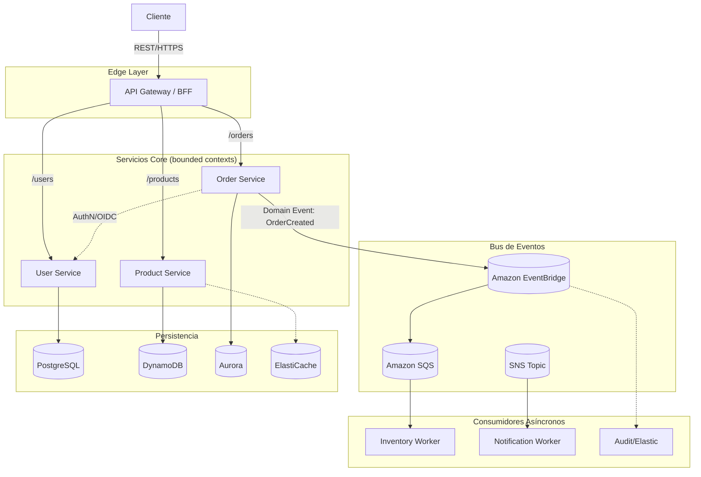

# Módulo 02 — Microservicios y Domain-Driven Design

> **Objetivo profesional:** Transitar del prototipo a sistemas distribuidos mantenibles en el tiempo. Aquí resolvemos la pregunta universal de nuestro tiempo: "¿Separamos esto en microservicios o mantenemos el monolito?" — respondiéndola con criterios objetivos (dominio, equipo, trade-offs reales), no por moda. Y aprendemos DDD como método que define los límites correctos de cada servicio.

> Este módulo se apoya en el [Módulo 01](01-Arquitectura-de-Software-Moderna.md) (estilos y framework de decisión). Los aspectos profundos de mensajería y consistencia (Saga, Outbox, Event Sourcing, CQRS) se tratan en el **Módulo 03** ([Event-Driven Architecture](03-Event-Driven-Architecture.md)); la seguridad (OAuth2, JWT, OIDC, IAM) en el **Módulo 08**; la observabilidad (tracing, SLI/SLO/SLA) en el **Módulo 07**. Aquí construimos los fundamentos y los límites.

---

## Introducción

En la práctica profesional, "microservicios" no es sólo la respuesta a la escala; es una **decisión organizativa y de dominio**. La mayoría de los proyectos fracasan no por la tecnología, sino por haber trazado los límites con criterios técnicos (muestreos) en lugar de criterios de negocio. DDD ("Domain-Driven Design", Evans, 2003) nació para corregir esto: modelar software según el dominio, no según la infraestructura.

En este módulo combinamos dos hilos:
1. El **qué y cómo** de los microservicios (fundamentos, comunicación, consistencia, patrones).
2. El **dónde trazar los límites** (DDD estratégico y táctico).

Al terminar, podrás justificar ante un comité de arquitectura por qué un cierto corte es correcto y otro no, y entender qué complejidades operativas (mensajería, seguridad, observabilidad, consistencia) asumes al descomponer.

---

## Fundamentos de Microservicios

### ¿Qué es realmente un microservicio?

Una definición operativa, descargada de hype:

> Un **microservicio** es una unidad de software pequeña y autónoma, de despliegue independiente, alineada con un **dominio de negocio** (Bounded Context), que se comunica con los demás mediante protocolos ligeros y que **es dueña de sus propios datos**.

Las cualidades que lo definen no son el tamaño en líneas de código, sino:

- **Independencia de despliegue:** puedes desplegar el servicio A sin tocar el B.
- **Autonomía: ownership del dato:** nadie más escribe directamente en su base de datos.
- **Límite de dominio:** representa exactamente una capacidad/contexto de negocio.
- **Escalabilidad selectiva:** se escala a sí mismo según su propia carga.
- **Aislamiento de fallos (bulkhead):** su caída no tumba a los demás.

### ¿Qué NO es un microservicio?

Estos "anti-fakes" son los que llenan de incidentes las empresas:

1. **Segmentación por capas técnicas.** Separar "UI", "Backend" y "DB" como si fueran microservicios. Son capas de una misma lógica; no tienen autonomía de negocio y duplican acoplamiento.
2. **"Servicios paraguas" (Swiss-Army service).** Un servicio global de auth, un servicio global de cache, un servicio global de datos, y luego servicios que no tienen dato propio. Esto es externalización masiva sin isolación real de dominios de fallo.
3. **Nanoservices.** Un servicio por cada función utilidad (`UserUtils-GetName`). Terminan en decenas de despliegues que multiplican latencia, fallos y costo sin valor de negocio.
4. **Límites difusos ("distributed monolith").** Un servicio "Product" que gestiona a la vez inventario, precios y categorías, y comparte tablas con otros. Es un monolito repartido con buzzwords: tienes la complejidad de distribuido sin sus beneficios.

### Diferencias entre SOA y Microservicios

| Aspecto | SOA (hacia 2005+) | Microservicios (2012+) |
|---|---|---|
| **Filosofía** | Reutilización empresarial e integración central (ESB) | Autonomía de dominio y despliegue independiente |
| **Granularidad** | Servicios grandes tipo columna vertebral empresarial | Servicios finos alineados a un bounded context |
| **Comunicación** | ESB central, XML/SOAP, orquestación pesada | REST/JSON, gRPC, eventos; coreografía preferida |
| **Datos** | Canonical models compartidos entre servicios | **Database per service** (cada servicio es dueño de su dato) |
| **Despliegue** | Largos ciclos, registros SOA, coordinación central | CI/CD continuo, canary, feature flags |
| **Gobernanza** | Comité central de arquitectura | Fitness functions, equipos autónomos |

**La lección de SOA** (y lo que separa a un senior): la integración empresarial es inherentemente compleja; hacerla mediante un bus central (ESB) y modelos canónicos globales **agrega** complejidad y acoplamiento. Microservicios responden con autonomía y contratos ligeros, pero heredan el mismo reto de consistencia distribuida. No es que SOA estuviera "mal": es que el modelo de gobernanza y granularidad era demasiado centralizado para el mundo del cloud.

### Características fundamentales

1. **Autonomía:** tomar decisiones locales (BigData) sin aprobación global.
2. **Bulkheads:** aislar recursos para que el fallo de uno no agote el pool compartido.
3. **Descubrimiento (discoverability):** los servicios se encuentran dinámicamente (registry, DNS).
4. **Interfaces programáticas:** contratos explícitos (OpenAPI, versionado).
5. **Observabilidad por defecto:** métricas, logs y trazas desde la primera versión, no como capricho.

### Microservicios vs Monolito Modular

En el [Módulo 01](01-Arquitectura-de-Software-Moderna.md) definimos el monilolito modular como puente excelente. Aquí la comparación directa que decide un proyecto:

| Criterio | Monolito Modular | Microservicios |
|---|---|---|
| **Transaccionalidad** | ACID completo dentro del proceso | Consistencia eventual vía eventos (Saga) |
| **Debugging** | Stack trace único, simple | Requiere distributed tracing y correlation IDs |
| **Frecuencia de despliegue** | Despliegue en serie del conjunto | Independiente por servicio |
| **Granularidad de escalado** | Todo o nada | Fina por servicio |
| **Madurez organizativa** | Apto para equipo único | Requiere equipos independientes |
| **Curva inicial** | Aplanada | Sobrecoste inicial alto, brilla a escala |

En la práctica, casi todos los equipos comienzan como **monolito modular** y **extraen** servicios a medida que crecen (strangler fig). Saltar directamente a microservicios es, para la mayoría de nuevas empresas, un error de costos.

### ¿Cuándo NO usar microservicios?

Declaraciones firmes que un senior honesto debe poder decir:

1. **Equipo pequeño** (<5 devs): el overhead operativo no compensa.
2. **Dominio ambiguo:** si no puedes nombrar el bounded context y su dueño, aún no segmentes.
3. **Consistencia transaccional fuerte obligatoria:** coress, contabilidad crítica global. Los eventos introducen riesgo innecesario.
4. **Ruta crítica de baja latencia:** cada salto de red milésimas valiosas (video real-time, trading HFT).
5. **Falta de ownership:** si la organización no asigna propiedad clara, se genera spaghetti.
6. **Monolito modular funcionando:** no lo rompas por moda.

---

## Domain-Driven Design (DDD)

Conceptos de Eric Evans (*DDD: Tackling Complexity in the Heart of Software*, 2003). Los aplicamos aquí, directamente, al diseño de microservicios.

### ¿Qué es un dominio?

El universo específico de conocimiento y actividad que nuestro software aborda. Los dominios complejos tienen reglas, restricciones y stakeholders con experticia propia.

Ejemplos:
- **Banking:** transacciones, reglamentos, intereses.
- **E-commerce:** catálogo, pedidos, inventario, recomendaciones.
- **Delivery:** rutas, geolocalización, transportes, niveles de servicio.
- **Identity:** autenticación, roles, compliance.

### Subdominios (división estratégica)

Todo dominio grande se divide y clasificamos:

| Tipo | Definición | Valor competitivo | Decisión |
|---|---|---|---|
| **Core Domain** | El que diferencia el negocio y su ventaja competitiva. | Muy alto | Invertir más: mejor gente, software propio y robusto |
| **Supporting Subdomain** | Necesario pero no diferencial. | Medio | Construir simple, posibles third-party |
| **Generic Subdomain** | Funciones comunes a cualquier empresa (email, auth, logs). | Bajo | Comprar, no construir (Cognito, SES, herramientas) |

**Anti-patrón:** confundir "complejo" con "core". Un generador de PDF de facturas es técnicamente complejo pero casi siempre un subdominio genérico (utilidad). Confundir esto desperdicia tiempo donde no hay diferenciación.

**Ejemplo plataforma salud:**
- Core: algoritmo de matching de diagnóstico (IP protegida).
- Supporting: portal paciente (funcional estándar).
- Generic: notificaciones de email, infraestructura de logs.

### Bounded Context

Frontera dentro de la cual **el modelo del dominio es válido y sin ambigüedad**. Fuera de ella, el mismo término puede significar algo distinto.

- Es una frontera **lingüística** (ver Ubiquitous Language abajo).
- Es la unidad de personalidad transaccional.
- Es **la base para microservicios**: 1 Bounded Context ≈ 1 servicio (idealmente).
- Entre contextos puede necesitarse una **Anti-Corruption Layer** para traducir.

**Ejemplo concreto:** en una app de comida, "Order" significa una cosa para Delivery (ruta, estado de reparto) y otra para Kitchen (platos, tiempo de preparación). Aunque se llamen igual, viven en bounded contexts distintos — y son candidatos natural a servicios separados.

### Ubiquitous Language (Lenguaje Ubicu)

No vocabulary can be shared between devs y PO without ambiguity.

**Mal:** El dev dice "Order" para la fila de db; el chef dice "Order" para su comanda. Ambos asumen lo mismo pero se refieren a cosas.

**Bien:** Introducir términos explícitos: `PurchaseOrder`, `PreparationTicket`, `DeliveryManifest`. Documentación viva que fija el idioma.

---

## DDD Táctico: bloques de construcción de código

Dentro de cada bounded context, DDD táctico propone objetos de dominio:

#### Entity
Objeto con **identidad persistente** que se mantiene a lo largo del tiempo y del estado. `Customer` (el cliente significa algo durable), mientras que `Address` puede ser reemplazada de una vez (quizás value object).

#### Value Object
Definido **sólo por sus atributos**, sin identidad única. Inmutable:

```typescript
Money(currencyCode: 'USD', amount: 1200)      // 12.00 USD
EmailAddress('a@b.com')
Coordinates(40.7128, -74.0060)
```

Se usan de manera extensa en atributos que describen a entidades, no requieren identidad y su igualdad se valora por contenido.

#### Aggregate y Aggregate Root
Un aggregate es un **clúster de entidades y value objects tratados como una unidad de consistencia**. Dentro de un aggregate:

- Se garantizan **invariantes de negocio** (reglas que deben cumplirse en todo momento).
- **Sólo el AggregateRoot** es el punto de entrada desde fuera; nadie manipula el resto direct.

```typescript
class Order {                       // Aggregate Root
  private items: OrderItem[];       // OrderItem es parte del aggregate
  addItem(sku: string, qty: number) { ... }  // siempre pasa por aquí
  total(): Money { ... }
}
```

**Regla:** un repositorio por aggregate. Persistencia = persistir el aggregate como unidad única.

#### Domain Services
Lógica de negocio que **no pertenece naturalmente** a una sola entidad o value object (suele ser un proceso inter-aggregate).

```typescript
class DeliveryCostCalculator {        // Domain Service
  calculate(route: Route, zones: PricingZone[]): Money { ... }
}
```

#### Application Services
Capa fina de **orquestación** que coordina *domain services* y *entities* y las fronte con los puertos. No contiene reglas de negocio, sólo las decisions and coordination y transacciones.

#### Domain Events
Registro (evento) de que **algo relevante pasó** dentro del dominio, como hecho inmutable.

```typescript
class OrderCompleted extends DomainEvent {
  constructor(public orderId: string, public at: Date) { super(); }
}
```

**Consejo de integración (maduro):** en vez de llamar síncronamente a otro servicio dentro de una transacción, **emite un domain event** y publica en el bus. Esto es el punto de unión con el Módulo 03 (Outbox + CQRS + Event Sourcing).

---

## Diseño de límites de servicio: cómo dividir un sistema

**No se divide por tecnología ni por capa**, sino por:
1. **Capacidad de negocio.**
2. **Límites de dominio que descubre DDD.**
3. **Ownership del equipo (Conway's Law).**

### Guía operativa paso a paso

1. Línea de análisis por **sets de negocio (strategy workshop)** con stakeholders: date bounded contexts.
2. Prioriza el **Core Domain** para el esfuerzo más fuerte.
3. Analiza **hotspots de acoplamiento**: queries que se repiten en múltiples conceptos indican límites erróneos.
4. Valida **ownership de equipo** manageable (Conway).

### Business Capability vs. Service

Cada servicio mapea a una **capacidad de negocio** ("procesar devoluciones", "generar facturas"), NO a función técnica ("Utils", "Manager"). Esta es la diferencia entre servicios mantenibles y "clases God distribuidas".

### Cohesión y Acoplamiento

- **Alta cohesión:** todo lo que está dentro de un servicio pertenece y cambia junto. Un servicio "Billing" no debería depender de "lo que sea que el dev agregó anoche".
- **Bajo acoplamiento:** cambios en uno no exigen release coordinado. Se logra con mensajería asíncrona y contratos claros (No compartas las de database).

**Señal:** si te encuentras copiando la misma validación entre tres servicios sin librería compartida, reconsidera los límites.

### Conway's Law

> *"Las organizaciones que diseñan sistemas están destinadas a producir disisqueña copia de su propia estructura de comunicación."*

Implicación: si tu arquitectura no refleja la estructura de equipos, terminarás con servicios de nadie, límites ambiguos y culpas cruzadas. **Solución:** reorganizar equipos para alinear la arquitectura deseada (*Inverse Conway Maneuver*).

### Team Topologies (Skelton & Pais)

Marco moderno: 4 tipos de equipos:

1. **Stream-Aligned Teams:** alineados a un flujo de valor de negocio ("Optimización de conversión", "Pago"). Entregan end-to-end.
2. **Platform Teams:** proveen servicios internos *self-service* a los equipos stream (cloud platform, seguridad, tooling). Reducen carga cognitiva.
3. **Enabling Teams:** ayudan a los Stream-Aligned a superar obstáculos/aprender ("SRE coaches". Naturaleza temporal).
4. **Complicated-Subsystem Teams:** donde hace falta prof. técnica específica (visión por computador, entrenamiento). Dueños especialistas.

**Encaje con microservicios:** Stream-Aligned certifican ses esse mismos bounded context; Platform Teams y seguridad/infra; Enabling ausilian con DDD y resiliencia.

### Anti-patterns comunes

1. **Compartir base de datos (Shared Database).** Varios servicios la misma postgres. Cualquier cambio rompe todo; deja deónimo.
2. **Sync call chains largas.** `A → Sync → B → Sync → C`, latencia amplificada y timeouts en cascada.
3. **Cambios de límites constantes.** Trasladar propiedades entre servicios cada mes: síntalo de fallo de diseño, no de "agilidad".
4. **Ignorar la data gravity.** Mover compute multi-cloud ignorando que la mayor parte de los datos sigue on-prem dispara costo/latencia.

---

## Comunicación entre microservicios

Cómo se comunican los servicios determina la resiliencia del sistema completo. Dos grandes familias:



### Comunicación síncrona (request-response)

Aparece cuando hace falta una respuesta en plazo de llamada. **Pero introduce acoplamiento temporal**: si el downstream cae o responde lento, el llamador se degrada igual. Hay que defenderer con timeouts, retries y circuit breakers.

| Protocolo | Cuándo usar | Pros | Contras |
|---|---|---|---|
| **REST/JSON** | Por defecto para APIs y muy común (versión) | Simple, estándar, cacheable, legible | Over-fetching, tipado débil |
| **gRPC** | Comunicación interna de blog de alto rendimiento | Tipado fuerte, eficiente (Protobuf, binario, HTTP/2 streaming) | Curva, debugging menos maduro, conversaje de datos más limitado |
| **GraphQL interno** | Agregación UI compleja (con BFF) | Consulta precisa, sin over/under-fetching | Complejidad de resolver, abuso fácil—Rolido de Módulo 09 |

### Comunicación asíncrona (mensajería)

Desacopla en tiempo y espacio. Especial a la resiliencia (el productor no espera al consumidor).

- **Colas (Queues):** punto a punto. Un mensaje lo procesa *uno solo* consumidor. Ideal para workers/jobs.
- **Topics de Pub-Sub:** una mensaje se replica a muchos suscriptores. Para de fan-out, notificationes, event sourcing.

### Tecnologías relacionadas en AWS

| Servicio | Rol | Cuándo |
|---|---|---|
| **Amazon SQS** | Cola de mensajes, at-least-once, DLQ, alta escala | Desacoplar jobs/heavy workloads, pipelines |
| **Amazon SNS** | Pub/Sub / fan-out | Alertas, notificaciones, disparar procesos independientes |
| **Amazon EventBridge** | EventBus serverless con esquemas y reglas | Routing de domain events, integración SaaS |
| **Apache Kafka** | Event store distribuido (streaming), replayable | Event Sourcing, big data pipelines |

**Regla de selección:** SQS para trabajo transaccional pesado (pérdida es dañina); SNS para fan-out liviano; EventBridge cuando el esquema de eventos evoluciona y adelanto Schema Registry; Kafka para massive streams y procesamiento de estado.

---

## Consistencia y transacciones distribuidas

Aquí lo teórico encuentra producción. La consistencia en una sola base de datos es trivaria; cruzando servicios es un dilema filosófico.

### El problema de las transacciones distribuidas

`OrderService` crea el pedido, llama a `PaymentService`, luego `InventoryService`. Se produce una partición de red entre Payment e Inventory:

- ¿El pago ocurrió? Qué.
- ¿El inventario se reconciló? Desconocido.
- ACID tradicional no puede garantizar atomicidad porque los recursos están en nodos distintos y el CAP se interpone.

### CAP Theorem (recordatorio operativo)

Definido en el [Glosario](00-Glosario.md) y el [Módulo 01]. En microservicios:

- Todos los recursos 👍 en una zona elimina riesgo de partición, pero ignora la seguridad física/geográfica.
- Multi-AZ → particiones son inevitables.
- Consistencia fuerte exige coordinación (locks, quórum, Raft) que mata latencia y dispon tubing.

Por esto el **default moderno** es **consistencia eventual + compensaciones (Saga)** y mucho trabajo de idempotencia.

### Consistencia eventual - required

Diciendo en este entre los servicios , las versiones convergen eventualmente. Requiere:

- **Idempotencia** en los consumidores.
- **Resolución de conflictos** (versiones, timestamps).
- **Lógica de compensación** (Saga).

Aceptable en: inventario, feed social, analytics. No aceptable en: contabilidad (ledger), historial médico primario.

### ACID vs BASE (referred)

Recogido en el [Glosario](00-Glosario.md): para resumir, elegimos BASE donde la disponibilidad y la escala pesan más que la consistencia inmediata, y ACID donde la integridad del ledger manda (y este comienzo en la misma DB).

### Saga Pattern: orchestration vs choreography

En lugar de intentarLock recursos globales, convertir la transacción global en una **secuencia de reposiciones transactional locales** conecadas por eventos o por un coordinador, cada paso con su **acción compensatoria**.

#### Coreografía (Choreography)

Cada servicio escucha eventos de y actúa voluntariamente.

```
OrderCreated -> Inventory.checkStock()
 StockReserved -> Payment.process() -> PaymentConfirmed -> Delivery.schedule()
```

**Pro:** sin orquestador central (sin punto de acumulación de fallos).
**Contra:** el flujo está disperso y los chained debugging requieren tracing distribuido potente (Módulo 07).

#### Orquestación (Orchestration / Orchestrator / coordinator)

Un servicio orquestador (# S|SYSTEM executivo) dirige el flujo explícitamente.

```
Orchestrator: StartOrder
  -> Command_checkStock()  Inventory  -> StockReserved
  -> Command payment() -> Payment -> PaymentConfirmed
  -> Command Dispatch() -> Logistics
```

**Pro:** visualización central y state machine clara, más fácil de razonar.
**Contra:** el orquestador puede ser cuello de botella/spof — en AWS se resuelve elegantemente con **Step Functions** (Módulo 04), que es state machine serverless sin os idiomáticos para respaldar el service busy.

### Transactional Outbox

Es el problema del **dual write**: "guardé en base de datos, pero falló publicar al bus". La solución: escribe los datos **y el evento a publicar en la misma transacción** local.

```sql
BEGIN;
INSERT INTO orders ...;
INSERT INTO outbox (id, topic, payload, status)
VALUES ('gen-uuid', 'OrderCreated', '{"orderId": ...}', 'PENDING');
COMMIT;
```

Un worker (o Lambda que escucha el stream de la DB) hace polling de `PENDING`, publica y actualiza a `SENT`. Si muere justo después de publicar antes de marcar, el consumidor debería ser idempotente (audiencia garantizada, duplicados tolerados). Garantiza atomicidad entre cambio de estado y emisión del evento — detalle en Módulo 03.

### Idempotencia (en contexto de servicios)

Más allá de la definición del [Glosario](00-Glosario.md), en microservicios:

- **Claves de idempotencia únicas** (UUID), no se repite.
- **Deduplicación** en el consumidor (Redis `SET NX`, constraint UNIQUE en MessageID/order).
- **Efectos resultado iguales** aunque se procese 2 veces.
- Cuidado con **check-then-act**: comprobar y luego actuar no es atómico sin control de concurrencia; el mejor approach es direct action on result determinística.

---

## Patrones avanzados de microservicios

Patrones definidos ya en el [Módulo 01](01-Arquitectura-de-Software-Moderna.md) y el [Glosario](00-Glosario.md); aquí se integran con el contexto del Módulo 02:

### API Gateway
Punto de entrada único: **auth**, routing, rate limiting, monitoreo. Evita exponer cada servicio. Traducción de protocolos (HTTP → gRPC interno). En AWS: Amazon API Gateway (REST/HTTP/WebSocket, caching, throttling, usage plans).

### Backend For Frontend (BFF)
Variante en que tienes un gateway **por tipo de cliente** (Web, iOS, Android), propiedad del equipo de cada cliente. Evita que "API genérica" sobrecargue dispositivos ligeros y permite policies de cache específicas por latencia.

### Service Discovery
Cómo se hallan las redes (indicios IP:puerto) dinámicas.

- **Client-side:** el cliente consulta el registry (Consul, Zookeeper) y conecta. Control fino, pero más acoplamiento del cliente.
- **Server-side:** un load balancer encienda con datos del registry (ALB + Target Groups, Cloud Map). El cliente simple, pero una llama más.

### Circuit Breaker
Ante umbral de errores, **falla rápido** (Open) en lugar de estarle. Estados: Closed/Open/Half-Open. Implementate en bibliotecas de resiliencia (Resilience4j, Polly) o en mesh (Envoy/Istio). Monitorea del `CircuitOpenRate`.

### Retry Pattern
Solo errores transitorios (net, 5xx, timeouts) con **exponential backoff + jitter**. Fórmula:

`Wait = min(MaxWait, base * 2^attempt + jitter)`

**Nunca retrinjes 4xx** (son errores del cliente, no transitorios). Y combinalo con circuit breaker (no peer a la parte de su caídas).

### Bulkhead
Aislamiento de recursos para que el fallo de un componente no agote el pool compartido. Como compartimentos de un barco: pool de threads separado por pago vs reporte, limites de concurrency reservados por Lambda, colas separadas trabajo crítico vs fondo.

### Rate Limiting
Evitar el abuso two thirds de las interpretaciones (Cliente/API abierta).
- **Token Bucket:** ráfagas permitidas (buen UX).
- **Leaky Bucket:** tasa constante (buen para backend).
- **Fixed window:** simple, burst boundary.
- **Sliding window log:** preciso, heavy memoria.
Módulo 09 lo verá más: rate limiting de la capa y aplicación.

### Caching
Reducir carga de base de datos acercando datos calientes. Hay clientes, CDN, service (Redis/ElastiCache). Patrones de cache (Cache-Aside, Write-Through, etc) en el Módulo 10. La clave: **invalidación** (TTL y eventos) — por relies no reflex el problema.

### CQRS y Event Sourcing
Reconocer aquí su lugar como **patrones de microservicios**:
- **CQRS:** separar el modelo de **escritura** (estricto, dominio) del **lectura** (denormalizado, eventos para sincronizar). Módulo 03.
- **Event Sourcing:** estado derivado de un log de eventos inmutable, con auditoría y replay. Módulo 03 y 05.

---

## Seguridad en microservicios

Presentado aquí el marco; detalle completo en **Módulo 08** (Seguridad, OAuth2, JWT, OIDC, IAM).

### Authentication vs Authorization

- **AuthN (¿quién eres?):** identidad. OAuth2/OIDC.
- **AuthZ (¿qué puedes hacer?):** políticas RBAC/ABAC.

En microservicios, cada hop puede delegar/revalidar con tokens.

### OAuth 2.0 y OIDC (resumen)

- **OAuth2** framework de acceso delegado.
  - **Client Credentials:** máquina-a-máquina (servicio A → servicio B). Ideal en este contexto.
  - **Authorization Code (+PKCE):** usuario web/mobile.
- **OpenID Connect (OIDC):** capa sobre OAuth2 que estandariza el **ID Token** (identidad) y el **UserInfo endpoint** (`iss`, `sub`, `email`).

### JWT

Token compacto firmado `Header.Payload.Signature` que propagar el estado de autenticación sin sesiones pegajosas. Claims: `iss`, `sub`, `aud`, `exp`, `iat`, `scp`.

**Buenas prácticas (Módulo 08 profundo):**
1. Valida la firma con cadena JWKS rotable.
2. Strict `exp`/`aud`/`iat`.
3. Tokens de vida cortes (ej: 15min) + **refresh token**.
4. No meter datos sensibles en el payload (solo firmado, no cifrado).
5. Prefier RS256/ES256 (asymétrica) para mejor distribución de claves.

### Service-to-Service Auth

Cómo demuestra el servicio A su identidad ante B:

1. **API Keys:** simple, difíciles de rotar/acoplar.
2. **mTLS:** intercambio de certs (fuerte). **AWS Private CA, SPIFFE/SPIRE.**
3. **JWT firmado (RS256) + JWKS:** emisor confiable emite token; servicios validan la firma por el endpoint JWKS. Estándar moderno (AWS Cognito, Auth0).

### Secrets Management

Nunca secrets en código/git. Usar:
- AWS Secrets Manager / Parameter Store.
- HashiCorp Vault.
Se inyectan en runtime via roles (IRSA en EKS, Lambda Execution Role, ECS Task Role), con rotación automática.

### Zero Trust Architecture

*"Never Trust; Always Verify".* La microservicios eliminan la segmentación de confianza implícita dentro de la red. Implícitos:
- **Service identity** (mTLS).
- **Policy enforcement** (sidecars/Envoy, authorization de mesh).
- **Least privilege** (solo adjunta a sus datos).
- **Monitor/log continuo** para detectar movement laterality.

---

## Observabilidad distribuida

En un microservicio la observabilidad es una disciplina de operación imprescindible. Detalle en **Módulo 07**. Aquí el mapa y quién.

### Logging centralizado
Agregar logs de funentes efímeras/containers en un sistema, consultable. (ELK, Splunk, Datadog, CloudWatch Logs Insights).
- JSON estructurado.
- **Correlation ID por request**.
- Contextes (env, versión, region).
- **Scrub de PII** antes de guardar.

### Distributed Tracing
Seguir una petición entre N hops. Objetos: **trace** (árbol de spans), `trace_id`, `span_id`, `parent_id`, start/end. Herramientas: **AWS X-Ray**, **OpenTelemetry** (estándar), **Jaeger/Zipkin**. Identifica el cuello de latencia por servicio.

### Correlation IDs
ID único generado en el edge es heartbeat- pasado en header `X-Correlation-ID`. Cada log y span lo occlusion. Cuando un usuario nota "error 123": buscas por `X-Correlation-ID`, vas a la traza, ves la query exacta. Indispensable.

### Métricas
Tipos: counter (total de eventos), gauge (+ gsnapshot), histogram (distribución de latencia), summary (percentiles p99).
**Golden signals** (SRE): latencia, errores, tráfico, saturación.

### Alerting
Alertes acciones en **SLO**!!!!! No en rendimiento bruto. Respuesta: error budget consumido → page; else dashboard. Siempre con runbooks ligados.

### SLI / SLO / SLA
- **SLI** = indicador medido ("99.95% disponibles 30 días").
- **SLO** = objetivo ("apuntamos 99.9%").
- **SLA** = contrato con consecuencias ("si <99.5%, creditos").

En microservicios: **SLO internos** agresivos (cultura de calidad), **SLA externos** realistas que pueden mantenerse con cuidado operativo.

---

## Casos reales

### Caso 1: De monolitito modular a servicios (startup)
Un SaaS de reservas con 5 devs nació modular monolith. Creció; cuando el trán de notificaciones requería **escalar independiente bajo peaks**, se extrajo a un microservicio real SQS+Fan-out (Módulo 04). El **payment** y **scheduling** se mantuvieron monotónico (consistencia ACID críta). Decición guiada por dolor real, no moda → lo correcto.

### Caso 2: Fintech alta con microservices + DDD
Una plataforma con patrones en bounded contexts (Payment, Fraud Detection, Compliance, Onboarding) y core (servicios) bien desacoplados. En el **dominio Payment**, DDD táctico: `Payment` aggregate root u Origen, `Money` value object, **Saga orquestada con Step Functions** para reembolsos. CQRS para lecturas full denormalizadas. Fitness functions → reglas en CI/CD (violación de dependencia o latency breack) bloquea el merge. Resultado: deplooys del payment-service diario sin coordinación global.

### Caso 3: Migración de monolito legacy (strangler)
Empresa con monolito PHP legacy y pedidos centralizados. Migración de **strangler fig**: nueva microservice de `Catalog` con own PostreSQL; el resto del monolito hizo POST a la nueva API al cliente. Cuando el flujo de pedidos se volvió independiente, se extrajo `Order` con saga (Order Created) y inventory. Lección: no se montaron anaconda microservices, se **primero bounded contexts limpieza y de CSC y ya a servicios extracciones caso a caso.

---

## Laboratorio

### Lab 1: División de límites
Toma el food-delivery que previamos en Módulo 01:
1. Mapea el **bounded contexts**.
2. Escribe un **Ubiquitous Language** definición de 5+ términos (orders, kitchen, delivery, idem...).
3. Asigna cada servicio a un rol de **Team Topologies** y decide si su granularidad es `service` o `module`.

### Lab 2: Matriz de comunicación
Dibuja el diagrama de grafo de servicios entre llamados **síncronos** vs **asíncronos**. Marca en dónde un **drive breaker**, **outbox** o **legacy queue** es obligatorio.

### Lab 3: Saga Orquestada
Inventa el flujo Order Fulfillment. Escribe el **pseudo-código del orquestador** que maneja compensaciones si PayoutService muere a mediata de la transacción.

### Lab 4: Observabilidad audit
Consulta de la estructura logografía ESE que "app estandará". Dónde inyecta **correlation ID** y **JSON structured logging**? Escribe el esquema del log JSON resultante.

### Lab 5: Threat model
Identifica vectores de ataque del **Identity Service**. Seleccione los flujos OAuth para first-party vs third-party apps.

### Lab 6: Contract test de micro-servicio
Con Pact, crea un test que falle: `OrderService` espera `items.priceCents` en la OrderCreated; repasa que `KitchenService` envía `unitPrice`. Muestra cómo el conflicto rompe el pipeline antes del merge.

---

## Entrevistas (preguntas y respuestas)

1. **¿Diferencia entre SOA y Microservices?**

   **Orientación:** Buscan que distingas *ownership* y *granularidad* por encima del ESB. Evita decir que son lo mismo.

   **Respuesta de un senior:** "SOA insistía en la separación de responsabilidades *empresariales* y casi siempre aterrizaba en un ESB que centralizaba la integración: ese bus se convertía en el monolito oculto, el punto único de fallo y el cuello de botella. Microservices son un refinamiento: servicios pequeños, autónomos, con *ownership de sus datos y de su despliegue*, que se comunican por API/eventos sin intermediario pesado. La diferencia práctica que me importa es el ownership: en SOA reutilizabas servicios como cajas compartidas; en microservicios cada equipo es dueño de extremo a extremo y no comparte base de datos. La granularidad, además, se decide por bounded context, no por un bus."

2. **¿Cuándo NO usarías microservicios?**

   **Orientación:** Quieren honestidad y ausencia de dogmatismo. Piensa en latencia, tamaño de equipo, consistencia y frecuencia de cambio.

   **Respuesta de un senior:** "No los usaría cuando el costo supera el beneficio: (1) latencia crítica punto a punto, donde cada salto de red penaliza y prefiero un monolith; (2) equipo pequeño sin capacidad de mantener N servicios con su observabilidad y deploy; (3) dominio con transacciones ACID multi-agregado críticas, donde fragmentarlo obliga a sagas complejas sin ganancia real; y (4) dominio que apenas cambia, porque la complejidad operativa no se amortiza. Para esos casos, un Modular Monolith o servicios grandes por bounded context me da la cohesión con menos dolor. Descomponer 'porque sí' crea problemas de consistencia, red y operación que no tenías."

3. **Explica Bounded Context.**

   **Orientación:** Demuestra que es el corazón de DDD y cómo define límites de modelo y de servicio. Menciona Shared Kernel y mapeo de agregados.

   **Respuesta de un senior:** "Un Bounded Context es la frontera donde un término tiene un significado único y no ambiguo. 'Pedido' en el contexto de *comercio* significa una cosa; en el de *logística* significa otra. Cada contexto tiene su propio modelo, su propio lenguaje ubicuo y su propia base de datos: no lo compartes con otros contextos. Esto es lo que permite que dos equipos usen 'producto' con significados distintos sin pelearse. Dentro de un contexto trabajas con Aggregates; entre contextos definimos contracts de integración, a veces con un Shared Kernel (un conjunto reducido compartido y versionado). El Bounded Context es, en la práctica, el candidato natural a servicio."

4. **¿Conoces la Ley de Conway? ¿Cómo la uses?**

   **Orientación:** Quieren ver que entiendes que la arquitectura refleja la organización y que la cambias con intención organizacional.

   **Respuesta de un senior:** "La Ley de Conway dice que los sistemas tienden a imitar la estructura de comunicación de la organización que los diseña. Si tienes dos equipos que necesitan coordinarse constantemente, producirás un sistema con fuerte acoplamiento entre sus partes. Yo la uso como herramienta, no como fatalidad: antes de definir servicios, defino el team topology según bounded contexts y dejo que cada equipo sea dueño de su parte; si quiero una arquitectura desacoplada, primero desacoplo la organización y la comunicación. El reverse Conway maneuver es literalmente diseñar los equipos para que produzcan la arquitectura objetivo. Si cambio la arquitectura sin cambiar la estructura organizativa, voy a terminar con el mismo monolito distribuido."

5. **¿Cómo manejas transacciones distribuidas?**

   **Orientación:** Evita 2PC en microservicios. Esperan Saga (orchestrated vs choreographed), Outbox y honestidad sobre consistencia.

   **Respuesta de un senior:** "En un monolith usas una transacción ACID local. En microservicios, el ACID multi-servicio es inviable y pagas con disponibilidad; lo reemplazo por consistencia eventual orquestada. Uso *Saga*: una secuencia de pasos locales con una compensación por cada uno. Distingo *orchestrated* —un coordinador explícito que sabe la secuencia y gestiona estados (más fácil de supervisar)— y *choreographed* —cada servicio reacciona a eventos, más desacoplado pero más difícil de seguir. Añado *Outbox* para publicar los eventos de forma atómica con el cambio de base de datos y evitar perderlos. El trade-off de fondo es que admito ventanas de inconsistencia y las documento: nunca 'declaro' como si fuera ACID; defino compensaciones de negocio para cada paso."

6. **Diseña el sistema de dispatch de Uber.**

   **Orientación:** Un clásico de system design. Buscan escala, geo-indexé y eventos. Muestra cómo particionas el problema.

   **Respuesta de un senior:** "Lo modelaría por eventos a escala. Mover los conductores y rider actualizando su posición a alta frecuencia: cada rider pide un viaje, que es un evento, y su posición se guarda en un geo-index (Redis Geospatial o un servicio de matching). Separaría responsabilidades: un servicio de *location pool* que mantiene y publica posiciones, y un servicio de *matching* que, ante un event 'trip request', encuentra los conductores más cercanos en el área, les ofrece el viaje (con timeout), y emite un event 'trip assigned'. Cada asignación genera una cadena de eventos de estado del viaje. El matching necesita baja latencia, así que lo mantengo cerca del geo-index en la región del usuario; el resto del procesamiento (precios, cobro) puede ser asíncrono. El cuello de botella son las zonas calientes (centro de la ciudad): hay que particionar el espacio geográfico para no saturar un nodo."

7. **Critica: base de datos compartida entre 3 servicios.**

   **Orientación:** Saben que es un smell. Quieren que expliques por qué rompe la autonomía.

   **Respuesta de un senior:** "Es un anti-patrón que destruye lo que buscan los microservicios. Si tres servicios escriben y leen el mismo esquema, técnicamente no son servicios independientes: están acoplados por el contrato de datos. Un cambio de esquema exige coordinar a los tres equipos (o uno rompe a los otros); la evolución que quieres evitar en un monolith vuelve por la puerta de atrás. Además pierdes el ownership de los datos y la capacidad de hacer deploy independiente, porque un schema change es un cambio que afecta a todos. El cumplimiento de Conway's Law también se rompe: tienes tres equipos 'independientes' coordinándose por una tabla compartida. La alternativa es que cada servicio sea dueño de sus datos y se integren por API o eventos, aceptando consistencia eventual donde haga falta."

8. **Desventajas de una Saga orquestada.**

   **Orientación:** Buscan que no idealices la orquestación. Compensaciones complejas, races de estado y el orquestador como bottleneck.

   **Respuesta de un senior:** "El orquestador centraliza la lógica, lo que es una ventaja de visibilidad, pero también su gran desventaja. Primero, introduce un *punto único de acoplamiento*: conoce todos los pasos y todos los contratos; si crece, se convierte en el servicio que nadie quiere tocar. Segundo, el orquestador puede volverse un *bottleneck* y una single point of failure para el flujo. Tercero, las *compensaciones* son complejas de mantener: cada paso debe tener su inversa, y los pasos intermedios que ya se completaron deben poderse deshacer de forma segura incluso si el orquestador se cae a mitad. Y cuarto, hay *race conditions* de estado: el coordinador debe tolerar timeouts, respuestas tardías y duplicados sin bloquearse. Por eso en flujos simples prefiero coreografía, y reservo orquestación para flujos donde necesito supervisar cada paso."

9. **¿Cómo aseguras la comunicación entre servicios?**

   **Orientación:** Esperan mTLS + OAuth client credentials y concepto de Zero Trust, no solo "token en el header".

   **Respuesta de un senior:** "Parto de Zero Trust: nada dentro de la red es de fiar por defecto. Autentico cada llamada servicio-a-servicio con *mTLS* (certificados de cliente), para garantizar que el emisor es quien dice ser a nivel de transporte, y autorizo con *OAuth2 Client Credentials*: cada servicio tiene credenciales propias y pide un token con scopes limitados. No confío en la red, así que cifro en tránsito (TLS) entre todos los peers y aplico autorización mínima. En AWS, por ejemplo, uso IAM service-linked roles o un service mesh que gestiona mTLS y policy por workload, con network policies que limitan quién puede hablar con quién. Además, end-to-end siempre logs todo con trace_id para auditar el flujo."

10. **Define SLI, SLO y SLA.**

    **Orientación:** Debes separar el indicador, el objetivo y el contrato, y la relación con el error budget.

    **Respuesta de un senior:** "En el modelo SRE: un *SLI* es el indicador real que mido, p. ej. la fracción de requests que responden en menos de 300 ms con status no-5xx. Un *SLO* es el objetivo que me pongo con el equipo y el negocio: 'el 99.9% de las requests deben cumplir ese SLI en una ventana de 30 días'. El SLO me da un *error budget*: si en la ventana voy al 99.5%, he gastado el 0.4% de presupuesto de error restante, y eso decide cuándo freno releases para estabilizar. Un *SLA* es el contrato *legal* con el cliente, casi siempre más alto que mi SLO interno, porque si el SLA es mayor que el SLO, un incumplimiento del SLA ocurriría mientras todavía estoy 'a tiempo' según mi presupuesto. El SLO es mi herramienta de ingeniería para balancear velocidad y reliability."

---

## Checklist

- [ ] Distinción entre capas técnicas y capacidades de negocio.
- [ ] Por qué la **shared database** es un anti-patterno.
- [ ] Mapeo de **Bounded Context → Service** boundaries.
- [ ] **Ubiquitous Language** sincroniza el vacío semántico.
- [ ] Elegir **síncrono vs asíncrono** según acoplamiento temporal.
- [ ] Por qué **timeouts, retries y circuit breakers** son obligatorios en llamadas distribuidas.
- [ ] **CAP/BASE** y sus implicaciones en elegir SQL vs NoSQL.
- [ ] Con de **consistencia eventual** via eventos.
- [ ] Explicar **Saga** (orchestration/choreography + compensación).
- [ ] Por qué **correlation IDs** no se negocian para observabilidad.
- [ ] Diferencia **autenticación vs autorización**.
- [ ] Con de **Zero Trust**.
- [ ] Reconocer **Eventual vs Strong** en requerimientos financieros.

---

## Referencias y lecturas recomendadas

- **"Building Microservices: Designing Fine-Grained Systems"** — Sam Newman (O'Reilly, 2nd ed., 2021). La referencia canónica del módulo.
- **"Monolith to Microservices: Evolutionary Patterns to Transform Your Monolith"** — Sam Newman (O'Reilly, 2019). Estrategias de migración (strangler fig, decomposition patterns).
- **"Domain-Driven Design: Tackling Complexity in the Heart of Software"** — Eric Evans (Addison-Wesley, 2003). El "Blue Book" que originó todo el diseño por dominios.
- **"Implementing Domain-Driven Design"** — Vaughn Vernon (Addison-Wesley, 2013). La versión práctica del DDD táctico.
- **"Team Topologies: Organizing Business and Technology Teams for Fast Flow"** — Matthew Skelton & Manuel Pais (IT Revolution, 2019). Conway's Law moderno y tipos de equipos.
- **"Designing Data-Intensive Applications"** — Martin Kleppmann (O'Reilly, 2017). Capítulos de comunicación, consistencia y particionado.
- **Martin Fowler — Microservices** — https://martinfowler.com/articles/microservices.html (el ensayo fundacional de James Lewis y Martin Fowler).
- **Martin Fowler — BoundedContext / UbiquitousLanguage** — https://martinfowler.com/bliki/BoundedContext.html
- **Chris Richardson — Microservices.io** — https://microservices.io (catálogo completo de patrones de microservicios, incl. Saga, API Gateway, Database per Service).
- **AWS Well-Architected Framework — Serverless Applications Lens** — https://docs.aws.amazon.com/wellarchitected/latest/serverless-applications-lens/

---

*Más profundidad operativa: **Apéndice A** de este módulo cubre mensajería, agregados avanzados, contract testing, config global, service mesh, DR planeado y ejercicios de escenarios. Los de consistencia distribuida (Saga, Outbox, CQRS, Event Sourcing) y el bus (EventBridge, SQS/SNS, Kafka) se desarrollan en el **Módulo 03**. La seguridad se completa en el **Módulo 08** y la observabilidad es tierra hasta el **Módulo 07**.*