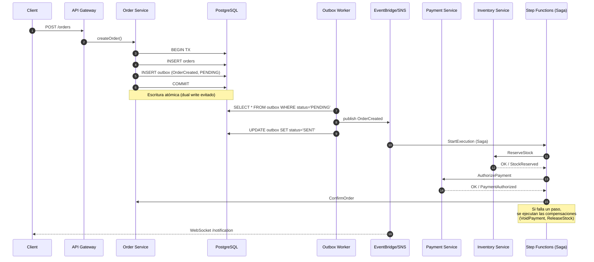
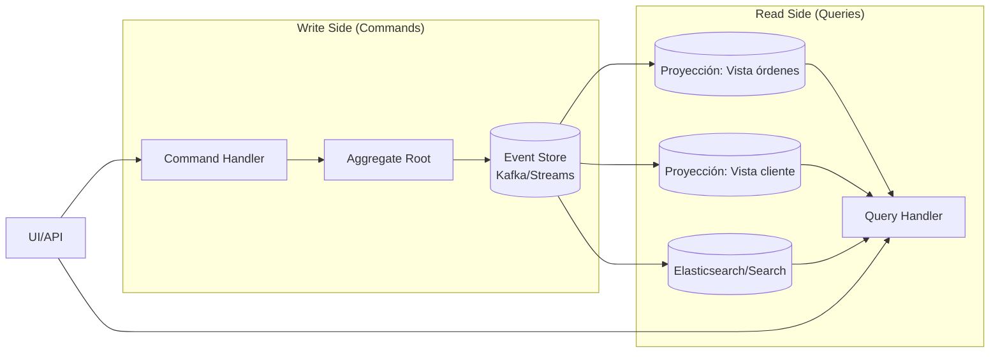

# Módulo 03 — Event-Driven Architecture y Mensajería

> **Objetivo profesional:** Dominar el paradigma asíncrono a profundidad. No sólo "usar una cola", sino entender cuándo y por qué EDA, las semánticas de entrega, la consistencia eventual como opción consciente, la diferencia entre eventos y comandos, y patrones como Saga, Outbox, CQRS y Event Sourcing con detalle de implementación. Al finalizar deberías diseñar un sistema EDA con trade-offs claros, no copiar un tutorial.

> **Este módulo es central a la guía.** Se apoya en el [Módulo 01](01-Arquitectura-de-Software-Moderna.md) y el [Módulo 02](02-Microservicios-y-DDD.md) (acá asumimos que SERVICE BOUNDARIES / dominio / bounded contexts ya están definidos). Las tecnologías AWS concretas (EventBridge, SQS/SNS, Step Functions, Lambda triggers) se ven con más profundidad en el **[Módulo 04](04-AWS-Serverless.md)**; la consistencia de datos (PACELC, particionamiento) en el **[Módulo 05](05-Bases-de-datos-distribuidas.md)**; resiliencia (circuit breakers, retry) en el **[Módulo 10](10-Escalabilidad-Resiliencia.md)**.

---

## Introducción

La **síncronía** es fácil de entender: un cliente pide algo, un servicio responde. Funciona... hasta que falla. En sistemas distribuidos la síncronía encadena dependencias temporales: si B es necesario para que A responda, **A y B fallarán juntos** (cascading failure).

La **Event-Driven Architecture (EDA)** elimina ese acoplamiento temporal: los productores **emiten eventos** con lo que ocurrió (`OrderCreated`, `PaymentConfirmed`, `StockReserved`), sin necesitar saber quién ni cuándo consume. Los consumidores subscriben interés, procesan en su propio ritmo, reaccionan cuando pueden. EDA no es solo "asíncrono": es cambiar la pregunta de *"¿qué debe responder?"* por *"¿qué debe pasar como consecuencia?"*.

**Cuándo EDA agrega valor real:**
- **Escalabilidad desacoplada:** picos se absorben en la cola, no tiran el servicio.
- **Extensibilidad:** nuevas reacciones se agregan suscribiéndose a eventos existentes sin tocar el productor.
- **Resiliencia:** fallos parciales no cortan al productor (o al contrario, se pierden controladamente a DLQ con evento para compensar).
- **Tiempo real:** eventos como fuente de verdad (auditoría, replay, analytics).

**Cuándo EDA sería exageración:**
- CRUD simple donde respuesta síncrona basta.
- Equipos sin madurez en observabilidad distribuida (la depuración se convierte en pesadilla).
- Requisitos de consistencia estricta e inmediata (la banca central no tolera "eventualmente"); aunque se puede diseñar para este caso, el costo explica por qué core ledger sigue siendo centralizado en muchas empresas.

En este módulo profundizamos en la **teoría** (semánticas de entrega, consistencia eventual, patrones) y la **práctica** (código de outbox, orchestrator de saga, consumer idempotente). Al final, sabrás no sólo cómo, sino cuándo evitar EDA —la marca de un senior.

---

## Conceptos fundamentales

### 1. ¿Qué es un evento?

Un **evento** es un registro **inmutable** de que algo ocurrió en el sistema. Tiene:
- **Tipo** (qué pasó): `OrderCreated`
- **Ocurrió en** (timestamp, zona horaria)
- **Subject** (qué afecta): el aggregate involucrado (orderId)
- **Datos (payload)** relevantes
- **Metadatos** (versión del esquema, correlation id, trace)

```json
{
  "type": "OrderCreated",
  "occurredAt": "2026-08-03T12:00:00Z",
  "subject": "order-123",
  "version": "1",
  "data": {"customerId": "c-456", "totalCents": 2590, "items": [...]},
  "metadata": {"correlationId": "req-abc", "causationId": "cmd-xyz"}
}
```

**Diferencia fundamental:**
- **Commands** ("haz esto") van a **un** destinatario y llevan intención; suelen ser síncronos (o vistos desde fuera).
- **Events** ("esto ocurrió") son hechos descritos en pasado; se publican a todo el bus interesado. **No se preguntan al emisor quién los consume**.

### 2. Delivery semantics (el corazón de la materia)

Cuando publicas un mensaje/evento, **qué garantías** hay sobre su llegada. Esto es lo que separa un sistema estable de uno caótico.

| Semántica | Mecanismo típico | Pros | Contras | Caso de uso |
|---|---|---|---|---|
| **At-most-once** | Sin ACK, sin retries (fire and forget) | Mínima latencia, sin duplicados | **Pérdida** posible | Métricas/telemetría donde perder algunos puntos no importa |
| **At-least-once** | Reintentos + ACK del consumidor | **Nunca pierde** | **Puede duplicar** | Default de la industria — requiere consumidor **idempotente** |
| **Exactly-once** | Transacciones distribuidas o deduplicación perfecta | Parece ideal | En sistemas distribuidos **exactly-once real de extremo a extremo no existe** | Lo que se logra es **effectively-once** (at-least-once + idempotencia) y bounded exactly-once (Kafka transacciones dentro de Kafka, SQS FIFO con dedup por dedup-id) |

**Teorema de los dos generales:** demuestra que en presencia de una red no fiable, **no existe protocolo finito que garantice agreement** entre participantes, i.e., exactly-once general es imposible. El trabajo real del ingeniero senior está en **diseñar efectivamente-once** (idempotencia + dedup + compensación) y documentarlo como tal.

### 3. Consistencia eventual

Definida en el [Glosario](00-Glosario.md). Operativamente: emitiendo eventos y aceptando que las réplicas/proyecciones se sincronizan **con delay**. Esto permite que el sistema siga aceptando trabajo aunque un servicio esté lento o caído.

**Implicaciones de diseño:**
- Una lectura inmediata después de una escritura puede estar **vieja** (no read-your-writes)."
- Soluciones: lecturas fuertes locales donde importan (pagos), "loading states" UX honestas, reconciliadores periódicos, monitoreo del lag de eventos.
- **Trade-off explícito:** acepta un poco de inconsistencia temporal a cambio de disponibilidad y rendimiento a escala (ver PACELC en el [Glosario](00-Glosario.md)).

### 4. Idempotencia: piedra angular

En [Módulo 02](02-Microservicios-y-DDD.md) y [Apéndice A de Módulo 1](01-Arquitectura-de-Software-Moderna-Apendice-A.md) quedó claro. Aquí profundizamos en técnicas distribuidas:

1. **Idempotency key único por operación lógica.** Stripe lo implementa con `Idempotency-Key` header. El server key recupera y devuelve explícitamente el mismo resultado sin efectos de lado.
2. **Deduplicación de mensajes.** SQS FIFO: `MessageDeduplicationId`. Kafka: claves y `Transactional.id`. DynamoDB: constraint `attribute_not_exists(pk)`.

Patrón código (Lambda consumer de SQS FIFO):
```python
def handler(event, context):
    for record in event['Records']:
        dedup_id = record['messageAttributes']['dedupId']['stringValue']
        if already_processed(dedup_id):
            continue  # idempotência
        process_payment(record['body'])
        mark_processed(dedup_id)
```

### 5. Event Ordering y Causality

En distribuido no existe "tiempo global"; los relojes no son confiables. **Eventual consistency + eventos + orden** implica:
- **Partial ordering:** dentro de un stream/topic partition, orden garantizado (Kafka, SQS FIFO).
- **Total ordering:** solo con coordinación (consensus), caro, evitar cuando sea posible.
- **Causality tracking:** version vectors, lamport timestamps o simplemente `causationId`/`correlationId` por evento para reconstruir dependencias.

A veces el orden importa realmente (`OrderCreated` antes de `OrderFulfilled` del mismo orderID). Lo manejas con:
- Partition keys que agrupan eventos por entidad (`order_id`).
- `SequenceNumber` por aggregate.
- Buffering minimalista en consumidor (no intentes reordenar universo entero).

---

## Arquitectura

### Topologías de EDA

#### a) Pub/Sub puro (Fan-out)
Un bus/topic y muchos suscriptores independientes. Cada suscriptor decide qué consume (filtros).
```text
              ┌──> EmailNotifier
OrderCreated ─┼──> InventoryUpdater
              └──> AnalyticsIndexer
```
Ventaja: extensibilidad extrema. Desventaja: no hay orden entre ramas.

#### b) Cola de trabajo (point-to-point)
Mensajes repartidos entre workers (uno lo toma, lo procesa, ACK).
```text
QueueOrders ──> Worker1
            └─> Worker2
```
Ventaja: escalado horizontal sencillo, desacoplamiento de carga. Desventaja: no broadcast.

#### c) Event Bus / Router con reglas
Broker inteligente (EventBridge) con resgistro de schemas y reglas de routing. Permite pipes de transformación, transformaciones, destinos múltiples (Lambda, SQS, API destino).

#### d) Streaming con durabilidad (Kafka/Event store)
Un log inmutable donde consumidores **lejan desde un offset determinado** (los últimos 5 minutos o desde el principio). Es fundamentalmente distinto de cola: **replay** es posible y diseñado. Permite Event Sourcing.

### Broker vs. Bus vs. Stream: roles en EDA

| Rol | Ejemplo AWS | Cuándo |
|---|---|---|
| **Queue** | SQS | Trabajo pesado, at-least-once, fan-in de workers |
| **Topic/pubsub** | SNS, EventBridge | Fan-out, routing por tipo/atributos |
| **Stream/event store** | Kafka/MSK, Kinesis | Inmutable log, replay, high throughput, event sourcing |

Estas tres no compiten; **se combinan** (un evento publica a EventBridge, una regla deriva a SQS para trabajo duro, y otro stream replica a Kinesis para analytics).

---

## Internals

### Semánticas bajo el capó

#### SQS
- **Tipos:** Standard (máxima escala, at-least-once, sin orden global) vs FIFO (exactly-once por grupo, orden dentro de MessageGroupID, throughput limitado).
- **Visibility timeout:** mientras procesas, el mensaje queda invisible para otros; si no confirmas a tiempo, reaparece.
- **DLQ:** mensajes con demasiados retries fallidos van a Dead Letter Queue para investigación/reingesta manual.
- **FIFO late triggers:** los mensajes se ordenan por grupo; si un consumidor no responde a tiempo, bloquea (head-of-line) el grupo hasta retry. Diseño para evitar keys truncadas.

#### SNS / EventBridge
- SNS = pub/sub simple y masivo, menos routing inteligente.
- **EventBridge** además tiene buses (default, custom, partner), **reglas** (partitionadas por cuenta), **schema registry** (catalogo OpenAPI de eventos), pipes de transformación.

#### Kafka/MSK
- Particiones = unidad de escalabilidad y orden parcial (orden total por clave).
- Consumer groups para procesamiento paralelo.
- **Compacted topics** para snapshot de estado.
- Exactly-once **dentro** de Kafka con transacciones; hacia consumidores externos sigue necesita idempotencia.

### Atomicidad Write→Publish: Transactional Outbox

Descripto en [Módulo 02](02-Microservicios-y-DDD.md) y reforzado en el [Glosario](00-Glosario.md). Código de referencia (simplificado):

```typescript
// Adentro del Use Case (Transactional)
await db.transaction(async (trx) => {
  await trx.insert('orders').values(order);
  await trx.insert('outbox').values({
    id,
    topic: 'OrderCreated',
    payload: JSON.stringify(event),
    status: 'PENDING',
  });
});
// El worker polling o CDC lee, publica y marca, con reintentos.
```

**Alternativa moderna:** el **CDC (Change Data Capture)** via Debezium/Streams toma el WAL/postgres y lo convierte en evento. No requiere escribir outbox tú, pero el consumidor externo debe tolerar event format del cambio de row y errores (DDLs).

### Compensaciones Sagas: cómo se revierte un paso

No existe "rollback" global entre servicios que ya commitiaron. Cada paso tiene una **compensación definida por el negocio**:

| Acción | Compensación (business aware) |
|---|---|
| Reservar pago (captura) | Void/Reembolso según el caso |
| Confirmar stock | Liberar reserva (no op si pedido cancelado) |
| Enviar notificación al restaurante | Enviar "pedido cancelado" (no borrar mensajes enviados) |

Los pasos compensatorios **desencadenan lo mismo conocimiento** y se publican a su vez como eventos (`PaymentRefunded`, `StockReleased`), haciendo que el deshacer también sea auditable.

---

## Patrones

Estos patrones EDA se detallan históricamente en el [Glosario](00-Glosario.md) y aplicables aquí con anchura:

### Saga

Ya descrito en Módulo 02. **Novedad de profundidad en EDA:**

El siguiente diagrama muestra el flujo completo: la escritura atómica con **Transactional Outbox** (evitando el dual write) y la **Saga orquestada** con sus pasos y compensaciones:



- **Choreography:** sin coordinador. Cada paso escucha evento y dispara el siguiente. Simple, pero el flujo vive en la red de eventos (difícil de leer/modificar). Bueno cuando pocos pasos/estados.
- **Orchestration:** coordinador explícito que mantiene el estado del saga (orden state machine) y ordena steps. En AWS, este rol natural lo desempeña **Step Functions** (Módulo 04), con estados y transiciones gestionadas, máximo timeout/maxRetries y visible en la consola.

**Cuándo elegir orquestación:** flujos críticos/largos (pagos, onboarding Reg), cuando debugging del flujo importa mucho, y en sistemas que necesitan visibilidad CFO.

**Cuándo choreography:** pocos comandos (1–3), prioridades de independencia total, cuando equipos pequeños manejan cada paso.

### CQRS

Separación **modelo de escritura** y **lectura**. En EDA encaja natural: Write side emite eventos cuando cambia; Read side se **consume esos eventos** y mantiene proyecciones (read models) optimizadas/Denormalizadas.



**Beneficios claros:** escalas lectura independiente, modelos de búsqueda flexibles, histórico.
**Costes: consistencia eventual obvia entre la lectura y comando**, esquemas de evento estables (versionado), monitoreo de atraso del consumidor.

**Anti-pattern:** usar CQRS por defecto en cualquier CRUD simple — el overhead no se justifica. Priorizar solo si lecturas y escrituras tienen requisitos/puntos distintos de dureza.

### Event Sourcing

Estado = función sobre el **log de eventos**. El [Glosario](00-Glosario.md) resumió; aquí diseño:

- **Proyección:** reconstruir updated state = replay de eventos.
- **Snapshots:** cada N evitas replay exponential (trade-off storage/consistency).
- **Events as source of truth:** beneficios auditables impresionantes (regulatorios, debugging, temporal query).
- **Costos:** la mayoría de los errores (bugs) no desaparecen (replay es complicado), versionado de esquema (hay que manejar eventos antiguos), complejidad de compatibilidad.

**Conclusión senior:** Event Sourcing en un **subset bounded** donde el histórico tenga masa crítica (finance ledger, audit, user activity tracking) y donde el equipo realmente saque valor; combinado con CQRS para preservar la experiencia de lectura.

### Outbox

Cierre de atomicidad local con nevado global (sección Internals).

### Dead Letter Queue (DLQ) y Reprocess

Mensajes con errores repetidos van a DLQ. **Buenas prácticas:**
- Monitor de alarm por tamaño de la DLQ.
- Inspector/reprocess (manual UI o Lambda que reintenta).
- Redrive automático tras X Horas/Días.

---

## Casos reales

### Caso 1: Pedidos de comida (Saga orquestada)

Flujo (éxito):
```
Orquestador (Step Function)
  ├─ ValidateOrder  → OK
  ├─ ReservePayment → OK
  ├─ ReserveStock   → OK
  ├─ NotifyRestaurant → OK
  └─ AssignDriver   → OK
OrderConfirmed(publish)
```
Fallo en `ReserveStock`: compensar `ReservePayment` → VoidPayment. Emitir `OrderCancelled` con razón. El usuario recibe notificación explícita.

**Por qué EventBridge+Step Functions:** pocos pasos críticos, dinero involucrado, soporte visual del flujo para auditoría regulatoria, evita pasar work-status por colas múltiples que podrían perderse.

### Caso 2: Lerrores de esquema evolutivo (EventBus + Registry)

Servicio Analytics consumía `OrderCreated` con `totalCents`. Un equipo migró a `amountInCents`. Se hizo breaking change sin querer.
**Solución madura:**
- Schema Registry con política de compatibilidad (BACKWARD).
- Consumer contract tests antes del despliegue (Pact/Schemathesis #modulo 2 apéndice).
- Proyecto de migración: dual-publish por N días, consumers migran, luego el esquema viejo se marca DEPRECATED y se elimina —ADR comunicando.

### Caso 3: Event Sourcing para ledger financiero

Core bancario: cada ingreso/gasto es un evento en Kafka/MSK. Saldo calculado = proyección CQRS. Requisitos:
- Regulador exige audit (log inmutable).
- Royalties "día X" vs "ahora".
**Implementación:** snapshots cada 1000 eventos, read model en Postgres, snapshot store en S3, replay UI-perficente al re-calcular al empezar el mes.

---

## Laboratorio

### Lab 1 (arquitectura): EDA design
Toma el food-delivery de antes. Propón:
1. Lista de eventos de dominio relevantes (`OrderCreated`, `PaymentAuthorized`, `StockReserved`, `RestaurantNotified`, `DriverAssigned`, `DeliveryConfirmed`, `OrderCancelled`).
2. Define producers y consumers de cada evento.
3. Qué bounded context posee cada esquema evento.
4. Dibujar flujo saga orquestado (antes-descrito) — término de compensaciones en negativo.

### Lab 2 (código): Outbox implementation
EN TypeScript/Node (o Python):
- Persiste una `Order` y una fila `outbox` en una sola transacción (Postgre).
- Un *outbox worker* hace polling cada 5s seleccionando PENDING, publica a SNS/SQS, marca `SENT`.
- Simula un fallo entre los pasos y mide/verifica que el evento es reintenta al menos una vez hasta exitoso.

### Lab 3 (resiliencia): DLQ Alarmado
- Configura cola con max retries = 3.
- Fuerza un escenario que falle (consumer que lanza excepción).
- Verifícate que tras 3 intentos la mensaje llega a DLQ y hay alarma CloudWatch configurada.
- Proceso manual re-drive y verificación de idempotencia del consumidor.

### Lab 4 (exactly-once dedupe)
SQS FIFO con `MessageDeduplicationId` para operación crítica. Genera duplicados intencionales y confirma que el efecto final ocurre una única vez.

### Lab 5 (orquestación con Step Functions)
Diseña la definición ASL (Amazon States Language) del Saga del Lab 1, con pasos de tipo Task y campos `Retry`,`Catch`.

---

## Entrevistas

1. **Explica difference entre at-least-once y exactly-once.**
   - Deja claro qué "exactly-once real de extremes imposible", y lo que se usan de facto (dedup/idempotencia) para lograr **effectively once**. Menciona el teorema psy** two generals.**

2. **¿Cómo manejas distribui transactions en EDA?**
   - **Saga** (coreografía vs orquestación), compensaciones por negocio, **outbox**, monitor LLQ. Incluye ejemplo.

3. **Cuando eliges ordenado FIFO vs Standard?**
   - Importancia del orden vs throughput. Coste throughput más bajo FIFO + heart of line. Agrupación por (entity id) aggregateId.

4. **Dead Letter Queue: cómo operasl**
   - Alarming sobre DLQ, inspección manual tools schema valid, redrive plan. Habla de "poison messages" inevitable.

5. **Diseña sistema de events para cash/platform de alta volatility.**
   - EventBridge multi-bus, schema registry, consumers idempotentes, trazabilidad + DLQ/Retry, versionado y backward compat.

6. **¿Cuándo NO usarías EDA?**
   - Baja latencia, contexto dependiente síncrona, bajo do sindical madurez, consistencia crítica y operativa dominada por ACID.

7. **Explains Actores Tácticos CQRS/Event Sourcing ventajas y desventajas de producción**

8. **¿Cómo garantizas solo una s stealing processing of a message?**
   - Con efectos idempotentes, dedup id, at-least-once + idempotencia = effectively once; evitar check-then-act ra Conditions.

9. **Event Orchestrator vs coreografía: ¿cuál y porqué?**

10. **Diseña un esquema evento de orden para millones/day.**
    - Estructura JSON, headers estándar (eventType, version, source), partition key = aggregateId, atributos y metadatos de trazabilidad (correlationId, traceparent).

---

## Checklist

- [ ] Sé diferenciar evento vs comando.
- [ ] Entiendo semánticas de entrega y qué significa **effectively once**.
- [ ] Capaz de explicar por qué exactly-once real se considera imposible.
- [ ] Se diseñar **outbox** en transacción única.
- [ ] Puedo definir compensaciones de un negocio para cada paso de una saga.
- [ ] Sé elegir entre coreografía y orquestación con razones.
- [ ] Entiendo trade-offs de **eventual consistency** y cómo mitigar para UX.
- [ ] Sé usar **idempotency keys** y deduplicación en consumidores.
- [ ] Conozco SQS Standard vs FIFO, DLQ, y sus límites.
- [ ] Tengo claro el rol de EventBridge, SNS, SQS, Kafka entre routing/streaming.
- [ ] Sé cuándo CQRS y Event Sourcing valen su costo.
- [ ] Sé observar un sistema EDA (lag, DLQ, correlation traces).

---

## Referencias y lecturas recomendadas

- **"Building Event-Driven Microservices: Leveraging Organizational Data at Scale"** — Adam Bellemare (O'Reilly, 2020). Referencia canónica de EDA con Kafka.
- **"Designing Data-Intensive Applications"** — Martin Kleppmann (O'Reilly, 2017). Capítulos de consistencia, particionado y semánticas de entrega (el mejor libro para exactly-once, CAP, cadenas de replicación).
- **"Enterprise Integration Patterns" (EIP)** — Gregor Hohpe & Bobby Woolf (Addison-Wesley, 2003). El catálogo clásico de patrones de mensajería (Message Queue, Pub/Sub, Correlation, Dead Letter).
- **"Microservices Patterns"** — Chris Richardson (Manning, 2018). Cooperación, transacciones distribuidas, Saga, CQRS.
- **Martin Fowler — Event Sourcing / CQRS** — https://martinfowler.com/eaaDev/EventSourcing.html y https://martinfowler.com/bliki/CQRS.html
- **Databases in the Wild: Transactional Outbox Pattern** — https://microservices.io/patterns/data/transactional-outbox.html
- **AWS — SQS Standard vs FIFO** — https://docs.aws.amazon.com/AWSSimpleQueueService/latest/SQSDeveloperGuide/sqs-standard-queues.html
- **AWS — EventBridge vs SNS vs SQS trade-offs** — https://aws.amazon.com/blogs/compute/sqs-vs-sns-vs-eventbridge/

---

**Módulo 03 completado. Los detalles profundos de AWS Serverless (step functions, EventBridge configs) están en el Módulo 04. Lo mismo la consistencia se conecta con el Módulo 05 (DynamoDB, condicionales y transacciones distribuidas en la DB-side).**