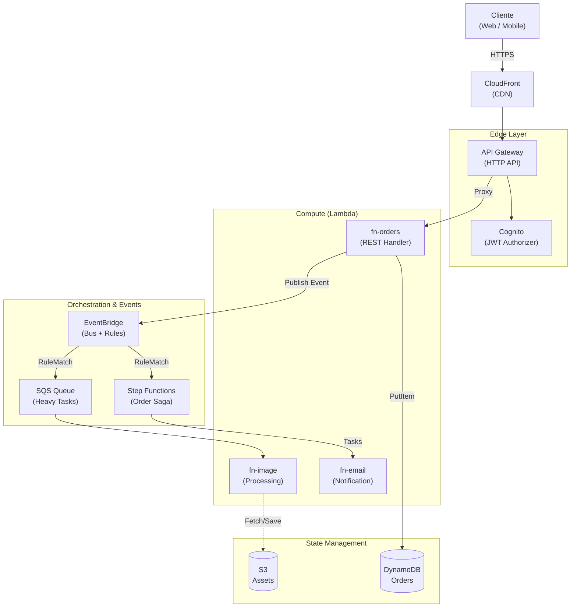

# Módulo 04 — AWS Serverless (Lambda, API Gateway, EventBridge, Step Functions, Cognito)

> **Objetivo profesional:** Dominar AWS Serverless no como "servicios" sino como **universo de trade-offs**. Entender cuándo Lambda es la respuesta correcta y cuándo es un error, cómo diseñar APIs con API Gateway sin perder performance, cómo orquestar workflows distribuidos con Step Functions sin que se conviertan en "código spaghetti en JSON", cómo EventBridge se diferencia de SNS/SQS, y cómo Cognito resuelve identidad sin construir tu propio IdP.

> **Este módulo es el puente entre la teoría (Módulos 01-03) y la infraestructura real.** Se apoya en [Módulo 02](02-Microservicios-y-DDD.md) (patrones de comunicación), [Módulo 03](03-Event-Driven-Architecture.md) (EventBridge, SQS, SNS, Saga) y se conecta con [Módulo 05](05-Bases-de-datos-distribuidas.md) (DynamoDB como persistencia natural de Lambda), [Módulo 06](06-Infraestructura-como-Codigo.md) (Terraform/CloudFormation para desplegar todo esto), y [Módulo 07](07-Observabilidad.md) (CloudWatch, X-Ray para traces).

---

## Introducción

AWS Serverless no es "no hay servidores" — es que **no gestionas servidores**. El servidor existe, pero AWS lo abstracta: tú subes función, ellos gestionan capacidad, escalado, parches y disponibilidad. El precio es una serie de trade-offs que, mal entendidos人民, producen sistemas mucho peores que los que reemplazan.

**Ventajas reales (con context):**

- Zero scaling logic: de 0 a thousands de invocaciones concurrentes sin configuración.
- Pay-per-use: pagas por milisegundo de ejecución y GB-segundo, no por uptime.
- Integración nativa con el ecosistema AWS (DynamoDB, S3, SNS, SQS, CloudWatch, X-Ray).
- Menor superficie operativa: no patches, no AMIs, no auto-scaling groups.

**Desventajas reales (que los tutoriales omiten):**

- **Cold starts:** la primera invocación de una función "dormida" incluye inicialización del runtime (100ms - 5000ms dependiendo del runtime y dependencias). En Node.js/Go son aceables; en JVM/Java son dolorosos a menos que uses SnapStart.
- **Límites estrictos:** 15 min max execution time, 10GB RAM max, payload limits (256KB para HTTP via API Gateway, 256KB para SQS, 6MB para invocación síncrona directa).
- **Vendor lock-in profundo:** el patrón Lambda + API Gateway + DynamoDB + EventBridge es difícil de portar a GCP/Azure sin reescritura.
- **Costo a escala:** a alto volumen constante (ej: 24/7 con 5000 req/s), EC2/ECS con Reserved Instances suele ser más barato que Lambda.
- **Debugging y testing local:** requiere herramientas especiales (SAM CLI, LocalStack, Docker emulación).

**Cuándo es correcto:**

- Eventos y triggers (S3 upload → thumbnail, DynamoDB stream → proyección).
- APIs con tráfico variable/impredecible.
- Glue jobs yETLLight.
- Prototipos y MVPs donde speed-to-market manda.

**Cuándo es incorrecto:**

- Workloads constantes 24/7 a alto throughput (más barato contendedores/EC2).
- Procesos con estado interno complejo que necesitan conexiones persistentes a múltiples backends (connection pooling agresivo).
- Aplicaciones que requieren más de 15 minutos de ejecución continua.
- Sistemas donde cold start de 3-5s es inaceptable (trading,HJ gaming de alta frecuenta).

---

## Conceptos

### AWS Lambda: más que "funciones"

**Qué es realmente:**
Un servicio de cómputo serverless donde:

- Subes código (o contenedor hasta 10GB).
- AWS ejecuta tu función en respuesta a _events_ (HTTP, S3, DynamoDB Streams, SQS, etc.).
- Escala horizontalmente ejecutando múltiples instancias en paralelo (hasta un límite regional por defecto de 1000 concurrent executions, ampliable via support ticket).
- Tú defines todo el entorno: runtime (Node.js 20.x, Python 3.12, Java 21, .NET 8, Go 1.x, Rust custom runtime, o container con OCI image).

**Anatomía de ejecución:**

```
Evento (HTTP, SQS, S3) → Runtime (proceso con tu código + runtime manager)
                        ↘ Handler(event, context)
                        ↘ return response / error
```

**Configuración clave:**

- **Memoria:** 128MB a 10,240MB (10GB). CPU granular: ~1 vCPU por 1.7GB. A más memoria, proporcionalmente más CPU; la política de "aumentar memoria" es la única forma de aumentar CPU.
- **Timeout:** default 3s, máximo 900s (15 min).
- **Concurrency:** reservado vs. proveedor. Reserved concurrency limita a una función específica (esto resuelve el problema de "un servicio acaparando la cuenta").
- **Layers:** paquetes de librerías compartidas entre funciones (evitando duplicar dependencias en cada zip).
- **Extensions:** procesos paralelos que se inician con Lambda para agentes (monitoring, tracing, secrets refresh).

### Cold starts detallados

Una función Lambda tiene dos fases de inicialización:

1. **Init (cold start):** contenedor SO + runtime + dependencias (npm install, mvn shaded jar, etc.) cargan. Esto ocurre una vez per instancia activa.
2. **Invoke (warm start):** el runtime ya está listo; Lambda reutiliza la instancia para próximas invocaciones.

**Mitigaciones:**

- **SnapStart (Java 11+):** snapshot JVM precargada. Inicia en ~35ms. No disponible para Node/Python nativamente.
- **Provisioned Concurrency:** AWS mantiene N instancias precalentadas. Costo adicional, pero elimina cold starts en rutas críticas. VERSUS reserved concurrency: provisioned es por performance, reserved es por control.
- **Librerías nativas optimizadas:** usar `esbuild` para bundle Node.js en un solo archivo, evitando cold starts por análisis de múltiples imports.

### Eventos y Fuentes de invocación

Lambda se invoca por:

- **HTTP/REST:** API Gateway, ALB (Application Load Balancer con Lambda como target).
- **Messaging:** SQS (polling batch), SNS (publish), EventBridge (rules).
- **Streaming:** DynamoDB Streams (CDC), Kinesis Data Streams.
- **Storage:** S3 PutObject, CloudWatch Events (cron).
- **Custom:** IoT Core, Cognito Triggers, Alexa Skills, etc.

**Control de errores por fuente:**

- **SQS:** Lambda poll hasta 10 mensajes. Si falla, el batch se devuelve a la cola. Lambda compiler retry hasta el maxReceiveCount de la queue.
- **DynamoDB Streams:** process records en batch. Si falla, Lambda repara el **shard completo** (head-of-line blocking en el stream).
- **Sync (HTTP/ALB):** el caller espera respuesta. Si Lambda falla, API Gateway devuelve 502.

### API Gateway: más que "un proxy"

API Gateway es un servicio managed de alto rendimiento para crear, publicar, mantener APIs REST/HTTP/WebSocket. Realiza dos funciones principales:

1. **Edge:** recepción de peticiones (CORS, autenticación, validación, rate limiting, caching).
2. **Integration:** conectar con backend (Lambda, HTTP, AWS services, mock).

**Tipos:**

- **REST API:** la clásica. Payload transformation con VTL (Velocity Template Language), policies, linked resources.
- **HTTP API:** más ligero, más barato (70% cost reduction vs REST), no soporta algunas funciones avanzadas (VTL, API Keys, usage plans nativos — se pueden hacer con authorizers).
- **WebSocket API:** para conexiones persistentes (chat, notificaciones push).

**Funcionalidades avanzadas:**

- **Caching:** respuestas cacheables con TTL, invalidación automática o manual. Reduces backend load.
- **Throttling:** tokens bucket por usuario o global, pará controlar rafagas.
- **API Keys y Usage Plans:** no son para seguridad (muchos creen esto; es para metering y cotas).
- **Custom Domain + ACM:** certificados SSL/TLS y dominios bonitos para APIs.
- **Canary releases:** dividen tráfico entre versiones (ej: 10% a nueva versión, 90% a la anterior) antes de promover.

**Trade-offs de diseño:**

- API Gateway + DynamoDB directo (integration tipo `AWS service proxy`): atractivo por rapidez, pero pierdes lógica de negocio centralizada y es hardcobre debuggear. Úsalo brillosamente para APIs CRUD simples.
- Lambda como backend: lógica centralizada para autenticación, enriquecimiento, transforms, validation.

### EventBridge: bus de eventos serverless con powers

EventBridge es más que SNS 2.0. Características diferenciadoras:

- **Schema Registry:** catálogo centralizado de contratos de eventos. Auto-discovery de eventos publicados: EventBridge infiere el esquema y lo almacena. Facilita a otros equipos consumir eventos consistentemente.
- **Event Pipes:** conexión directa source→target (SQS→EventBridge→Step Functions, API Gateway→Lambda). Incluye filtering, transformación y enrichment sin Lambda intermedia.
- **Scheduler:** subnservicio para invocar targets en cron (reemplaza CloudWatch Events).
- **Cross-account/cross-region:** event buses pueden estar en cuenta A, región us-east-1, con reglas que envían a target en cuenta B.

**CUando usar cada uno:**
| Escenario | AWS Service |
|---|---|
| Notificación simple a múltiples suscriptores | SNS |
| Trabajo pesado desacoplado | SQS |
| Eventos con routing por atributos | EventBridge |
| Streams, replay, high-volume continuo | MSK / Kinesis Data Streams |

**Ejemplo con EventBridge:**

```json
{
  "source": ["myapp.orders"],
  "detail-type": ["OrderCreated"],
  "detail": {
    "customerId": ["c-456"],
    "total": [{ "numeric": [">", 100] }]
  }
}
```

Una regla puede matchear y enviar solo pedidos del customer c-456 con total > 100 a un Step Function de "VIP approval".

### Step Functions: orquestación serverless

Step Functions coordina múltiples servicios AWS en workflows business con state machines definidas en **Amazon State Language (ASL)**, que es JSON.

**Tipos de workflow:**

- **Standard:** max 1 año de duración, exactly-once processing, más barato para ejecuciones largas.
- **Express:** max 5 minutos, at-least-once, alto volumen (processing >100K eventos/seg), mucho más económico para duración corta.

**Ventaja técnica:** state machine _no corre código_, solo coordina. Cada `Task` state invoca una API (Lambda, DynamoDB, SQS, ECS Activity) y espera resultado. No mantienes conexiones persistentes.

**Patterns clave:**

- **Saga orquestada:** como vimos en [Módulo 03](03-Event-Driven-Architecture.md), perfección para: coordinar pasos de pedidos, patient discharge, billing cycles.
- **Parallel:** ejecuta ramas concurrentes (enriquecer pedido + verificar fraud + log interaction concurrently).
- **Choice:** decisiones basadas en input de la Task anterior.
- **Map:** iterar sobre arrays (process 1000 S3 keys como batch concurrente).
- **Wait:** pausar entre acciones sin llamar innecesariamente services.

**Idempotencia:** Step Functions suporta integraciones idempotentes (`$.Retry` con backoff, `ResultPath`, `Parameters` para earthing de inputs entre steps).

### Amazon Cognito: identidad sin infraestructura

Cognito soluciona **autenticación** y **director de usuarios** sin que construyas tu propio sistema. Es crítico entender sus componentes para no confundirlos:

- **User Pools:** directorio de usuarios completo (registro, sign-in, reset password, MFA, OAuth 2.0 tokens para consumo "user-level"). Emite JWTs estándar.
- **Identity Pools (Federated Identities):** paran acceso a AWS resources desde terceros (Google, Facebook, OpenID Connect, SAML). Genera credenciales IAM temporales.
- **Triggers:** Lambda functions que se ejecutan en ciertos puntos del credential flow (pre_sign_up, post_confirmation, etc.) para personalización.

**JWT de User Pools:** para applicaciones web/móvil típicas, el `id_token` y `access_token` emitidos por Cognito bastan para autenticar requests en API Gateway con authorizers nativos.

---

## Arquitectura

### 1. Diseño de aplicación serverless típica

La vista general del stack serverless (renderizada en GitHub):



*(Versión alternativa en texto plano para editores sin Mermaid:)*

```
┌─────────┐    ┌─────────────┐    ┌────────────┐    ┌────────────┐    ┌─────────┐
│ Client  │───▶│  Route 53   │───▶│  API GW    │───▶│ Lambda     │───▶│DynamoDB │
│(Web/SPA)│    │ + CloudFront│    │ (REST/HTTP)│    │ Fn (Auth)  │    │ (NoSQL) │
└─────────┘    └─────────────┘    └────────────┘    └────────────┘    └─────────┘
                                         │
                                         ▼
                                   ┌────────────┐
                                   │ EventBridge│
                                   │ (Event bus)│
                                   └────────────┘
                                         │
          ┌─────────┬──────────┬───────────┬───────────┐
          ▼         ▼          ▼           ▼           ▼
      ┌───────┐ ┌───────┐ ┌─────────┐ ┌─────────┐
      │ Lambda│ │ Lambda│ │   Step  │ │ Step Fn │
      │(Email)│ │(Image)│ │Functions│ │ │(Saga) │ │(DataETL)│
      └───────┘ └───────┘ └─────────┘ └─────────┘ └─────────┘
```

**Puntos de diseño:**

- Edge: CloudFront para CDN, Route 53 para DNS with health checks.
- API: HTTP API basta si no necesitas VTL transformations. REST cuando necesitas API Keys usage by plan.
- Lambdas: pequeñas, single purpose. Use context memoization (como apostillar en clase BD EN PV singleton).
- Data: DynamoDB para key-value y documentdb si acceso patters son simples. Amplifier por aggregate by features.
- Events: EventBridge con Schema Registry enables discovery. Separar event bus por dominio.
- Async procesamiento: SQS queue toLambda (work processors). Para streams+replay: Kinesis / MSK con consumers Lambda.

### 2. Authentication y Authorization flow

```
1. Cliente -> Cognito User Pool (Sign in)
   -> Retorna JWT (id_token + access_token + refresh_token)

2. Client calls API Gateway con `Authorization: Bearer <access_token>`

3. API Gateway Cognito Authorizer valida firma, expiración, scopes.

4. API GW inyecta claims ($context.authorizer.claims.sub) y los pasa a Lambda.

5. Lambda decide authorization: "usuario X puede acceder a sus own orders",
   using identity claim `sub` for data filtering.

6. Si expira: cliente usa refresh_token en Cognito -> new tokens.
```

Service-to-service entre Lambdas: usar `ClientCredentials` flow. En event processing, la emisión de nuevos tokens se hace con IAM roles (Execution Role) para invocar otros servicios AWS sin hardcode.

### 3. Flujo de agregación asíncrona con SQS+Step Functions

**Pattern:** trabajo pesado secuencial pero sin timeout de Lambda.

```
API Gateway HTTP
   └─> Lambda Fn_A (Split order into tasks)
      └─> SQS con Task messages (individual units)
         └─>[Trigger] Lambda Fn_B (Process each task, updates DynamoDB)
            └─> DynamoDB: Status updated

Cuando DynamoDB stream registra "all tasks COMPLETED":
   └─> EventBridge rule triggers Step Functions
        └─> Saga final (send email, issue invoice, register metrics)
             -> [Tasks states as they complete...]
```

### 4. WebSocket with API Gateway + Lambda

Para chat real-time:

- Cliente mantiene WebSocket connection (`$connect`, `$disconnect`, `$default` lambdas).
- Dialogos pub/sc events van a EventBridge.
- Reglas enrutan a Lambda encargada de `postToConnection`.

Estos patrones reemplazan to Simple WebSocket servers. Common gotcha: el `$connect` handler must store mapping between WebSocketID and userId (usually in DynamoDB with TTL).

---

## Internals: Lambda profundidad

### Runtime execution y estadísticas

HTTP-trigger:

```python
import json
def lambda_handler(event, context):
    # Accessing API Gateway proxy format v2.0
    body = json.loads(event.get('body', '{}'))
    return {
      "statusCode": 200,
      "headers": {"Content-Type": "application/json"},
      "body": json.dumps({"message": "ok"})
    }
```

AWS genera CloudWatch Logs con:

- `START` / `END` / `REPORT` (duration, billed duration, memory size, init duration).
- Metricas: Invocations, Duration, Errors, Throttles, ConcurrentExecutions.

**Memory optimization pattern:** With 1GB memory (≈0.58 vCPU). Benchmark fluorescencia between 512MB (single core) vs 1792MB (1.05 cores): a veces duplicar memoria halucinates cold start duration for CPU-bound fixture initialization (JS bundling, Java classloading).

**Provisioned Concurrency example:**

```yaml
ProvisionedConcurrencyConfig:
  ProvisionedConcurrentExecutions: 10
```

Mantiene 10 Lambdas precalentadas (billed as always running). Mesaure with CloudWatch `ProvisionedConcurrencyInvocations`.

**Cold start mitigations in practice:**

1. Node.js: use `esbuild` or `webpack` to bundle everything to single file.
2. Java: SnapStart.
3. Python: keeping `requirements.txt` minimal region specific runtime caching.
4. Arquitectura: middleware-heavy endpoints on API GW instead of Lambda where possible.

### Límites que hay que conocer

Payload limits (per invocation):

- API Gateway HTTP: 10MB body, 10KB header size total.
- SQS message: 256KB max.
- SNS message: 256KB per publish.
- EventBridge event: 256KB per event.
- S3 triggered Lambda: data event record only includes metadata (max ~6KB per event item), content fetched separately.
- Lambda direct sync invoke: 6MB request/response.

Concurrency:

- Default regional: 1000 concurrent executions. Reserved concurrency: up to ~60000 per account across all functions; you can reserve per function (e.g., critical fn gets 50).

### Patrón de inyección de dependencias y testabilidad

Lambda functions son complicadas de testear si metes todo en la misma función. Solución: Hexagonal + DI.

```typescript
// Handler.ts — Entry Point (Infra)
export const handler = async (event: APIGatewayProxyEvent) => {
  const repo = new DynamoOrderRepository();
  const useCase = new CreateOrderUseCase(repo);
  return useCase.execute(JSON.parse(event.body));
};

// createOrderUseCase.ts — Application (Domain)
export class CreateOrderUseCase {
  constructor(private repo: OrderRepository) {}

  async execute(input: CreateOrderDTO): Promise<Result<string>> {
    const order = Order.create(input);
    await this.repo.save(order);
    await this.publishEvents(order.events);
    return ok(order.id);
  }
}
```

Cargamos el repositorio real en producción, in-memory fake en tests — el use case no sabe qué está usando.

---

## Patrones

### Pattern: Fan-out con SNS + SQS

```text
EventBridge (orders.events)
   |
   └─→ SNS Topic "order-events"
         ├─→ SQS "notifications" → Lambda → Email
         ├─→ SQS "analytics"     → Lambda → Redshift/S3
         └─→ SQS "erp-sync"      → Lambda → SAP/HTTP
```

Esto combina routing (EventBridge) con desacoplamiento (SNS) y backpressure/retries (SQS). Es el patrón estándar para resultado distribución de eventos.

### Pattern: Lambda Power Tuning

Herramienta de AWS Labs que ejecuta función con diferentes configuraciones de memoria y mide costo/duration trade-off. Output recomienda optimization point.

Ejemplo típico de salida:

```
Memory  Cost Duration
128     $0.0002  15s
512     $0.0006   4s
1024    $0.0011   2s
2048    $0.0021   1.1s
```

A veces 2x memoria reduce duration by half → costs stay same, UX improved.

### Pattern: Idempotency Layer

Pattern aplicado a Lambda que procesa SQS:

```typescript
const DEDUP_TABLE = process.env.DEDUP_TABLE;

async function processRecord(record) {
  const messageId = record.messageId;
  const result = await dedupDB.insert({ PK: `MSG_${messageId}`, status: 'PROCESSING' },
    { ConditionExpression: 'attribute_not_exists(PK)' });

  if (result.alreadyExists) return; // at-least-once safety

  try {
    await businessLogic(record.body);
    await dedupDB.update({ ... , status: 'DONE' });
  } catch (err) {
    await dedupDB.update({ ..., status: 'FAILED', error: err.message });
    throw err; // Retries via SQS visibility timeout
  }
}
```

Store last processed rollover from DynamoDB stream (sequence number) to prevent reprocessing on consumer lag rebalance.

### Pattern: CORS handling

Don’t rely on Lambda to return CORS headers unless debug. Enable CORS in API Gateway directly (OPTIONS preflight si aplica). For HTTP API, simple configuration; REST API requires integration response mappings based on origin map.

---

### Pattern: Model Gateway (capa de integración de modelos)

Es la generalización del API Gateway cuando el backend consume uno o varios proveedores de IA (modelos auto-hospedados + APIs externas). Es un proxy centralizado que:

- **Unifica la interfaz:** si cambia un modelo/API, se actualiza el gateway y no todas las aplicaciones que dependen de él.
- **Centraliza acceso y coste:** en lugar de repartir credenciales de OpenAI/Anthropic, las aplicaciones acceden solo al gateway, que aplica control fino por aplicación y limita/monitoriza el uso (evita abuso y gestiona coste).
- **Implementa fallback y resiliencia:** ante *rate limits* o fallos de una API, enruta a un modelo alternativo, reintenta o degrada sin cortar el servicio.
- **Reutiliza la capa edge:** como todo pasa por él, es el lugar natural para logging, métricas, caching (exacto/semántico) y guardrails.

En AWS se despliega como una Lambda/ECS detrás de API Gateway, o como un proxy adyacente, reutilizando el rate limiting, la auth (Módulo 08) y la observabilidad (Módulo 07) ya existentes en esta guía.

> *"A model gateway is an intermediate layer that allows your organization to interface with different models in a unified and secure manner ... The gateway can also implement fallback policies to overcome rate limits or API failures."* — Chip Huyen, *AI Engineering*, Cap. 10 (AI Engineering Architecture and User Feedback).

## Casos Reales

### Caso 1: Migración de monolito a serverless en producción (E-commerce)

Un retailer migró su checkout desde Node monolito a Lambda + API Gateway + DynamoDB.

- **Altas lambdas:** `checkout-handler` para starts transactions, `payment-callback` para external payment confirmations, `inventory-reserve` para stock moves.
- **Resultado:** Deploy con 0 downtime, escala a BlackFriday (10x traffic), costes reducidos ~40% vs EC2 persistente, pero debugging inicial complejo hasta establecer(correlation ID + X-Ray).
- **Lección:** Authentication via Cognito User Pools redujo código by ~60%, no obstante tuvieron que migrar múltiples roles custom a User Pool Groups + IAM conditional policies.

### Caso 2: Procesamiento masivo con Map State (Fintech)

Una fintech debía calcular daily positions para ~10,000 accounts. Monolitica tardaba 45 minutos con prohibición de downtime.

Solución serverless con Step Functions Map:

- **Distributed Map State:** input array de IDs processed in parallel (maxConcurrent: 500, Batch input to avoid memory depletion).
- Cada "Task" invoques a Lambda which fetch account data, compute position, write result.
- `ResultWriter` in Step Functions EMITS summary to S3 for archival and analytics.
- **Time:** 45m → 4m with cost ~2.3x of single Lambda same duration (paralelism "pays more but completes faster" trade-off acceptable).

### Caso 3: WebSockets + Push Notifications para field teams

Empresa logística needed live dispatch updates on drivers app. Tradicional: WebSocket server behind ELB + connection state in Redis (~$1200/mo, horizontal scaling pain).

Solución: API Gateway WebSocket + Lambda + DynamoDB.

- `$connect` lambda saves `connectionId -> driverId`.
- Dispatcher publishes to SNS when new assignment.
- Fan-out Lambda sends POST to `https://{domain}/{stage}/@connections/{connectionId}` via API Gateway Management API.
- **Cost:** ~180/mo, automatic scaling, no stateful好景不长 servers. Management API per-attempt cost balances out.

**Crítico lesson:** Used TTL on DynamoDB connection records to auto-purge stale connectionIds. Middleware authorizer refreshed socket auth token every 15 minutes to avoid long-lived tokens compromise.

---

## Laboratorio

### Lab 1: Serverless CRUD API con DynamoDB

Task: Build a minimal todo API using HTTP API Gateway + Lambda + DynamoDB.

1. Bookmark POST /todos, GET /todos, PUT /todos/:id, DELETE /todos/:id.
2. CORS enabled.
3. Unit test the use case with mocks.
4. Integration test with SAM Local or LocalStack.

**Deliverables:** ZIP deployable via AWS SAM template (infra as code preview — Módulo 06).

### Lab 2: Order processing with Saga via Step Functions

Implement in TypeScript/JavaScript:

- Step Function `OrderSaga` con tambien:
  - `ValidateOrder` (Task → Lambda)
  - `ReservePayment` (Task → Lambda → Retry 3)
  - `ReserveStock` (Task → Lambda)
  - `Choose: StockReserved?` (Choice state, check output)
  - `ConfirmOrder` (Task)
  - `Catch` on `ReservePayment` → `VoidPayment` (Task)
  - `Catch` on any failure → `SendFailureNotification` via SNS.

Deploy with SAM. Test with Step Functions Local or stubbed Lambda responses.

### Lab 3: Event-driven architecture with EventBridge Pipes

Queue something: DynamoDB Stream from `Orders` table. When row updated with status="SHIPPED":

- EventBridge Pipe reads stream, filters by status.
- Target = SQS Queue for notifications.
- Separate SQS queue triggers Lambda with logic for user email.

Check lag in CloudWatch, ensure messages arrive within X seconds.

### Lab 4: JWT Authorizer with Cognito User Pool

1. Create Cognito User Pool with email sign-in.
2. Configure API Gateway with JWT Authorizer (Issuer + Audience).
3. Scope-based restriction: endpoint `/admin/**` requires `cognito:groups` claim contains "Admin".
4. Client demo: get with Postman, access token, call API.

### Lab 5: Serve "heavy" long-running batch with Express Workflows

Compare standard workflow vs express:

- Process 5000 records with annotations.
- Measure totalExecutionDuration and billable duration.
- Learn when to choose each.

---

## Entrevistas

1. **Diferencia entre HTTP API y REST API en API Gateway.**

   **Orientación:** Compara costo, funcionalidad y cuándo cada uno según el tipo de API y backend.

   **Respuesta de un senior:** "HTTP API es más barato y con menor superficie de features, pensado para CRUD simple con backend Lambda o de servicio HTTP: suficiente integración, menos latencia y menos costo. REST API es el clásico con más features: soporta *mapping VTL* de requests/responses, *usage plans* y API keys para monetización, validación con modelos JSON, SDKs generados, y conexión directa con backends no-HTTP (por ejemplo, un Lambda que habla otro protocolo). Mi regla: si es una API pública/CRUD que solo necesita un proxy a Lambda, elijo HTTP API por costo y simplicidad; si necesito VTL, authorization compleja por method, planes de uso con API keys o integración con backends que no son HTTP, uso REST API. No es 'REST mejor que HTTP': es elegir la herramienta por lo que la API realmente necesita."

2. **Cold starts: cómo predecirlos y mitigarlos.**

   **Orientación:** Debes separar la predicción (Init Duration) de las mitigaciones, y el matiz de costo vs necesidad.

   **Respuesta de un senior:** "El cold start es el tiempo que pasa desde que Lambda esculpe una nueva ejecución hasta que tu handler corre; se ve en CloudWatch como `Init Duration`. Lo *predigo* con eso, y conociendo qué carga: memoria baja con trabajo CPU-bound, o un bundle grande que tarda en deserializar, invitan a cold starts largos. Lo *mitigo* según cuándo el problema es real: (1) *Provisioned Concurrency* para los endpoints críticos que no pueden esperar, que mantiene ejecuciones tibias (tiene costo, así que NO lo aplico a todas las funciones); (2) *SnapStart* (Java) que persigue reducir el arranque de runtime y código; (3) reducir el bundle y lazy-load de imports para que el init sea más corto; (4) reservar una dotación de warm execution. Y aclaro el trade-off: optimizar el cold start de todo te cuesta dinero que no recuperas; lo reservo para el camino que el usuario percibe."

3. **Diseña un servicio de procesamiento de imágenes que escale.**

   **Orientación:** Esperan event-driven con S3/SQS/Lambda, handle de archivos grandes, batching y DLQ.

   **Respuesta de un senior:** "Lo montaría totalmente serverless y event-driven: cuando se sube una imagen a S3, se emite un evento que encola trabajo. Para archivos grandes no subiría el binario por la API; usaría un *evento de S3 con URL pre-firmada* que la función descarga directamente desde S3, evitando cargar el payload por el gateway. El procesamiento va a una cola (SQS) que se *batchea* (máx. 10 mensajes por invocación) para eficiencia, y el error se ruta a una *DLQ*. Cada imagen genera metadatos que escribo a DynamoDB para consultar el estado y las URLs de salida. Si un solo worker no basta (thumbnails múltiples, vídeo), disparo un *Step Functions* que orquesta varias funciones en paralelo. Escala sin intervención porque cada componente es serverless y está desacoplado por la cola; solo cuido el DLQ y el monitoreo de la cola para ver atascos."

4. **Coste: Lambda vs EC2 vs Fargate para una API 24/7 con ~2M requests/día.**

   **Orientación:** Buscan que hagas una comparación honesta de coste y cuándo la inversión está justificada.

   **Respuesta de un senior:** "Para tráfico constante 24/7, Lambda no siempre es lo más barato. Hago la cuenta: ~2M requests/día con ~100 ms y 512 MB en Lambda, una estimación razonable ronda los ~30 USD/mes de ejecución. El mismo trabajo en un EC2 c6i.large (dos vCPU, 4GB) son ~70 USD/mes, más el load balancer (~18 USD/mes). Lamia gana cuando el tráfico es *esporádico o variable*: no pagas tiempo ocioso. Pero cuando la carga es predecible y constante, EC2/Fargate con ASG se vuelve más rentable y elimina el cold start. Mi recomendación honesta: empezar con Lambda por velocidad y under-utilización, y migrar a Fargate con ASG cuando el tráfico se estabilice y el coste de Lambda lo justifique. La decisión no es 'mejor tecnología', es dónde está el punto de corte de costo según el perfil de tráfico."

5. **DynamoDB vs Aurora Serverless v2 para un e-commerce basado en Lambda.**

   **Orientación:** Contrasta casos de uso: latencia predecible y sin conexiones con DynamoDB, contra consultas relacionales y ACID multi-tabla con Aurora.

   **Respuesta de un senior:** "Para la mayoría del catálogo y carrito de un e-commerce en Lambda elijo *DynamoDB*: latencia predecible en milisegundos, no gestiono connection pool (HTTP en vez de protocolo de base de datos), y escala sin operación. Respecto al lóbulo relacional: si necesito *queries relacionales complejas* (joins, reportes ad hoc) o *ACID multi-tabla* que DynamoDB resuelve mal, y el límite de conexiones concurrentes no es problema (>10K conexiones en el pico), *Aurora Serverless v2* encaja, porque escala la capacidad y se integra bien con Lambda aunque requiere gestionar el pool de conexiones (RDS Proxy). La decisión se toma antes por *access patterns*: defino cómo se lee y se escribe; si es por clave predecible → DynamoDB; si son joins y transacciones relacionales → Aurora. Nunca tomo la base de datos antes de modelar los patrones de acceso."

6. **Step Functions vs orquestador a medida.**

   **Orientación:** Buscan que hables de state management, retries, ASL declarativo y cuándo custom ganaría.

   **Respuesta de un senior:** "Partiría casi siempre de *Step Functions* para orquestar flujos: me da *state management* gestionado (guarda el estado entre pasos sin que yo lo haga), *retry* y *timeout* configurados declarativamente en ASL, *checkpointing* que reanuda el flujo donde quedó, y visualización + métricas para operar. El JSON declarativo cuesta aprenderlo, pero se amortiza cuando la orquestación es un valor real. Solo considero un *orquestador a medida* en dos casos: throughput extremadamente alto, donde el overhead del state de Step Functions no escala, o una lógica tan propietaria y simple que no justifica el costo de adoptar DSL. Mi criterio: si la coordinación importa más que la duración, uso Step Functions; un custom box está justificado solo cuando cargo, simplicidad o control absoluto lo piden."

7. **Cognito vs Auth0 vs construir auth en casa.**

   **Orientación:** Compara costo, integración con ecosistema AWS, API de gestión, y cuándo el build in-house se justifica.

   **Respuesta de un senior:** "Elijo *Cognito* cuando estoy en AWS: es el más barato, se integra nativamente con IAM (Identity Pools) para dar permisos a recursos AWS, y permite personalización con triggers de Lambda (migración, pre-token, etc.) sin salir del ecosistema. *Auth0* gana en riqueza de Management API, integraciones social/enterprise listas sin trabajo custom, y experiencia de cliente, aunque cuesta más a partir de ciertos MAU. Construir auth *in-house* casi nunca lo recomiendo por el riesgo de seguridad (manejo de tokens, password hashing, MFA, sesiones), salvo que un requisito regulatorio me impida usar un SaaS de identidad o necesite operar del todo en mi propia infraestructura. La decisión entre Cognito y Auth0 es: máximo acople AWS-barato vs máximo feature-set-easy."

8. **Migración Monolito → Serverless: trade-offs.**

   **Orientación:** Debates cold start, pooling de conexiones a RDS, observabilidad, sesiones y coste variable.

   **Respuesta de un senior:** "Migrar despacito y con intención. Los trade-offs que llamo: (1) *cold starts* en el camino crítico, que antes no existían; (2) *connection pooling* a bases relacionales, porque el número de ejecuciones puede disparar conexiones y ahogar el RDS (ahí RDS Proxy); (3) *observabilidad*: pago cada request y tengo más componentes, así que requiero tracing y logging estructurado antes de la migración; (4) *sesiones de estado*: en un serverless no guardas estado en el proceso, hay que llevar cualquier sesión a DynamoDB/Redis o token; y (5) *coste variable*: salgo de pagar por hora a pagar por request, lo que no siempre es predecible. La estrategia: extraer primero lo que más se beneficia (spikes, endpoints infrecuentes, batch), dejar el núcleo monolith hasta que el flujo esté probado, y no migrar lo que solo cambia de infraestructura sin valor."

9. **Exactly-once para pagos vía cola.**

   **Orientación:** Debes aterrizar el concepto de idempotencia + dedup a nivel de consumidor, y la ejecución aislada.

   **Respuesta de un senior:** "El pago es el peor caso para duplicados, así que no confío en garantías del transporte. Asumo *at-least-once* de SQS y resuelvo *effectively once* en el consumidor con *idempotencia*: cada mensaje lleva una `dedupKey` (p. ej. el `paymentId`), y al procesarlo hago una escritura condicional—inserto el asiento solo si la clave no existe—de forma atómica en la misma transacción que el cobro. Proceso todo dentro de una *única ejecución de Lambda* para que la operación sea atómica frente a reintentos; si la ejecución muere a medio, cuando se reintenta, la dedupKey detecta que ya está aplicada y devuelve el resultado sin re-cobrar. No hago check-then-act (evito la condición de carrera). El resultado: aunque el broker reintente, el cliente se cobra exactamente una vez."

10. **Debuggear una aplicación serverless distribuida.**

    **Orientación:** Esperan correlación de logs, tracing distribuido y redacción de datos sensibles.

    **Respuesta de un senior:** "Para debuggear un problema serverless distribuido no miro un solo log: correlaciono. Activo *X-Ray* para distributed tracing, de modo que cada request tracea sus spans a través de API Gateway → Lambda → DynamoDB/SQS y veo dónde está la latencia o el fallo. Uso *CloudWatch Logs Insights* con queries para correlacionar por `requestId` o `traceId` a través de las funciones, filtrando con tiempo. Y verifico que el logging estructurado incluya `requestId`/`correlationId` en cada mensaje, para saltar de un evento al siguiente sin saltos. Cuido la *redacción* de datos sensibles: aplico políticas de redacción para no loguear card numbers, password, tokens. Mi flujo: localizar el trace con X-Ray, abrir los logs de ese trace con Insights, y confirmar la causa, con observabilidad como requisito previo (nunca añadida después de un incidente)."

---

## Checklist

- [ ] Entiendo differences entre HTTP API, REST API y ALB como entry point.
- [ ] Sé expliquan cold starts, cómo medirlos, y tres mitigaciones efectivas.
- [ ] Puedo elegir entre Provisioned vs Reserved Concurrency based on objective.
- [ ] He diseñado al menos una Saga orquestada con Step Functions y ASL JSON.
- [ ] Sé diferenciar SNS (fanout simple), SQS (trabajo), y EventBridge (routing+schema).
- [ ] Puedo integrar API Gateway con Cognito JWT Authorizer sin Lambda authorizer code.
- [ ] He implementado un producer/consumer idempotent pair with SQS and DynamoDB dedup.
- [ ] Entiendo límites de payload (API GW 10MB, SQS 256KB, Lambda 6MB direct sync).
- [ ] He implementado HTTPS redirects /authentication offload at CloudFront/API GW layer.
- [ ] He calculado cost estimation de un workload serverless previsualemente.

---

## Referencias y lecturas recomendadas

- **AWS — What is AWS Lambda / Serverless** — https://aws.amazon.com/lambda/ y https://aws.amazon.com/serverless/
- **AWS — Serverless Applications Lens (Well-Architected)** — https://docs.aws.amazon.com/wellarchitected/latest/serverless-applications-lens/
- **AWS — "Dynamo: Amazon's Highly Available Key-value Store"** — DeCandia et al., 2007, https://www.allthingsdistributed.com/2022/11/amazon-2022-recap-dynamodb.html
- **AWS Samples — AWS Lambda Power Tuning** — https://github.com/aws-samples/aws-lambda-power-tuning (herramienta de optimización de memoria/costo).
- **AWS — Amazon State Language (ASL)** — https://states-language.net/
- **AWS — EventBridge vs SNS vs SQS** — https://aws.amazon.com/blogs/compute/sqs-vs-sns-vs-eventbridge/
- **AWS — AWS Lambda Limits** — https://docs.aws.amazon.com/lambda/latest/dg/gettingstarted-limits.html
- **AWS — Getting started with Amazon Cognito** — https://docs.aws.amazon.com/cognito/latest/developerguide/getting-started.html
- **"Serverless Architectures on AWS"** — Peter Sbarski (Manning). Libro de patrones serverless.
- **"AI Engineering"** — Chip Huyen (O'Reilly, 2024). Cap. 10 (patrón *model gateway* en la capa de integración).
- **YouTube — "AWS re:Invent Serverless" talks** — https://www.youtube.com/results?search_query=aws+reinvent+serverless+dynamodb

---

**Módulo 04 completo. La construcción de la infraestructura con Terraform/CloudFormation viene en el Módulo 06. Base de datos se profundiza en el Módulo 05.**
