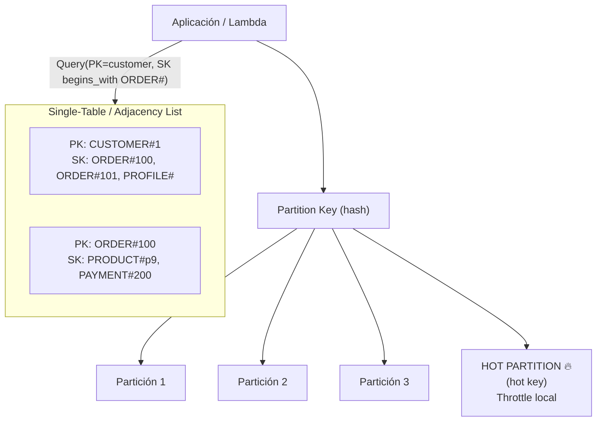

# Módulo 05 — Bases de Datos Distribuidas (DynamoDB y Patrones NoSQL)

> **Objetivo profesional:** Dominar la persistencia distribuida como un ingeniero senior. No basta con saber `putItem`/`query` en DynamoDB: hay que entender **por qué Amazon necesitó crearlo, qué limitaciones tenían las bases relacionales, cómo funciona el particionamiento, qué es un Partition Key, por qué aparecen los hot partitions, cómo se calculan las RCU/WCU, cuándo conviene un GSI o un LSI, y sobre todo por qué los modelos relacionales "tal cual" suelen fallar al migrarlos a DynamoDB.** Al finalizar, deberías diseñar tablas basadas en **patrones de acceso**, no en normalización.

> **Ubicación en la guía:** Se apoya en el [Módulo 01](01-Arquitectura-de-Software-Moderna.md) (trade-offs), [Módulo 02](02-Microservicios-y-DDD.md) (database-per-service, bounded context), [Módulo 03](03-Event-Driven-Architecture.md) (consistencia eventual, streams). Conecta con [Módulo 04](04-AWS-Serverless.md) (Lambda + DynamoDB) y los conceptos transversales CAP/PACELC/ACID/BASE del [Glosario](00-Glosario.md). El patrón CQRS se ve en el Glosario y en el Módulo 03.

---

## Introducción

En los módulos anteriores diseñamos **límites de servicios** y **flujos de eventos**. Ahora llega el momento de responder la pregunta que arruina a más proyectos organizados: **¿dónde vive el estado?**

Durante décadas, la respuesta fue obvia: una base de datos relacional (SQL). RDBMS ofrece ACID, joins, integridad referencial, lenguaje declarativo (SQL). Pero cuando un sistema debe escalar horizontalmente a miles de nodos y a millones de escrituras por segundo, aparecen los límites físicos del modelo relacional: el escalado vertical tiene techo, y los joins/transacciones cruzando nodos rompen la ilusión de una sola base.

Amazon, al diseñar su plataforma de e-commerce, se topó con este muro y construyó **DynamoDB** (y publicó el paper **"Dynamo: Amazon's Highly Available Key-value Store"**, 2007). Este módulo no es una lección de "cómo usar la consola": es la historia, la mecánica interna y el **pensamiento de modelado** que define a un ingeniero senior enfrentado a datos a escala.

**Lo que un senior debe poder responder sin dudar:**
- ¿Qué gané y qué pagué por elegir NoSQL con consistencia eventual?
- ¿Por qué mi diseño SQL "bien normalizado" se derrumbó migrado tal cual a DynamoDB?
- ¿Dónde están los cuellos de botella (hot keys/partitions) y cómo los evito desde el modelo?

---

## Conceptos: el problema que resolve DynamoDB

### ¿Por qué Amazon necesitó inventar DynamoDB?

A mediados de los 2000, el carrito de compras de Amazon necesitaba:
- **99.99% de disponibilidad** sin degradación durante sus picos (Navidad, Prime).
- **Bajas latencias** consistentes (single-digit ms).
- **Escalado horizontal** simple: añadir capacidad = añadir servidores.

Las bases relacionales de la época ofrecían ACID y SQL pero escalaban casi siempre **verticalmente** (más CPU/RAM en una sola máquina), con réplicas de lectura caras y consistencia compleja. En un Black Friday, un nodo central con petabytes era inmanejable.

La respuesta fue un diseño **leaderless, AP** (en términos CAP): disponible y tolerante a particiones, con consistencia eventual por defecto y lecturas consistentes bajo demanda. Ese es el origen de las **Dynamo-like databases** (DynamoDB, Cassandra, Voldemort, Riak).

### Modelo de datos

DynamoDB es un **key-value + document store**:
- **Table** = colección de items.
- **Item** = un registro (dict de atributos).
- **Attributes** = campos (nested JSON permitido).
- **Partition Key (PK)** + opcional **Sort Key (SK)** definen la clave primaria.

Todo el modelo gira alrededor de **cómo se busca**, porque **no hay joins, ni GROUP BY, ni índices secundarios arbitrarios**: solo consultas por clave (o índices que definas explícitamente).

### Relational vs DynamoDB: la trampa

Los equipos que "migran su ERD tal cual" fallan por esto:

| Pensamiento relacional | Realidad DynamoDB |
|---|---|
| Diseño por normalización (3NF) | Diseño por **access patterns** (denormalización intencional) |
| Joins para cruzar tablas | Aplicación cruza datos; duplicación deliberada |
| Un índice global por campo | Máximo 20 GSIs por tabla, cada uno con costo propio |
| Transacciones complejas multi-tabla | Transacciones hasta por 100 items / 4MB (multi tabla reciente) |
| Query flexible (cualquier columna en WHERE) | DEBES conocer la PK; el modelado decide las búsquedas |

**Regla de oro: en DynamoDB, primero listas los patrones de acceso (queries), luego diseñas la tabla. Nunca al revés.** En SQL, primero normalizas y luego escribes queries; en DynamoDB, cada "acceso" que necesitas debe ser una búsqueda barata por clave.

---

## Arquitectura: cómo funciona por dentro

### Particionamiento y Partition Key

Una tabla DynamoDB se reparte en **particiones (shards) físicas**. Cada item se asigna a una partición calculando un **hash** de su partition key:

```
partición = hash(PK) % número_de_canréteros
```

- El **Partition Key** debe distribuir uniformemente el hash para que el tráfico se reparta entre particiones.
- El **Sort Key** permite ordenar/agrupar dentro de una misma partición y hacer range queries (BETWEEN, begins_with).
- El dato más importante a nivel senior: **una tabla no es "un solo almacén"**: es una colección de particiones independientes, cada una con **su propio límite** de capacidad (aprox. 3000 RCU / 1000 WCU por partición).

La siguiente vista resume la mecánica: las claves se reparten por hash entre particiones (con riesgo de hot partition), mientras que la técnica single-table agrupa entidades relacionadas para convertirlo todo en queries eficientes:



### Hot partitions (El enemigo nº1)

Una **hot partition** ocurre cuando una sola llave se llena de tráfico. Ejemplo típico:

> Una tabla de "scores" de un juego viral con PK = `gameId`. En mess night, todos juegan a `game_id = "iyf-2026"` → miles de escrituras saltan sobre UNA partición (la del hash de esa clave). El resto queda ocioso. DynamoDB la limita (ThrottlingException / 400), aunque tu cuenta tenga millones de WCU libres.

**Causas comunes:**
- Keys globalmente populares (productos virales, cuentas de usuario mega-famoso).
- Escrituras concentradas en un rango continuo de time (ej. fechas con hash que aglutina).
- TTL/borrado en masa de la misma partición.

**Soluciones (pattern toolbox):**
1. **Shuffle sharding / saturating the scope:** añadir un sufijo aleatorio o entidad (p.ej. `orderId#partition`). El orden global se pierde; réplica el dato en buckets paralelos (como las vecinas de DynamoDB).
2. **Write sharding:** dividir una key caliente en N sub-keys (`hot_0..hot_99`) y distribuir las escrituras; luego agregar en lectura.
3. **Cambiar la PK por una compuesta** que dispersa (tenant + scope).

### Sort Key y el patrón de diseño consolidado

El **single-table design** o **"adjacency list"** es el patrón más rico de DynamoDB. En vez de dividir entidades en tablas separadas, **consolida todas en una misma tabla** usando prefijos en la SK y relaciones por clave primaria.

Ejemplo multi-entidad en una sola tabla (`Orders`) con **Adjacency List**:

```
PK            SK                     type     data
-----------+----------------------+--------+----------
USER#c-1   | ORDER#o-1            | order   | {total...}
USER#c-1   | ORDER#o-2            | order   | {total...}
USER#c-1   | PROFILE#             | profile | {name...}
USER#c-1   | ADDRESS#addr-1       | address | {...}
```

- Todos los items del mismo usuario caen en la **misma partición** (bueno para queries por usuario).
- Con `SK begins_with("ORDER#")` obtienes todos los pedidos de un usuario en **una sola query ordenada**.
- Con `SK = "PROFILE#"` obtienes el profile exacto.
- Relaciones: `PK=USER#c-1, SK=PAID_BY#order#o-1` para referenciar pagos sin join.

**Beneficio:** mín. lecturas, costes bajos, búsquedas óptimas. **Costo:** menos legible, el modelado debe pensarse con cuidado, y cada entidad añade esquemas en el mismo "universo".

### Read Consistency

Por [PACELC](00-Glosario.md) y predictibilidad:

- **Lectura eventual (defecto):** lecturas pueden devolver versiones viejas. Cuesta **mitad de RCUs**.
- **Lectura fuertemente consistente:** el dato leído es el último commiteado de la partición socia. Cuenta **2x RCUs**.
- **Global Tables / DynamoDB Accelerator:** para multi-region (cross region replication) se usa Global Tables; para micro-latencia (`DD B`, 1ms) se usa DynamoDB Accelerator (DAX) como cache en front.

**Trade-off práctico:** para datos transaccionales sensibles usa fuertemente consistente (ej. saldo); para feeds/aud logs usa eventual (barato y suficiente). Cuesta el doble: piénsalo en el modelado.

---

## Internals: capacity, pricing y resultados

### RCU / WCU (Capacity Units)

- **1 RCU** = 1 lectura fuertemente consistente de hasta **4 KB** por segundo (o 2 lecturas eventuales de hasta 4 KB).
- **1 WCU** = 1 escritura de hasta **1 KB** por segundo.
- **Ejemplo:** un item de 500 bytes al que lees 20 veces/seg eventual = 20 / 2 = 10 RCU. Un item de 2.5 KB escrito 10 veces/seg = 10 * 3 (cada 1KB) = 30 WCU.

**Modos de capacidad:**
- **On-demand:** pagas por uso, escala automática. Determinado para impredecibles/MVP.
- **Provisioned:** fijas RCU/WCU explícitas, con auto-scaling opcional. Costo predecible, maneja cola de throttle.

### Throttling y su manejo

Pasar el límite → `ProvisionedThroughputExceededException`. Recomendado:
- Retry exponential backoff (AWS SDK nativo lo hace).
- **Burst capacity:** buckets de capacidad adicional por cortos picos.
- Usar auto-scaling target utilization (~60-70%) con throttling lean back.

### Single-table y costes avanzados

- **GSI y LSI** consumen **su propio** RCU/WCU adicional (en provisioned; en on-demand no hay extra por proyección).
- **Proyección:** LSI/GSI pueden proyectar todos (ALL), solo llaves (KEYS_ONLY) o atributos específicos (INCLUDE). Cuanto más proyecte, más caro; proyecta solo lo que necesitas para reducir costo/WCU.

### Transacciones DynamoDB

Apoyo **transacciones acídicas** multi-item (hasta 100 items, 4MB) entre varios items en la misma o en distintas tablas:
- `TransactWriteItems`, `TransactGetItems`.
- **Importante para DDD:** los **Aggregates** de DDD (Módulo 02) se mapean perfecto a *una* transacción DynamoDB sobre los items del mismo aggregate. No intentes transaccionar entre agregados distintos (viola ownership/ACID).

**Idempotencia y conditional writes** (relacionado con [Módulo 03](03-Event-Driven-Architecture.md) y [Glosario](00-Glosario.md)):
```text
ConditionExpression = "attribute_not_exists(orderId)"
```
Usa el `ConditionExpression` para *compare-and-swap* atómico (evitar overqueries race conditions sin locks).

---

## Patrones

### GSI vs LSI: cuándo cada uno

| Índice | Define | Cuándo usarlo |
|---|---|---|
| **LSI (Local Secondary Index)** | Se crea en la **misma partición** que la tabla, con PK igual y SK distinta | Búsquedas por orden alternativo **dentro de la misma partición/entity**. Coste compartido con la tabla; cuenta en los 20 LSI posibles de una tabla. No soporta eventual (heredado tabla), y SK filter |
| **GSI (Global Secondary Index)** | **Tabla nueva física** con su propio PK/SK (puede cambiarlas respecto de la tabla base) | Búsquedas **globales** (otro atributo como clave). Independientes, escalan individuales. Coste extra. Máx 20 GSI | 

**Regla rápida:** usa **LSI** si (1) el atributo de filtrado ya está en la PK de la tabla, (2) solo variante de ordenamiento en la misma entidad, (3) prefieres no pagar índice extra. Usa **GSI** cuando necesites buscar por un atributo que no es la PK y quieras otra proyección.

### DynamoDB Streams (datos → eventos)

`Streams` emite un **evento (CDC)** por cada cambio (INSERT/UPDATE/REMOVE) en la tabla, en 24h de retención.
- Se conecta con Lifecycle triggers: Lambda lee el stream y propaga a EventBridge/SQS (cierra el lazo con EDA del [Módulo 03](03-Event-Driven-Architecture.md)).
- Perfecta para **outbox** (evento como consecuencia de la escritura), sincronización CQRS, o build projections en otros stores (ElasticResearch/S3).

### TTL (Time-To-Live)

Automáticamente borra items tras un timestamp. Excepcional para: sesiones, OTP, datalake de expiración, logs efímeros, contadores de retry. La expiración es eventual; monitorear con alarmas el flujo de borrado.

### Single-table (Adjacency list) — profundización

Es la respuesta senior a "¿cómo modelas un boilerplate de e-commerce en DynamoDB?":

Entidades: Customer, Order, Product, Payment.

```
PK            | SK                    | type
-------------|----------------------+--------
CUSTOMER#1 | ORDER#100            | order
CUSTOMER#1 | PAYMENT#200          | payment
CUSTOMER#1 | CUSTOMER#            | profile
ORDER#100  | ORDER#100            | order_header
ORDER#100  | PRODUCT#p9           | order_item
ORDER#100  | PAYMENT#200          | order_payment
PRODUCT#p9| PRODUCT#p9            | product
```

Búsquedas típicas que resuelve:
- "Todos los pedidos de un cliente" → `Query(PK=CUSTOMER#1, SK begins_with ORDER#)`.
- "Los productos de la orden 100" → `Query(PK=ORDER#100, SK begins_with PRODUCT#)`.
- "El pago de la orden 100" → `GetItem(PK=ORDER#100, SK=PAYMENT#200)`.

Beneficio: todo en una partición = una sola query eficiente y transactionable (agregado DDD). El costo: compartir esquema, más disciplina, menos SQL mental.

### Access-pattern driven design workflow

Proceso que un senior sigue:
1. Modela el dominio (problems contexts) con DDD.
2. Lista **todos** los access patterns (qué hace cada query por cada feature).
3. Por pattern, decide PK y SK (a dónde debe apuntar).
4. Agrupa en single-table si se beneficia de partición/orden/transacción.
5. Añade GSIs solo para los patterns que no caben.
6. Valida capacity (RCU/WCU) por item/iteration. Muy rara vez: **proyecta en Elastic/cache** si necesitas full-text/search (no en DynamoDB).

---

## Casos Reales

### Caso 1: E-commerce Black Friday (single-table + hot key)

Un retailer migró el tablero de pedidos a DynamoDB. Primer día de Black Friday: `get order by user` funcionaba genial, pero `list top-selling product` moría: todos escribían al item "recomended#pizza" → **hot partition**.

**Fix:** write-sharding del contador en `counter#pizza#0..9` (10 subitems), sumamos en lectura (eventual, ok). Los pedidos por usuario usaron single-table (`USER#id ORDER#...`), sin hot key (cada user distinta PK).

### Caso 2: App social de notificaciones (TTL + GSI + Streams)

Notificaciones con **GSI on `recipientId`** para query "notificaciones de un usuario", **TTL** de 90 días autoexpurge, y **Streams** para enviar push vía Lambda → SNS. Escala a decenas de millones de notis/mes con on-demand (baratos en eventos no críticos).

**Lección:** la GSI permitió un pattern que no cabía en la PK; TTL eliminó el job de purga CRON; Streams cerró la orquestación sin message queue manual.

### Caso 3: Banca fintech (transacciones multi-item)

Para `TransferEvent` (debitar A, acreditar B, log): una `TransactWriteItems` sobre los items, garantizando atomicidad. Con **ConditionExpression** sobre saldo `>= importe`. El aggregate `Account` mapeado a un solo item → transacción local garantizada ACID-like, gracias a DynamoDB TransactWrite.

---

## Laboratorio

### Lab 1: Modelado por access patterns
Sobre el dominio food-delivery del Módulo 01:
1. Lista 8 queries típicas (pedidos del cliente, restaurantes por rating, estado del pedido para el driver, etc.).
2. Diseña la(s) tabla(s) single-table con PK/SK/GSI/LSI adecuados.
3. Justifica en 2 líneas por qué cada PK/SK resuelve el access pattern.

### Lab 2: Medición de hot partition
En local (DynamoDB Local / Docker):
- Crea tabla con PK=gameId, escribe bursts contra un single key vs varios keys.
- Observa `ConsumedCapacity` y throttles.
- Implementa write-sharding (`key#0..#N`) y mide la mejora.

### Lab 3: RCU/WCU correctos
Dado un item de 12 KB con 50 reads/seg (eventual) y 3 writes/seg:
- Calcula RCU y WCU necesarios.
- Decide provisioned vs on-demand.
- Aplica auto-scaling target.

### Lab 4: Transacciones y conditional write
- Implementa `TransactWriteItems` para `transfer` con `ConditionExpression` de saldo (patrón anti-doble-gasto).

### Lab 5: Streams → outbox → EventBridge
- Crea tabla + Stream. Lambda que escucha el stream, filtra `INSERT` de `outbox`, publica a SQS/EventBridge (conecta con el [Laboratorio del Módulo 03](03-Event-Driven-Architecture.md)).

---

## Entrevistas

1. **¿Por qué DynamoDB? ¿Cuándo NO?**

   **Orientación:** Explica con CAP/PACELC (AP), cuándo es perfecto (key-value, escala) y cuándo no sirve (joins, ad hoc, ACID multi-aggregate).

   **Respuesta de un senior:** "DynamoDB es una base key-value de tipo *AP* en el espectro PACELC: prioriza disponibilidad y tolerancia a partición, con consistencia eventual por defecto. Es perfecto cuando tengo acceso por clave *predecible* y necesito *escala masiva* sin operación: carrito, sesiones, _ledger_ de eventos, catálogos por PK. Su superpoder es el *key access pattern*: si sé qué clave voy a leer, latencia predecible de milisegundos a cualquier escala. No lo uso cuando el problema exige *joins* complejos, *queries ad hoc* o *full-text search* (ahí encaja mejor un relacional, OpenSearch, etc.), o *ACID multi-aggregate* estricto — solo tengo transacciones atómicas acotadas. Tampoco si el access pattern es exploratorio y no lo conozco. La decisión se hace modelando primero los patrones de acceso; si lo fuerzas donde no, pagas en modelado y suffering, y a veces Aurora/PostgreSQL encaja mejor aun siendo honesto con el trade-off de escala."

2. **¿Qué es una hot partition y cómo la arreglas?**

   **Orientación:** Define qué es (throttle local por partición) y da soluciones de write-sharding, shu e keys, sub-bucketing.

   **Respuesta de un senior:** "Una hot partition ocurre cuando una sola partición única recibe traffic desproporcionado: por ejemplo, un 'top user' o un producto viral cuyo hash de partition key cae en una partición concreta. DynamoDB *throttlea* a nivel de partición, no global: aunque la tabla tenga capacidad provisionada global suficiente, la partición caliente supera su cuota individual y genera `ProvisionedThrottle`. Lo arreglo repartiendo *escritura*: (1) añado un *suffix aleatorio* o *shuffle* a la partition key cuando el orden no importa; (2) uso *write-sharding* combinando la clave caliente con un entero aleatorio, y luego leo con `Query` sobre los shards; (3) *sub-bucketing* cuando quiero preservar orden; o (4) re-diseño la clave compuesta para que la entidad no sea un único punto. El principio: redistribuir la carga entre el máximo de particiones posibles y, si la lectura necesita agregación, hacerla en el cliente o con streams."

3. **LSI vs GSI: ¿cuál y cuándo?**

   **Orientación:** Distingue LSI (misma partición, opciones limitadas) de GSI (nueva tabla, otro PK, costo adicional).

   **Respuesta de un senior:** "Son dos tipos de índice secundario. El *LSI* (local secondary index) vive en la *misma partición* de la tabla base, sobre la misma partition key pero con otro atributo de sort key; es barato, pero solo se puede crear en el momento de la tabla, solo puede proyectar (vivamente con el valor del sort), y no te da globalidad: no puedes consultar 'por otro campo' a través de todas las particiones. El *GSI* (global secondary index) es una *copia física distinta* de la tabla con su propio par de índices (partition key / sort key) y su propia capacidad: te da busca global por un atributo, se puede crear/actualizar después, pero cuesta capacidad adicional y tiene su propia consistencia. Uso *LSI* para ordenar por otra sort key del mismo elemento (p. ej. listar por fecha dentro de un userId); uso *GSI* para un pattern de acceso global sobre otro atributo (p. ej. buscar por email)."

4. **Single-table design: pros y cons.**

   **Orientación:** Contrasta ahorro de costo/lecturas contra complejidad de esquema.

   **Respuesta de un senior:** "El single-table design mete varios tipos de entidad en una sola tabla, aprovechando el patrón de diseño de DynamoDB: iOS reduce el número de tablas, *ahorra costo* y *reduce lecturas cruzadas* porque puedo recuperar un agregado entero en una sola query, y hace posible *transacciones* por agregado al estar cerca. La contrapartida es fuerte: el *esquema compuesto* (con prefijos en las keys tipo `ORDER|#id`) es difícil de leer, debuggear y mantener; hay una *curva de aprendizaje* alta y riesgo de acoplar entidades accidentalmente si el sort key no está bien pensado; y la documentación es crítica porque el esquema no es evidente en el código. No lo hago por dogmatismo: solo si el equipo domina ese modelado y el dominio encaja (p. ej. agregados). Para equipos acostumbrados a SQL relacional y sin necesidad de esas optimizaciones, varias tablas explícitas son más mantenibles honestamente."

5. **RCU/WCU: calcula el costo.**

   **Orientación:** Debes dominar las unidades (4KB/lectura, 1KB/escritura), el 2x de lectura fuerte, así como on-demand vs provisioned.

   **Respuesta de un senior:** "Las unidades son el lenguaje de costo de DynamoDB. Una *RCU* cubre leer hasta *4 KB*; una *WCU* cubre escribir hasta *1 KB*. Ejemplo: para leer un item de 8 KB en consistencia eventual gasto 2 RCUs (8/4), y con `ConsistentRead: true` (*strongly consistent*) el doble, 4 RCUs, porque hay que leer de la copia líder. Para escribir uno de 1 KB gasto 1 WCU; uno de 2.5 KB redondea a 3 WCUs (se redondea hacia arriba por unidad). Después está el *modo*: en *provisioned* compras fija de RCU/WCU (con burst y iguala el costo constantemente); en *on-demand* pagas por uso y escalas automáticamente, mejor para tráfico impredecible aunque caro en picos sostenidos. Lo que un senior calcula es el *total de unidades* → aplica el precio por unidad/mes, para decidir de antemano el presupuesto, en vez de esperar la factura."

6. **¿Cómo decides entre consistencia débil y fuerte?**

   **Orientación:** Explica `ConsistentRead: true`, el doble de RCU que cuesta, y el uso de DAX/cache.

   **Respuesta de un senior:** "DynamoDB es eventualmente consistente por defecto: una lectura justo después de un write podría devolver el valor anterior en el mult-región/frente de replicación. Para consistencia *fuerte* uso `ConsistentRead: true`, que cuesta *el doble de RCUs* porque lee del líder; la reservo solo para datos de integridad crítica donde leer *después que se escribió* es obligatorio (p. ej. validar que un pago se reflejó, leer el estado para un chequeo de negocio). Para el resto, la eventual es suficiente y más barata. Añado matices: puedo combinar con *DAX* (cache frente a DynamoDB) para baja latencia de lecturas calientes sin forzar consistencia fuerte en todo, y asumo que 'write-ledger' de eventos tolera eventual consistency a costa de una ventana corta. La decisión es por *semántica de negocio de cada lectura*, no global del sistema."

7. **Transacciones multi-item DynamoDB.**

   **Orientación:** Cubre `TransactWriteItems` (hasta 100 items/4MB), atomicidad, y la regla senior de solo dentro del mismo aggregate.

   **Respuesta de un senior:** "`TransactWriteItems` me deja operar atómicamente sobre *hasta 100 items* y hasta *4 MB* en una o varias tablas dentro de la misma región: o se aplican todas las escrituras o ninguna (rollback), y admite condiciones. Es útil p. ej. para un `TransactGet`/`TransactWrite` de varios items de un mismo agregado manteniendo la consistencia. Mi regla senior: *transacciones solo dentro del mismo agregado DDD*. Usarlas 'entre agregados' o entre servicios viola el ownership del dato y te lleva a la ilusión de ACID global que DynamoDB no te da: crea acoplamiento oculto y problemas de escalado. Cuando en el diseño aparecen necesidades multi-agregado, es una señal de que está equivocado el modelo o necesitas un patrón de entrada (outbox/saga) en vez de una transacción. Además confirmo el límite de tamaño y verifico que el patrón de acceso no cruce agregados."

8. **Modela un "feed de notificaciones" para millones de usuarios.**

   **Orientación:** Buscan un modelo basado en GSI por `recipientId`, TTL, streams y el problema del hot user.

   **Respuesta de un senior:** "Modelaría la notificación como item con una partition key por `recipientId` y una sort key por timestamp, de modo que un `Query` por `recipientId` devuelva el feed ordenado de forma natural. Para *agregadas* por usuario, uso un *GSI* cuando precise filtrar/ordenar por otro campo. Añado *TTL* para que las notificaciones expiren solas y no crezcan para siempre, y expongo el feed vía stream/API con *event-driven* para responses en tiempo real. El problema de escala serio es el *hot user*: un usuario viral (top creator) concentra lecturas. Lo separo con *write-sharding* (particiones por `recipientId#shard`) y consolido el resultado en el cliente, o uso *buffer* para picos. Escala *on-demand* o provisionada según carga, y vigilo las particiones calientes del feed antes de que afecten a todos."

9. **Caso de doble gasto (double spend).**

   **Orientación:** Esperan *conditional writes* para atomicidad, transacciones multi-item e idempotencia.

   **Respuesta de un senior:** "El doble gasto es exactamente por qué la *conditional write* es la herramienta: escribo el debito solo con una condición `transactionCount == 0` o `balance >= amount`, usando `ConditionExpression`. DynamoDB garantiza que esa condición se evalúa y aplica *atómicamente*, así que dos requests concurrentes no pueden gastar los mismos fondos: la primera acierta, la segunda falla la condición y se rechaza. Si el cobro implica varias cuentas o un ledger multi-item, uso `TransactWriteItems` para que el débito y el crédito sean atómicos. Y añado una *clave de idempotencia* (un `paymentId` único por request) con `attribute_not_exists` para que un reintento no cobre dos veces. El resultado: el doble gasto se bloquea en la capa de datos con primitivas atómicas de DynamoDB, no en lógica de aplicación frágil."

10. **¿Cómo integras DynamoDB con sistemas event-driven?**

    **Orientación:** Habla de *Streams* (CDC), fan-out a EventBridge/SQS, Global Tables y TTL para eventos.

    **Respuesta de un senior:** "La pieza clave es *DynamoDB Streams*: un flujo por orden cronológico de los cambios de la tabla (inserts, updates, deletes) que actúa como *CDC* (change data capture). Un Lambda (o un esperando de streams) consume ese flujo y hace *fan-out* a EventBridge/SQS, publicando el evento de negocio. Así, 'se creó un pedido' se convierte en un evento sin que el servicio que escribe tenga que acordarse de publicar: el stream lo captura. Lo combino con el patrón *Outbox* (Módulo 03) para garantizar que el cambio y su evento vayan atómicos. Añado *Global Tables* para replicar cross-region si quiero baja latencia multi-región, y uso *TTL* para expirar datos temporales y que su expiración también dispare streams si quiero. El resultado: DynamoDB se convierte en la *fuente de verdad* event-driven sin acoplar al consumidor."

---

## Checklist

- [ ] Entiendo por qué Amazon inventó DynamoDB (límite del escalado vertical relacional, disponibilidad AP).
- [ ] Sé la diferencia entre modelar por normalización vs por access patterns.
- [ ] Conozco la mecánica de partition/sort key y cómo influyen en la distribución del tráfico.
- [ ] Puedo identificar y mitigar **hot partitions** (write-sharding, key shuffle, bucketing).
- [ ] Sé calcular los RCU/WCU y decidir provisioned vs on-demand.
- [ ] Distingo fuertemente consistente (2x RCU) vs eventual, y cuándo usar cada una.
- [ ] Puedo diseñar **single-table** con adjacency list para un dominio → access pattern.
- [ ] Sé elegir LSI vs GSI con sus implicaciones de costo y proyección.
- [ ] Uso DynamoDB **Streams** como puente a EDA (outbox, CQRS, eventos).
- [ ] Uso TTL para vida efímera de items (sesiones, logs, push).
- [ ] Uso `TransactWriteItems`/`ConditionExpression` para atomicidad e idempotencia.
- [ ] Reconozco cuándo DynamoDB NO es la respuesta (joins complejos, ACID multi-aggregate, full-text).

---

## Referencias y lecturas recomendadas

- **"Dynamo: Amazon's Highly Available Key-value Store"** — DeCandia et al., 2007. El paper fundacional que explica por qué y cómo se construyó Dynamo (fuente primaria del módulo). https://www.allthingsdistributed.com/files/amazon-dynamo-sosp2007.pdf
- **AWS — DynamoDB Developer Guide** — https://docs.aws.amazon.com/amazondynamodb/latest/developerguide/ (operaciones, capacity, consistency, TTL, Streams, transacciones).
- **AWS — DynamoDB Best Practices** — https://docs.aws.amazon.com/amazondynamodb/latest/developerguide/best-practices.html (tabla única, hot partitions, etc.).
- **AWS — "Designing your partition keys"** — https://docs.aws.amazon.com/amazondynamodb/latest/developerguide/bp-partition-key-design.html
- **AWS — Working with Queries / GSI / LSI** — https://docs.aws.amazon.com/amazondynamodb/latest/developerguide/SecondaryIndexes.html
- **"DynamoDB Book" (The DynamoDB Book)** — Alex DeBrie (2020). El recurso más práctico y profundo sobre modelado single-table. https://www.dynamodbbook.com/
- **"Designing Data-Intensive Applications"** — Martin Kleppmann (O'Reilly, 2017). Capítulos de replicación, particionado y consistencia (CAP/PACELC).
- **AWS — DynamoDB Local** — https://docs.aws.amazon.com/amazondynamodb/latest/developerguide/DynamoDBLocal.html (para los laboratorios).
- **Fowler — NoSQL & CAP** — https://martinfowler.com/articles/nosql-intro.html

---

**Módulo 05 completado. Deep dive en Infraestructura como Código (Terraform/CloudFormation) para desplegar este stack en el Módulo 06. Modelos relacionales equivalentes (Aurora, RDS Proxy, connection pooling) se tocan ahí y en el Módulo 10.**