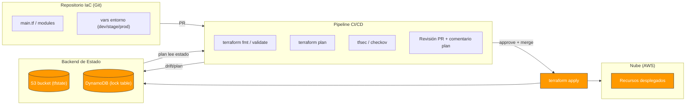

# Apéndice A — Mecanismos Suplementarios del Módulo 06 (IaC)

> Profundización en patrones avanzados de Infraestructura como Código: diagramas de flujo IaC, módulos avanzados, policy-as-code, conteo de recursos, multi-account y migración de estados heredados.

---

## 1. Flujo IaC completo (diagrama)

Vista de cómo el código declarativo se convierte en infraestructura real controlada:



---

## 2. Módulos avanzados y for_each / count

**Count vs for_each (cómo crear N recursos o recursos con mapa de config):**
- `count = 3` → crea 3 instancias indexadas `[0]`, `[1]`, `[2]`.
- `for_each` → el más flexible, cuando cada instancia necesita metadatos divergentes.

```hcl
# for_each: un bucket por entorno con configuración distinta
variable "envs" {
  type = map(object({
    region = string
    tags   = map(string)
  }))
  default = {
    dev  = { region = "us-east-1", tags = { env = "dev" } }
    prod = { region = "us-west-2", tags = { env = "prod" } }
  }
}

resource "aws_s3_bucket" "b" {
  for_each = var.envs
  bucket   = "app-${each.key}"
  tags     = each.value.tags
}
```

### Mover recursos entre módulos (moved block)

Cuando refactorizas a módulos, `moved` evita que Terraform destruya y recree:

```hcl
moved {
  from = aws_dynamodb_table.orders
  to   = module.orders_table.aws_dynamodb_table.t
}
```

---

## 3. Policy-as-Code en profundidad

**tfsec — reglas de seguridad por defecto** que conviene activar siempre:
- `aws-s3-enable-versioning`
- `aws-s3-enable-bucket-encryption`
- `aws-dynamodb-enable-at-rest-encryption` (default encryption)
- `aws-s3-block-public-access`
- `aws-iam-no-policy-wildcards`

Acerca a un ejemplo dramático de la transparencia HEAD (senior) recordará: bloquear buckets abiertos públicos con `aws_s3_bucket_public_access_block`.

```hcl
resource "aws_s3_bucket_public_access_block" "ok" {
  bucket = aws_s3_bucket.b.id

  block_public_acls       = true
  block_public_policy     = true
  ignore_public_acls      = true
  restrict_public_buckets = true
}
```

---

## 4. Terraform Cloud y remote runs

**Ganancia clave sobre S3-local:**
- Plan y apply ejecutados en **Terraform Cloud** (no en tu máquina/CI).
- Comentario de plan automático como PR check.
- Estado y locking gestionados como servicio.
- Runs automatizados ante cambios en el repo, con aprobación manual opcional para prod.

**Trade-off honesto:** vendor (HashiCorp), costo; para equipos pequeños puede bastar S3+lock.

---

## 5. Multi-cuenta / Control Tower + Landing Zone

Patrón enterprise de gobernanza con varias cuentas AWS:
- **management/control** (billing, audit, Log Archive).
- **security** (org-level security).
- **workloads** (dev/stage/prod separadas por cuenta).
- Despliegue con Terraform **multi-account** (workspaces por cuenta o `provider` delegado) o **StackSets** CFN.

Beneficio: blast radius aislado, límites de permisos claros, facturación segregada, y cumplimiento por cuenta. Complejidad: gestión de roles cross-account y de los "ATOMS" (Account/Region/Org).

---

## 6. Migración de estado heredado e import

**Import de recursos existentes** (creados a mano o por otra herramienta):
```bash
terraform import aws_dynamodb_table.orders orders-prod
```
Luego ajusta el bloque para que el plan quede sin diffs.

**Migración S3 → Terraform Cloud / a otro backend:**
```bash
terraform init -migrate-state
```
Mueve el tfstate sin perder mapeo. Es delicado: verifica permisos y backup.

---

## 7. Guardrails y aprobación manual en prod

Patrón CI sólido para no romper prod:
1. **PR** → `fmt`, `validate`, `plan`, `checkov`. El plan se comenta en la PR.
2. Aprobación humana **explícita** para `apply` en prod.
3. Fusión a `main` dispara `apply` solo al entorno destino.
4. Drift → alarma y re-plan de reconciliación.

```yaml
# .github/workflows/iac.yml (resumen — Módulo 12 lo completa)
on:
  pull_request:
    paths: ['infra/**']
jobs:
  plan:
    runs-on: ubuntu-latest
    steps:
      - name: Terraform Init
        run: terraform init -backend-config=./envs/dev.backend
      - name: Validate
        run: terraform validate
      - name: Plan
        run: terraform plan -out=/tmp/plan.tfplan
      - name: Scan policy
        run: checkov -d infra/
```

---

## 8. Estado: buenas y malas prácticas

**Buenas prácticas:**
- Estado **siempre remoto** (S3/Terraform Cloud) con encrypt + lock.
- **Nunca** commits del `.tfstate` en Git (contiene secrets/sensibilidad).
- Backup y versioning del bucket de state (S3 versioning) → poder recuperar.
- Separar state por entorno/folder.
- `terraform state rm/pull/push` solo con conocimiento de consentimiento/delimitado.

**Riesgo clave:** commitear el `tfstate` es peor que no tenerlo: robar estado = entender/duplicar infra, o borrar accidentalmente. Mantener en backend remoto privado.

---

## 9. Glosario extendido (Módulo 06)

- **State (tfstate):** archivo que mapea recursos declarados con IDs reales de la nube.
- **Backend:** dónde se guarda el state (local, S3, Terraform Cloud).
- **Lock (DynamoDB):** tabla que evita applies concurrentes.
- **Plan / Apply:** fases de diff y aplicación.
- **Drift:** divergencia entre model deseado y real.
- **Change Set (CFN):** vista de cambios antes de aplicar.
- **Stack:** unidad de rollback atómico de CloudFormation.
- **Nested stack / StackSet:** reutilización y despliegue multi-account en CFN.
- **SAM:** extensión serverless de CloudFormation.
- **create_before_destroy:** estrategia blue/green a nivel de recurso.
- **prevent_destroy:** protección contra borrado accidental.
- **policy-as-code:** reglas automatizadas que validan infra antes de aplicar (tfsec, checkov, Sentinel).
- **for_each / count:** crear N recursos o mapas de recursos.
- **moved block:** reubicar recursos sin recrearlos al refactorizar módulos.