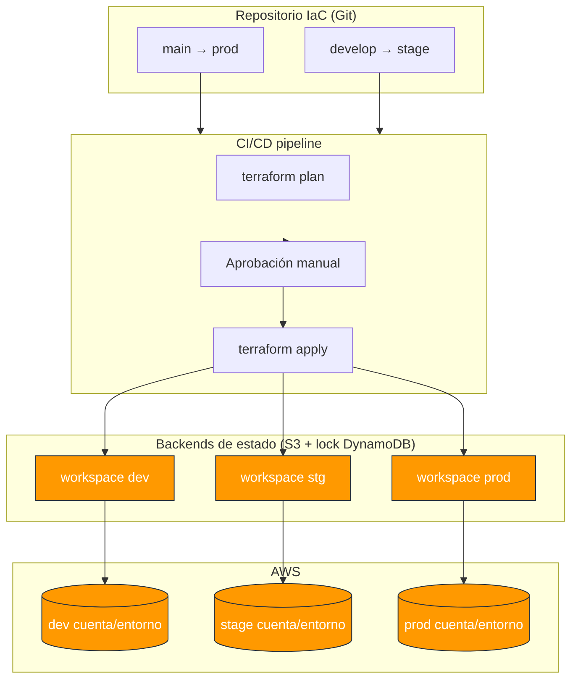

# Módulo 06 — Infraestructura como Código (Terraform y CloudFormation)

> **Objetivo profesional:** Pasar de "crear recursos en la consola de AWS" a **tratar la infraestructura como producto de software**: reproducible, versionada, revisable, testeada y efímera. Aquí dominarás los dos enfoques dominantes — **Terraform** (declarativo, multi-cloud, estado explícito) y **CloudFormation** (nativo de AWS, sin estado propio, integrado con el ecosistema) — y sabrás cuándo elegir cada uno, cómo gestionar el estado, evitar el drift y estructurar módulos reutilizables.

> **Ubicación en la guía:** Se apoya en [Módulo 04](04-AWS-Serverless.md) (los recursos que vamos a desplegar: Lambda, API Gateway, DynamoDB, etc.) y [Módulo 05](05-Bases-de-datos-distribuidas.md). Conecta con los módulos de [Observabilidad](07-Observabilidad.md) y [Seguridad](08-Seguridad.md) (IAM), y con [CI/CD](12-CI-CD.md) (IaC dentro de pipelines). Conceptos base (CloudWatch, IAM) del [Glosario](00-Glosario.md).

---

## Introducción

Hacer `aws ec2 run-instances` o clicar en la consola "crear tabla" funciona *una vez*. Pero cuando tienes que reproducir el entorno de staging, replicar la prod en una nueva región, auditar quién cambió qué, o recuperar un ambiente destruido un viernes a las 5pm, el "click-click-click" es un **incidente esperando ocurrir**.

La **Infraestructura como Código (IaC)** es la práctica de **describir la infraestructura en archivos declarativos** que viven en control de versiones y se aplican de forma automática y repetible. No es solo "automatización": es aplicar a la infraestructura las mismas disciplinas del desarrollo de software — revisión de código, versionado, revisabilidad, testing, y ciclo de vida controlado.

**Beneficios reales (contextualizados):**
- **Reproducibilidad:** el mismo código produce el mismo ambiente (casi* siempre — ver drift).
- **Velocidad:** de días/horas a minutos; entornos efímeros on-demand.
- **Revisabilidad y traceability:** cada cambio es un diff en PR, con autor y razón.
- **Manejo de ciclo de vida:** destruir y recrear entornos sin miedo ni acumulación de basura.
- **Multi-entorno consistente:** dev/stage/prod generadas desde la misma fuente con diferencias mínimas.

**La crítica honesta que un senior debe manejar:**
- IaC **no es gratis**: el estado y el drift son complejidades nuevas.
- El "código" falla por **desincronización** (drift) entre lo declarado y lo real.
- Requiere **disciplina operativa**: quién aplica, cuándo, con qué permisos, en qué orden.
- Herramientas distintas = curvas de aprendizaje y ecosistemas propios.

Elegir entre Terraform y CloudFormation no es solo "me gusta X": es una decisión de **estado, ecosistema, equipo y portabilidad** que veremos en detalle.

---

## Conceptos

### ¿Qué es exactamente IaC?

Es describir el **deseado final** (declarativo) o la **secuencia de pasos** (imperativo) para construir infra. Dominan los enfoques **declarativos** (Terraform, CloudFormation, Pulumi, AWS CDK): tú dices *qué quieres*, la herramienta calcula y aplica *cómo llegar*.

**Declarativo vs imperativo:**
- **Imperativo:** "crea una tabla, luego agrega una política, luego espera 10s". (Ansible, scripts). Vulnerable a no-idempotencia.
- **Declarativo:** "quiero que exista una tabla con esta clave y GSI". La herramienta hace el diff con el estado actual y solo cambia lo necesario.

### Los tres pilares de IaC reproducida

1. **Estado (desired state + actual state).** La herramienta guarda qué existe (el "state") y lo compara con lo declarado.
2. **Plan / Diff.** Antes de aplicar, muestra qué se creará/modificará/destruirá (la seguridad de `terraform plan` o el Change Set de CloudFormation).
3. **Aplicación idempotente.** Volver a aplicar el mismo código no debe producir cambios si ya está todo correcto.

### Infra como producto frente a scripts

Un script "de despliegue" que hace 15 CLI commands no es IaC robusta: no sabe *qué estado existe*, no remedia drift, no hace rollback atómico. IaC real se distingue por:
- Conocimiento del estado y capacidad de plan/diff.
- Módulos y reutilización.
- Ciclo de vida (crear/actualizar/destruir) gestionado.
- Integración con testing y CI/CD.

### Modelo de drivers: Terraform vs CloudFormation vs CDK/Pulumi

| Herramienta | Modelo | Estado | Ecosistema | Portabilidad |
|---|---|---|---|---|
| **Terraform** | HCL declarativo, provider multi-cloud | Estado externo (local/S3+lock) | Multi-cloud (AWS, GCP, Azure, on-prem) | Alto |
| **CloudFormation** | YAML/JSON declarativo nativo AWS | **Sin estado propio** (la nube es la fuente de verdad) | Solo AWS, pero integrado con todo (SAM, stacks, Change Sets) | Bajo (lock-in) |
| **AWS CDK** | Código (TS/Python/Go) que genera CloudFormation | Igual que CFN | AWS+ (genera CloudFormation) | Medio |
| **Pulumi** | Código (TS/Python/Go) con backends | Estado externo | Multi-cloud | Alto |

>"AWS CDK" y "Pulumi" son de *programación* pura, mientras Terraform/CFN son puramente *declarativos*. El que se aprende senior es **pensar en el modelo de estado y de errores**, más que en la sintaxis, porque eso es lo que se repite en cualquier herramienta.

### Terraform: piezas clave (recorrido técnico)

**Bloques elementales del HCL (HashiCorp Configuration Language):**

```hcl
# Provider: el conector con la nube (AWS)
terraform {
  required_version = ">= 1.5"
  required_providers {
    aws = { source = "hashicorp/aws", version = "~> 5.0" }
  }
  backend "s3" {}
}

variable "environment" {
  type    = string
  default = "dev"
}

resource "aws_dynamodb_table" "orders" {
  name         = "orders-${var.environment}"
  billing_mode = "PAY_PER_REQUEST"
  hash_key     = "PK"
  range_key    = "SK"

  attribute {
    name = "PK"
    type = "S"
  }
  attribute {
    name = "SK"
    type = "S"
  }
}

output "table_arn" {
  value = aws_dynamodb_table.orders.arn
}
```

**El flujo de trabajo del estado:**
1. **Terraform init** → descarga providers, configura el backend.
2. **Terraform plan** → lee el estado, calcula el diff desired vs actual, muestra acciones.
3. **Terraform apply** → ejecuta el plan y actualiza el estado.
4. **Terraform destroy** → destruye los recursos gestionados (y alerta del `prevent_destroy`).

### CloudFormation: el contrapunto de AWS

CloudFormation describe stacks (grupos de recursos) con YAML/JSON. La **nube misma es la fuente de verdad**: CFN consulta el estado real de los recursos; no guarda un archivo de estado aparte.

```yaml
AWSTemplateFormatVersion: '2010-09-09'
Description: Stack de pedidos

Resources:
  OrdersTable:
    Type: AWS::DynamoDB::Table
    Properties:
      TableName: !Sub 'orders-${AWS::StackName}'
      BillingMode: PAY_PER_REQUEST
      AttributeDefinitions:
        - AttributeName: PK
          AttributeType: S
        - AttributeName: SK
          AttributeType: S
      KeySchema:
        - AttributeName: PK
          KeyType: HASH
        - AttributeName: SK
          KeyType: RANGE

Outputs:
  OrdersTableArn:
    Value: !GetAtt OrdersTable.Arn
```

**Conceptos CFN clave:**
- **Stack:** unidad de rollback atómico; si algo falla, revierte.
- **Change Set:** equivalente a `terraform plan` (muestra los cambios antes de aplicarlos).
- **Drift detection:** compara el modelo deseado con el real (glitches por cambios manuales).
- **Nested stacks / StackSets:** reutilización y despliegue multi-cuenta.
- **SAM (Serverless Application Model):** extensión de CFN orientada a serverless (función, tabla, API Gateway) que reduce verbosidad.

---

## Arquitectura

### Topologías de gestión de entorno

**IaC — cómo orquestas múltiples entornos:**

```
┌──────────────────────────────┐
│ Código IaC en Git (branch)    │
│   main/ : prod infra         │
│   develop/ : stage infra     │
└──────────────────────────────┘
        │ (CI/CD pipeline: plan + apply)
        ▼
┌──────────────┬──────────────┬──────────────┐
│ Workspace dev │ Workspace stg│ Workspace prod│
│ backend s3:   │ backend s3:  │ backend s3:   │
│ bucket-iac-   │ bucket-iac-  │ bucket-iac-   │
│ dev/terraform │ stg/...      │ prod/...      │
└──────────────┴──────────────┴──────────────┘
```

Versión en diagrama (Mermaid):



- **Terraform workspaces:** aislan el estado por entorno dentro de un mismo código (ej. `dev`, `staging`, `prod`). Cada uno tiene su propio state en el backend.
- **StackSets / multi-account:** despliega el mismo stack en muchas cuentas (muy usado en el patrón de cuentas múltiples con AWS Control Tower / Landing Zone).

### Separación de responsabilidades/pipelines

**Patrón maduro de ambiente gestionado por IaC:**

1. **Infra base (network/VPC/IAM):** se crea una vez, poco cambiante, gobernada por un equipo platform.
2. **Infra de aplicación (Lambda, API, DynamoDB):** cambia con cada release; pipeline IaC aplica.
3. **Selector de entorno:** variables `environment`, `region`, `project` parametrizan todo.

Esto sigue la filosofía de **plataforma vs. aplicación** del [Módulo 02](02-Microservicios-y-DDD.md) (Team Topologies).

### Terraform Cloud / remote state

Un tema senior crítico: **el estado remoto y el bloqueo**. Con un equipo o en CI:

```hcl
terraform {
  backend "s3" {
    bucket         = "my-iac-state"
    key            = "envs/prod/terraform.tfstate"
    region         = "us-east-1"
    encrypt        = true
    dynamodb_table = "terraform-locks"   # locking contra concurrencia
  }
}
```

- **S3** te da el almacenamiento central del state.
- **DynamoDB (lock table)** implementa el *locking* → dos CI corriendo `apply` a la vez no se pisan.
- Alternativa: **Terraform Cloud** (estado + locking + remote run + plan en la nube, ideal para revisión de plan como PR).

---

## Internals

### Cómo funciona el state, el plan y el backend

**Flujo interno de Terraform (alto detalle):**
1. Lee configuración `.tf`.
2. Construye un **grafo de recursos** (dependencias implícitas por referencias: `aws_dynamodb_table.orders.arn`).
3. Carga el **state** desde el backend.
4. Hace el **diff** (graph traversal) → "Resource actions: 0 to add, 1 to change, 1 to destroy".
5. Aplica en **orden topológico** (respetando dependencias).
6. Persiste un **nuevo state** tras cada éxito.

**¿Por qué el estado importa tanto?**
- Mapea el **ID real** de cada recurso (`arn`, nombre) con el bloque del código.
- Si el state se pierde/corrompe y no está en remote, Terraform **no sabe** qué recursos creó → los huérfanos se quedan en la nube (y la factura).
- Por eso el **estado remoto con locking y backup** es obligatorio en equipos.

**Drift:**
Cuando alguien modifica un recurso a mano en la consola, el modelo deseado (código) deja de coincidir con el real. `terraform plan` lo detecta y propondrá revertir (o ignorar si configuraste `lifecycle { ignore_changes }`). CloudFormation lo expone vía *Drift Detection*.

### Manejo de errores y rollback

- **CloudFormation:** rollback automático **atómico** del stack si falla la creación/actualización. Con `DeletionPolicy` y `UpdateReplacePolicy` controlas qué pasa al reemplazar/eliminar un recurso (Retain/Snapshot/Delete).
- **Terraform:** **no** hace rollback automático. Si falla `apply`, deja aplicados los pasos que sí lograron (parcial). Por eso el **plan** y las opciones `-target` para aplicar en fases, y la disciplina CI que re-planee / vuelva a `apply` hasta validar.
- **Estrategia rollback IaC:** recreación desde el código (cuando los datos son efímeros) o `replace` controlado con `create_before_destroy`.

```hcl
resource "aws_instance" "app" {
  lifecycle {
    create_before_destroy = true  # crea la nueva antes de destruir la vieja
  }
  ...
}
```

### Prevención de destrucción accidental

```hcl
resource "aws_dynamodb_table" "critical" {
  lifecycle {
    prevent_destroy = true
  }
}
```

Protege recursos que no admite pérdida (bases con datos). Es una de las primeras "seguridad IaC" que un senior configura.

### Terraform vs CloudFormation: el trade-off en profundidad

| Dimensión | Terraform | CloudFormation |
|---|---|---|
| **Estado** | Explícito, externo (S3/DynamoDB/Terraform Cloud) — control y riesgo de estado | Implícito — la nube como single source of truth, sin archivo de estado |
| **Rollback** | Manual (no automático) — creador del plan | Automático atómico por stack |
| **Lenguaje** | HCL declarativo + expresiones | YAML/JSON + funciones `!Ref`, `!GetAtt`, `!Sub` |
| **Multi-cloud / multi-provider** | Sí (nativo: AWS, GCP, Azure, on-prem) | Solo AWS |
| **Reutilización** | Módulos robustos + registroy | Nested stacks, StackSets, SAM |
| **Drift** | Detectado en plan como diff que puedes revertir | Detección explícita de drift |
| **Ecosistema/precedencia** | Comunitario enorme de providers; estándar de facto multi-cloud | Nativo AWS, integrado con IAM/roles/KMS/Tagging nativos, CDK lo genera |
| **Para who** | Equipos multi-cloud, o quienes quieren estado/reusabilidad/HCL | Equipos 100% AWS que valoran nativo/serverless y rollback automático |

**Regla senior rápida:**
- 100% AWS, priorizas serverless, quieres rollback atómico y menor overhead de estado → **CloudFormation/ SAM / CDK**.
- Multi-cloud, necesitas estado explícito, portabilidad, o team ya experto en HCL → **Terraform**.
- No es "mejor"; es **trade-off de estado/extensibilidad/ecosistema**. La respuesta correcta en entrevista es argumentar con el contexto del equipo y las necesidades.

---

## Patrones

### Módulos reutilizables (Terraform)

Un módulo es un directorio con `.tf` que encapsula un recurso/referencia con entradas/salidas claras. Patrón de equipo para reutilizar en varios entornos:

```hcl
# modules/table/main.tf
variable "table_name" { type = string }
variable "environment" { type = string }
resource "aws_dynamodb_table" "t" {
  name = "${var.environment}-${var.table_name}"
  billing_mode = "PAY_PER_REQUEST"
  hash_key = "PK"
  range_key = "SK"
  # ... attribute definitions
}
output "table_arn" { value = aws_dynamodb_table.t.arn }
```

```hcl
# entornos/dev/main.tf
module "orders_table" {
  source      = "../../modules/table"
  table_name  = "orders"
  environment = "dev"
}
```

### Flight patterns: codigo de despliegue avanzado

Se detallan en el [Apéndice de Módulo 01](01-Arquitectura-de-Software-Moderna-Apendice-A.md); en IaC los automatizas declaramos **(blue/green, canary)**:
- Estás **definiendo infra**, no solo funciones: por tanto las estrategias se codifican en el mismo IaC (ej: versiones de Lambda alias + weights).
- `create_before_destroy` permite la estrategia blue/green real a nivel de recurso.

### Sentinel / policy as code

Estándar para imponer reglas de infra (ej: "nadie puede crear una tabla sin encriptación en reposo", "no expongas buckets públicos"):
- **Terraform Sentinel** / **Checkov** / **tfsec** (open source security scanners de HCL).
- Se ejecuta en CI/apply y hace *fail-closed* antes de tocar infra.

Ejemplo (tfsec ideal: la típica alerta):
```hcl
# aws_s3_bucket with default encryption S3_129
```

### State isolation por entorno

Para aislar `dev/stage/prod`:
- Backend S3 con key distinta por entorno.
- O **workspaces** por entorno + variables overhead.
- Mejor práctica moderna: **una carpeta por entorno** con su propio `backend` (separación total de state → un fallo en dev no toca prod).

### Testing de infraestructura

- **Static:** tfsec/checkov + `terraform fmt` + `validate`.
- **Planek:** `terraform plan -detailed-exitcode` para verificar que no hay cambios no deseados.
- **Dynamic (Terratest):** Go test que `apply`, valida pre-provisioned, sometimes y destruye (integración real). Módulo 01 caso 2.

---

## Casos reales

### Caso 1: Migración de infra por clic a Terraform (fintech)

Una fintech tenía clustering manual de 40 microservices en la consola. Adoptaron Terraform con **estado remoto S3 + lock DynamoDB** y **workspaces por entorno**.
- **Resultado:** despliegues de infra que tomaban horas y requerían un "pico de conocimiento" ahora son PRs con plan diffs revisables; el equipos 4x más en deploy.
- **Lección:** el 90% del duro fue ordenar el **estado y el flujo (plan previo en CI)**. La migración a la nube del estado remotó fue el "acierto de seguridad" evitando perdida de rastreo tras semanas de trabajo.

### Caso 2: CloudFormation + SAM en start serverless puro

Startup serverless 100% AWS usa CloudFormation via SAM.
- **SAM** describe functions + API + DB en un único template, con `sam build` + `sam deploy`.
- **Resultado:** rollback atómico automático (Fallos revertir), integración con native IAM/KMS, tagging central. Dificultad baja en day-to-day.

### Caso 3: Control de costo/cambio con policy-as-code + template evaluaciones

Empresa grande con quince cuentas adopta **AWS Control Tower + Terraform multi-account**:
- Templates IaC generan el catálogo de servicios estándar.
- **Checkov en CI** rechaza cualquier PR que intente crear un bucket público o tabla sin encriptor.
- **Resultado:** el número de *security misconfigurations* bajo 80% en dos trimestres; governance automatizada sin comité manual.

---

## Laboratorio

### Lab 1: Terraform de tu stack serverless
1. Crear `main.tf` que despliegue: DynamoDB orders (single-table), Lambda handler, API Gateway, y el EventBridge rule.
2. `terraform init`, `plan`, `apply` en `dev`.
3. `terraform show` e inspecciona el state y el ARN de salida.
4. Borrar con `terraform destroy` (preparado).

Requisito: Remote state en S3/DynamoDB para el *locking*.

### Lab 2: Estado, lock y concurrencia
1. Configura el **backend S3 + DynamoDB lock table**.
2. Lanza dos `terraform apply` simultáneos (ej: dos terminales). Verifica que el segundo **bloquea** hasta que el primero termina o `acquiring state lock` sale.
3. `terraform force-unlock <lock-id>` para simular un bloqueo huérfano.

### Lab 3: Drift
1. Crea un recurso (ej: una tabla) con Terraform.
2. En la consola AWS, **cámbialo a mano** (agrega un GSI o cambia billing).
3. `terraform plan` → observa que propone reconciliar el drift.
4. Configura `lifecycle { ignore_changes = [...] }` y repite plan.
5. Equivalente CFN: ejecuta **Drift Detection** sobre un stack y compara.

### Lab 4: Módulo reutilizable
Porta el ejemplo `modules/table` + dos entornos (dev/prod) usando la misma fuente. Cambia algo en prod; verifica que dev no se ve por el aislamiento de state.

### Lab 5: policy-as-code (tfsec/checkov) + CI
1. Instala tfsec/checkov y agrega reglas (bucket público, encriptación DynamoDB).
2. Haz que fallen reproses por no cumplir.
3. Configura un GitHub Action que ejecute `terraform fmt -check`, `validate`, `checkov` al hacer PR (enlaza a Modulo 12).

---

## Entrevistas

1. **Terraform vs CloudFormation: ¿cuál elijes y por qué?**
   > Argumentar según context: multi-cloud/portabilidad/estado explícito prefieren Terraform. 100% AWS + serverless + rollback atómico para CFN/SAM/CDK. Resalta el trade-off de estado/ecosistema más que la preferencia personal.

2. **¿Qué es exactamente el estado de Terraform y cómo lo proteges?**
   > Mapea IDs con bloques; repositorio central. Remoto S3/DynamoDB locking + backup + `-state`/`-backend-config`. Si se pierde, recursos huérfanos.

3. **¿Cómo manejas el bloqueo de estado y la concurrencia?**
   > DynamoDB lock (o Terraform Cloud). Intento de apply simultáneo → bloquea y espera; huérfanos → `force-unlock`.

4. **¿Cómo detectas y solucionas el drift?**
   > `terraform plan` muestra diff; detective guía. `ignore_changes` para cambios legítimos por job manual. CloudFormation Drift Detection + stack theory policy.

5. **Diseña un flujo IaC para un equipo pequeño serverless.**
   > Repo por producto, backend remoto, workspaces/folders por entorno, plan en PR de CI, apply solo en merge a main con approval, policy-as-code, drift alertas.

6. **Diferencias entre SAM y CFN simple.**
   > SAM → serverless helper (concisión de funciones, tabla, API): genera CloudFormation. CFN plano → más control pero más verboso; SAM es CFN for serverless.

7. **¿Cómo haces el rollback en infraestructura?**
   > CFN: automático por stack. Terraform: no automático → por plan/reapply, `target`, y `create_before_destroy` (blue/green).

8. **¿Cómo evidenciás que un cambio de infra no rompe?**
   > Plan en PR + Terratest (apply real momentáneo) + policy-as-code + escaneo de drift. Todos automatizados en CI.

9. **Protege una base con datos de la destrucción.**
   > `prevent_destroy` (Terraform), `DeletionPolicy: Retain` (CFN) y backups. Explica compоз Todos los puntos de confirmación manual en prod.

10. **¿State isolation: workspaces vs folders.**
    > Folders: state totalmente separado + menos riesgo de error; workspaces: conveniente para dev entornos ad hoc pero stage shared puede confundirse. Recomendar folders separadas por entorno de prod.

---

## Checklist

- [ ] Diferencia claramente **declarativo vs imperativo** en IaC.
- [ ] Conozco los **tres pilares**: estado, plan/diff, aplicación idempotente.
- [ ] Entiendo cómo funciona el **backend/estado remoto** y por qué importa el **locking**.
- [ ] Sé configurar remote state **S3 + DynamoDB lock** y resolver bloqueos.
- [ ] Reconozco y manejo el **drift** (plan + ignore_changes / drift detection de CFN).
- [ ] Conozco los **bloques HCL básicos**: provider, resource, variable, output, backend, lifecycle.
- [ ] Domino conceptos CFN: **stack, Change Set, drift, nested/StackSet, SAM, DeletionPolicy**.
- [ ] Elijo entre **Terraform vs CloudFormation** según contexto con argumentos de estado/ecosistema.
- [ ] Uso **módulos reutilizables** y separación de entornos por folders/backend.
- [ ] Aplico **policy-as-code** (tfsec/checkov) y testing (fmt/validate/plan/Terratest).
- [ ] Protejo recursos críticos con `prevent_destroy` / `DeletionPolicy: Retain`.
- [ ] Integro IaC en **CI/CD** con plan en PR y apply controlado en main.

---

## Referencias y lecturas recomendadas

- **HashiCorp — Terraform documentation & AWS Provider** — https://registry.terraform.io/providers/hashicorp/aws/latest/docs (referencia canónica).
- **HashiCorp — Terraform Language (backends, state, lifecycle)** — https://developer.hashicorp.com/terraform/language
- **AWS — CloudFormation User Guide** — https://docs.aws.amazon.com/AWSCloudFormation/latest/UserGuide/
- **AWS — Change Sets** — https://docs.aws.amazon.com/AWSCloudFormation/latest/UserGuide/using-cfn-updating-stacks-changesets.html
- **AWS — Detect drift on a stack** — https://docs.aws.amazon.com/AWSCloudFormation/latest/UserGuide/using-cfn-stack-drift.html
- **AWS — SAM (Serverless Application Model)** — https://docs.aws.amazon.com/serverless-application-model/latest/developerguide/
- **"Terraform Up & Running"** — Yevgeniy Brikman (O'Reilly, 3rd ed.). El mejor libro práctico de Terraform.
- **"The Terraform Book"** — James Turnbull (LeanPub). Alternativa sólida.
- **tfsec** (seguridad en HCL) — https://github.com/aquasecurity/tfsec y **Checkov** — https://www.checkov.io/ (policy-as-code).
- **Terratest** — https://github.com/gruntwork-io/terratest (testing de infra con Go).

---

*Más profundidad, diagramas y patrones avanzados en el **Apéndice A** (`06-Infraestructura-como-Codigo-Apendice-A.md`). Los módulos de [Observabilidad](07-Observabilidad.md) y [CI/CD](12-CI-CD.md) continúan la automatización del entorno.*