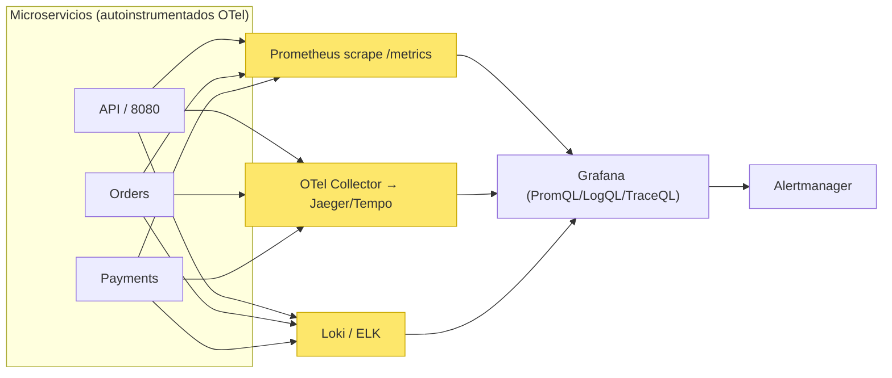
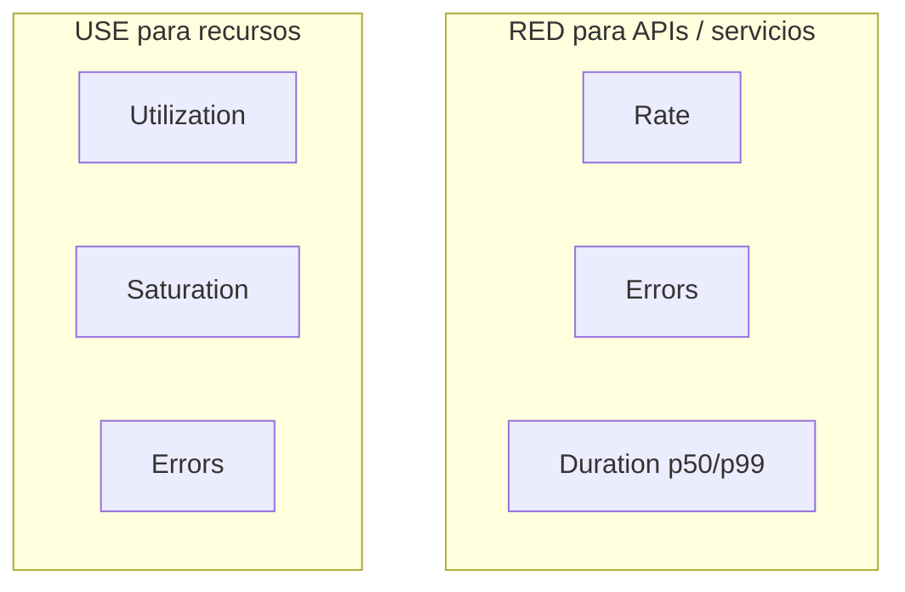
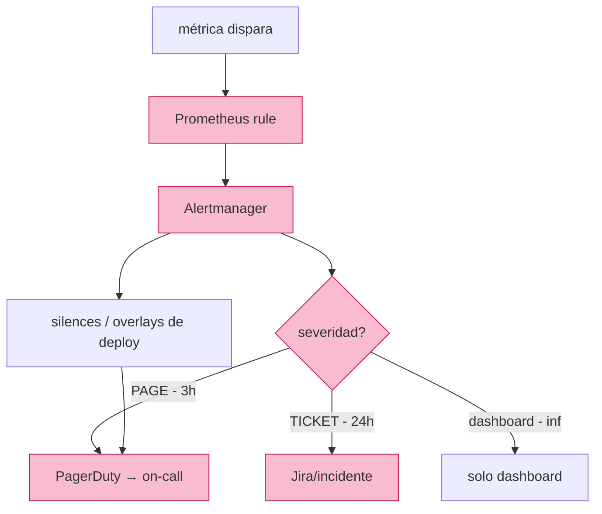

# Apéndice A — Observabilidad en práctica

> Profundización técnica del Módulo 07: instrumentación con OpenTelemetry y Prometheus, PromQL, RED/USE, RUM detallado, correlación de los tres pilares y un glosario extendido. Contenido de implementación real, listo para aplicar.

---

## 1. Instrumentación con OpenTelemetry y Prometheus

**Arquitectura recomendada (CNCF):**
- **OpenTelemetry SDK** (auto-instrumentation) en cada servicio genera spans, metrics y logs.
- **Tracing → Jaeger / Tempo / X-Ray**.
- **Metrics → Prometheus** (scrape) vía endpoint `/metrics` en formato text exposition.
- **Logs → Loki / ELK / Splunk**.
- **Grafana** para dashboards y alertas, con PromQL / LogQL / TraceQL.



### PromQL para histogramas y ratios

```promql
# rate de requests por 1 min por endpoint
rate(http_requests_total{job="api"}[1m])

# p99 de latencia vía histogram
histogram_quantile(0.99,
  sum(rate(http_request_duration_seconds_bucket{job="api"}[5m])) by (le))

# ratio de errores (RED: rate errors / rate requests)
sum(rate(http_requests_total{job="api", status=~"5.."}[5m]))
  / sum(rate(http_requests_total{job="api"}[5m]))
```

### Métricas de los "tres pilares" en el cliente

Dado que Prometheus usa *scraping* (push sobre el endpoint), cómo se integra con una API que *empuja* si fuera el caso: con un **OTel Collector** puedes recibir por OTLP e interoperar.

---

## 2. RED y USE: by-the-book

Dos frameworks clásicos para decidir qué medir de un servicio:

- **RED** (más directo para *request-driven* / user-facing):
  - **R**ate — requests por segundo.
  - **E**rrors — ratio de errores.
  - **D**uration — percentiles de latencia (p50/p99).
- **USE** (para recursos/infraestructura):
  - **U**tilization — % de un recurso ocupado.
  - **S**aturation — cuánto se está *esperando* (colas, workers, RVU).
  - **E**rrors — errores del recurso.



Saturación es la señal temprana de que estás cerca del límite antes de que la latencia colapse. Latencia percibida comienza a degradarse *antes* de cruzar el umbral de utilización.

---

## 3. Correlación de los tres pilares (la clave senior)

Un sistema observable se juzga por poder **unir** señales. Patrón:

1. El `trace_id` se genera en el edge (API Gateway) y se propaga (header `traceparent`).
2. Cada servicio logra sus **logs** con el `trace_id` en el payload.
3. Métricas por `job`/`service` se agregan sin traza, pero el *leading question* `¿qué request lenta?` se responde con tracing y se cruza al log en un segundo.

**Ejemplo de log estructurado con correlación (JSON):**

```json
{
  "level": "ERROR",
  "msg": "payment_timeout",
  "service": "payments",
  "trace_id": "4bf92f3577b34da6a3ce929d0e0e4736",
  "duration_ms": 3200,
  "status": 504,
  "tenant": "acme"
}
```

Un p99 alto en métricas te dice *que* hay un problema; el log te dice *dónde* y el span te dice *por qué* (colapso en DynamoDB, timeout de provider, etc.).

---

## 4. RUM en detalle

- **Captura en el cliente** (browser/móvil): performance (`paint`, `LCP`, `FCP`), JS errors, network, transacciones de usuario percibidas.
- **Por qué importa:** la telemetría del server mide lo que *tu* servicio tardó, no lo que *tu usuario* percibe (latencia de red, retry del client, caché del browser).
- **Acción:** enviarlos a un collector (como los SDKs OTel web) y unirlos al `trace_id` de backend para saltar de la percepción del cliente al latencia del servidor.
- **Uso clásico:** correlacionar conversión de negocio (nivel business) con métricas de rendimiento percibido del cliente (nivel client software).

---

## 5. Tablas de percentiles y ratios útiles

| Señal | p50 típica | p95 | p99 | Nota |
|---|---|---|---|---|
| API pago | ~200 ms | ~800 ms | ~1.5 s | los p99 extremos rompen cancelaciones |
| Batch | ~1 s | ~4 s | ~8 s | verificar colas |
| HTML load (RUM) | ~1.2 s | ~3.5 s | ~6 s | percibidos, no server |

**Ratios (dos métricas para saber si degenera el servicio):**
- `errors / requests`: tendencia de degradación.
- `5xx / total`: descifrar error agrupado.
- `failed_auth / auth_total`: alerta de brute-force.
- `p95 trend up + saturation = utilization near cap` (USE).

---

## 6. Alerting SRE: routing y severidad



Reglas para disminuir el *alert fatigue*:
1. Toda alerta debe tener un **runbook** o ser **borrable**.
2. Prioridad de pages mucho menor que tickets.
3. Umbrales dinámicos o por percentiles, no absolutos.
4. Correlacionar con deploys para entender el contexto; silenciar falsos positivos con "deploy window".

---

## 7. Glosario extendido del Módulo 07

- **Observability** — propiedad de un sistema para permitir preguntas ad hoc; three pillars.
- **Three pillars** — metrics, logs, tracing.
- **RUM** — real user monitoring; telemetría de cliente.
- **Counter / Gauge / Histogram / Summary** — tipos de métrica.
- **p50 / p95 / p99 / p99.9** — percentiles que importan en latencia.
- **RED** — rate/errors/duration.
- **USE** — utilization/saturation/errors.
- **Trace** — vida de una request; cadena de spans.
- **Span** — unidad atómica de trabajo dentro de un trace.
- **trace_id / traceparent** — correlación y propagación W3C.
- **Information radiator** — display de estado visible sin acceso a producción.
- **Overlay de deploy** — marcar deploys en gráficas de métricas.
- **MTTR** — mean time to recover (minutos en elite vs semanas en low).
- **Alert fatigue** — número insoportable de alertas.
- **Anomaly detection** — detección de ítems/eventos fuera del patrón esperado.
- **Kolmogorov-Smirnov test** — test no paramétrico para datos Ops no-Gaussianos.
- **Alertmanager / PagerDuty** — routing de alertas y on-call.
- **PromQL / LogQL / TraceQL** — lenguajes de query de Prometheus, Loki, Grafana Tempo.