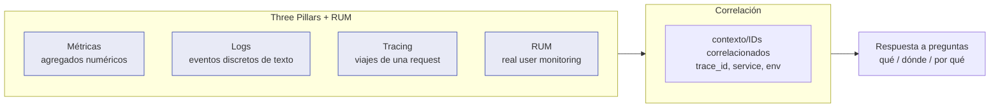
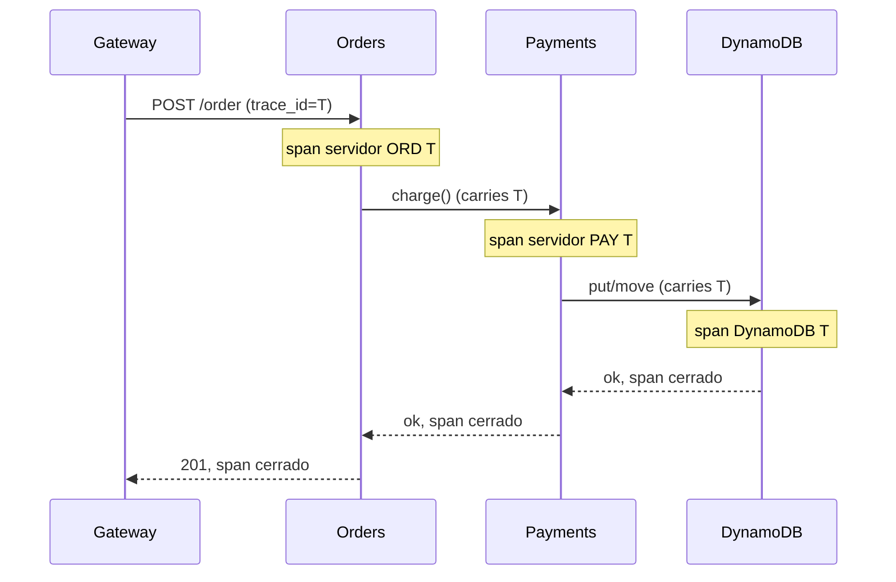

# Módulo 07 — Observabilidad

> **Nivel:** Senior. El objetivo es que comprendas cómo diseñar sistemas *observables*, no solo "cómo configurar un dashboard". Verás por qué observabilidad ≠ "logging bonito", cómo se acopla la telemetría de extremo a extremo, y cómo tomar decisiones de diseño (métricas, logs, tracing, RUM, alerting SRE) sobre cómo tus sistemas se comportan en producción.
>
> **Conexiones:** se apoya en [Módulo 02 — Microservicios y DDD](02-Microservicios-y-DDD.md) (muchos servicios = muchos lugares que mirar), [Módulo 03 — EDA](03-Event-Driven-Architecture.md) (los eventos deben poder rastrearse), Módulo 10 — Escalabilidad/Resiliencia (SLO/burn-rate) y Módulo 13 — AI-Assisted.

---

## Introducción

"Monitoring" tradicional te decía *si* algo está arriba o abajo. "Observabilidad" te permite *hacer preguntas* sobre sistemas que nunca anticipaste. En un mundo de microservicios distribuidos, entre dos nodos ya no hay frontera de máquina clara: la latencia, el estado y el error se convierten en propiedades *de red*, no de un solo proceso. La observabilidad es la respuesta a esa pérdida de visibilidad.

> *"La Segunda Vía describe los principios que habilitan el feedback rápido y constante, recíproco, de derecha a izquierda, en todas las etapas del value stream. Nuestro objetivo es crear un sistema de trabajo cada vez más seguro y resiliente."* — The DevOps Handbook, Cap. 3

Dos principios rectores para un senior:

1. **Feedback rápido**: detectar y remediar problemas "mientras son más pequeños, baratos y fáciles de arreglar".
2. **Telemetría omnipresente** (*pervasive telemetry*): "cada feature debe estar instrumentada. Si fue lo suficientemente importante como para que un ingeniero la implementara, entonces es lo suficientemente importante como para generar suficiente telemetría de producción para confirmar que opera como fue diseñada." (Scott Prugh, Cap. 14)

La observabilidad se convierte en un *requisito arquitectónico* (una "-ility") tan importante como la escalabilidad.

---

## Conceptos

### Observabilidad vs. Monitoring

| Monitoring | Observabilidad |
|---|---|
| Responde "¿está caído?" | Responde "¿qué está pasando y por qué?" |
| Conoces de antemano qué preguntar | Haces preguntas nuevas sobre estados imprevistos |
| Métricas predefinidas | Tres pilares: **métricas, logs y tracing** (the three pillars) + eventos ricos |
| Estado binario / umbrales | Correlación de señales para *explorar* |
| Orientado a alertas conocidas | Orientado a *debugging* abierto y *SLO* |

Cyt (Charity Majors) y los think tanks modernos añaden un matiz: observabilidad **real** la definen los **eventos de cardinalidad alta** (high-cardinality event streams) con dimensión libre, no solo agregados precalculados. Un sistema observable es aquel donde puedes hacer preguntas *ad hoc* sin redeploy.

### Los tres pilares + uno



- **Métricas** — valores numéricos agregados en el tiempo (contadores, gauges, histogramas). Bajos costos, alto agregado, baja cardinalidad.
- **Logs** — eventos discretos de texto con timestamp. Alta cardinalidad, alto volumen y costo.
- **Tracing (distributed tracing)** — recorre la vida de una sola request a través de servicios. Necesario en microservicios.
- **RUM / client telemetry** — mide lo que ve el usuario real en navegador/móvil (percepción, no infraestructura).

### Señales que importan: tiempo, error, saturación

Para un senior, la disciplina de operar se puede reducir a observar constantemente **tres cosas** sobre un servicio: cuán rápido responde (latencia), cuán frecuentemente se equivoca (errors), y cuán "lleno" está (saturation / utilización).

---

## Arquitectura

### La pila completa de telemetría (multi-nivel)

El *DevOps Handbook* (Allen / Williams / Repka?, Cap. 14, citando a James Turnbull, *The Art of Monitoring*) recomienda **cinco niveles** de métricas que debes cubrir para "ver la salud de todo aquello de que depende tu servicio":

| Nivel | Qué medir |
|---|---|
| **Business** | transacciones de venta, revenue, sign-ups, churn, resultados A/B |
| **Application** | tiempos de transacción, tiempos de respuesta del usuario, fallos |
| **Infrastructure** (DB, SO, red, storage) | carga CPU, uso disco, tráfico |
| **Client software** (browser/móvil) | crashes, errores, tiempos de transacción percibidos |
| **Deployment pipeline** | build pasa/falla, lead time, frecuencia de deploys, estado de entornos |

> *"Al tener cobertura de telemetría en todas estas áreas, podremos ver la salud de todo aquello de que depende nuestro servicio, usando datos y hechos en lugar de rumores, señalamientos de dedo, culpa, etc."*

### Arquitectura de recolección (golden example)

```mermaid
flowchart TB
    subgraph APP["Aplicaciones / microservicios"]
        SDK["SDKs OTel / StatsD / instrumentación"]
        EV["logs estructurados"]
    end

    subgraph COL["Gestión de operación"]
        AGG["Linchador de agregados (Prometheus)"]
        LOGS["Event router / central de logs (ELK, Loki, Splunk)"]
        TR["Trazador distribuido (Jaeger, Tempo, X-Ray)"]
    end

    subgraph VIEW["Visualización y alerta"]
        DB["Dashboards / Grafana"]
        AL["Alertmanager / PagerDuty"]
        ANOM["Anomaly detection"]
        SR["SLO / burn-rate"]
    end

    APP --> AGG
    APP --> LOGS
    APP --> TR
    AGG --> PLAT["PromQL queries"]
    AGG --> AL
    LOGS --> DB
    TR --> DB
    PLAT --> DB
    DB --> SR
    AL --> PAGERL["on-call"]

    classDef app fill:#FFD54F,stroke:#F57F17;
    class SDK,EV app;
    class AGG,LOGS,TR,COL2 fill:#C5E1A5,stroke:#558B2F;
    class DB,AL,ANOM,SR fill:#B3E5FC,stroke:#0277BD;
```

### Information radiators

> *"Information radiator: término genérico para cualquiera de una serie de displays... que un equipo coloca en una ubicación altamente visible, de modo que todos los miembros del equipo así como los transeúntes puedan ver la información más reciente de un vistazo."*

Criterios:
- Cualquiera con interés puede ver la información **sin** acceso a producción ni cuentas privilegiadas ni esperar tickets.
- Superponer **overlays de deployments** en las gráficas de métricas (la técnica "vertical line technology" de Etsy): como los deploys son una de las principales causas de caídas, cada deploy se marca como una línea vertical en el gráfico. Así un efecto secundario se correlaciona inmediatamente.
- Páginas de estado públicas para clientes (transparencia = confianza).

---

## Internals

### Métricas: tipos y cuándo usar cada uno

- **Counter** — solo aumenta (requests totales, errores, bytes). Útil con `rate()`.
- **Gauge** — valor que sube y baja (CPU, memoria, workers, tamaño de cola).
- **Histogram** — distribuye observaciones en buckets (latencia en ms); base para calcular percentiles.
- **Summary** — percentiles calculados en el cliente (Prometheus histórico; se prefiere histogram para agregar).

**Latencia: usa percentiles, no medias.** La media oculta colas de las colas. `p50`, `p95`, `p99`, `p99.9` — los extremos son los que el usuario siente.

> **Anti-patrón de medias:** alertar solo con la media puede no disparar ni con colas catastróficas. En datos Ops no-Gaussianos, el enfoque "media + 3σ" es inviable (produce alertas a falsas horas). Richard McFadyen / Forsgren documentan las distribuciones "chi square" de Ops.

### Logging estructurado

- **Mensajes estructurados** (JSON) con campos consistentes, no texto libre que no se puede filtrar.
- **Niveles (DevOps Handbook)**: `DEBUG` (todo, off en prod), `INFO` (acciones user-driven), `WARN` (condición que puede volverse error), `ERROR` (fallo), `FATAL` (terminar el proceso).
- **Regla de oro (Dan North):** "Al decidir si un mensaje debe ser ERROR o WARN, imagina ser despertado a las 4 AM. El tóner bajo de la impresora no es un ERROR."
- **Correlación:** cada evento lleva `request_id` / `trace_id` para seguir la vida de la request entre servicios.
- **Eventos imperdibles (Chuvakin/seguridad):** decisiones de auth, accesos, cambios privilegiados, cambios de datos, *input inválido* (posible inyección), uso de recursos, health, startups/shutdowns, **circuit breaker trips**, backup OK/fail.

### Transformar logs en métricas

> *"Una vez que hemos centralizado nuestros logs, podemos transformarlos en métricas contándolos en el event router — por ejemplo, un evento de log como 'child pid 14024 exit signal Segmentation fault' puede ser contado y resumido como una única métrica de segfault en toda nuestra infraestructura de producción."*

Ejemplo concreto, LogQL / Promtail:
```
sum(rate({app="api"} |= "Segmentation fault"[5m]))
```

### Distributed tracing: cómo funciona

Cadena de spans conectados por un `trace_id` propagado en cada llamada:



**Contexto de propagación:** `W3C traceparent` — se pasa en headers/message metadata para construir el grafo. Mientras los tres pilares son plataformas separadas, la **correlación por identificación** los une: del `trace_id` saltas al log del mismo request y viceversa.

### Detección de anomalías (operaciones avanzadas)

- **Media + desviación estándar (σ)** — solo con distribución Gaussiana. Alertar a +3σ (esperas 0.3% falsos positivos). Ventaja: no hay umbral estático, que es inviable con cientos de miles de métricas.
- **Datos no-Gaussianos** (típicos en Ops, "chi square"): 3σ produce *false* y *missed* alerts ("escuchas 2:37 AM, 4:13 AM, 5:17 AM").
- Alternativas no paramétricas: **medias móviles / smoothing**, **FFT**, y **test de Kolmogorov-Smirnov** (Grafana/Graphite): comparan distribuciones periódicas/estacionales sin suponer normalidad, detectando varianzas día-a-día y semana-a-semana.
- **Alert fatigue (John Vincent):** "Es el problema más grande que tenemos... Necesitamos ser más inteligentes sobre nuestras alertas o todos nos volveremos locos."

### Alerting SRE: lo que un senior debe dominar

Conceptos del modelo SRE (Google) que se integran aquí y se profundizan con los SLO en el módulo de escalabilidad:

- **Alertas** que *requieren* acción humana en el momento (on-call).
- **Páginas** para lo verdaderamente urgente; **tickets** para lo que puede esperar; **borrar** lo ruidoso.
- **Umbrales dinámicos** → reducen falsos positivos.
- **Evitar "alert storm"**: deduplicación, routing por severidad, silencios → correlación con overlays de deploy.

---

## Patrones

### Patrón 1: Telemetría con una línea de código (StatsD / OTel)

El objetivo async es que instrumentar sea trivial. (La implementación específica va al Apéndice A).

### Patrón 2: Instrumentar según "resultados no deseados" (Tom Limoncelli)

> *"Bromeo que en un mundo ideal borraríamos todas las alertas... Luego, tras cada caída visible al usuario, preguntaríamos qué indicadores habrían predicho esa caída y luego añadiríamos esos a nuestro sistema de monitoreo. Repetir. Ahora solo tenemos alertas que previenen caídas, en oposición a ser bombardeados por alertas después de que una caída ya ocurrió."*

Método: tras cada incidente, revisa qué señal *líder* faltaba. Indicadores líderes de ejemplo para un NGINX que deja de responder: web page load times crecientes, memoria libre baja, disco bajo, transaction times del DB más largos, nº de servidores funcionales tras el load balancer en descenso.

### Patrón 3: RUM (Real User Monitoring) + telemetría de client

Medir desde el navegador/móvil la experiencia percibida (clasificación de transacciones del usuario), no desde el server. Cubre el nivel *client software* del framework multi-nivel: crashes, errores, tiempos de carga percibidos (el usuario no espera p95 del server: espera lo que ve).

### Patrón 4: Feedback integrado en deploys

> *"Nunca debemos considerar nuestro deployment de código o cambio de producción como hecho hasta que esté operando como diseñado en el entorno de producción."*

Tras cada deploy, comparar telemetría pre/post-deploy (overlay). Si un cambio rompe algo:
1. **Feature toggle** para apagar la feature rota (menos riesgo).
2. **Fix forward** — solo con buen testing + telemetría que lo confirme rápido.
3. **Rollback** (blue-green / canary).

### Patrón 5: Basar decisiones en datos (método científico)

Resolver incidentes formulando hipótesis:
- ¿Qué evidencia dice que el problema existe?
- ¿Qué eventos/cambios relevantes pudieron contribuir?
- ¿Qué hipótesis conecta causas y efectos?
- ¿Cómo probamos cuál es correcta?

> *"La telemetría nos permite usar el método científico para formular hipótesis sobre qué está causando un problema particular y qué se requiere para resolverlo."*

---

## Casos reales

1. **Etsy (2012)** — Transformación DevOps: Ganglia + Graphite; la "Church of Graphs"; más de 200.000 métricas de producción por capa (2011) y 800.000+ (2014); telemetría con una línea de código (StatsD open-source); pantallas de TV por la oficina (information radiator); detección y arreglo de un spike de warnings PHP en <10 min. *Ian Malpass:* "If it moves, we track it."
2. **LinkedIn / InGraphs (2011)** — Proyecto de un interno (Eric Wong): antes, obtener el uso de CPU de un servicio requería ticket y 30 min de montaje; InGraphs lo hizo self-service y en tiempo real, detectando un problema de un proveedor de webmail antes que el propio proveedor.
3. **Netflix outlier detection (2012)** — En clusters stateless de ~1.000 nodos, computar el "normal actual" y expulsar nodos que no encajan (matando el nodo enfermo), reduciendo masivamente el tiempo de arreglo. Fluye al diseño de **autoescalado predictivo** (netflix/scryer), superando al Auto Scaling de AWS usando outlier detection + FFT + regresión linear sobre patrones de visionado no-Gaussianos.
4. **CSG (Scott Prugh, 2014)** — >1.000 millones de eventos de telemetría/día, >100.000 ubicaciones de código instrumentadas; "crear telemetría de app e infra estructuró fue una de las inversiones de mayor retorno que hemos hecho."
5. **Right Media / Nick Galbreath (2006)** — Progresión de miedo a desplegar hasta despliegues frecuentes estables vía telemetría tras cada deploy: "el secreto del flujo suave y continuo es hacer cambios pequeños y frecuentes que cualquiera pueda inspeccionar."
6. **Google SRE — Launch/Handoff Readiness Review** — Los developers autogestionan su servicio en producción ≥6 meses antes de que un SRE lo reciba; las checklists LRR/HRR son "memoria organizacional"; criterios: cobertura de monitoring suficiente, y *"¿está la aplicación generando un número insoportable de alertas en producción?"*

---

## Laboratorio

### Lab 1: Instrumentación de una función serverless con métricas y logs

Crea una función (JS) que genere una métrica de latencia y un log estructurado por invocación, e identifica qué observarías en cada nivel del framework multi-nivel.

### Lab 2: Correlación de tres pilares

Simula una request de compra que atraviesa API → ordenador → pago → DB; instrumenta cada hop con spans OTel y logs con `trace_id`; dibuja el `sequenceDiagram` de su *trace* y verifica poder saltar de un span a su log.

### Lab 3: Diseñar dashboards por nivel

Diseña (en texto/mermaid o Grafana si lo tienes) un dashboard que cubra los cinco niveles: business, application, infra, client, deployment pipeline. Añade overlay de deploys.

### Lab 4: Umbrales dinámicos vs. estáticos

Toma una métrica histórica de latencia; calcula "media+3σ" y una detección por test de Kolmogorov-Smirnov sobre la misma serie; discute cuál dispara alarmas y cuál no (y por qué).

### Lab 5: Alerting SRE

Define qué páginas requieren despertar on-call vs. qué genera ticket; escribe la ruta de una alerta (métrica → Alertmanager → PagerDuty → on-call) y la distinción de severidad.

---

## Entrevistas

1. **¿Cómo diferenciarías observabilidad de monitoring? ¿Qué le pides a un sistema para considerarlo "observable"?**
2. **¿Por qué la media no sirve para latencia? ¿Qué usarías y por qué?**
3. **Explica cómo un `trace_id` te permite debuggear un incidente en microservicios.**
4. **¿Qué niveles de telemetría debes cubrir para ver la salud de un servicio? Da un ejemplo por nivel.**
5. **¿Cuándo una alerta debe ser un page vs. un ticket? ¿Qué es el *alert fatigue* y cómo lo evitas?**
6. **¿Cómo integras los deployment overlays para correlacionar cambios con efectos?**
7. **¿Qué es *RUM* y por qué difiere de la telemetría del server?**
8. **Cuenta un incidente que resolviste usando datos/telemetría (método científico).**
9. **¿Cómo transformas logs en métricas? Da un ejemplo concreto.**

---

## Checklist

- [ ] Tengo métricas en los **cinco niveles**: business, application, infraestructura, cliente (RUM), pipeline.
- [ ] Uso **logs estructurados** con campos consistentes y `trace_id` para correlación.
- [ ] Instrumento **distributed tracing** entre servicios con propagación W3C.
- [ ] Mi dashboard **radía información** sin acceso a producción (information radiator + overlay de deploys).
- [ ] Uso **percentiles** para latencia, no medias.
- [ ] Puedo **transformar logs en métricas** cuando lo necesito.
- [ ] Mi alerting distingue **pages vs tickets**, y evito *alert fatigue*.
- [ ] Tras cada incidente, añado la señal **líder** que faltaba (método de Limoncelli).
- [ ] Un feature no se considera "hecho" hasta que tiene telemetría que confirma que opera como se diseñó.

---

## Referencias y lecturas recomendadas

- *The DevOps Handbook* (2ª ed.), Kim/ Humble/ Debois/ Willis/ Forsgren — Parte IV "Feedback": Caps. 14 (el "Event Router" y la "telemetría" como término paraguas), 15 (anomalies: σ, FFT, Kolmogorov-Smirnov), 16 (telemetría en el pipeline y dev on-call), 17 (hipótesis y experimentación). Tracking references: las cinco niveles de telemetría (Cap. 14), "transform logs into metrics", los eventos de log imperdibles de Chuvakin (Cap. 14), la técnica de overlay de deploys de Etsy (Caps. 14/16), los LRR/HRR de Google (Cap. 16), los values de "information radiator" (Cap. 14).
- *The Unicorn Project* (Gene Kim) — la crítica de Maxine al modelo tickets para observabilidad; la ficción del "cultural suite".
- *Seeking SRE* o *The Site Reliability Workbook* (Google / O'Reilly) — SLO, burn-rate, alerta.

> El Apéndice A del [Módulo 07](07-Observabilidad-Apendice-A.md) incluye: implementación de Prometheus + OpenTelemetry + ejemplo completo de correlación, promql para histogramas, RED/USE, RUM detallado, tablas de ratios p50/p95/p99, y un glosario extendido del módulo.