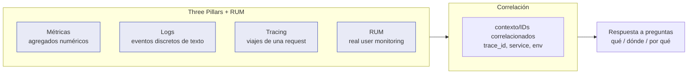
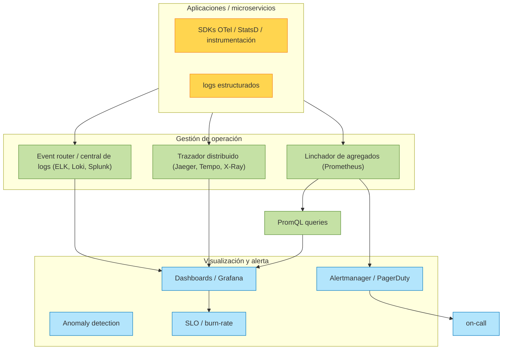
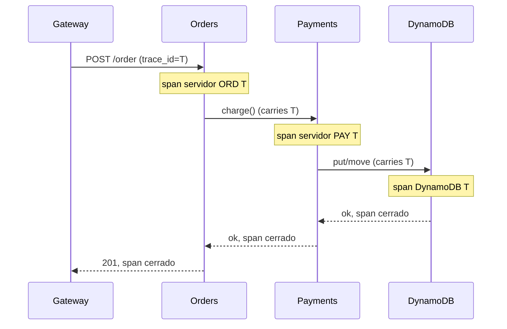

# Módulo 07 — Observabilidad

> **Nivel:** Senior. El objetivo es que comprendas cómo diseñar sistemas _observables_, no solo "cómo configurar un dashboard". Verás por qué observabilidad ≠ "logging bonito", cómo se acopla la telemetría de extremo a extremo, y cómo tomar decisiones de diseño (métricas, logs, tracing, RUM, alerting SRE) sobre cómo tus sistemas se comportan en producción.
>
> **Conexiones:** se apoya en [Módulo 02 — Microservicios y DDD](02-Microservicios-y-DDD.md) (muchos servicios = muchos lugares que mirar), [Módulo 03 — EDA](03-Event-Driven-Architecture.md) (los eventos deben poder rastrearse), Módulo 10 — Escalabilidad/Resiliencia (SLO/burn-rate) y Módulo 13 — AI-Assisted.

---

## Introducción

"Monitoring" tradicional te decía _si_ algo está arriba o abajo. "Observabilidad" te permite _hacer preguntas_ sobre sistemas que nunca anticipaste. En un mundo de microservicios distribuidos, entre dos nodos ya no hay frontera de máquina clara: la latencia, el estado y el error se convierten en propiedades _de red_, no de un solo proceso. La observabilidad es la respuesta a esa pérdida de visibilidad.

> _"La Segunda Vía describe los principios que habilitan el feedback rápido y constante, recíproco, de derecha a izquierda, en todas las etapas del value stream. Nuestro objetivo es crear un sistema de trabajo cada vez más seguro y resiliente."_ — The DevOps Handbook, Cap. 3

Dos principios rectores para un senior:

1. **Feedback rápido**: detectar y remediar problemas "mientras son más pequeños, baratos y fáciles de arreglar".
2. **Telemetría omnipresente** (_pervasive telemetry_): "cada feature debe estar instrumentada. Si fue lo suficientemente importante como para que un ingeniero la implementara, entonces es lo suficientemente importante como para generar suficiente telemetría de producción para confirmar que opera como fue diseñada." (Scott Prugh, Cap. 14)

La observabilidad se convierte en un _requisito arquitectónico_ (una "-ility") tan importante como la escalabilidad.

---

## Conceptos

### Observabilidad vs. Monitoring

| Monitoring                        | Observabilidad                                                                 |
| --------------------------------- | ------------------------------------------------------------------------------ |
| Responde "¿está caído?"           | Responde "¿qué está pasando y por qué?"                                        |
| Conoces de antemano qué preguntar | Haces preguntas nuevas sobre estados imprevistos                               |
| Métricas predefinidas             | Tres pilares: **métricas, logs y tracing** (the three pillars) + eventos ricos |
| Estado binario / umbrales         | Correlación de señales para _explorar_                                         |
| Orientado a alertas conocidas     | Orientado a _debugging_ abierto y _SLO_                                        |

Cyt (Charity Majors) y los think tanks modernos añaden un matiz: observabilidad **real** la definen los **eventos de cardinalidad alta** (high-cardinality event streams) con dimensión libre, no solo agregados precalculados. Un sistema observable es aquel donde puedes hacer preguntas _ad hoc_ sin redeploy.

### Los tres pilares + uno



- **Métricas** — valores numéricos agregados en el tiempo (contadores, gauges, histogramas). Bajos costos, alto agregado, baja cardinalidad.
- **Logs** — eventos discretos de texto con timestamp. Alta cardinalidad, alto volumen y costo.
- **Tracing (distributed tracing)** — recorre la vida de una sola request a través de servicios. Necesario en microservicios.
- **RUM / client telemetry** — mide lo que ve el usuario real en navegador/móvil (percepción, no infraestructura).

### Señales que importan: tiempo, error, saturación

Para un senior, la disciplina de operar se puede reducir a observar constantemente **tres cosas** sobre un servicio: cuán rápido responde (latencia), cuán frecuentemente se equivoca (errors), y cuán "lleno" está (saturation / utilización).

---

## Arquitectura

### La pila completa de telemetría (multi-nivel)

El _DevOps Handbook_ (Allen / Williams / Repka?, Cap. 14, citando a James Turnbull, _The Art of Monitoring_) recomienda **cinco niveles** de métricas que debes cubrir para "ver la salud de todo aquello de que depende tu servicio":

| Nivel                                     | Qué medir                                                              |
| ----------------------------------------- | ---------------------------------------------------------------------- |
| **Business**                              | transacciones de venta, revenue, sign-ups, churn, resultados A/B       |
| **Application**                           | tiempos de transacción, tiempos de respuesta del usuario, fallos       |
| **Infrastructure** (DB, SO, red, storage) | carga CPU, uso disco, tráfico                                          |
| **Client software** (browser/móvil)       | crashes, errores, tiempos de transacción percibidos                    |
| **Deployment pipeline**                   | build pasa/falla, lead time, frecuencia de deploys, estado de entornos |

> _"Al tener cobertura de telemetría en todas estas áreas, podremos ver la salud de todo aquello de que depende nuestro servicio, usando datos y hechos en lugar de rumores, señalamientos de dedo, culpa, etc."_

### Arquitectura de Recolección (golden example)



### Information radiators

> _"Information radiator: término genérico para cualquiera de una serie de displays... que un equipo coloca en una ubicación altamente visible, de modo que todos los miembros del equipo así como los transeúntes puedan ver la información más reciente de un vistazo."_

Criterios:

- Cualquiera con interés puede ver la información **sin** acceso a producción ni cuentas privilegiadas ni esperar tickets.
- Superponer **overlays de deployments** en las gráficas de métricas (la técnica "vertical line technology" de Etsy): como los deploys son una de las principales causas de caídas, cada deploy se marca como una línea vertical en el gráfico. Así un efecto secundario se correlaciona inmediatamente.
- Páginas de estado públicas para clientes (transparencia = confianza).

---

## Internals

### Métricas: tipos y cuándo usar cada uno

- **Counter** — solo aumenta (requests totales, errores, bytes). Útil con `rate()`.
- **Gauge** — valor que sube y baja (CPU, memoria, workers, tamaño de cola).
- **Histogram** — distribuye observaciones en buckets (latencia en ms); base para calcular percentiles.
- **Summary** — percentiles calculados en el cliente (Prometheus histórico; se prefiere histogram para agregar).

**Latencia: usa percentiles, no medias.** La media oculta colas de las colas. `p50`, `p95`, `p99`, `p99.9` — los extremos son los que el usuario siente.

> **Anti-patrón de medias:** alertar solo con la media puede no disparar ni con colas catastróficas. En datos Ops no-Gaussianos, el enfoque "media + 3σ" es inviable (produce alertas a falsas horas). Richard McFadyen / Forsgren documentan las distribuciones "chi square" de Ops.

### Logging estructurado

- **Mensajes estructurados** (JSON) con campos consistentes, no texto libre que no se puede filtrar.
- **Niveles (DevOps Handbook)**: `DEBUG` (todo, off en prod), `INFO` (acciones user-driven), `WARN` (condición que puede volverse error), `ERROR` (fallo), `FATAL` (terminar el proceso).
- **Regla de oro (Dan North):** "Al decidir si un mensaje debe ser ERROR o WARN, imagina ser despertado a las 4 AM. El tóner bajo de la impresora no es un ERROR."
- **Correlación:** cada evento lleva `request_id` / `trace_id` para seguir la vida de la request entre servicios.
- **Eventos imperdibles (Chuvakin/seguridad):** decisiones de auth, accesos, cambios privilegiados, cambios de datos, _input inválido_ (posible inyección), uso de recursos, health, startups/shutdowns, **circuit breaker trips**, backup OK/fail.

### Transformar logs en métricas

> _"Una vez que hemos centralizado nuestros logs, podemos transformarlos en métricas contándolos en el event router — por ejemplo, un evento de log como 'child pid 14024 exit signal Segmentation fault' puede ser contado y resumido como una única métrica de segfault en toda nuestra infraestructura de producción."_

Ejemplo concreto, LogQL / Promtail:

```
sum(rate({app="api"} |= "Segmentation fault"[5m]))
```

### Distributed tracing: cómo funciona

Cadena de spans conectados por un `trace_id` propagado en cada llamada:



**Contexto de propagación:** `W3C traceparent` — se pasa en headers/message metadata para construir el grafo. Mientras los tres pilares son plataformas separadas, la **correlación por identificación** los une: del `trace_id` saltas al log del mismo request y viceversa.

### Detección de anomalías (operaciones avanzadas)

- **Media + desviación estándar (σ)** — solo con distribución Gaussiana. Alertar a +3σ (esperas 0.3% falsos positivos). Ventaja: no hay umbral estático, que es inviable con cientos de miles de métricas.
- **Datos no-Gaussianos** (típicos en Ops, "chi square"): 3σ produce _false_ y _missed_ alerts ("escuchas 2:37 AM, 4:13 AM, 5:17 AM").
- Alternativas no paramétricas: **medias móviles / smoothing**, **FFT**, y **test de Kolmogorov-Smirnov** (Grafana/Graphite): comparan distribuciones periódicas/estacionales sin suponer normalidad, detectando varianzas día-a-día y semana-a-semana.
- **Alert fatigue (John Vincent):** "Es el problema más grande que tenemos... Necesitamos ser más inteligentes sobre nuestras alertas o todos nos volveremos locos."

### Alerting SRE: lo que un senior debe dominar

Conceptos del modelo SRE (Google) que se integran aquí y se profundizan con los SLO en el módulo de escalabilidad:

- **Alertas** que _requieren_ acción humana en el momento (on-call).
- **Páginas** para lo verdaderamente urgente; **tickets** para lo que puede esperar; **borrar** lo ruidoso.
- **Umbrales dinámicos** → reducen falsos positivos.
- **Evitar "alert storm"**: deduplicación, routing por severidad, silencios → correlación con overlays de deploy.

---

## Patrones

### Patrón 1: Telemetría con una línea de código (StatsD / OTel)

El objetivo async es que instrumentar sea trivial. (La implementación específica va al Apéndice A).

### Patrón 2: Instrumentar según "resultados no deseados" (Tom Limoncelli)

> _"Bromeo que en un mundo ideal borraríamos todas las alertas... Luego, tras cada caída visible al usuario, preguntaríamos qué indicadores habrían predicho esa caída y luego añadiríamos esos a nuestro sistema de monitoreo. Repetir. Ahora solo tenemos alertas que previenen caídas, en oposición a ser bombardeados por alertas después de que una caída ya ocurrió."_

Método: tras cada incidente, revisa qué señal _líder_ faltaba. Indicadores líderes de ejemplo para un NGINX que deja de responder: web page load times crecientes, memoria libre baja, disco bajo, transaction times del DB más largos, nº de servidores funcionales tras el load balancer en descenso.

### Patrón 3: RUM (Real User Monitoring) + telemetría de client

Medir desde el navegador/móvil la experiencia percibida (clasificación de transacciones del usuario), no desde el server. Cubre el nivel _client software_ del framework multi-nivel: crashes, errores, tiempos de carga percibidos (el usuario no espera p95 del server: espera lo que ve).

### Patrón 4: Feedback integrado en deploys

> _"Nunca debemos considerar nuestro deployment de código o cambio de producción como hecho hasta que esté operando como diseñado en el entorno de producción."_

Tras cada deploy, comparar telemetría pre/post-deploy (overlay). Si un cambio rompe algo:

1. **Feature toggle** para apagar la feature rota (menos riesgo).
2. **Fix forward** — solo con buen testing + telemetría que lo confirme rápido.
3. **Rollback** (blue-green / canary).

### Patrón 5: Basar decisiones en datos (método científico)

Resolver incidentes formulando hipótesis:

- ¿Qué evidencia dice que el problema existe?
- ¿Qué eventos/cambios relevantes pudieron contribuir?
- ¿Qué hipótesis conecta causas y efectos?
- ¿Cómo probamos cuál es correcta?

> _"La telemetría nos permite usar el método científico para formular hipótesis sobre qué está causando un problema particular y qué se requiere para resolverlo."_

---

## Casos reales

1. **Etsy (2012)** — Transformación DevOps: Ganglia + Graphite; la "Church of Graphs"; más de 200.000 métricas de producción por capa (2011) y 800.000+ (2014); telemetría con una línea de código (StatsD open-source); pantallas de TV por la oficina (information radiator); detección y arreglo de un spike de warnings PHP en <10 min. _Ian Malpass:_ "If it moves, we track it."
2. **LinkedIn / InGraphs (2011)** — Proyecto de un interno (Eric Wong): antes, obtener el uso de CPU de un servicio requería ticket y 30 min de montaje; InGraphs lo hizo self-service y en tiempo real, detectando un problema de un proveedor de webmail antes que el propio proveedor.
3. **Netflix outlier detection (2012)** — En clusters stateless de ~1.000 nodos, computar el "normal actual" y expulsar nodos que no encajan (matando el nodo enfermo), reduciendo masivamente el tiempo de arreglo. Fluye al diseño de **autoescalado predictivo** (netflix/scryer), superando al Auto Scaling de AWS usando outlier detection + FFT + regresión linear sobre patrones de visionado no-Gaussianos.
4. **CSG (Scott Prugh, 2014)** — >1.000 millones de eventos de telemetría/día, >100.000 ubicaciones de código instrumentadas; "crear telemetría de app e infra estructuró fue una de las inversiones de mayor retorno que hemos hecho."
5. **Right Media / Nick Galbreath (2006)** — Progresión de miedo a desplegar hasta despliegues frecuentes estables vía telemetría tras cada deploy: "el secreto del flujo suave y continuo es hacer cambios pequeños y frecuentes que cualquiera pueda inspeccionar."
6. **Google SRE — Launch/Handoff Readiness Review** — Los developers autogestionan su servicio en producción ≥6 meses antes de que un SRE lo reciba; las checklists LRR/HRR son "memoria organizacional"; criterios: cobertura de monitoring suficiente, y _"¿está la aplicación generando un número insoportable de alertas en producción?"_

---

## Laboratorio

### Lab 1: Instrumentación de una función serverless con métricas y logs

Crea una función (JS) que genere una métrica de latencia y un log estructurado por invocación, e identifica qué observarías en cada nivel del framework multi-nivel.

### Lab 2: Correlación de tres pilares

Simula una request de compra que atraviesa API → ordenador → pago → DB; instrumenta cada hop con spans OTel y logs con `trace_id`; dibuja el `sequenceDiagram` de su _trace_ y verifica poder saltar de un span a su log.

### Lab 3: Diseñar dashboards por nivel

Diseña (en texto/mermaid o Grafana si lo tienes) un dashboard que cubra los cinco niveles: business, application, infra, client, deployment pipeline. Añade overlay de deploys.

### Lab 4: Umbrales dinámicos vs. estáticos

Toma una métrica histórica de latencia; calcula "media+3σ" y una detección por test de Kolmogorov-Smirnov sobre la misma serie; discute cuál dispara alarmas y cuál no (y por qué).

### Lab 5: Alerting SRE

Define qué páginas requieren despertar on-call vs. qué genera ticket; escribe la ruta de una alerta (métrica → Alertmanager → PagerDuty → on-call) y la distinción de severidad.

---

## Entrevistas

1. **¿Cómo diferenciarías observabilidad de monitoring? ¿Qué le pides a un sistema para considerarlo "observable"?**

   **Orientación:** Contrapone el _quién/pregunta conocida_ (monitoring) con _preguntas ad hoc sobre estados imprevistos_ (observabilidad) y las señales que lo permiten.

   **Respuesta de un senior:** "El monitoring te responde preguntas que _ya sabes_ que vas a hacer: '¿está caído?', '¿el p99 pasó de 300 ms?'. La observabilidad te permite _explorar_ y responder preguntas que no anticipaste: '¿qué estaba pasando en el sistema a las 3:14, justo antes de que Colombia fallara?' Monitoring te dice _que_ algo está mal; observabilidad te dice _por qué_. Para considerar un sistema observable le pido tres cosas: _métricas_ que capturen el estado agregado (con percentiles, no solo medias), _logs estructurados_ y correlacionados (con `requestId`/`traceId`), y _tracing distribuido_ que reconstruya la vida de una request a través de todos los servicios; y que esas tres señales se puedan **correlacionar** —saltar de un trace a sus logs—. Si de un gráfico no puedo llegar a la causa raíz sin redeploy, no es observable, es solo monitored."

2. **¿Por qué la media no sirve para latencia? ¿Qué usarías y por qué?**

   **Orientación:** Apunta a que la media esconde colas y outliers; defiende los percentiles y el sesgo de datos no-Gaussianos.

   **Respuesta de un senior:** "La media no sirve porque la latencia suele ser _muy sesgada_: una cola corta de requests pesadas o un cold start pueden disparar la media sin que la mayoría de usuarios note nada. La media además _mezcla_: puedes tener el p50 perfecto y un peor 5% devastador, invisible en el promedio. Por eso uso _percentiles_: `p50` para la experiencia típica, `p95`/`p99` para lo que los extremos sienten, y `p99.9` para los peores usuarios. A un senior también le importa el _sesgo no-Gaussiano_ de los datos de ops: con una media y 3σ puedes fallar a la hora de alertar solo porque la distribución no es normal. Los percentiles, y técnicas no paramétricas como el test de Kolmogorov-Smirnov o medias móviles, capturan mejor la realidad. La regla: para latencia, mira la _distribución_, no el promedio."

3. **Explica cómo un `trace_id` te permite debuggear un incidente en microservicios.**

   **Orientación:** Debes mostrar el camino: un ID que atraviesa todos los servicios y conecta spans y logs.

   **Respuesta de un senior:** "Cuando una request atraviesa varios servicios, cada uno es un _span_, y todos quedan unidos por un `trace_id` que se genera en el borde (API Gateway) y se _propaga_ de llamada a llamada vía header (W3C `traceparent`). Para debuggear, con ese ID puedo reconstruir el _camino completo_ del request: en el trazador (Jaeger/Tempo/X-Ray) veo la cadena de spans —cuál duró, cuál falló, cuál fue lento— y así localizo el cuello de botella o el punto de error exacto. Y como cada servicio también escribe logs _con el mismo `trace_id`_, salto de la vista del trace al detalle del log del servicio sospechoso. Sin esto, un incidente distribuido es un puzzle sin conexión: solo sabes que 'algo falló entre servicio A y B', pero no dónde. El trace_id convierte el caos en una historia legible y correlacionada."

4. **¿Qué niveles de telemetría debes cubrir para ver la salud de un servicio? Da un ejemplo por nivel.**

   **Orientación:** Repite el marco de los 5 niveles (business, application, infra, client, pipeline). Demuestra amplitud.

   **Respuesta de un senior:** "Para 'ver la salud de todo aquello de que depende mi servicio' cubro cinco niveles: _business_ (las métricas que al negocio le importan: transacciones de venta, sign-ups, revenue, churn); _application_ (el servicio en sí: tiempos de transacción, latencia de respuesta, fallos); _infrastructure_ (lo que lo sostiene: CPU, memoria, uso de disco, estado de la DB, red); _client software_ (lo que percibe el usuario final en browser/móvil: crashes, errores, tiempos de carga percibidos —RUM—); y _deployment pipeline_ (el estado del CI: build pasa/falla, lead time, frecuencia de deploys, estado de entornos). Ejemplos concretos: pedidos/día (business), p99 del API (application), CPU de la DB (infra), carga de página percibida (client), build rojo (pipeline). Con esas cinco capas veo el _porqué_ de un problema, no solo el síntoma."

5. **¿Cuándo una alerta debe ser un page vs. un ticket? ¿Qué es el alert fatigue y cómo lo evitas?**

   **Orientación:** Distingue acción inmediata (page) de lo que puede esperar (ticket), y ataca el exceso de alertas.

   **Respuesta de un senior:** "Un _page_ es solo para lo que exige despertar a un humano _ahora_: un problema que está degradando al usuario o puede perder datos, donde cada minuto cuenta. Todo lo demás, que puede esperar horas o días, es un _ticket_ (incidente pendiente, backlog). El _alert fatigue_ es tener tantas alertas que el on-call se insensibiliza: al final ignoras páginas, aunque alguna sea crítica. Lo evito con varias reglas: (1) cada página debe tener un _runbook_ o no existe; (2) prefiero _tickets_ sobre _pages_ por un margen amplio; (3) uso _umbrales dinámicos_ y percentiles, no absolutos frágiles; (4) _correlaciono con deploys_ —una alerta en una ventana de deploy se interpreta y silencia a propósito—; y (5) tras cada incidente borro las alertas que no predijeron nada (método de Limoncelli). Página pocas y valiosas, no todas."

6. **¿Cómo integras los deployment overlays para correlacionar cambios con efectos?**

   **Orientación:** Habla de marcar deploy en gráficas, linking causa/efecto, y el time de detección.

   **Respuesta de un senior:** "Superpongo en cada gráfica de métricas una _línea vertical por cada deploy_ (la técnica de Etsy, 'vertical line technology'). Así, si tras un deploy aparece un spike, una caída o un cambio en el p99, lo correlaciono de inmediato con ese cambio, en vez de buscar señales a ciegas. Con una ventana temporal—'qué se desplegó a las 14:02 y qué métrica cambió a las 14:03'—, acoto la causa. Esto también cambia el _time to detection_: como sé cuándo tocó producción, sé qué revisar. Y en flujo: una alerta dentro de la ventana de deploy se _interpreta dentro de ese contexto_ (settling period tras el deploy, cache misses, etc.), no se dispara al on-call sin más. El overlay convierte cada cambio en una hipótesis contrastable contra la telemetría."

7. **¿Qué es RUM y por qué difiere de la telemetría del server?**

   **Orientación:** Distingue lo que el servidor mide de lo que el usuario _percibe_.

   **Respuesta de un senior:** "RUM (Real User Monitoring) es la telemetría que capturas **en el cliente**—navegador o móvil—midiendo la experiencia real de usuarios reales: tiempos de carga percibidos (LCP, FCP), errores de JavaScript, latencias de red, transacciones de usuario. Difiere del servidor porque el servidor mide _tu_ tiempo de procesamiento, pero no la red entre el servidor y el usuario, ni el cache del browser, ni los reintentos del cliente. El p95 que ves en tu API no es lo que el usuario siente. Por eso RUM importa: es lo único que ve la experiencia _completa_. El valor senior está en _unirlo_: correlacionar la señal RUM con el `trace_id` del backend, para pasar de 'el usuario tarda 4 s' a 'el servidor tardó 800 ms, la diferencia es red/cliente'. RUM sin tracing es síntoma; RUM + tracing es diagnóstico."

8. **Cuenta un incidente que resolviste usando datos/telemetría (método científico).**

   **Orientación:** Cuentan una historia corta con hipótesis, evidencia y verificación; no un monólogo. Confirma tu perfil senior con un ejemplo real.

   **Respuesta de un senior:** "Hubo un incidente de pagos que aparecía como 'timeouts intermitentes', sin causa obvia. Primero _formulé la hipótesis_ usando evidencia en vez de ruido: saqué el trace del p99 y vi que la degradación coincidía con los _peaks_ del fin de semana. En lugar de culpar al proveedor externo de pagos, miré la telemetría del endpoint de salida: la latencia _al tercero_ se disparaba justo cuando nuestra cola de reintentos crecía. Mi hipótesis: no era el tercero, era nuestro _retry_ agresivo que lanzaba una avalancha ante un proveedor levemente lento, saturando su límite. Lo **verifiqué** con una hipótesis controlada: limité los reintentos y añadí _backoff_, y el p99 volvió a la normalidad en la siguiente serie. El método científico—hipótesis, evidencia, prueba—hizo que lo resolviera en minutos con datos, no asumiendo 'culpa del proveedor'."

9. **¿Cómo transformas logs en métricas? Da un ejemplo concreto.**

   **Orientación:** Muestra el mecanismo (centralizar logs y contarlos/transformarlos) y un ejemplo concreto de agregación por tipo de error.

   **Respuesta de un senior:** "Centralizo los logs y los transformo agregándolos en el event router: en vez de miles de líneas de log, las _cuento_ y las convierto en métricas de alto nivel para alertar y hacer trending. Del mismo modo, un log de error 'segfault' repetido se convierte en una métrica 'número de segfaults' en todo el clúster, y paso de 'tuvimos 10 la semana pasada' a alertar 'miles en la última hora'. Concretamente: parseo un campo del log (por ejemplo, `status=5xx`, o un `exceptionType`) y cuento su frecuencia por ventana temporal en Prometheus/Loki. Con _Loki_ puedo hacer un `count_over_time({app="api"} |= "Segmentation fault" [5m])` para obtener esa métrica. Así cualquier log cuyo significado escape al agregado de métricas se vuelve visible y alertable, sin instrumentación nueva del servicio."

---

## Checklist

- [ ] Tengo métricas en los **cinco niveles**: business, application, infraestructura, cliente (RUM), pipeline.
- [ ] Uso **logs estructurados** con campos consistentes y `trace_id` para correlación.
- [ ] Instrumento **distributed tracing** entre servicios con propagación W3C.
- [ ] Mi dashboard **radía información** sin acceso a producción (information radiator + overlay de deploys).
- [ ] Uso **percentiles** para latencia, no medias.
- [ ] Puedo **transformar logs en métricas** cuando lo necesito.
- [ ] Mi alerting distingue **pages vs tickets**, y evito _alert fatigue_.
- [ ] Tras cada incidente, añado la señal **líder** que faltaba (método de Limoncelli).
- [ ] Un feature no se considera "hecho" hasta que tiene telemetría que confirma que opera como se diseñó.

---

## Referencias y lecturas recomendadas

- _The DevOps Handbook_ (2ª ed.), Kim/ Humble/ Debois/ Willis/ Forsgren — Parte IV "Feedback": Caps. 14 (el "Event Router" y la "telemetría" como término paraguas), 15 (anomalies: σ, FFT, Kolmogorov-Smirnov), 16 (telemetría en el pipeline y dev on-call), 17 (hipótesis y experimentación). Tracking references: las cinco niveles de telemetría (Cap. 14), "transform logs into metrics", los eventos de log imperdibles de Chuvakin (Cap. 14), la técnica de overlay de deploys de Etsy (Caps. 14/16), los LRR/HRR de Google (Cap. 16), los values de "information radiator" (Cap. 14).
- _The Unicorn Project_ (Gene Kim) — la crítica de Maxine al modelo tickets para observabilidad; la ficción del "cultural suite".
- _Seeking SRE_ o _The Site Reliability Workbook_ (Google / O'Reilly) — SLO, burn-rate, alerta.

---

> _El Apéndice A del [**Módulo 07**](appends/07-Observabilidad-Apendice-A.md) incluye: implementación de Prometheus + OpenTelemetry + ejemplo completo de correlación, promql para histogramas, RED/USE, RUM detallado, tablas de ratios p50/p95/p99, y un glosario extendido del módulo._
