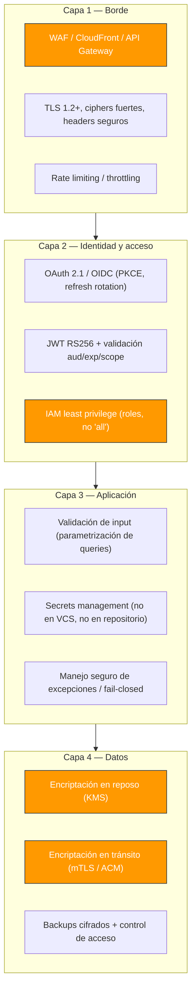
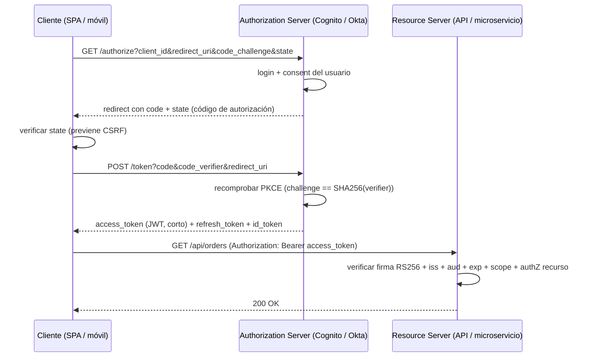
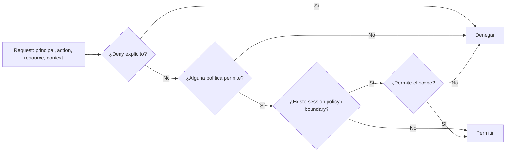

# Módulo 08 — Seguridad, Autenticación y Autorización

> **Nivel:** Senior. El objetivo es que diseñes la _postura de seguridad_ del sistema (identidad, tokens, autorización, IAM, criptografía y defensa en profundidad), no que memorices un checklist. Verás los flujos OAuth 2.1 / OpenID Connect, cómo funciona un JWT por dentro y por qué falla, el modelo de políticas de AWS IAM, y las mejores prácticas que separan a un senior que _entiende_ el riesgo de un junior que "agrega un token".
>
> **Conexiones:** se apoya en [Módulo 01](01-Arquitectura-de-Software-Moderna.md) (arquitectura y trade-offs), [Módulo 02](02-Microservicios-y-DDD.md) (comunicación entre servicios → mTLS/Zero Trust), [Módulo 04](04-AWS-Serverless.md) (Cognito/API Gateway como capa de entrada), [Módulo 06](06-Infraestructura-como-Codigo.md) (IaC y secretos) y [Módulo 07](07-Observabilidad.md) (logging de seguridad).

---

## Introducción

La seguridad no es una capa que se añade al final: es una **propiedad del diseño**. Un senior piensa en el _modelo de amenazas_ antes de escribir código: quién podría atacar, por qué vía, y qué pasaría si lo logra. La mentalidad correcta la resume _The Pragmatic Programmer_:

> _"In fact, you do need to be that paranoid, every day … Security through obscurity just doesn't work. The attacks aren't the result of clever attackers; the developers were careless."_ (Topic 43, "Stay Safe Out There")

En un backend moderno, autenticar (¿quién eres?) y autorizar (¿qué puedes hacer?) son responsabilidades distintas y críticas. La mayoría de las brechas (OWASP lo confirma año tras año) vienen de **broken access control**, **misconfiguration** y **cryptographic failures** — no de hackers con superpoderes, sino de _cuidado insuficiente_ en el diseño. Este módulo te da las piezas para diseñarlo bien y, sobre todo, para **explicar el riesgo** como se espera de un senior.

---

## Conceptos

### Terminología que debes dominar (y matizar en entrevista)

- **Authentication (AuthN):** verificar la _identidad_ del sujeto ("¿quién eres?"). OAuth 2 NO hace autenticación; **OpenID Connect (OIDC)** es la capa que sí la hace sobre OAuth 2.
- **Authorization (AuthZ):** verificar qué puede hacer ("¿puedes leer `orders/123`?"). Es el **segundo** paso, tras la autenticación, y donde casi siempre se rompe la seguridad (broken access control).
- **Principle of Least Privilege (Saltzer):** _"Every program and every privileged user … operate using the least amount of privilege necessary to complete the job."_ (según cita de _The Pragmatic Programmer_). Autorización **fina**, no binaria ("admin vs user" es demasiado grueso).
- **Identity:** el sujeto (usuario, servicio, workload) al que se atribuyen permisos.
- **Principal / Session / Context:** identidad + su estado + el contexto (dirección, dispositivo, hora) usado para decidir.
- **Trust boundary:** el límite donde cambia el nivel de confianza de los datos.
- **Confianza en el perímetro vs Zero Trust:** asumir que **nadie** dentro de la red es de fiar por defecto; cada request se autentica y autoriza por separado.

### Autenticación vs. Autorización (no confundirlas)

```
AuthN (¿quién?)  →  AuthZ (¿qué puede?)  →  Audit (¿qué hizo?)
```

Falla corriente: validar la firma del JWT (authn) y asumir que eso basta. **No**: hay que validar además `aud`, `scope`, `exp` y la **autorización específica del recurso** (object-level access control). Ese es exactamente el origen del A01 _Broken Access Control_.

### El triángulo CIA

- **Confidencialidad:** solo quien debe puede leer (encriptación).
- **Integridad:** los datos no se alteran (firmas, hashes, TLS).
- **Disponibilidad:** el servicio responde pese a ataques (rate limiting, redundancia).

Y las **tres fuentes clásicas de fallo distribuido** (Módulo 01) se combinan aquí: no confíes en la red ni en el reloj de pared, y diseña para pausas.

---

## Arquitectura

### Defensa en profundidad (layers)

Una sola capa de seguridad no basta: la seguridad real es una serie de capas, de modo que si una falla, la siguiente la contiene (principio de _defense in depth_):



### Anatomía del flujo OAuth 2.1 Authorization Code + PKCE (SPA / CLI)

OAuth 2.1 consolida las mejores prácticas: **PKCE obligatorio**, **implicit grant eliminado**, **refresh token rotation obligatoria**. El flujo moderno:



Puntos donde se rompe la seguridad en la práctica:

- Guardar el **code_verifier** en `sessionStorage` → mejor guardarlo en memoria y borrarlo tras el exchange.
- Aceptar tokens por _query string_ "por compatibilidad" → **solo** en `Authorization: Bearer`.
- Validar la firma sin validar **audience** → un token de servicio A vale en servicio B.

### Postura de seguridad en AWS (vista de conjunto)

- **IAM** (identidad y permisos), **KMS** (claves de encriptación), **Secrets Manager / Parameter Store** (secretos), **CloudTrail** (auditoría de API), **GuardDuty** (detección de amenazas), **WAF + Shield** (borde / DDoS), **Security Groups / NACLs** (firewall de red), **ACM / mTLS** (cifrado en tránsito).

---

## Internals

### Cómo funciona un JWT por dentro

Un JWT son **tres segmentos base64url separados por `.`**: `header.payload.signature`.

```
eyJhbGciOiJSUzI1NiJ9.eyJzdWIiOiIxIiwib2lmIjoiaHR0cHM6... .9NnYNQO
^------header-----^  ^---------payload-----------^  ^--signature--^
```

- **Header:** `{"alg":"RS256","typ":"JWT","kid":"<key-id>"}` → qué algoritmo y qué clave (`kid`) se usaron.
- **Payload (claims):** `sub` (sujeto), `iss` (emisor), `aud` (audiencia), `exp` (expiración), `iat` (emitido en), `scp`/`scope`, `jti` (id único para revocación).
- **Signature:** firma criptográfica del `header.payload`.

**¿Está encriptado?** No. JWT solo está _firmado_ (y no siempre encriptado). Su contenido es **base64 legible** por cualquiera: **nunca** pongas datos sensibles (claves, PII) en el payload a menos que esté encriptado (JWE).

**¿Stateless?** El atractivo es la verificabilidad sin estado compartido: cualquier servicio con la clave pública verifica la firma offline. El precio: **no puedes revocar inmediatamente** un access token hasta que expire. Por eso → access tokens **cortos** (5–15 min) + refresh tokens (rotación). Si necesitas revocación instantánea → sesiones server-side (Redis) o blocklist de `jti`.

### RS256 vs HS256 (y por qué importa el algoritmo)

|                    | HS256 (HMAC-SHA256)                              | RS256 (RSA signature)                                          |
| ------------------ | ------------------------------------------------ | -------------------------------------------------------------- |
| Criptografía       | Simétrica (un secreto compartido)                | Asimétrica (privada firma / pública verifica)                  |
| Quién puede firmar | **Cualquiera** que tenga el secreto              | Solo el dueño de la clave privada                              |
| Distribución       | El secreto debe estar en todos los verificadores | Solo el _auth service_ tiene la privada; todos solo la pública |
| Uso correcto       | Un único servicio que emite y verifica           | **Microservicios / tercera confianza**                         |

**Regla senior:** en una arquitectura de microservicios, usa **RS256** (o ES256); cada servicio verifica con la pública vía **JWKS**, sin compartir el secreto de firma. HS256 solo es aceptable en un único servicio que emite y verifica.

### Los ataques clásicos de JWT (debes reconocerlos)

1. **`alg: none`:** un JWT sin firma que un servidor mal configurado aceptaba. Mitigación: especificar `algorithms: ['RS256']` — **nunca** permitir que el `alg` del header decida la validación.
2. **Algorithm confusion (RS256→HS256):** si el servidor acepta ambos y usa la **clave pública RSA como secreto HMAC**, un atacante firma con HS256 usando la pública (que es pública). Mitigación: fijar el algoritmo y separar tipos de claves.
3. **Falta de validación de `aud`:** un access token para servicio A se usa en servicio B. Mitigación: verificar `aud` conocida.
4. **Guardar tokens en `localStorage`** (accesible a JS → XSS lo roba). Mejor: **cookies `HttpOnly` + `Secure` + `SameSite=Strict/Lax`**, access token en memoria.
5. **Refresh token de larga vida sin rotación:** si se roba, vale para siempre. Mitigación: **rotación por uso** (cada refresh vale una sola vez) y _reuse detection_ (si se usa dos veces → asumir robo y revocar).

### Cómo evalúa AWS un policy de IAM

AWS evalúa una request en este orden de decisión:



Reglas clave:

- **Deny explícito gana siempre** (incluso sobre un Allow).
- Si no hay Allow explícito y aplicable → **denegar por defecto** (deny implicit).
- Los **resource-based policies** (ej. de un bucket S3) y **identity-based policies** se evalúan juntos; un **permissions boundary** limita la capacidad máxima de un rol.

### Criptografía: la regla de oro

> _"Don't roll your own crypto"_ — _The Pragmatic Programmer_: incluso un error pequeño compromete todo. Usa librerías **vigentes, mantenidas y de código abierto** (TLS, JWT/JWK, bcrypt/argon2) y, para credenciales, prefiere un **tercero auth provider** que "pasa todos los días manteniendo seguro su sistema".

Y el antipatrón de contraseñas (NIST): **no** impongas reglas de composición complejas, **no** restrinjas longitud <64, **no** rote forzadamente, **no** ocultes el paste. Fomenta **largas** y con alta entropía; compara contra listas de contraseñas conocidas (HIBP).

---

## Patrones

### Patrón 1: Authorization Code + PKCE (SPA / CLI)

Flujo estándar con `code_challenge` (S256) y verificación de `state` para evitar CSRF. Solo se recibe el token en un canal de retorno seguro, nunca persistido en `localStorage`.

### Patrón 2: Client Credentials (service-to-service)

Para **máquinas** que se comunican entre sí (no usuarios): el servicio se autentica con sus credenciales y obtiene un access token con scopes. Combinado con **mTLS** para Zero Trust entre microservicios. Nunca para flujos de "usuario".

### Patrón 3: Refresh Token Rotation + Reuse Detection

Cada uso del refresh genera uno nuevo; una vez consumido, el anterior queda inválido. Si llega un refresh **ya usado** → señal de robo → revocar toda la sesión. Access tokens cortos (5–15 min).

### Patrón 4: Least Privilege con roles (AWS IAM)

Crear roles con los **permisos mínimos** necesarios (ej. una Lambda solo puede `dynamodb:GetItem` en su tabla específica), usar **conditions** (tenant, tag) y un **permissions boundary**. Nunca `Action:"*"`.

### Patrón 5: Secrets Management

- **Nunca** en version control (_The Pragmatic Programmer_: no hagas check-in de secretos; usa config/env vars).
- En AWS: **Secrets Manager** para rotación automática, **Parameter Store (SecureString)** para config simple, y **KMS** para las claves de encriptación. Separa los entornos dev/prod.

### Patrón 6: RBAC vs ABAC

- **RBAC (Role-Based):** permisos por rol → simple de administrar, pero poco granular.
- **ABAC (Attribute-Based):** permisos por _atributos_ (ej. `document.owner == principal`, `department == finance`) → fino y escalable, ideal para multitenancy. AWS soporta ABAC con tags y `Condition`.

### Patrón 7: Fail Closed ante excepciones (OWASP A10)

Manejo de condiciones excepcionales: ante error **niega por defecto** (fail-closed), nunca "fail-open" que conceda acceso o exponga datos en el camino del error. Conecta con _The Pragmatic Programmer_ ("expect the worst").

### Patrón 8: WAF / borde y rate limiting

Situar WAF (reglas OWASP), TLS moderno, headers de seguridad (`Strict-Transport-Security`, `Content-Security-Policy`, `X-Content-Type-Options`) y **rate limiting** en el edge para absorber ataques antes de la capa de identidad.

---

## Casos reales

1. **Broken access control (A01).** _"Zara, Talend, Frontier"_ etc.: ataques que cambiaban el ID en la URL/body (`orders/123` → `orders/124`) revelando datos de otros usuarios. Lección: **object-level authorization** — validar _permiso por recurso específico_, no solo "está logueado". Es el n.º 1 de OWASP por una razón.
2. **Supply chain (A03), reordenado en 2025.** Casos **SolarWinds / Log4Shell / Solr**: un componente vulnerable o un build comprometido infecta downstream. Lección: **SBOM**, dependencias minimizadas y firmadas, sin paquetes no usados, monitoreo de CVEs.
3. **Algorithm confusion en JWT (CVE reales en librerías).** Varios SDKs JWT históricamente aceptaron `alg:none` o confundieron la clave pública con secreto HMAC. Lección: **fijar el algoritmo** en el verificador, nunca confiar en el header.
4. **Credenciales filtradas en Git / repositorios.** Escaneos muestran miles de secretos expuestos en repos públicos. Lección: **secrets management**, `git-secrets`/guardrails en CI, rotación inmediata ante fuga (y que no estén en _Pragmatic Programmer_ sin motivo).
5. **Cognito / AWS**: el mal uso típico es conceder permisos amplios a una Lambda (ej. `*` en DynamoDB). Lección: **least privilege** con roles estrechos, condiciones por tenant y `permissions boundary`.

---

## Laboratorio

1. **Decodifica un JWT:** toma un token real de un proveedor (o genera uno), decodifica header y payload en `jwt.io` o con `python/jq`. Confirma que **no está encriptado**.
2. **Reproduce `alg:none`:** con una librería local (pydantic/pyjwt, `jsonwebtoken`) firma un token sin firma y verifica que tu validador lo rechaza cuando fijas `algorithms=["RS256"]`.
3. **PKCE en curl:** simula el flujo completo contra un Authorization Server de prueba (Auth0/Okta/Cognito free tier) con `curl`, incluyendo `code_verifier`/`code_challenge`.
4. **Policy IAM mínimo:** escribe (en IaC, ver Módulo 06) un rol para una Lambda que solo haga `dynamodb:GetItem` en `arn:aws:dynamodb:...:table/orders`, y un `permissions boundary`. Verifica con `aws iam simulate-principal-policy`.
5. **Headers de seguridad:** configura en el CDN/borde los headers HSTS, CSP y `X-Content-Type-Options`; valida con `securityheaders.com`.
6. **Test de contraseñas:** ejecuta un _password strength_ con una lista conocida (HIBP) en tu propio flujo de registro; observa cuántas claves "fuertes" ya están comprometidas.

---

## Entrevistas

1. **"¿Cómo autenticarías y autorizarías una API de microservicios? ¿Dónde pondrías la frontera de seguridad?"**

   **Orientación:** busca que distingas AuthN de AuthZ, que propongas una frontera clara (borde vs servicio), y que menciones tokens _short-lived_ y validación de audiencia. Un junior dice "JWT en todos lados"; un senior explica qué protege cada capa.

   **Respuesta de un senior:** separo AuthN (identidad) de AuthZ (permiso). La autenticación la resuelvo en el borde o con un identity provider (Cognito, OIDC): el usuario obtiene un access token corto (5–15 min) y un refresh token con rotación. Cada microservicio valida el JWT como _resource server_: verifica firma (RS256/ES256 vía JWKS, nunca fiar del `alg` del header), `iss`, `aud` (que el token sea para _ese_ servicio), `exp` y `scope`. La autorización fina la hago en la capa de aplicación — ABAC con atributos (`orders/123` solo si `document.owner == sub`) — porque el token no basta para decidir sobre un recurso específico. Entre servicios, para comunicaciones internas uso client credentials o mTLS bajo Zero Trust: nadie dentro de la red es de fiar por defecto.

2. **"¿Cuál es la diferencia entre OAuth 2 y OpenID Connect? ¿Cuándo usas cada uno?"**

   **Orientación:** el candidato debe saber que OAuth 2 es un framework de _autorización_ (delegar acceso) y OIDC es autenticación construida sobre él. Un error común es "OAuth es login".

   **Respuesta de un senior:** OAuth 2 define cómo un tercero accede a recursos protegidos en nombre del usuario (delegación): el recurso principal es el **access token**. OIDC es una capa sobre OAuth 2 que añade el **ID token** (un JWT con claims de identidad: `sub`, `email`, `name`) y el endpoint `userinfo`, para autenticar quién es el usuario. La regla práctica: si necesitas _login_ (quién es) → OIDC; si necesitas _delegar acceso_ (qué puede hacer una app en nombre del usuario) → OAuth 2. Usamos OIDC con PKCE para el login de la SPA; el microservicio que consume la API recibe el access token OAuth.

3. **"¿Qué pasa si un access token se filtra? ¿Cómo lo mitigas?"**

   **Orientación:** busca comprensión del _trade-off_ stateless vs revocación. El candidato debe mencionar vida corta, rotación, y alternativas (session store/blocklist).

   **Respuesta de un senior:** el token filtrado vale hasta que expire, así que la primera línea es **acortar su vida** (5–15 min) y tener **refresh tokens rotados** y con _reuse detection_. Si roban el refresh y lo reutilizan, revocamos toda la sesión. Si necesito revocación inmediata, paso a sesiones server-side (Redis) o a una blocklist de `jti` — asumo el costo de estado a cambio de control. Además, el token nunca debe viajar en URL ni persistirse en `localStorage`; uso cookies `HttpOnly`/`Secure`/`SameSite` o memoria del cliente. Y audito con CloudTrail/logs: saber que hubo fuga es tan importante como mitigarla.

4. **"¿Cómo protegerías secretos en una arquitectura serverless? ¿Qué harías si se filtra uno?"**

   **Orientación:** el candidato debe ir más allá de "no subirlos a Git": rotación, cifrado, acceso mínimo y plan de respuesta.

   **Respuesta de un senior:** los secretos viven en **Secrets Manager** (con rotación automática) o **Parameter Store SecureString**; las claves de cifrado en **KMS** con políticas de uso mínimas. Los entrego a las funciones en runtime por variable de entorno o vía SDK, nunca en el código ni en el build. Nunca en VCS: guardrail en CI con `git-secrets`/escaneo de repos. Si se filtra: **rotar inmediatamente** (Secrets Manager cambia el valor y lo propaga), revocar las credenciales comprometidas, auditar con CloudTrail quién pudo acceder, y revisar el _blast radius_ — y documentar el incidente como lección.

5. **"¿Qué es el 'alg:none' y por qué es un riesgo? ¿Cómo lo previenes?"**

   **Orientación:** pregunta de cultura de seguridad + detalles de JWT. Un candidato fuerte conoce el bug histórico y la mitigación (fijar algoritmo).

   **Respuesta de un senior:** `alg:none` es un modo del estándar JWT para tokens sin firma (para debugging). Un verificador mal configurado que acepta el `alg` del header puede aceptar un token que un atacante forjó sin firma. Se previene **nunca** dejando que el header decida: en el validador se fija la lista de algoritmos permitidos (`algorithms=["RS256"]`) y se rechaza todo lo demás. Es la misma familia que _algorithm confusion_ (RS256→HS256): el verificador debe fijar el algoritmo y el tipo de clave, y verificar `kid` contra el JWKS correcto.

6. **"¿Cuál es la diferencia entre RBAC y ABAC? ¿Cuál elegirías para una app multitenant?"**

   **Orientación:** los entrevistadores (típicamente en plataformas) quieren ver que el candidato pesa granularidad vs complejidad administrativa.

   **Respuesta de un senior:** RBAC asigna permisos a roles; es simple de administrar pero grueso y difícil de escalar cuando los permisos dependen del _contexto_. ABAC decide por atributos del principal, del recurso y del entorno (owner del documento, tenant, departamento, hora). En multitenancy elijo ABAC: los permisos se expresan como _"puede leer su propia fila en su tenant"_ sin crear un rol por tenant. En AWS lo implemento con tags y `Condition`. Pero matizo: empiezo por RBAC simple para arrancar, y escalo a ABAC cuando el modelo de roles explota.

7. **"¿Qué significa 'fail-closed' en seguridad? Da un ejemplo real."**

   **Orientación:** evalúa la mentalidad de seguridad (seguro por defecto) y la calidad del ejemplo.

   **Respuesta de un senior:** fail-closed significa que ante un error o ambigüedad, **niego el acceso por defecto** en lugar de concederlo. Ejemplo: en la capa de autorización, si un atributo requerido falta o la validación del token falla con una excepción, el default debe ser `403/401`, no "continúa con acceso parcial". Otro ejemplo: un handler de errores que ante una validación fallida de input devuelve `400` sin ejecutar la lógica, en lugar de "intentar seguir". En diseño de sistemas, también aplica a timeouts de comunicación: si no sabes si la operación se aplicó, no repitas un débito sin idempotencia.

8. **"¿Cómo manejarías tokens en una SPA (JWT vs cookies)? ¿Y CSRF?"**

   **Orientación:** el candidato debe equilibrar la exposición a XSS (JWT en `localStorage`) contra CSRF (cookies), y conocer `SameSite`.

   **Respuesta de un senior:** si guardo el access token en `localStorage`, cualquier XSS puede leerlo → prefiero **cookies `HttpOnly` + `Secure` + `SameSite=Strict`** para el refresh y el session cookie, y el access token en memoria. `HttpOnly` evita que JS lo lea; `SameSite=Strict` mitiga CSRF al no enviar la cookie en requests cross-site; para peticiones que sí necesitan cross-site, uso tokens anti-CSRF (doble envío o header personalizado) y valido el header `Origin`/`Referer`. Con cookies, la sesión es revocable server-side, lo que también responde a la pregunta de revocación.

9. **"Explica cómo una política de IAM de AWS decide permitir o denegar. ¿Qué son los permissions boundaries?"**

   **Orientación:** pregunta de AWS + seguridad. El candidato debe conocer el orden de evaluación (deny explícito > allow, deny implícito) y el concepto de boundary.

   **Respuesta de un senior:** AWS evalúa en este orden: primero **deny explícito** (si existe, siempre gana), luego **allow explícito** de las políticas aplicables (identity-based + resource-based), y si no hay allow, el **deny implícito** deniega por defecto. Un **permissions boundary** es una política que define el _máximo_ de permisos que puede tener un rol/principal, aunque una política más amplia diga lo contrario — útil para dar a un equipo IAM delegado sin riesgo de escalada total. Lo combino con condiciones (ABAC, tags) y con `iam:simulate-principal-policy` para probar antes de desplegar.

10. **"¿Qué es Zero Trust? ¿Cómo lo aplicarías entre microservicios?"**

    **Orientación:** evalúa si el candidato piensa la seguridad _entre_ servicios, no solo en el borde.

    **Respuesta de un senior:** Zero Trust parte de que **no existe confianza implícita por estar dentro de la red**: cada request se autentica, autoriza y cifra por separado, aunque vaya de servicio A a servicio B en la misma VPC. Lo aplico con: (1) **mTLS** en la malla de servicios (ambas partes presentan certificados emitidos por una CA interna), (2) **client credentials / SPIFFE** para la identidad del workload, (3) autorización por política (scope/claim) en cada servicio receptor — no solo en el gateway — y (4) políticas de red restrictivas (security groups, no trust "todo dentro"). El trade-off es complejidad operativa: la justifico cuando el riesgo o el tamaño del sistema lo ameritan.

---

## Checklist

- [ ] ¿Separo AuthN de AuthZ y tengo una frontera de seguridad clara (borde vs servicio)?
- [ ] ¿Uso OIDC con PKCE para login y access tokens de vida corta con rotación de refresh?
- [ ] ¿Valido JWT con algoritmo fijo (RS256/ES256), `iss`, `aud`, `exp` y `scope`?
- [ ] ¿Hago autorización _object-level_ (cada recurso valida el permiso del principal)?
- [ ] ¿Mis secretos están en Secrets Manager/Parameter Store + KMS y **nunca** en VCS?
- [ ] ¿Aplico least privilege (roles estrechos, conditions, permissions boundary)?
- [ ] ¿Conozco y mitigo los ataques de JWT (`alg:none`, algorithm confusion, falta de `aud`)?
- [ ] ¿Mis tokens viajan solo en `Authorization: Bearer` (no en query string)?
- [ ] ¿Tengo headers de seguridad (HSTS, CSP, X-Content-Type-Options) y rate limiting en el borde?
- [ ] ¿Mi manejo de excepciones es fail-closed y no expone información en errores?
- [ ] ¿Tengo auditoría (CloudTrail/logs) y plan de rotación ante fuga de credenciales?

---

## Referencias

- **The Pragmatic Programmer** - Dave Thomas & Andy Hunt (Pearson Education, 2020), Topic 43 — "Stay Safe Out There" (principios de seguridad, least privilege, "don't roll your own crypto", secrets fuera de VCS).
- Saltzer & Schroeder, "The Protection of Information in Computer Systems" (CACM, 1974) — principio de least privilege (citado en _Pragmatic Programmer_).
- OWASP **Top 10 (2025)** — A01 Broken Access Control, A02 Cryptographic Failures, A03 (Supply chain, reordenado en 2025), A05 Security Misconfiguration, A06 Vulnerable Components, A10 Server-Side Request Forgery.
- OAuth 2.1 (draft) / RFC 6749 (OAuth 2.0), RFC 7636 (PKCE), OpenID Connect Core 1.0.
- RFC 7519 (JWT), RFC 7515 (JWS), RFC 7517 (JWKS).
- NIST SP 800-63B — guía de contraseñas (longitud, sin composición forzada, lista de comprometidas).
- AWS IAM documentation — _Policy evaluation logic_, permissions boundaries, ABAC.
- AWS Security Blog — OAuth 2.1 / Cognito / WAF best practices.
- [Módulo 01](01-Arquitectura-de-Software-Moderna.md), [Módulo 02](02-Microservicios-y-DDD.md), [Módulo 04](04-AWS-Serverless.md), [Módulo 06](06-Infraestructura-como-Codigo.md), [Módulo 07](07-Observabilidad.md).

---

> _Más profundidad e implementaciones de referencia en el [**Apéndice A**](appends/08-Seguridad-Apendice-A.md)._
