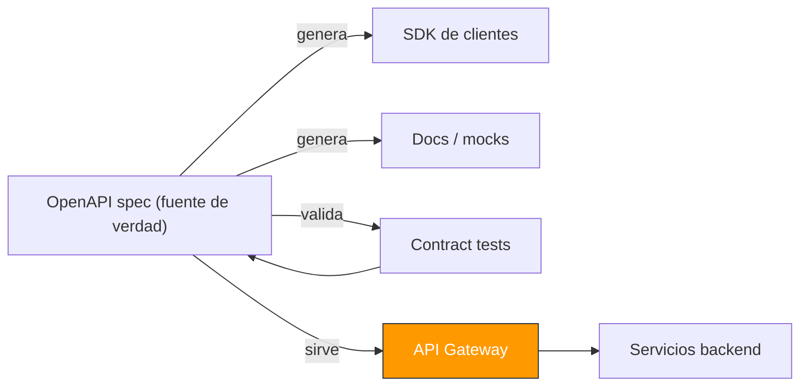
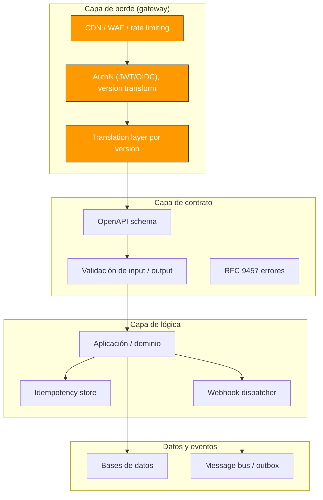
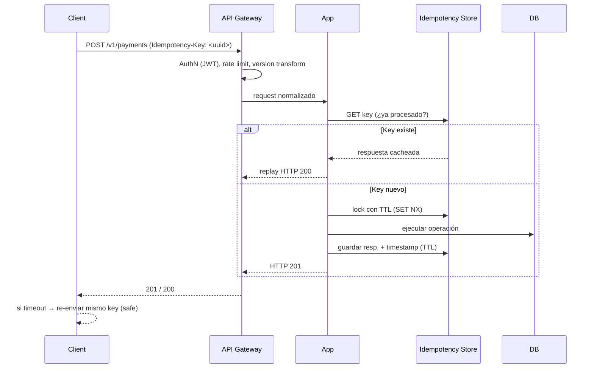
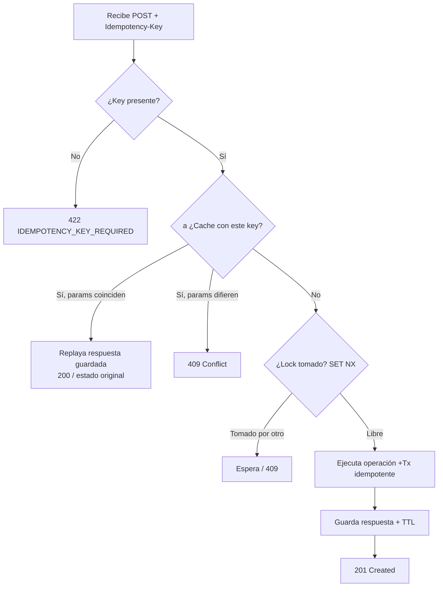
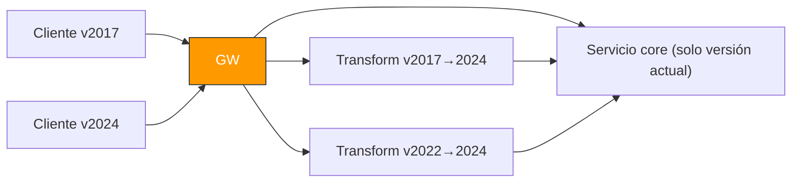

# Módulo 09 — Diseño de APIs (REST, GraphQL, Webhooks, versionado, idempotencia)

> **Nivel:** Senior. Una API no es "un conjunto de endpoints": es un **contrato** que otros equipos y terceros van a usar durante años, y del que dependerán la confianza (y el dinero) de tus consumidores. Este módulo cubre cómo modelar recursos, elegir el paradigma correcto (REST vs GraphQL vs gRPC), cómo hacer retries **seguros** con idempotencia, cómo versionar sin romper a nadie, y cómo entregar webhooks que no fallen en producción.
>
> **Conexiones:** se apoya en [Módulo 01](01-Arquitectura-de-Software-Moderna.md) (arquitectura y contractos), [Módulo 02](02-Microservicios-y-DDD.md) (API-Based Collaboration y bounded contexts), [Módulo 03](03-Event-Driven-Architecture.md) (eventos, delivery semantics, outbox), [Módulo 05](05-Bases-de-datos-distribuidas.md) (paginación e índices), [Módulo 08](08-Seguridad.md) (authN/authZ de la API) y [Módulo 07](07-Observabilidad.md) (request-id y telemetría).

---

## Introducción

El mejor momento para invertir en el diseño de una API es **antes** de que exista el primer consumidor. Un senior entiende que las decisiones de contrato (nombres, formas, códigos de error) se pagan o se cobran _durante años_: una vez que un tercero depende de `GET /orders`, quitar un campo o cambiar un código de error es caro y muchas veces imposible.

La postura correcta la resumen los propios proveedores:

> _"When a client sees a failure, it can ensure convergence of its own state with the server's by retrying, and continue to retry until it verifiably succeeds."_ — _Stripe Engineering_, "Designing robust and predictable APIs" (2017)

Eso es diseño de APIs, en una frase: dar a los clientes la capacidad de **converger a un estado correcto de forma retryable**. No se trata de adivinar el futuro, sino de construir un contrato que _tolere_ el futuro: que soporte evolución sin breaking changes, retries sin efectos duplicados, y errores que un cliente pueda interpretar programáticamente.

En 2026, gran parte de lo que antes era "gusto personal" ahora es **estándar publicado**: RFC 9457 para errores machine-readable, cursor-based pagination como normativa en APIs grandes, `Idempotency-Key` como práctica table-stakes en mutaciones, y versionado por aislamiento (header/date-based) en lugar de por URL. Este módulo te da el marco para decidir _cuándo_ cada paradigma es el correcto y _cómo_ implementarlo a nivel senior.

---

## Conceptos

### Terminología que debes dominar

- **REST (Representational State Transfer):** estilo arquitectónico basado en **recursos** (sustantivos) y verbos HTTP. Stateless por request; cacheable; recursos con representaciones uniformes.
- **Resource:** una entidad nombrada (`orders`, `users/42`). El verbo va en el **método HTTP**, no en la URL.
- **GraphQL:** lenguaje de consulta + runtime. Un solo endpoint `POST /graphql` donde el **cliente** pide exactamente los campos anidados que necesita (elimina over-/under-fetching).
- **gRPC:** RPC de alto rendimiento sobre HTTP/2 con **Protobuf** (binario). Ideal para comunicación _service-to-service_ y streaming.
- **Webhook:** el **servidor** llama a la URL del cliente (reversa del request-response). Entrega asíncrona de eventos/notificaciones.
- **Idempotencia:** una operación que puede ejecutarse **muchas veces** con el mismo resultado que una sola vez. `GET`, `PUT`, `DELETE` son idempotentes por HTTP; `POST` NO, por eso necesita `Idempotency-Key`.
- **Idempotency-Key:** valor (UUID) que el cliente envía en mutaciones; el servidor guarda el resultado y lo **replaya** si el mismo key llega de nuevo.
- **Versionado:** mecanismo para **aislar** cambios rupturistas de los clientes que aún no están listos.
- **Contract-first / OpenAPI-first:** el spec (OpenAPI 3.x) es la **fuente de verdad**; los clientes/SDKs se generan a partir de él.
- **N+1 / over-/under-fetching:** problemas de cantidad de datos transferidos y de llamadas.
- **RFC 9457 (Problem Details):** formato estándar `application/problem+json` para errores, con campos `type`, `title`, `status`, `detail`, `instance`.

### Criterios de decisión de paradigma (el corazón del módulo)

"No uses X porque es tendencia" — usa la decisión guiada por **quién consume, qué datos necesita, y dónde está el cuello de botella**:

| Pregunta                                                 | REST                       | GraphQL                          | gRPC                                |
| -------------------------------------------------------- | -------------------------- | -------------------------------- | ----------------------------------- |
| ¿Clientes externos diversos, CDN/cacheo crítico?         | ✅ (cacheable universal)   | ⚠️ (POST único rompe HTTP cache) | ❌ (no cacheable sin capa propia)   |
| ¿Front-end con necesidades de datos muy variables / BFF? | ⚠️ (chatty, over-fetching) | ✅ (precisión en 1 round-trip)   | ❌                                  |
| ¿Alto throughput interno service-to-service, streaming?  | ⚠️                         | ❌                               | ✅ (Protobuf + HTTP/2 multiplexing) |
| ¿Simple, rápido de arrancar, equipo sin experiencia?     | ✅                         | ⚠️                               | ❌                                  |
| ¿Seguridad/autorización a nivel de campo?                | ⚠️                         | ✅ (más natural)                 | ⚠️                                  |

**Regla de oro senior (2026):** _default a REST_ para API pública/partner; _añade GraphQL_ cuando el front-end esté bloqueado pidiendo nuevas formas o haya clientes con necesidades muy distintas (móvil vs desktop); _añade gRPC_ cuando el profiling muestre que la comunicación interna es el cuello de botella. Lo común en producción es una **arquitectura híbrida**: REST público + GraphQL/tRPC en el front propio + gRPC interno, traducido en el API Gateway.

---

## Arquitectura

### El contrato como fuente de verdad (OpenAPI-first)

El spec es el **contrato**: se escribe primero, se versiona en Git, y de él se generan clientes, SDKs, mocks y tests de contrato (ver Módulo 12 para CI). Un cambio en el spec es un _breaking change_ y debe tratarse como tal.



### Modelo de capas de una API moderna



### Anatomía de un request robusto (REST)



**La clave del diseño:** el cliente puede retry **indefinidamente y con seguridad** porque el servidor, ante el mismo `Idempotency-Key`, responde lo ya computado. Eso convierte un error que es _ambiguo_ ("¿se cobró o no?") en un error que es _convergentemente seguro_.

---

## Internals

### Cómo funciona la idempotencia por dentro (y su trampa)

Stripe la define como el estándar de la industria. Detalles que la distinguen de un "hash":

1. **Clave:** cliente genera un UUID (o string ≤ 255 chars) y lo manda en `Idempotency-Key`.
2. **Scope:** la cache se keya por `(account_id, idempotency_key)` — mismo key para distintos recursos no colisiona.
3. **TTL:** se guarda la respuesta por **24h** (o tu ventana máxima de retry). En Redis con persistencia (AOF) para sobrevivir reinicios.
4. **La trampa:** solo se cachea el resultado **después** de que la ejecución comienza. Un request que falla la validación **NO** se sirve desde cache — porque cachearlo impediría al cliente corregir el input y reintentar bajo el mismo key. El patrón: validar primero; si inválido → `400` y _no_ cachear; si la operación está en curso → devolver/esperar.
5. **Concurrencia:** se usa un **lock distribuido** (`SET key "processing" NX EX ttl`) para que dos requests con el mismo key no ejecuten la operación dos veces en paralelo.
6. **Guard contra ambigüedad:** si un mismo key llega con un **body distinto**, se rechaza con `409` — evita el caso de "cliente con lógica rota".



**Por qué el lock distribuido + TTL es clave:** si dos replicas procesan el mismo key a la vez, ambas podrían ejecutar el cobro. El `NX` garantiza que solo una "gana" el procesamiento; la otra espera o replaya.

### Idempotencia por método HTTP (semántica)

- **`GET`, `HEAD`, `OPTIONS`:** idempotentes y seguros (sin efectos secundarios) — cacheable.
- **`PUT` / `DELETE`:** idempotentes por diseño. `PUT` con el mismo body converge; `DELETE` de un recurso inexistente puede ser `404` repetido sin corromper estado.
- **`POST`:** NO es idempotente → **requiere `Idempotency-Key`** en toda mutación que cree o modifique algo que sea costoso de deshacer/comensar (pagas, órdenes, cuentas).

Regla práctica: _todo `POST` que cree/modifique y duplique sería doloroso de compensar debe tener idempotencia._ Pagos y órdenes siempre; creación de cuenta normalmente; notificaciones opcionalmente (duplicar un email es molesto, no catastrófico).

### Paginación: cursor vs offset

- **Offset (`?page=2&limit=20`):** simple, pero colapsa con `OFFSET 100000` (la BD escanea y descarta filas en cada request) y da resultados **erráticos** si se insertan/borran filas entre requests (duplicados o huecos).
- **Cursor (`?cursor=<opaque>&limit=20`):** clave en un identificador **estable** (`WHERE id > :cursor ORDER BY id LIMIT clinic21`). Escala linealmente, es consistente ante inserciones, y el cursor es opaco (base64) — el cliente no lo decodifica. El precio: pierdes el salto aleatorio a una página concreta. Con `LIMIT limit+1` detectas `has_more`.

**Regla senior:** cursor-based como default en list endpoints bajo carga; offset solo para paneles pequeños que necesiten saltar de página.

### Errores: RFC 9457 (Problem Details)

Estándar publicado en 2023 (sucede a RFC 7807), media type `application/problem+json`, para que los clientes puedan **ramificar programáticamente** sobre un tipo estable, no sobre texto libre:

```json
{
  "type": "https://api.orders.com/errors/insufficient-funds",
  "title": "Insufficient funds",
  "status": 402,
  "detail": "The card has insufficient balance for this charge.",
  "instance": "/v1/charges/ch_123",
  "code": "card_declined" // discriminator accionable (estilo Stripe)
}
```

Campos base: `type` (URI estable), `title`, `status` (HTTP), `detail` (humano), `instance` (URI del recurso afectado). Añade un `code` interno accionable. **Nunca** devuelvas strings ad-hoc en el `body` ni `status` engañosos (`200` con error o `500` siempre).

### Versionado: versión ≠ número, es aislamiento

La discusión "v1, v2 o fecha" pierde la pregunta real: **cómo aíslas un breaking change de los clientes que aún no están listos**.

- **Versión por URL (`/v1/users`):** tradicional, muy visible, pero multiplica árboles de URLs y fuerza a mantener rutas para siempre.
- **Versión por header (`Accept: application/vnd.api.v2+json`) o `X-API-Version`:** mismo URL siempre; nuevo default se actualiza en config sin redeploy; GitHub usa `X-GitHub-Api-Version`. El costo: menos descubribilidad.
- **Date-based + pinning (Stripe):** cada cuenta queda **fijada** a la versión activa cuando se creó (o sube explícitamente); se puede overridear por request (`Stripe-Version: 2024-04-10`). Stripe ha lanzado ~100 versiones incompatibles desde 2011 **sin romper a nadie**.
- **Translation layer (la clave de Stripe):** el _core_ solo habla la versión más reciente; cada breaking change es un pequeño \*_módulo_/ de transformación que convierte respuestas viejas hacia atrás para clientes legacy. Esto evita que el `if version` se esparza por la lógica de negocio.



**Deprecación machine-readable** (RFC 8594 / headers IANA): `Deprecated: true` + `Sunset: <RFC1123 date>` para avisar clientes programáticamente, con un mínimo de 6–12 meses de aviso (estándar Zalando).

---

## Patrones

### Patrón 1: Resource-Oriented REST (sin verbos en la URL)

Sustantivos en plural, verbo en el método. `POST /orders`, `GET /orders/{id}`, `PUT /orders/{id}`, `DELETE /orders/{id}`. Para acciones no-CRUD: sub-recursos o el estilo Google con `:` — `POST /v1/videos:process` en lugar de `/processVideo`. No reflejes tablas de BD en el path.

### Patrón 2: Idempotency Key (Stripe-style)

`Idempotency-Key` en `POST`, lock `SET NX`, cache de respuesta con TTL, replay en duplicado, `409` ante mismatched body, `422` si falta key en mutación. Ver Internals.

### Patrón 3: Cursor-based pagination

`?cursor=<opaque>&limit=N`, `has_more` con `LIMIT limit+1`, índice ordenado por la key del cursor. Opaque y estable.

### Patrón 4: Problem Details (RFC 9457) + códigos accionables

Formato de errores estándar + `code` interno. Clients ramifican por `type`/`code`, jamás por texto. `instance` apunta al request id para correlación (Módulo 07).

### Patrón 5: Versioning por aislamiento + translation layer

Core habla solo la última; módulos de transform retro-compatibles; pinning por cuenta; header `Accept`/`X-API-Version`. Deprecación con `Sunset`.

### Patrón 6: Webhooks confiables (ver recuadro)

Retry con backoff exponencial, firma HMAC-SHA256 + timestamp (anti-replay), `10.10` payloads ofuscadas, endpoint mortal, manejadores idempotentes y tolerantes a out-of-order.

### Patrón 7: API Gateway como frontera uniforme

Todo lo transversal vive en el gateway: rate limiting con `Retry-After`, autenticación, WAF, requests-id (`X-Request-Id`), version transform. La app se mantiene limpia de ese cruce (conecta con Módulo 04).

### Patrón 8: Contract-first / OpenAPI 3.x

El spec es la fuente de verdad; se validan inputs/outputs contra el schema (rechaza campos extra/desconocidos), se generan SDKs y mocks. Cambiar el spec = breaking change.

---

## Casos reales

1. **Stripe — idempotencia y versionado.** Ha procesado cientos de miles de millones de dólares y **no ha roto compatibilidad desde 2011**. Idempotency-Key en todos los `POST`, cache por `(account, key)` con 24h de TTL, versionado date-based pinning con translation layer. Lección: las dos prácticas —retries seguros y aislamiento de versiones— son las que sostienen una API pública de confianza.
2. **GitHub — versionado por header.** `X-GitHub-Api-Version` con date-based, en vez de URL `/v2`. Muestra cómo mantener un solo árbol de rutas y versionar por header para servicios usados por millones de integraciones.
3. **N+1 en GraphQL mal usado.** Equipos que migraron a GraphQL "por moda" y heredaron _resolvers ineficientes_ y N+1 queries (el paso a N+1 severo que nunca tenían en REST). Lección del caso bióquro/2026: adoptar GraphQL sin que el caso de uso (variabilidad de datos del cliente) lo exija produce complejidad pura. Datloader como mitigación si lo usas.
4. **Webhooks duplicados/out-of-order.** Integradores que reprocesan eventos duplicados o fuera de orden y corrompen estado. Lección: handlers idempotentes y basados en **estado** (event-sourced), ignorar `updated` de una entidad que aún no existe y reprocesar cuando llegue el `created`.
5. **Offset pagination en producción.** APIs que con `page=500&limit=20` degradan la BD (escaneo y descarte de miles de filas) y dan páginas inconsistentes entre requests. Lección: cursor-based como default bajo carga.

---

## Laboratorio

1. **Idempotency-Key end-to-end:** implementa (con Redis) un `POST /v1/charges` que: `SET key processing NX EX 60`, ejecuta el cobro, guarda la respuesta con TTL 24h, replaya en duplicado y `409` si el body difiere. Prueba con `curl` el retry tras un timeout simulado.
2. **Cursor vs offset:** con una tabla de ~1M filas, compara `EXPLAIN ANALYZE` de `OFFSET 100000` vs `WHERE id > :cursor`. Mide la degradación.
3. **RFC 9457:** reemplaza tu handler de errores por `application/problem+json` con `type`/`code`. Añade `X-Request-Id` y correlaciona con logs (Módulo 07).
4. **Transpilation de versión:** monta un _core_ que solo habla `v2` y un módulo de transform que convierta respuestas `v1` → `v2`; una sola ruta de URL con header de versión.
5. **Firma de webhook:** calcula `HMAC-SHA256(secret, raw_body)` con `X-Signature` y timestamp; rechaza firmas inválidas y timestamps viejos (> 5 min) para anti-replay.
6. **Contract test:** escribe un spec OpenAPI como fuente de verdad y valida que las respuestas reales cumplen el schema (falla el build si un campo cambia) — conecta contí con el Módulo 12.

---

## Entrevistas

1. **"¿Cómo harías una operación de pago `POST` segura para retry en un entorno distribuido?"**

   **Orientación:** busca que el candidato resuelva el problema _ambiguo_ del doble cobro con idempotencia, y que distinga validación vs ejecución.

   **Respuesta de un senior:** uso un `Idempotency-Key` (UUID) que el cliente manda en cada `POST`. El servidor lo guarda como "processing" con un `SET NX` y TTL (lock distribuido contra duplicados concurrentes); ejecuta la operación y guarda la respuesta con TTL (24h, en Redis con persistencia). Si llega el mismo key de nuevo, **replay la respuesta guardada** en vez de cobrar otra vez — así el cliente puede retry un timeout indefinidamente y converger sin doble cargo. Detalles que importan: no cacheo requests que **fallan validación** (para permitir corregir input y reintentar bajo el mismo key), `409` si el mismo key llega con body distinto, y `422` si falta la key. Además hago el guardado de la operación **idempotente** en la BD (constraint único en el key) como respaldo ante caída de Redis.

2. **"REST vs GraphQL vs gRPC — ¿cuándo usarías cada uno?"**

   **Orientación:** el candidato debe pasar de "qué es mejor" a "quién consume y dónde está el cuello de botella". Puntos fuertes: reconocer el uso híbrido.

   **Respuesta de un senior:** depende de los trade-offs que quiero. **REST** lo uso por default en API pública/partner: es cacheable (clave para CDN) y universal, y si el problema es servir datos iguales a millones con un CDN, es la única opción real. **GraphQL** cuando el front-end está bloqueado pidiendo formas variadas o hay clientes muy distintos (móvil vs desktop): el cliente pide exactamente lo que necesita en un round-trip, eliminando over-/under-fetching; el costo es complejidad de schema, caching difícil (un solo POST rompe HTTP cache) y riesgo de N+1 en resolvers. **gRPC** para comunicación interna service-to-service de alto throughput: Protobuf binario es 5–10× más rápido de parsear y HTTP/2 multiplexa; pero pierde HTTP caching y requiere curva de aprendizaje. Lo normal es **híbrido**: REST externo, GraphQL en el front propio, gRPC interno, con traducción en el gateway.

3. **"¿Cómo versionas una API sin romper a los consumidores existentes?"**

   **Orientación:** quiere ver que el candidato entiende versionado como _aislamiento_, y que conoce más allá del `/v1/`.

   **Respuesta de un senior:** lo importante es separar el breaking change de los clientes que aún no migran. Prefiero **versionado por header** (`Accept` vendored type o `X-API-Version`) o **date-based con pinning** como Stripe en vez de `/v1/` en la URL, para no duplicar árboles de rutas para siempre. La arquitectura clave es un **translation layer**: el core solo habla la última versión, y cada breaking change es un pequeño módulo de transformación que convierte respuestas viejas hacia atrás; así evito que los `if version` se esparzan en el dominio. Deprecación machine-readable con `Sunset` y `Deprecated: true`, avisando 6–12 meses. El /vN/ simple solo si mis consumidores son scripts que no soportan headers.

4. **"¿Cuál es la diferencia entre offset y cursor pagination? ¿Cuándo usarías cada una?"**

   **Orientación:** evalúa si sabe del cliff de rendimiento de offset y la consistencia de cursor bajo inserciones.

   **Respuesta de un senior:** offset (`page=2&limit=20`) es simple y permite salto aleatorio, pero colapsa bajo carga: `OFFSET 100000` hace que la BD escanee y descarte 100k filas en cada request, y además da resultados erráticos si se insertan filas entre requests (duplicados o huecos). Cursor (`?cursor=<opaque>`) keya en un identificador **estable** con `WHERE id > :cursor ORDER BY id LIMIT n+1`; escala linealmente, es consistente ante inserciones y la key es opaca. Uso cursor como default en list endpoints bajo carga; offset solo para paneles pequeños que necesiten saltar a una página específica.

5. **"¿Cómo diseñas los errores de una API para que los clientes los manejen bien?"**

   **Orientación:** busca el estándar RFC 9457 y la idea de "discriminador accionable" — no strings ad-hoc.

   **Respuesta de un senior:** sigo **RFC 9457** (`application/problem+json`): campos `type` (URI), `title`, `status`, `detail`, `instance`, más un `code` interno accionable. El objetivo es que un cliente pueda **ramificar programáticamente** sobre un `type`/`code` estable, no hacer string-matching de mensajes. Mantengo coherentes los códigos HTTP (4xx vs 5xx), pongo `instance` con el `X-Request-Id` para correlacionar con logs, y uso `Retry-After` en `429` y errores temporales (5xx) para que el cliente sepa si puede reintentar y cuándo. Nunca mezclo "200 con error" ni expongo detalles internos en `detail`.

6. **"¿Qué es un webhook y cómo lo harías confiable? ¿Cuál es el problema de los retries?"**

   **Orientación:** quiere que el candidato piense en reversa del pull (push), entrega asíncrona, retry con backoff, firma y handlers idempotentes y tolerantes a out-of-order.

   **Respuesta de un senior:** un webhook es push: el servidor llama a la URL del cliente cuando sucede un evento, a diferencia del pull. Para que sea confiable: **retry con backoff exponencial + jitter** y una cola de dead letters; **firma HMAC-SHA256** del body + timestamp para que el integrador verifique autenticidad y rechace replays (`X-Webhook-Signature`); manejo idempotente en el cliente (debounce del mismo `event_id`); y handlers **order-independent** o una máquina de estados que tolere out-of-order (ignorar un `updated` de algo que aún no existe y reprocesarlo cuando llegue el `created`). Y del lado servidor, no "fire-and-forget": registro, retry y observabilidad.

7. **"¿Cómo calculas un `Idempotency-Key`? ¿Qué guardas y por cuánto tiempo?"**

   **Orientación:** evalúa los detalles de implementación: scope, TTL, la trampa de cachear validaciones, y el respaldo en BD.

   **Respuesta de un senior:** el cliente genera un UUID por operación lógica única. El servidor guarda, keyado por `(account_id, idempotency_key, endpoint)`, el **estado** (`processing` o `done`) y la **respuesta final**, con un TTL que cubra tu ventana máxima de retry (Stripe usa 24h). No cacheo requests que **fallan validación** — si la validación pasa y la operación se ejecuta, ahí sí cacheo; esto evita un error común que rompe la lógica de retry. Ante concurrencia usamos un lock `SET NX` y, como respaldo de seguridad, un constraint único en BD sobre el key para que aunque caiga Redis no haya doble ejecución.

8. **"¿Qué ventajas y riesgos tiene un contrato OpenAPI-first? ¿Cómo lo mantienes como fuente de verdad?"**

   **Orientación:** quiere que discrimine entre "docs" y "contrato", y su rol en generación, validación y tests.

   **Respuesta de un senior:** la ventaja es que el spec deja de ser documentación y se convierte en **fuente de verdad**: de él genero SDKs, mocks, docs y **contract tests**, y valido inputs/outputs en runtime contra el schema (rechazando campos desconocidos/extra). El riesgo es el desfase spec↔implementación: por eso lo versiono en Git, valido en CI, y considero _cualquier cambio de spec un breaking change_ (se revisa como tal). OpenAPI 3.1 alineado con JSON Schema 2020-12; miro 3.2 si necesito features nuevas. El gateway y los tests se generan del spec, así ambos no pueden divergir.

9. **"¿Cómo protegerías una API pública de abuso y de sobrecarga? ¿Qué headers devolverías?"**

   **Orientación:** evalúa borde/rate limiting en el gateway (no en app), y los headers estándar `Retry-After` / `X-RateLimit-*`.

   **Respuesta de un senior:** pongo **rate limiting en el gateway**, no en código de aplicación (API Gateway, Kong, nginx). Estrategias: fixed window (simple), sliding window (precisa) o token bucket (permite ráfagas); agrego WAF/DDoS en el borde y auth en la frontera. Devuelvo `429 Too Many Requests` con `Retry-After` para que el cliente haga backoff, y headers informativos `X-RateLimit-Limit`, `X-RateLimit-Remaining`, `X-RateLimit-Reset`. Para evitar duplicados por retry agresivo, combino con idempotencia. Y expongo `Retry-After` también en 5xx temporales cuando sea seguro reintentar.

10. **"¿Cómo decides si una operación interna service-to-service debe ser REST, gRPC o evento (mensajería)?"**

    **Orientación:** evalúa el cruce con DDD y Event-Driven: cuándo *colo\_, cuándo *event\*, y cuándo gRPC. Un senior no usa siempre el mismo primitivo.

    **Respuesta de un senior:** depende del acoplamiento y del flujo. Si es una **consulta** síncrona y de alto throughput donde el rendimiento importa, uso **gRPC** (Protobuf + multiplexing). Si es una **operación de comando** síncrona y simple, REST con idempotency. Y si lo que quiero es **desacoplar en el tiempo** (el productor no debe esperar al consumidor, o hay múltiples consumidores), mando un **evento** a un bus con outbox/at-least-once y entrego por webhook/delivery — es el patrón correcto para eventual consistency (Módulo 03). La regla: usa síncrono (REST/gRPC) cuando necesitas la respuesta hoy; usa eventos cuando quieres acoplamiento débil y tolerancia a fallos; encaja con API-Based Collaboration de DDD.

---

## Checklist

- [ ] ¿Modelo los recursos como sustantivos y uso el método HTTP como verbo (sin verbos en la URL)?
- [ ] ¿Elegí el paradigma según el consumidor y el cuello de botella (y justifiqué el híbrido si aplica)?
- [ ] ¿Todo `POST` que crea/modifica algo costoso de compensar tiene `Idempotency-Key`?
- [ ] ¿Mi idempotencia tiene lock `SET NX`, replay, TTL y no cachea requests de validación fallida?
- [ ] ¿Uso cursor-based pagination en list endpoints bajo carga?
- [ ] ¿Mis errores siguen RFC 9457 con `type`/`code` accionable y `instance` = request-id?
- [ ] ¿Versiono por aislamiento (header/date + translation layer) y tengo deprecación con `Sunset`?
- [ ] ¿Mis webhooks firman el payload (HMAC + timestamp), retry con backoff y specan handlers idempotentes?
- [ ] ¿Mi spec OpenAPI es la fuente de verdad (contract-first) y valida inputs/outputs en runtime?
- [ ] ¿El gateway centraliza rate limiting (`Retry-After`), authN, WAF y request-ids?

---

## Referencias

- **Stripe Engineering** — "Designing robust and predictable APIs" (2017) `stripe.com/blog/idempotency` y "APIs as infrastructure: future-proofing Stripe with versioning" (2017) `stripe.com/blog/api-versioning`; Stripe API Reference — _Idempotent requests_.
- **RFC 9457** — _Problem Details for HTTP APIs_ (2023, sucede a RFC 7807), IETF.
- **RFC 9110** — HTTP Semantics; **RFC 8594** — _Location: The Sun API_ (deprecación `Sunset`); **RFC 9745** — webhooks.
- **OpenAPI Initiative** — OpenAPI Specification 3.1 / 3.2 (spec-first, JSON Schema 2020-12).
- **Google AIP** (API Improvement Proposals) — AIP-190, custom methods, design guidance.
- **Microsoft Azure** — REST API guidelines (naming, URI depth, versionado).
- **Zalando RESTful API Guidelines** — errores, deprecación (6–12 meses), paginación.
- **GraphQL / Apollo** — schema-first, DataLoader y mitigación de N+1.
- **gRPC docs** — Protobuf, HTTP/2 streaming, patrones service-to-service.
- _Designing Web APIs_, B. Mulloy / _The Design of Web APIs_, A. Lau (referencia de diseño).
- [Módulo 01](01-Arquitectura-de-Software-Moderna.md), [Módulo 02](02-Microservicios-y-DDD.md), [Módulo 03](03-Event-Driven-Architecture.md), [Módulo 05](05-Bases-de-datos-distribuidas.md), [Módulo 07](07-Observabilidad.md), [Módulo 08](08-Seguridad.md), [Módulo 12](12-CI-CD-moderno.md).

---

> _Más profundidad e implementaciones de referencia en el [**Apéndice A**](appends/09-Diseño-de-APIs-Apendice-A.md)._
