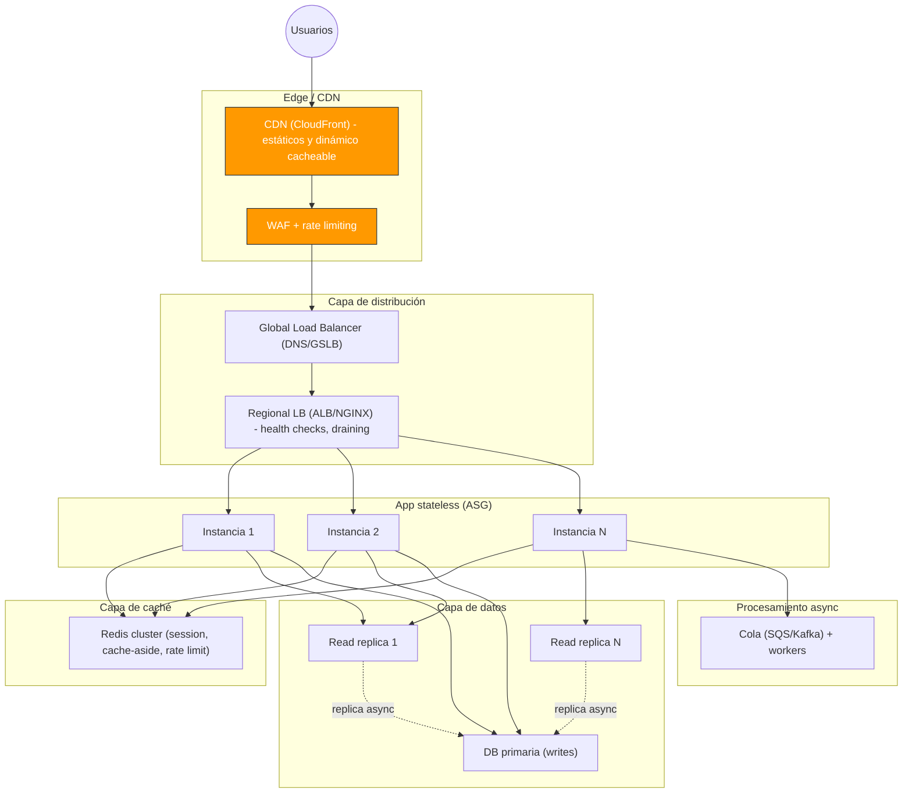
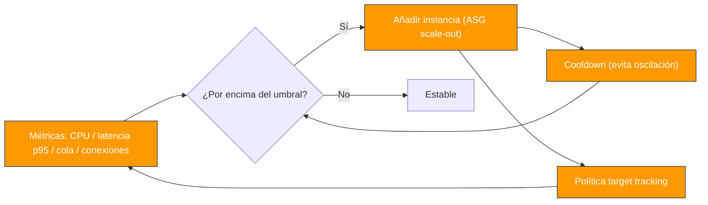
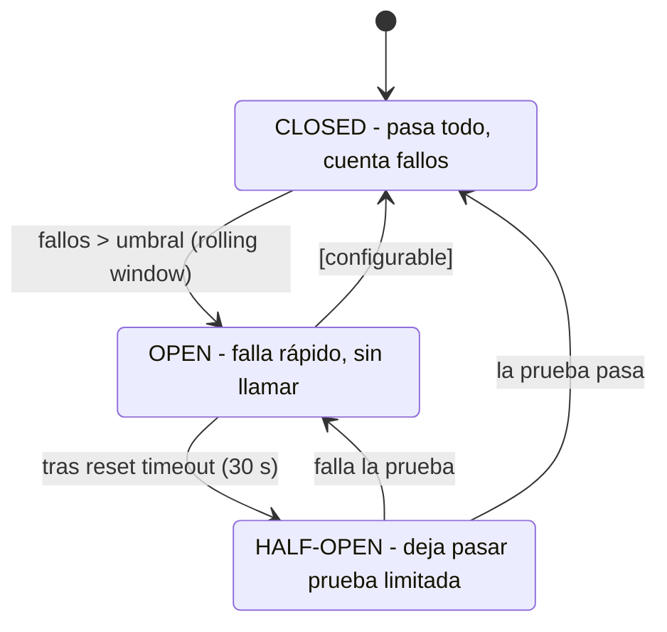

# Módulo 10 — Escalabilidad, Performance y Resiliencia

> **Nivel:** Senior. Este módulo responde a las dos preguntas que definen un sistema de millones de usuarios: **¿cómo aguanta más carga?** (escalabilidad y performance) y **¿cómo sigue funcionando cuando las cosas fallan?** (resiliencia). No es un listado de herramientas: es la lógica de _cuándo_ y _por qué_ aplicar cada patrón, y los trade-offs que eso impone. El hilo conductor es el mismo de siempre: **las fallas son el estado normal de un sistema distribuido**, y el diseño decide si se propagan o se contienen.
>
> **Conexiones:** se apoya en [Módulo 01](01-Arquitectura-de-Software-Moderna.md) (arquitectura, trade-offs, las 3 fuentes de fallo), [Módulo 03](03-Event-Driven-Architecture.md) (asincronía, delivery semantics), [Módulo 04](04-AWS-Serverless.md) (auto-scaling serverless), [Módulo 05](05-Bases-de-datos-distribuidas.md) (sharding, CAP, consistencia — que aquí **no se repiten**, solo se referencian), [Módulo 07](07-Observabilidad.md) (SLOs, medición) y [Módulo 09](09-Diseño-de-APIs.md) (idempotencia que hace seguros los retries, rate limiting de borde).

---

## Introducción

Escalar no es "comprar más servidores": es **remover el cuello de botella que limita el crecimiento, en el orden correcto, sin romper lo que ya funciona**. Un senior sabe que el 90% del camino a millones de usuarios es arquitectura _simple pero disciplinada_ — stateless detrás de un load balancer, cache, replicas de lectura — y que la complejidad (sharding, multi-región, particionado) solo se justifica cuando los datos o la escritura la exigen. La metáfora del _The DevOps Handbook_ aplica aquí: la capacidad es un **flujo**, y un solo paso lento determina el throughput de todo el sistema (cuello de botella de Teoría de Restricciones).

Y en paralelo, **la resiliencia es una propiedad de diseño, no un accidente**. Michael Nygard (_Release It!_) lo popularizó: _continuing to call a failing service is often worse than failing fast_. La cascada clásica — un servicio lento agota los thread pools del que lo llama, que agota a sus llamadores, y el sistema colapsa por una sola dependencia — es evitable con tres familias de patrones: **contener el fallo** (circuit breaker, bulkhead, timeout), **no amplificarlo** (retry con backoff + jitter, no retry storms) y **degradar con gracia** (fallbacks, carga programada).

> _"Failure isn't a question of if, but when. Designing for failure isn't pessimism — it's pragmatism."_ — consenso de ingeniería de resiliencia (Netflix, AWS, Google).

---

## Conceptos

### Terminología que debes dominar (y distinguir)

- **Escalabilidad:** capacidad del sistema de aumentar su throughput o soportar más usuarios agregando recursos. No es lo mismo que _performance_: puedes tener un sistema lento pero perfectamente escalable, y uno rápido que no escala.
- **Escalado vertical (scale up):** más CPU/RAM/disco en la **misma** máquina. Simple, pero con tope físico y costo superlineal; y un solo punto de fallo.
- **Escalado horizontal (scale out):** **más máquinas** detrás de un load balancer. Prácticamente sin tope; exige **stateless** o estado externalizado.
- **Throughput:** cantidad de trabajo completado por unidad de tiempo (req/s, transacciones/s). En el mejor caso está limitado por el cuello de botella (Ley de Little: `L = λ × W`).
- **Latencia:** tiempo que tarda una operación. Se reporta con **percentiles** (p50, p95, p99, p999) — **nunca** con promedios, porque esconden la cola de fallas. "El promedio miente".
- **Tail latency:** la latencia de los percentiles extremos (p99.9). Es lo que percibe el usuario más lento, y la que amplifica la latencia con N llamadas en serie (Módulo 01).
- **Autoscaling:** agregar/remover capacidad automáticamente según métricas (CPU, latencia, cola). **Escalar por latencia, no por CPU**, como regla en 2026.
- **Stateless:** cada instancia puede atender cualquier request sin estado local que persista; el estado vive en un store externo (Redis, BD, S3). Es el prerequisito del escalado horizontal.
- **Caché:** capa de almacenamiento rápido (memoria) que evita recalcular/re-consultar datos calientes.
- **CDN:** red de caché _en el borde_ geográfico, que acorta la distancia física y descarga el origin (estático y, cada vez más, dinámico).
- **Backpressure:** mecanismo de control de flujo para que un productor más rápido que el consumidor no lo desborde.
- **Rate limiting:** límite explícito de requests por cliente/ventana; una forma _decisiva_ de backpressure.
- **Circuit breaker:** interrumpe las llamadas a una dependencia enferma para no gastar recursos en peticiones condenadas (fail fast).
- **Retry con backoff + jitter:** reintentar fallos _transitorios_ con espera exponencial y aleatorización para no crear retry storms.
- **Timeout:** límite temporal de una llamada; _el_ patrón que evita que una dependencia lenta agote recursos.
- **Bulkhead:** aislar recursos (thread pools, conexiones) por dependencia para que una no devore todo.
- **Graceful degradation / degradación elegante:** ante fallo, servir una versión reducida pero útil (fallback, dato cacheado, función deshabilitada).
- **Fault tolerance / tolerancia a fallos:** el sistema sigue operando (quizá degradado) ante fallos parciales, y se recupera sin intervención.
- **Chaos engineering:** disciplina de _probar_ la resiliencia inyectando fallos controlados en producción.
- **CAP:** consistencia / disponibilidad / tolerancia a partición; solo 2 de 3 ante partición. Tratado en detalle en [Módulo 05](05-Bases-de-datos-distribuidas.md).

### Escala vertical vs horizontal (la decisión)

|                           | Vertical (scale up)                                         | Horizontal (scale out)                               |
| ------------------------- | ----------------------------------------------------------- | ---------------------------------------------------- |
| Cambio                    | Más recursos en la misma máquina                            | Más máquinas / instancias / pods                     |
| Tope                      | Sí, físico (y de licencia)                                  | Prácticamente ninguno                                |
| Costo                     | Superlineal (máquinas enormes son carísimas)                | Lineal aproximado                                    |
| Alta disponibilidad       | Requiere redundancia separada                               | Inherente (múltiples nodos)                          |
| Estado                    | Fácil (todo en una máquina)                                 | Difícil → exige stateless + estado externalizado     |
| Comportamiento bajo fallo | Caída total                                                 | Degradación parcial (si N-1 sobreviven)              |
| Cuándo                    | Datos pequeños, arranque, stateful inevitable (BD primaria) | **El default para workloads stateless y para reads** |

**Regla senior:** vertical scale cuando es barato y suficiente (arranque, BD primaria con carga contenida); horizontal donde la carga es predecible y crece (app servers, replicas de lectura). La pirámide clásica (2026): _vertical mientras sea barato → horizontal cuando sea necesario → sharding cuando el volumen de datos/escritura lo exija_.

### Latencia vs throughput (y la Ley de Little)

- `L = λ × W` (Ley de Little): la cantidad de requests _en vuelo_ es igual a la tasa de llegada por el tiempo que cada una pasa en el sistema. Implicación práctica: para reducir el número de requests en el sistema (y por tanto la presión de memoria), o bajas la latencia (`W`) o bajas la tasa (`λ`, con backpressure/rate limiting).
- Con N llamadas síncronas en serie, la latencia efectiva es la **suma** de los percentiles. Con 100 servicios en serie, si cada uno tiene p99 = 100 ms, el p99 total es ~10 s. Por eso: paralelismo, asincronía, y acotar la cadena síncrona (Módulo 01).
- Un request que usa **1 s de CPU** en una máquina de **1 core** no puede procesar más de 1 req/s en ese core; para 1000 req/s necesitas 1000 cores _efectivos_ de ese recurso — el cálculo de capacidad por _recurso dominante_ (CPU, I/O, memoria).

---

## Arquitectura

### La anatomía de un sistema escalable a millones



**Cada capa existe para resolver un problema específico:**

1. **CDN:** acorta la latencia geográfica y descarga el origin (~80% de los assets estáticos).
2. **Load balancer:** distribuye y **detecta** instancias muertas (health checks) y drena conexiones antes de dar de baja.
3. **App stateless:** escala horizontalmente sin coordinar estado.
4. **Caché (Redis):** absorbe las lecturas calientes antes de tocar la BD.
5. **Read replicas:** separan el tráfico de lectura del primario.
6. **Colas:** sacan el trabajo lento del request path y absorben ráfagas.
7. **Sharding (cuando toca):** distribuye datos/escrituras (referencia: Módulo 05).

### La transición por capas a medida que creces

```
1 máquina → app + BD juntas
10³ users → stateless app + Redis + read replicas
10⁴ users → ASG automático, CDN completo, colas para todo lo async
10⁵ users → sharding de escritura, multi-región con GSLB, SLOs explícitos
10⁶ users → particionado global, event-driven, equipo de infra dedicado
```

La disciplina del senior: **no adelantar complejidad** — el _premature sharding_ es un error carísimo ("muchos equipos shardean a un décimo de la carga donde scale-up + replicas les hubiera alcanzado dos años más").

### Autoscaling: escalar por latencia, no por CPU



Reglas clave de 2026:

- **Scale por latencia p95/p99** (métrica que refleja la experiencia del usuario) antes que por CPU (que no captura espera en I/O ni colas). AWS _target tracking_ hace esto por ti.
- **Cooldown / warm-up:** evitar _thrashing_ (subir y bajar constantemente). Los contenedores/Lambdas tardan en "calentarse"; escala con margen, no al filo.
- **Schedule + reactive:** combina autoscaling _programado_ (picos conocidos, ej. venta Black Friday) con _reactivo_ (métricas). El reactivo solo no alcanza para picos explosivos.
- **Sobre-provisionar en eventos:** para picos previstos, provisiona capacidad por adelantado (ventas, lanzamientos) y deja que el autoscaling reactive ajuste lo fino.
- **Drenaje de conexiones (connection draining):** al dar de baja una instancia (deploy o scale-down), el LB espera 30–60 s a que terminen los requests en vuelo, evitando ráfagas de 502/503.

---

## Internals

### Cómo funciona el circuit breaker por dentro

Tres estados (inspirado en el breaker eléctrico), cada uno con umbrales configurados:



- **Closed:** todas las llamadas pasan; se cuentan fallos en una ventana deslizante (ej. 50% de fallos o 5 fallos en 10 s). Superado el umbral → **Open**.
- **Open:** todas las llamadas fallan **inmediatamente** sin tocar la dependencia (fail fast). Después del _reset timeout_ (ej. 30 s) pasa a **Half-Open**.
- **Half-Open:** deja pasar una **prueba limitada** de requests. Si pasan → **Closed** (recuperado). Si fallan → vuelve a **Open** con otro timeout.
- **Fallback:** cuando el circuito está abierto, la llamada devuelve un fallback (dato cacheado, respuesta degradada) en lugar de error — esto es lo que materializa la _graceful degradation_.

**Regla senior:** el breaker **no** reemplaza a retries/timeouts/bulkheads — los **coordina**. Retries para transitorios (con idempotencia, Módulo 09), breaker para dependencias _crónicamente_ enfermas, timeout para que nada se cuelgue, bulkhead para que una dependencia no devore recursos ajenos. Libraries: Resilience4j (JVM), Polly (.NET), Hystrix (deprecado), o a nivel de mesh (Istio `DestinationRule`).

### Retry con backoff + jitter (el anti-retry-storm)

- **Backoff exponencial:** espera `initial × base^attempt` (100 ms, 200, 400, 800…) entre intentos. Evita martillar un servicio que se está recuperando.
- **Jitter (aleatorización):** añade ruido (± 10–50%) a la espera. **Sin jitter, todos los clientes reintentan al mismo segundo** y crean una _retry storm_ que tira al servicio de nuevo — el "thundering herd" del retry. Con jitter, los reintentos se reparten.
- **Máximo de intentos:** 3–5, y **no** reintentar todo: solo errores _transitorios_ (5xx, timeouts, 429 con Retry-After). Un 400 o 404 no se arregla con retry.
- **Idempotencia como precondición:** un retry solo es seguro si la operación es idempotente (POST con Idempotency-Key, Módulo 09). Retry de un POST sin idempotencia = doble efecto.
- **Retry budgets (presupuesto de reintentos):** limita el número total de reintentos que el sistema puede disparar (ej. no más del 10% de requests con retry), para que un fallo no multiplique la carga global.

### Timeout management: la disciplina de los límites

- **Tres timeouts distintos:** conexión (connect), primer byte (read/response), y operación completa (request). Un solo timeout "generoso" no basta.
- **Timeout por llamada, no global:** cada dependencia tiene el suyo (el de una BD de 2 s no debe ser el mismo que el de un pago de 10 s).
- **Deadline propagation:** cuando llamas a un servicio con una cadena de dependencias, _pasa el deadline restante_ (contexto con timeout) para que la suma nunca supere el presupuesto total del request. Sin esto, 5 servicios × 30 s cada uno = 150 s en el peor caso, y el caller ya no está.
- **Timeouts + circuit breaker + bulkhead juntos:** el timeout limita el _tiempo_; el bulkhead limita los _recursos_; el breaker corta la _dependencia_.
- **Fallos de timeouts no son "rarezas":** un timeout que dispara fallback degrada la experiencia pero **mantiene el sistema vivo** — el objetivo es que una dependencia lenta no _derribe_ lo demás.

### Backpressure: controlar el flujo antes de que desborde

La metáfora del agua en una tubería: si el productor vierte más rápido de lo que el consumidor bebe, el desborde es inevitable. Estrategias:

- **Implícita (colas):** una cola finita entre productor y consumidor absorbe ráfagas; si crece, el productor empieza a ser rechazado (y a su vez a aplicar su propia política).
- **Explícita (reactive streams):** el consumidor le dice al productor _cuántos_ items puede aceptar (backpressure por demanda, ej. Reactive Streams, gRPC flow control).
- **Load shedding (descarga de carga):** ante sobrecarga, **rechazar** lo no esencial para proteger lo esencial (dropear requests de bajo valor, priorizar críticos). "Los servidores que dejan de aceptar trabajo son los que sobreviven".
- **Rate limiting:** límite _decisivo_ al flujo desde el borde.

**La relación:** backpressure es el _principio_; las colas, el rate limiting y el load shedding son sus _implementaciones_. Sin backpressure, la sobrecarga se traduce en latencia creciente y eventual OOM/caída (el "hockey stick" de latencia).

### Rate limiting por dentro (token bucket / sliding window)

- **Token bucket:** un bucket con `capacity` tokens que se recargan a `rate` por segundo. Permite **ráfagas** controladas (hasta `capacity`) — bueno para clientes legítimos. Redis: `INCR + EXPIRE` por ventana o `ZSET` para sliding window.
- **Fixed window:** simple (`X requests por minuto`), pero permite ráfagas en los bordes de la ventana (2× en el límite).
- **Sliding window:** más preciso (no hay ráfaga de borde), más estado (Redis `ZSET` de timestamps, o `sliding log`).
- **Distribuido:** con múltiples nodos el contador debe ser **compartido** (Redis) para no multiplicar el límite por instancia. El gateway (Módulo 09) es el lugar natural: `429` + `Retry-After` + `X-RateLimit-*`.
- **Rate limiting vs retry:** el cliente debe _respetar_ `Retry-After`; si no, sus retries se convierten en el abuso que intentamos evitar.

### Caché por capas (de la más rápida a la más lejana)

| Capa                 | Ejemplo                  | Velocidad      | Invalidación                    |
| -------------------- | ------------------------ | -------------- | ------------------------------- |
| 1. En-proceso (app)  | Caffeine, caché local    | ns–µs          | Difícil de propagar → TTL corto |
| 2. Distribuida       | Redis / Memcached        | µs–ms          | Explicita (DELETE) + TTL        |
| 3. BD cache          | Buffer pool, query cache | ms             | Automática del motor            |
| 4. CDN / edge        | CloudFront, Varnish      | ms (near user) | Purge + TTL                     |
| 5. Cliente / browser | HTTP cache headers       | 0 (local)      | `Cache-Control`, ETags          |

Patrones que importan (ver Apéndice A para implementación):

- **Cache-aside (lazy):** leer caché → si miss, leer BD → escribir caché. Simple y resistente; riesgo de _stampede_ (muchos misses simultáneos) → **locking / single-flight**.
- **Write-through:** escribir BD + caché a la vez. Consistente, pero escribe siempre.
- **Cache invalidation:** la pregunta más difícil en informática (famoso dicho). Reglas: TTL cortos para datos volátiles, `DELETE` explícito en writes, **versionar la cache key** (`users:v2:42`) en cambios de schema.
- **TTL y jitter en el TTL:** expirar todo a la vez = stampede. Añade jitter al TTL para repartir las expiraciones.
- **Cache stampede / thundering herd:** cuando un item caliente expira, N requests golpean la BD a la vez. Mitigaciones: locks distribuidos, _stale-while-revalidate_, TTL jittered, cálculo único en background.

---

## Patrones

### Patrón 1: Stateless app + estado externalizado

Toda instancia atiende cualquier request; el estado (sesión, rate counters, jobs) vive en Redis/BD/S3. Es el prerequisito de autoscaling horizontal y del trato igualitario en el LB (sin sticky sessions).

### Patrón 2: Load balancing con health checks + connection draining

L4 (TCP, el más rápido, sin mirar payload) vs L7 (HTTP: routing por path/host, útil para APIs). Round-robin para stateless simple; **least connections** para long-lived; **consistent hashing** para sesión/caché (minimiza re-hashing al cambiar nodos). Health checks activos; draining en escala/deploy.

### Patrón 3: Auto scaling por latencia + cooldown

ASG/K8s HPA con _target tracking_ sobre latencia p95 y colas; cooldown y warm-up para evitar thrashing; autoscaling programado para picos conocidos. Sobre-provisionar eventos críticos.

### Patrón 4: Caché multinivel con invalidation deliberada

Cache-aside + write-through según el caso; TTL con jitter; versionado de key; _stale-while-revalidate_ para evitar stampedes. La capa correcta según cuán volátil es el dato.

### Patrón 5: CDN + Edge (estático y dinámico)

Estáticos (assets, imágenes) en el edge con TTL largo e invalidación por purge; respuestas API dinámicas _cacheables_ (headers `Cache-Control`, ETag, `surrogate-control` para CDN) descargan el origin. En AWS: CloudFront + Lambda@Edge/CloudFront Functions.

### Patrón 6: Read replicas + read-your-writes

Separar reads del primario; routing de queries de lectura a réplicas. **La trampa:** lag asíncrono → para operaciones que deben ver la escritura inmediata (confirmar compra), enruta esa query específica al **primario** o usa _read-your-writes_ (marcador de sesión que fuerza primario). Aurora: hasta 15 réplicas; lag en ms bajo carga normal.

### Patrón 7: Colas + workers (desacoplar lo lento)

Sacar del request path todo lo que no necesita respuesta síncrona (emails, procesos, sync externos). La cola absorbe ráfagas (buffer), desacopla productor/consumidor y permite escalar workers de forma independiente (SQS/Kafka — Módulo 03).

### Patrón 8: Circuit breaker + fallback

Breaker por dependencia con umbrales en ventana deslizante; al abrir, fallback (cacheado o degradado). Coordina con timeouts y retries.

### Patrón 9: Retry con backoff exponencial + jitter

3–5 intentos, solo transitorios, respetando `Retry-After`; idempotencia como precondición; _retry budgets_ para no amplificar.

### Patrón 10: Bulkhead (aislamiento de recursos)

Thread pools y connection pools **separados por dependencia** (pool de pagos ≠ pool de inventario). Si pagos se satura, inventario sigue sirviendo. Versión a nivel de red: instancias dedicadas por tenant/dependencia crítica.

### Patrón 11: Graceful degradation / load shedding

Fallbacks con datos cacheados, endpoints de prioridad (esenciales primero), feature flags para deshabilitar funciones no críticas bajo estrés, y _circuit breakers_ que convierten fallos en degradación. Un sistema bien diseñado se _dobla_, no se rompe.

### Patrón 12: Chaos engineering

Inyección **controlada** de fallos en producción para validar las hipótesis de resiliencia: terminar instancias, inducir latencia, particionar red. _Chaos Monkey_ (Netflix), _AWS FIS (Fault Injection Simulator)_, _Gremlin_, _Litmus/Chaos Mesh_ (K8s). Principios: empieza en staging → pequeño blast radius → hipótesis medible → game days.

---

## Casos reales

1. **Netflix — Chaos Monkey y Hystrix.** Netflix automatizó la destrucción de instancias en producción para forzar una cultura donde "los servicios deben sobrevivir a la pérdida de un nodo". Hystrix (su circuit breaker) nació de esta experiencia y popularizó el patrón en toda la industria. Lección: **probar el fallo** es lo único que garantiza que la resiliencia _existe_, no que está documentada.
2. **El colapso por thread-pool exhaustion (la cascada clásica).** Un servicio lento (30 s de timeout) con 100 hilos agota el pool del caller; el caller deja de atender a todos, y la latencia y los timeouts suben en cadena. Lección: sin **timeouts + bulkheads + breaker**, una sola dependencia derriba el sistema entero.
3. **Retry storm que tira la región.** Un _retry sin jitter_ sincronizado: cuando un servicio cae, miles de clientes reintentan exactamente al mismo segundo y el servicio no logra recuperarse (efecto _thundering herd_). Lección: **jitter** + _retry budgets_ + backoff; y respetar `Retry-After`.
4. **Aurora y read replicas para reads masivos (caso Apex).** Un PostgreSQL único bajo pico de transacciones → migración a Aurora con hasta 15 read replicas que descargaron las queries de lectura; la escalada horizontal de reads cubrió el crecimiento sin sharding. Lección: **replicas primero, sharding solo cuando las escrituras/data lo exijan**.
5. **Premature sharding (el error caro).** Equipos que shardean a 1/10 de la carga que hubieran aguantado con scale-up + replicas, y heredan joins cross-shard, transacciones distribuidas y rebalanceo operativo. Lección: la complejidad se paga cuando los datos/escrituras _realmente_ la exigen (detalle de sharding en Módulo 05).
6. **CDN + cache layers (caso eCommerce global).** Productos con catálogos leídos millones de veces: edge cache ~80% de assets + Redis cache-aside para catálogo + read replicas para queries dinámicas; latencia <200 ms para usuarios en 15 geografías. Lección: las capas de caché resuelven los reads; las escrituras van a la cola.

---

## Laboratorio

1. **Profiling básico:** con un endpoint real, mide latencia p50/p95/p99 con un script de carga (artillery/k6). Confirmarás que la media esconde la cola.
2. **Ley de Little aplicada:** con un service con cola, verifica `L = λ × W` — sube `λ` (tasa) hasta que la cola crezca sin control y observa el "hockey stick" de latencia.
3. **Circuit breaker en miniatura:** implementa (o usa Resilience4j/Polly) un breaker con Closed→Open→Half-Open y un fallback; prueba apagando la dependencia y observa cómo el sistema _falla rápido_ en lugar de colgarse.
4. **Retry storm sin jitter vs con jitter:** dispara 100 clientes que reintentan un servicio a la vez; mide cuántos reintentos golpean al mismo milisegundo sin jitter vs con jitter ±50%.
5. **Caché con stampede:** implementa cache-aside sin protección, expira un item caliente, y observa el pico de queries a la BD; luego añade _stale-while-revalidate_ o single-flight y compáralo.
6. **Autoscaling por latencia:** en AWS/K8s, configura autoscaling por latencia p95 (no CPU) y observa el _cooldown_; compara con autoscaling por CPU y nota el retraso en captar espera de I/O.
7. **Chaos en staging:** con AWS FIS o Chaos Monkey, termina el 20% de las instancias de un ASG y valida la hipótesis "el sistema sigue sirviendo". Game day: planifícalo como ejercicio.

---

## Entrevistas

**1. "¿Cuál es la diferencia entre escalabilidad vertical y horizontal? ¿Cuál elegirías y cuándo?"**

**Orientación:** espera que distinga _scale up_ vs _scale out_, reconozca el prerequisito del horizontal (stateless) y aplique la regla de no adelantar complejidad.

**Respuesta de un senior:** vertical agrega recursos a la misma máquina (tope físico, costo superlineal, un solo punto de fallo); horizontal agrega máquinas detrás de un load balancer (sin tope práctico, alta disponibilidad inherente) pero exige **stateless** o estado externalizado (Redis, BD). Uso vertical donde es barato y suficiente — arranque, la BD primaria con carga contenida — y horizontal como default para app stateless y reads (auto scaling). Y evito adelantar complejidad: muchas veces scale-up + read replicas aguantan dos años más que un sharding prematuro, que introduce joins cross-shard y rebalanceo operativo.

**2. "¿Cómo escalarías una API para pasar de miles a millones de usuarios?"**

**Orientación:** quiere una **secuencia** de decisiones ordenada por retorno (la "escalera"), no un dump de herramientas. Puntos fuertes: stateless, caché, replicas, colas, y recién al final sharding.

**Respuesta de un senior:** subo la escalera en orden de retorno: (1) **stateless app** detrás de un load balancer con health checks y connection draining — a partir de aquí escalo horizontalmente; (2) **caché multinivel** — CDN para estáticos, Redis cache-aside para los reads calientes; (3) **read replicas** para separar las lecturas del primario (con read-your-writes para queries que deben ver la escritura); (4) **colas + workers** para sacar del request path lo que no necesita respuesta síncrona; (5) **autoscaling por latencia** con cooldown; y recién cuando las escrituras o el volumen de datos lo exijan, (6) **sharding** (detalle en Módulo 05). El orden importa: el sharding es el último recurso porque es el de mayor complejidad operativa.

**3. "Explica cómo funciona un circuit breaker y por qué lo usarías."**

**Orientación:** busca la mecánica de los 3 estados, la idea de _fail fast_, y que lo coordine con retries/timeouts (no como reemplazo).

**Respuesta de un senior:** es un breaker eléctrico para software. En **Closed** dejo pasar todo y cuento los fallos en una ventana deslizante; al superar el umbral (ej. 50% fallos) pasa a **Open**: las llamadas a la dependencia fallan **inmediatamente** sin tocarla, con un fallback (dato cacheado o respuesta degradada). Tras un reset timeout pasa a **Half-Open**, deja pasar una prueba limitada, y según el resultado vuelve a Closed o a Open. El punto clave: _continuar llamando a un servicio enfermo es peor que fallar rápido_ — consume threads, memory y connection pools, y agota los recursos del caller. No reemplaza a retries/timeouts: retries para transitorios, breaker para crónicos, y timeouts para que nada se cuelgue.

**4. "¿Por qué los retries pueden ser peligrosos y cómo los haces seguros?"**

**Orientación:** quiere que el candidato conozca el _retry storm_ (thundering herd), el _jitter_, y la precondición de idempotencia.

**Respuesta de un senior:** un retry ingénuo puede **amplificar** un fallo: si todos los clientes reintentan al mismo segundo (sin jitter) contra un servicio que se está recuperando, lo tiran de nuevo — es el _thundering herd_. Lo hago seguro con: **backoff exponencial** con **jitter** (±50%) para repartir los reintentos; **máximo 3–5 intentos**; reintentar **solo errores transitorios** (5xx, timeouts, 429 respetando `Retry-After`) y nunca un 400/404; **idempotencia como precondición** (POST con Idempotency-Key, Módulo 09); y un **retry budget** global (no más del X% de requests con retry) para que un fallo no multiplique la carga.

**5. "¿Cómo manejas el timeout en una cadena de servicios? ¿Qué es la propagación de deadline?"**

**Orientación:** evalúa si entiende que los timeouts se _acumulan_ y que el presupuesto total debe repartirse.

**Respuesta de un senior:** tres timeouts por llamada (connect, read, total), específicos por dependencia, y el patrón clave es la **propagación de deadline**: al llamar al siguiente servicio paso el _tiempo restante_ del presupuesto total del request (contexto con deadline), así la suma nunca excede lo que el cliente puede esperar. Sin esto, 5 servicios × 30 s = 150 s de peor caso mientras el caller original ya no está. Combinado con timeouts, el **circuit breaker** corta la dependencia crónica y el **bulkhead** limita los recursos — los tres juntos evitan que una dependencia lenta consuma todo.

**6. "¿Qué es backpressure y cómo lo aplicarías? ¿Y load shedding?"**

**Orientación:** quiere la definición como _control de flujo_, las implementaciones (colas, reactive streams, rate limiting), y la idea de proteger lo esencial.

**Respuesta de un senior:** backpressure es control de flujo para que un productor más rápido que el consumidor no lo desborde. Lo aplico con **colas finitas** (implicit backpressure: si la cola crece, el productor es rechazado), **rate limiting** en el borde, y **reactive streams** cuando necesito control explícito por demanda. Y cuando la sobrecarga ya está aquí, aplico **load shedding**: rechazo lo no esencial para proteger lo crítico — servidores que dejan de aceptar trabajo son los que sobreviven. La idea subyacente: el sistema debe **degradar con gracia** (graceful degradation) y volver al ritmo normal cuando baja la presión.

**7. "¿Cómo escalarías las lecturas y las escrituras de una base de datos?"**

**Orientación:** espera la separación de paths (reads con caché + réplicas, writes con particionado) y la mención del _lag_ de réplicas. Evita repetir sharding en profundidad (Módulo 05).

**Respuesta de un senior:** primero separo los paths. **Lecturas:** caché (Redis/CDN) para lo caliente, y **read replicas** que descargan al primario, con _read-your-writes_ para queries que deben reflejar la escritura inmediata (por el **lag asíncrono** de las réplicas). **Escrituras:** si el volumen o los datos lo exigen, **sharding** horizontal por un shard key bien elegido — pero solo cuando agoté replicas y caché, porque el sharding trae joins cross-shard, transacciones distribuidas y rebalanceo. En AWS, Aurora da hasta 15 réplicas y lag en ms; y para writes el patrón es particionar (los detalles de particionado/consistent hashing están en el Módulo 05).

**8. "¿Qué es la degradación elegante (graceful degradation) y cómo la diseñas?"**

**Orientación:** quiere una postura de diseño (fallbacks, prioridades, features) más que definiciones.

**Respuesta de un senior:** es que el sistema, ante fallo, sirva una **versión reducida pero útil** en lugar de caer: un fallback con el último dato cacheado, deshabilitar funciones no críticas con feature flags, y endpoints con **prioridad** (lo esencial primero) bajo estrés. Los circuit breakers son el mecanismo: cuando una dependencia falla, en vez de error devuelvo el fallback. Y la observabilidad (Módulo 07) es la que me dice _qué_ está degradado. El objetivo es que el sistema se **doble en vez de romperse** — que el usuario perciba lentitud o funciones limitadas, no una página blanca.

**9. "¿Qué es chaos engineering y cómo lo pondrías en práctica de forma segura?"**

**Orientación:** evalúa la disciplina (hipótesis, blast radius, progresión) y que no sea "romper producción por diversión".

**Respuesta de un senior:** es la práctica de **inyectar fallos de forma controlada** para validar hipótesis de resiliencia — porque si nunca probaste el fallo, tu resiliencia es solo documentación. Netflix lo inició con Chaos Monkey (mataba instancias en producción). Lo pongo en práctica con: empezar en **staging** y luego producción con **blast radius pequeño** (un nodo, un ASG al 10%); definir una **hipótesis medible** ("con 20% de instancias caídas, el p99 se mantiene <500 ms"); usar herramientas como AWS FIS, Gremlin, Litmus; y **game days** planificados. La clave es que cada experimento genere una _lección accionable_, no ruido.

**10. "¿Cómo medirías la performance de un endpoint y cómo la reportarías a un usuario/equipo?"**

**Orientación:** quiere que el candidato distinga throughput/latencia, use percentiles (no promedios) y conecte con SLOs.

**Respuesta de un senior:** mido **throughput** (req/s) y **latencia por percentiles** p50/p95/p99/p999 — nunca promedios, porque el promedio esconde la cola de fallas (tail latency) y "el promedio miente". La métrica que el usuario percibe es el **p99/p999**, y en cadenas síncronas la latencia se _amplifica_ con cada llamada (Módulo 01). Reporto contra un **SLO** (ej. p99 < 500 ms) con un **error budget**, como en el Módulo 07, y uso profiling (flame graphs) y APM para encontrar dónde se va el tiempo. Para capacidad uso la Ley de Little (`L = λ × W`) — la carga del sistema depende de la tasa y del tiempo en vuelo, lo que conecta performance con backpressure.

---

## Checklist

- [ ] ¿Mi app es **stateless** (estado en Redis/BD/S3) y escalable horizontalmente?
- [ ] ¿Tengo load balancer con health checks y **connection draining**?
- [ ] ¿El autoscaling escala por **latencia/colas** (con cooldown), no solo por CPU?
- [ ] ¿Tengo **caché multinivel** (en-proceso → Redis → CDN) con invalidation deliberada y TTL con jitter?
- [ ] ¿Mis **reads** van a read replicas (con read-your-writes) y mis writes al primario?
- [ ] ¿Evito **premature sharding** y recurro al particionado solo cuando los datos/escrituras lo exigen?
- [ ] ¿Cada dependencia tiene **timeouts** (connect/read/total) y propago deadlines?
- [ ] ¿Tengo **circuit breakers** con fallbacks por dependencia crítica?
- [ ] ¿Mis **retries** tienen backoff exponencial + jitter, máximo de intentos y respetan `Retry-After`?
- [ ] ¿Tengo **bulkheads** (pools aislados por dependencia)?
- [ ] ¿Tengo **backpressure** y **load shedding** para proteger lo esencial bajo estrés?
- [ ] ¿Mido por **percentiles** (p95/p99) contra SLOs, no por promedios?
- [ ] ¿Practico **chaos engineering** controlado (staging → blast radius pequeño → hipótesis) o game days?

---

## Referencias

- **Michael Nygard — _Release It!_ (2007/2018)** — _failing fast_, circuit breaker, bulkhead, timeouts; el origen de los patrones de resiliencia.
- **Netflix TechBlog** — "Chaos Engineering" (principles), "Chaos Monkey"; _Hystrix_ y su lección de diseño.
- **AWS Whitepapers** — _Well-Architected Framework_ (Performance Efficiency, Reliability), _AWS Fault Injection Simulator_ (FIS), _Amazon Aurora_ (read replicas), _Auto Scaling_ best practices.
- **Resilience4j** (JVM), **Polly** (.NET), **Akka** (Scala) — documentación de circuit breaker/retry/bulkhead/timeout.
- **Gremlin / Litmus / Chaos Mesh** — chaos engineering tooling y guías.
- **"Designing Data-Intensive Applications"** — Martin Kleppmann (O'Reilly, 2017). replication, partitioning, consistency (referencia profunda; detalles en Módulo 05).
- **Microsoft Azure Architecture Center** — _Circuit Breaker_, _Retry_, _Throttling_, _Backpressure_ patterns.
- **Google SRE Book** — load shedding, latency, percentiles, SLOs (cruzado con Módulo 07).
- **The DevOps Handbook** — Kim, Humble, Debois, Willis, Forsgren (IT Revolution, 2021). Teoría de Restricciones aplicada a la capacidad (cuello de botella determina el throughput).
- [Módulo 01](01-Arquitectura-de-Software-Moderna.md), [Módulo 03](03-Event-Driven-Architecture.md), [Módulo 04](04-AWS-Serverless.md), [Módulo 05](05-Bases-de-datos-distribuidas.md), [Módulo 07](07-Observabilidad.md), [Módulo 09](09-Diseño-de-APIs.md).
