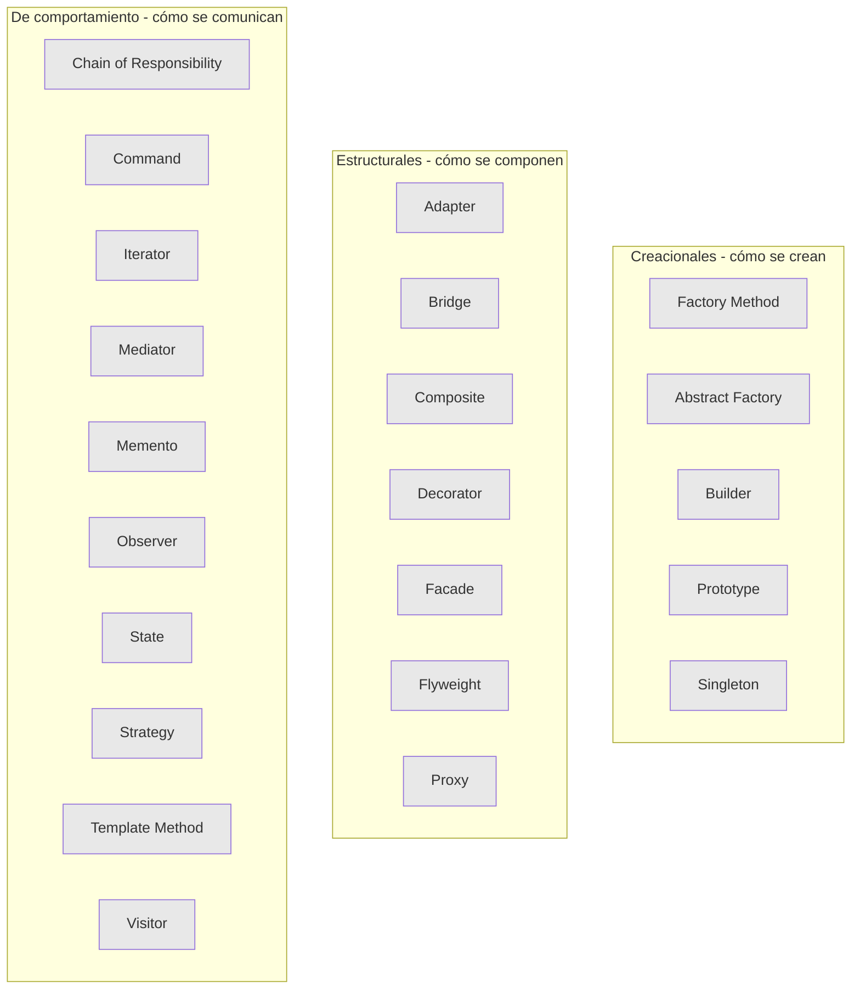
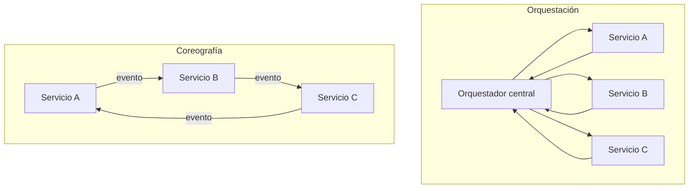
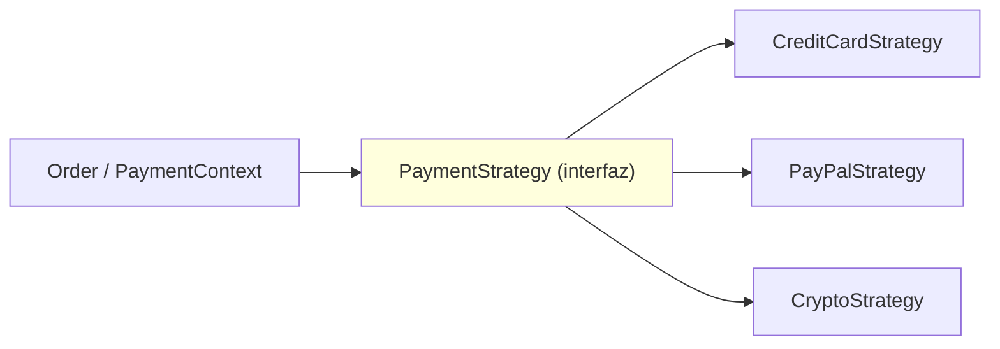
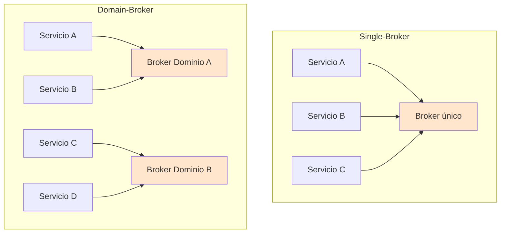
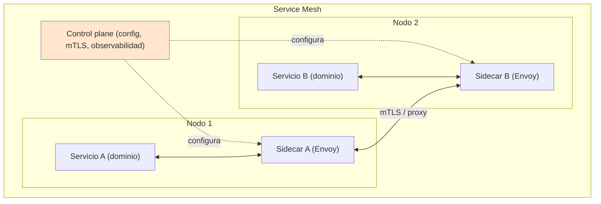
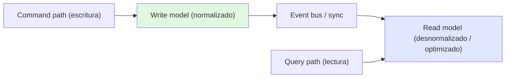
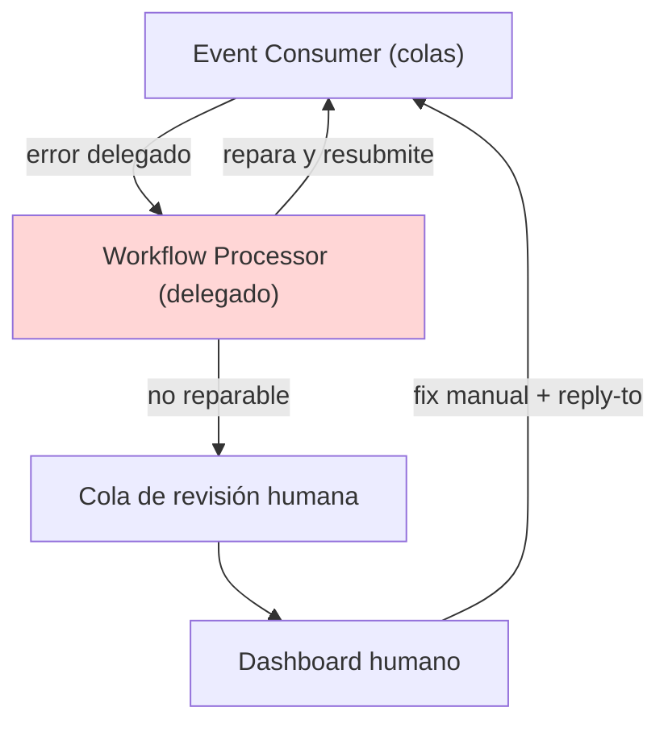

# Módulo 11 — Patrones de Diseño y Patrones de Arquitectura

> **Nivel:** Senior. Este módulo cierra el puente entre el *código* y el *sistema*: los **patrones de diseño** (GoF) resuelven problemas de diseño dentro de una clase/componente; los **estilos de arquitectura** son topologías con nombre (dónde viven los componentes, cómo se comunican, cómo se despliegan); los **patrones de arquitectura** son soluciones contextualizadas a problemas *transversales* (orquestación vs coreografía, CQRS, Sidecar, Workflow Event) que aparecen dentro de varios estilos. La distinción de fondo, que separa a un senior de un "coleccionista de patrones", es saber *cuándo* un patrón aplica, qué trade-offs impone y cuándo NO usarlo — porque todo en arquitectura es un trade-off (Primera Ley de la Arquitectura de Software).
>
> **Conexiones:** profundiza [Módulo 01](01-Arquitectura-de-Software-Moderna.md) (Clean/Hexagonal/Onion, SOLID — referenciados, no repetidos), [Módulo 02](02-Microservicios-y-DDD.md) (bounded contexts), [Módulo 03](03-Event-Driven-Architecture.md) (EDA, orquestación vs coreografía, CQRS — aquí se contrastan y se profundiza con los patrones de error-handling), [Módulo 10](10-Escalabilidad-y-Resiliencia.md) (patterns de resiliencia que se apoyan en estos) y [Módulo 05](05-Bases-de-datos-distribuidas.md) (CQRS, event sourcing, particionado).

---

## Introducción

Los patrones existen porque son **soluciones contextualizadas a problemas recurrentes** — no porque suenen bien. Un patrón tiene un *problema* claro, una *solución* con estructura y, sobre todo, unos *trade-offs* que el que lo aplica debe asumir. Usar un patrón sin entender su contexto es tan peligroso como no usarlo.

> *"Patterns are, after all, solutions to common problems… Focus on identifying the most appropriate pattern first, then choose the most appropriate implementation for it."* — *Fundamentals of Software Architecture*, 2.ª ed.

Este módulo tiene dos grandes familias, balanceadas a propósito:

1. **Patrones de diseño (GoF):** las 22 soluciones clásicas de 1994 (creacionales, estructurales, de comportamiento), presentadas de forma *concisa* con la lente senior de *cuándo* y *por qué* — porque la mayoría del valor está en los principios que los sostienen y en reconocerlos en producción, no en memorizarlos.
2. **Estilos y patrones de arquitectura:** el bloque que recibe el peso real de este módulo. Incluye la "carta de estrellas" (star-chart) comparativa de estilos (Layered, Modular Monolith, Pipeline, Microkernel, Service-Based, EDA, Space-Based, SOA, Microservices) y un **catálogo de patrones de arquitectura por familia**: comunicación (orquestación vs coreografía, request-reply, broker-domain), descomposición (modular monolith, microkernel, sidecar/service mesh, strangler fig), datos y estado (CQRS, event sourcing, saga), EDA (Workflow Event, poison event, anemic events, Swarm of Gnats, payloads key/data-based, event forwarding) e infraestructura/reuso (reuse de dominio vs operacional, data grid).

La mentalidad senior en una frase (según *Pragmatic Programmer*): los patrones son herramientas, no reglas; DRY y OCP se violan cuando el contexto no las justifica, y saber *cuándo* es el verdadero skill.

---

## Conceptos

### Terminología que debes dominar

- **Patrón de diseño (GoF):** solución de diseño a nivel de clases/objetos a un problema recurrente, definida en *Design Patterns* (Gamma, Helm, Johnson, Vlissides, 1994).
- **Estilo de arquitectura:** topología con nombre — componentes, su despliegue, su comunicación y su topología de datos (Layered, Microservices, EDA…). Implica *características* asumidas.
- **Patrón de arquitectura:** solución *contextualizada* a un problema arquitectónico transversal (Orquestación/Coreografía, CQRS, Sidecar, Service Mesh, Broker-Domain, Workflow Event). Se distingue del estilo y de la "best practice".
- **Particionado técnico vs de dominio:** técnico = capas por capacidad (presentación/lógica/datos); de dominio = por workflows/dominio (DDD). Layered es técnico; Modular Monolith y Microservices son de dominio.
- **Architecture quantum:** la unidad de despliegue con independencia funcional. Un sistema con un solo quantum (un monolith) no escala por partes; los microservicios tienen muchos quanta.
- **Encapsulate What Varies:** identifica lo que cambia y sepáralo de lo estable; el principio raíz de muchos patrones (Strategy, Factory, Bridge).
- **Program to an interface, not an implementation:** el cliente depende de una abstracción, no de una clase concreta.
- **Favor composition over inheritance:** delegar comportamiento en objetos compuestos en vez de heredar.
- **SOLID:** SRP, OCP, LSP, ISP, DIP (disección en Módulo 01).
- **Conway's Law / Inverse Conway Maneuver:** el diseño refleja la comunicación del equipo; para lograr la arquitectura, primero reestructura los equipos.
- **Cohesion / Coupling:** alta cohesión dentro de un módulo, bajo acoplamiento entre módulos — el objetivo de casi todos los patrones.
- **Big Ball of Mud:** el antipatrón final: sin estructura discernible, estado compartido promiscuo, crecimiento sin regulación.
- **Acoplamiento de dominio vs operacional:** el dominio NO debe reusarse entre servicios (la duplicación es preferible al acoplamiento); el código operativo (monitoring, logging, auth, circuit breakers) SÍ se reusa — vía sidecar/mesh.

### Principios raíz de los patrones de diseño (Shvets)

El libro *Dive Into Design Patterns* de Alexander Shvets (que estudiamos en disco) estructura los patrones sobre principios previos:

1. **Encapsulate what varies:** minimizar el efecto del cambio. Como el casco del barco dividido en compartimentos: una mina (cambio) daña un compartimento, no hunde el barco. Ejemplo del libro: `getOrderTotal` mezclando impuestos → extraer `getTaxRate(country)` aislado.
2. **Program to an interface, not an implementation:** las abstracciones permiten cambiar el "qué" sin tocar el "cómo".
3. **Favor composition over inheritance:** la composición permite combinar comportamientos en runtime y evita la rigidez de la herencia.

La mayoría de los patrones GoF son aplicaciones de estos tres principios + SOLID.

### GoF en una tabla (22 patrones)

| Tipo | Patrones | Esencia | Ejemplo backend |
|---|---|---|---|
| **Creacionales** | Factory Method, Abstract Factory, Builder, Prototype, Singleton | Cómo se *crean* los objetos (desacoplar creación de uso) | Fabrica de repositorios, builders de queries, cliente de BD singleton |
| **Estructurales** | Adapter, Bridge, Composite, Decorator, Facade, Flyweight, Proxy | Cómo se *componen* clases/objetos | Proxy de API remota, decorators de cache/retry, facade de SDK |
| **Comportamiento** | Chain of Responsibility, Command, Iterator, Mediator, Memento, Observer, State, Strategy, Template Method, Visitor | Cómo se *comunican* y distribuyen responsabilidades | Strategy de pagos, Observer de eventos, State de máquinas de estado, Command de jobs |

---

## Arquitectura

### Patrones de diseño: estructura conceptual (las "intenciones")

*Nota: el mapa mental correcto no es memorizar los 22, sino saber a qué **familia de problema** pertenecen para reconocerlos en producción.*

### Estilos de arquitectura: comparación por características

La elección entre estilos NO es por "moda" sino por las **características** que el sistema necesita. La tabla "star-chart" de *Fundamentals of Software Architecture* (2.ª ed.) resume los trade-offs:

| Estilo | Particionado | Simplicidad/Costo | Deploy | Test | Escalab. | Elastic. | Fault tol. | Perf. |
|---|---|---|---|---|---|---|---|---|
| Layered (n-tier) | Técnico | ★★★★★ | ★ | ★★ | ★ | ★ | ★ | ★★★ |
| Modular Monolith | Dominio | ★★★★★ | ★★ | ★★ | ★ | ★ | ★ | ★★★ |
| Pipeline | Técnico | ★★★★★ | ★★ | ★★ | ★ | ★ | ★ | ★★★ |
| Microkernel | Ambos | ★★★★★ | ★★★ | ★★★ | ★ | ★ | ★ | ★★★ |
| Service-Based | Dominio | ★★★★ | ★★★★ | ★★★★ | ★★★ | ★★ | ★★★★ | ★★★ |
| Event-Driven | Técnico | ★★ | ★★★★ | ★ | ★★★★★ | ★★★★★ | ★★★★★ | ★★★★★ |
| Space-Based | Técnico | ★ | ★★ | ★ | ★★★★★ | ★★★★★ | ★★★★ | ★★★★★ |
| Orchestration SOA | Técnico | ★★ | ★ | ★ | ★★ | ★★ | ★ | ★★ |
| Microservices | Dominio | ★★★ | ★★★★★ | ★★★★★ | ★★★★★ | ★★★★★ | ★★★★★ | ★★ |

**Lectura senior:** microservices y EDA ganan en casi todo menos en simplicidad/perf — y por eso "empieza simple" es tan defendible. El Modular Monolith es el punto dulce de inicio: domain-partitioned, 1 deployment, y evolución natural a distribuido.

### Estilos clave (resumen operativo)

- **Layered (n-tier):** el clásico; técnicamente particionado, capas cerradas (layers of isolation), 1 quantum. Simple y barato, pero débil en deploy/test/escala. Riesgo: *Architecture Sinkhole* (requests pasan sin lógica). Úsalo para apps pequeñas o mientras decides algo mejor.
- **Modular Monolith:** 1 deployment unit pero **particionado por dominio** (módulos). Mejor testabilidad que layered, evolución fácil a microservices. Riesgos: over-reuse (borra fronteras de módulo), demasiada comunicación entre módulos.
- **Pipeline (pipes & filters):** filtros (producer/transformer/tester/consumer) unidireccionales. Perfecto para ETL, integraciones, Step Functions. No apto para flujos no deterministas ni alta escala.
- **Microkernel (plug-in):** core mínimo + plug-ins. Ideal para **customización** (impuestos por estado, insurance claims, Eclipse/Jenkins). El único estilo que puede ser técnico y de dominio a la vez.
- **Service-Based:** híbrido pragmático entre monolith y microservices (~≤12 services gruesos, opcional BD compartida). Gran relación simplicidad/costo entre los distribuidos; buen *stepping stone*.
- **Event-Driven:** procesadores asíncronos acoplados por eventos; excelente en escala/elasticidad/evolvibilidad; difícil de testear y de controlar el flujo total (detalle en M03). Aquí se profundiza con sus patrones de error-handling (sección Patrones).
- **Space-Based:** reemplaza la BD como *constraint* síncrono con un **data grid en memoria** replicado (Hazelcast/Ignite), escrituras asíncronas. 5 estrellas en escala/elasticidad; costoso y complejo; para picos extremos (ticketing, subastas, flash sales).
- **Orchestration-Driven SOA:** taxonomía de servicios + ESB/orchestration engine; hoy de interés histórico salvo integración de legados.
- **Microservices:** ver M02. Punto clave aquí: *es el único estilo que exige partir los datos* (database-per-service), y "micro" es una etiqueta, no una regla de tamaño.

---

## Internals

### Cómo funciona la orquestación vs la coreografía (el patrón de comunicación)

Este es un *patrón de arquitectura* transversal: aparece en EDA, microservices y SOA. Su elección es un trade-off clásico (Segunda Ley: el análisis de trade-offs no se hace una sola vez).

| | Orquestación | Coreografía |
|---|---|---|
| Estado del workflow | Centralizado (consultable) | Distribuido (sin dueño) |
| Manejo de errores | Central (dueño del estado puede retry) | Difícil (cada servicio debe saber el flujo) |
| Recuperabilidad | Alta (el orquestador reintenta) | Baja |
| Responsividad | Menor (bottleneck del orquestador) | Mayor (paralelismo) |
| Escalabilidad | Menor (puntos de coordinación) | Mayor (escala independiente) |
| Fault tolerance | SPOF del orquestador (mitigable con redundancia) | Mejor (sin punto único) |
| Acoplamiento | Mayor (servicios acoplados al orquestador) | Menor |

**Regla senior:** usa **orquestación** cuando el flujo tiene muchos estados, errores y condiciones de frontera que debes manejar de forma central (ej. un checkout complejo) — o **Step Functions** para eso en AWS (M04); usa **coreografía** cuando la escalabilidad y el desacoplamiento dominan (ej. notificaciones, procesamiento de eventos) y puedes tolerar eventual consistency.

### Cómo funciona el patrón Strategy (el patrón que encapsula la variación)

El Strategy es la materialización de *encapsulate what varies* + *program to an interface* + *favor composition*. En vez de `if/else` sobre tipos de pago, se aísla cada algoritmo tras una interfaz y se inyecta:

El punto clave de *Dive Into Design Patterns*: añadir un método de pago nuevo **no** modifica `Order` (OCP) ni mezcla responsabilidades (SRP). El Strategy es la respuesta directa al ejemplo de OCP del libro (shipping methods).

### Cómo funciona el Singleton (y por qué el senior lo trata con pinzas)

El Singleton garantiza una única instancia y un punto de acceso global. *Dive Into Design Patterns* lo critica con precisión:
- **Pros:** una sola instancia para un recurso compartido (pool de conexiones, logger), lazy init.
- **Contras:** viola SRP (resuelve dos problemas), puede **enmascarar mal diseño** (componentes que se conocen demasiado), requiere cuidado en **multithreading** (doble-checked locking), y **dificulta el unit testing** (no puedes mockear fácilmente un constructor privado/estático).

**Regla senior:** hoy la inyección de dependencias (un contenedor DI que registra una instancia *singleton-scoped*) reemplaza al patrón manual en casi todos los casos — es más testeable y no esconde acoplamiento. El Singleton clásico queda para casos concretos (config en runtime, un pool).

### Cómo funciona el patrón Request-Reply (comunicación síncrona sobre brokers)

En EDA, cuando un procesador necesita una respuesta inmediata (un ID de confirmación) se usa *request-reply* (o comunicación *pseudosíncrona*): dos colas (request y reply) por canal. Hay dos implementaciones canónicas (detalle en FSA, cap. 15):

1. **Correlation ID (CID):** el productor envía al request queue y hace un *blocking wait* en el reply queue con un *message selector* que filtra por `CID = messageId original`. El consumidor responde copiando el CID al header del reply. Ventaja: no crea infra por request; soporta alta concurrencia.
2. **Temporary queue:** el productor crea una cola efímera y pasa su nombre en el header *reply-to*. Cualquier mensaje que llegue es suyo. Más simple (sin selector), pero el broker debe crear/borrar una cola por request — **penaliza throughput y latencia** a gran escala. Por eso la recomendación del libro es el CID.

**Regla senior:** usa el patrón **Synchronous Retry** del libro (M10) o colas dedicadas cuando necesites confirmación; evita *temporary queues* por request salvo volúmenes bajos.

### La matriz de decisión "¿qué patrón de diseño uso?" (senior)

No se memorizan 22 patrones: se reconocen por el *problema*:
- ¿Necesitas crear objetos sin acoplar el cliente al tipo concreto? → **Factory Method / Abstract Factory**.
- ¿Construir un objeto complejo paso a paso? → **Builder**.
- ¿Una única instancia global compartida? → **Singleton** (o DI singleton-scoped).
- ¿Adaptar una interfaz incompatible? → **Adapter**.
- ¿Añadir comportamiento a un objeto en runtime sin cambiar la clase? → **Decorator** (la base de middleware/cache/retry).
- ¿Simplificar una interfaz compleja? → **Facade** (ej. un SDK como facade de una API).
- ¿Control de acceso/diferir a un recurso costoso? → **Proxy** (proxy de BD pool, proxy de API remota).
- ¿Muchos algoritmos intercambiables? → **Strategy**.
- ¿Una cadena de handlers que procesan o delegan? → **Chain of Responsibility** (middleware HTTP).
- ¿Notificar a múltiples listeners cuando algo cambia? → **Observer** (event listeners, pub/sub en memoria).
- ¿Una entidad cambia comportamiento según estado? → **State** (máquinas de estado, pedidos/orders).
- ¿Encapsular una operación como objeto (para undo/redo, cola, logging)? → **Command** (jobs, transacciones).
- ¿Ejecutar la misma operación sobre una estructura sin acoplar el cliente al tipo? → **Visitor** (usar con moderación).

---

## Patrones

### Patrones de diseño GoF (backend, conciso)

**Creacionales.** *Factory Method + Abstract Factory* (crear familias sin acoplar al concreto: una `RepositoryFactory` que según config devuelve `PostgresOrderRepository` o `DynamoOrderRepository`; factories de clientes cloud por región). *Builder* (objetos complejos con pasos explícitos y validación: builders de queries SQL/ES, config con defaults). *Prototype* (clonar objetos costosos: templates de eventos/documentos). *Singleton* (+ DI singleton-scoped para pool de conexiones, cliente HTTP con keep-alive).

**Estructurales.** *Adapter* (convertir una interfaz incompatible: adaptadores de SDKs de pagos/mensajería; base de los ports & adapters de Hexagonal). *Decorator* (añadir comportamiento en runtime: middleware de cache/retry/rate-limit/circuit breaker/logging; literalmente la base de los stacks de middleware). *Facade* (interfaz simple detrás de un subsistema: el API Gateway como facade de microservicios). *Proxy* (control de acceso/lazy/remote: proxy de pool de conexiones, *service proxy* de Envoy). *Composite* (árboles: permisos jerárquicos), *Flyweight* (estados intrínsecos inmutables: datos de referencia), *Bridge* (separar abstracción de implementación).

**De comportamiento.** *Strategy* (algoritmos intercambiables: pagos, envíos, descuentos). *Observer* (notificar listeners: pub/sub en memoria, base de la reactividad y del patrón de eventos de M03). *Chain of Responsibility* (cadena de middleware: authn → authz → rate limit → validación → handler). *State* (la entidad cambia de comportamiento según estado: pedido `created → paid → shipped → delivered`). *Command* (operación como objeto: jobs de SQS/Kafka, undo/redo). *Mediator* (centraliza comunicación: chats, workflows). *Memento* (snapshots: auditoría). *Iterator* (recorrido: colecciones). *Template Method* (esqueleto con pasos delegados: `BaseRepository`). *Visitor* (operación desacoplada de la estructura; usar con moderación).

*Nota: las implementaciones en código de los patrones clave (Decorator, State, Command) están en el Apéndice A.*

### Patrones de arquitectura — catálogo por familia

A diferencia de los GoF, estos patrones **no dependen del lenguaje**: dependen de la *topología* y la *comunicación* del sistema. Los agrupamos por la familia de problema que resuelven.

#### Familia 1 — Comunicación

**Patrón 1: Orquestación vs Coreografía** (ver Internals) — el *pattern* de comunicación más importante para un senior. Decide quién es dueño del estado de un workflow.

**Patrón 2: Request-Reply (correlation ID vs temporary queue)** (ver Internals) — cómo conseguir una respuesta síncrona sobre un broker asíncrono sin romper el desacoplamiento.

**Patrón 3: Broker-Domain vs Single-Broker.** ¿Un broker para todo el sistema o uno por dominio? **Single-Broker:** descubrimiento centralizado, mínima infra, pero SPOF y límite de throughput (un solo broker sature el bus). **Domain-Broker:** mejor aislamiento, más escalable, más infra/costo. En AWS, la analogía es un EventBridge *default bus* (single) vs *custom event buses* por dominio.

**Trade-off senior:** el broker es *infraestructura operacional*, así que la regla de *reuse operacional* (patrón 11) aplica — pero el aislamiento de dominios (fallo, seguridad, throughput) a menudo justifica el costo extra. Empieza simple (single), extrae a domain brokers cuando un dominio satura o quiere aislamiento de fallos.

#### Familia 2 — Descomposición

**Patrón 4: Modular Monolith como punto de partida.** 1 deployment unit, particionado por dominio (DDD). No es un "monolith de mierda": exige fronteras de módulo estrictas (sin `object references` entre módulos, solo APIs). Es la estrategia *default* para la mayoría de los sistemas de negocio, con evolución natural a microservices cuando un módulo necesita su propio quantum (ver Casos reales: Silicon Sandwiches).

**Patrón 5: Microkernel (plug-in).** Core mínimo con puntos de extensión + plug-ins cargados en runtime. Ideal para customización (impuestos por región, claims de seguros, editores). Es a la vez un *estilo* y un *patrón de descomposición*. La clave es el *contract* entre core y plug-ins — si cambia a menudo, el core se fragiliza.

**Patrón 6: Sidecar + Service Mesh.** Adjuntar concerns operativos (monitoring, logging, circuit breakers, authn, TLS) a cada servicio en un plano transversal, sin tocar el código de dominio. Cada servicio corre con un sidecar; el **control plane** configura los sidecars de forma central.

**Trade-offs:** sidecar por plataforma (K8s) y puede crecer; el *data plane* añade latencia (1 salto extra por llamada); requiere madurez operativa (mTLS, retries, canary routing) para pagar su costo. En AWS: App Mesh (mTLS, traffic routing) o directamente Envoy/Istio si el equipo los domina. **Regla senior:** el mesh implementa el *Reuse Operacional* (patrón 11) sin contaminar el dominio; úsalo cuando haya muchos servicios y concerns transversales comunes, no para 3 microservicios.

**Patrón 7: Strangler Fig.** Migrar un legacy reemplazándolo gradualmente: cada feature nueva se implementa en el nuevo sistema y el tráfico se enruta pieza a pieza (routing layer), hasta que el legacy queda vacío y se retira. Es el patrón de *descomposición evolutiva* por excelencia; reduce riesgo frente a un *big-bang rewrite*. En AWS: el routing layer puede ser un API Gateway / ALB con weighted targets.

#### Familia 3 — Datos y estado

**Patrón 8: CQRS (Command-Query Responsibility Segregation).** Separar el path de escritura del de lectura — a veces con datastores distintos y sincronización async.

**Cuándo:** reads y writes con características distintas (volúmenes dispares, modelos diferentes, seguridad distinta). **Cuándo NO:** CRUD simple con un solo modelo — es complejidad pura. Ver M03/M05.

**Patrón 9: Event Sourcing.** Persistir el *flujo de eventos* como fuente de verdad (append-only log) en vez del estado actual; el estado se deriva por replay. Complementa a CQRS. Resuelve auditoría completa y reconstrucción, a costo de complejidad (event versioning, eventual consistency, replay). Detalle en M03/M05.

**Patrón 10: Saga.** Coordinar transacciones distribuidas entre servicios sin 2PC: secuencia de transacciones locales + *compensating actions* en caso de fallo. Dos estilos: **choreographed** (cada servicio emite el siguiente evento) y **orchestrated** (un orquestador de saga, en AWS: Step Functions). Detalle en M03.

#### Familia 4 — EDA: patrones de eventos y de error-handling

Esta familia se estudia a fondo en el cap. 15 de *Fundamentals of Software Architecture*. Son los patrones que un senior debe dominar para *diseñar* flujos de eventos correctos, no solo "emitir eventos".

**Patrón 11: Payloads key-based vs data-based.** ¿Cuánto contexto lleva el evento?
- **Key-based:** solo el ID (o el key). Menor acoplamiento de contrato, mejor para crear/borrar entidades. **Riesgo:** *anemic events* — si el consumidor no puede hacer nada con solo la key.
- **Data-based:** todo el dato (incluido el no necesario). Máxima conveniencia, mayor acoplamiento de contrato (*stamp coupling*).
- **Regla senior:** en el espectro, elige el punto correcto según *cuánto cambia* el dato y *qué necesita* el consumidor. Para updates, incluye **before y after** (la mayoría de BDs no reflejan el valor previo). Un evento *anémico* es un evento derivado cuyo payload no permite al procesador decidir ni continuar procesando.

**Patrón 12: Swarm of Gnats (antipatrón).** Disparar *demasiados eventos derivados finos* desde un procesador satura el sistema y vuelve ininteligible el flujo de eventos. La regla del libro: **granularidad de eventos según el resultado/estado del cambio**, no por campo. Ejemplo: `fraud_checked` (coarse) vs `fraud_detected` + `no_fraud_detected` (dos eventos con contexto fuera del payload → los consumidores deciden sin analizar el payload). El balance: demasiado coarse fuerza a todos a leer el payload; demasiado fino es un swarm. **Enfócate en el resultado del procesamiento o del cambio de estado.**

**Patrón 13: Workflow Event (error-handling en EDA).** Cuando un procesador asíncrono falla no hay usuario síncrono que corrija. El patrón usa **delegación, contención y reparación** con un *workflow delegate*: el consumidor que falla **delega** el error a un servicio Workflow Processor y pasa al siguiente mensaje (la responsividad no se degrada). El processor **contiene** el error, intenta **reparar** el mensaje programáticamente (transformar/limpiar datos) y lo **resubmite** a la cola original. Si no puede, lo envía a una cola de revisión humana (dashboard → corrección manual → resubmit con *reply-to*).

*Ejemplo del libro (trades):* un trade con `8756 SHARES` (no parseable) genera `NumberFormatException`. El TradePlacement delega el error al Trade Placement Error service, que *stripea* la palabra SHARES y lo resubmite; el trade se procesa al final. **Consecuencia:** los mensajes reparados se procesan *fuera de secuencia*; si el orden importa (ej. trades de la misma cuenta), el consumidor debe *contener* el contexto (colas temporales FIFO por cuenta) hasta que el error se resuelva.

**Patrón 14: Event Forwarding (prevención de pérdida de datos).** Tres puntos clásicos de pérdida en EDA (del productor al broker, del broker al consumidor que crashea, o al persistir) y sus mitigaciones:
- **Productor → broker:** *persistent message queues* (persistencia física) + **synchronous send** (blocking wait hasta ack de persistencia).
- **Broker → consumidor:** *client acknowledge mode* — el mensaje NO se remueve al leerlo; se le adjunta el client ID (evita que otro lo lea) y solo se confirma tras procesarlo. Contrasta con *auto acknowledge* (remueve al leer: riesgo de pérdida si crashea).
- **Persistencia final:** *ACID transaction + database commit*, y **Last Participant Support (LPS)** que confirma al broker que el evento se persiste y se completa el ciclo.

**Patrón 15: Anemic events (antipatrón).** Relacionado con payloads key-based (patrón 11): un evento derivado con contexto insuficiente para el procesamiento descendente. Mitigación: incluir el dato actualizado + valores previos en el payload del evento derivado.

#### Familia 5 — Infraestructura y reuso

**Patrón 16: Reuse — dominio vs operacional.** La máxima de microservices: *"duplication is preferable to coupling"*. El **código de dominio** (lógica de negocio) NO se comparte entre servicios — duplicarlo evita acoplamiento. El **código operacional** (monitoring, logging, auth, circuit breakers, deployment) SÍ debe reusarse — pero vía *sidecar/mesh* (patrón 6), no por librerías compartidas acopladas. Esta distinción es la clave para no caer en los dos extremos: servicios duplicando todo (operacional) o librería compartida que acopla dominios.

**Patrón 17: Space-Based / Data Grid.** Para picos extremos, la BD síncrona es el *constraint*: se sustituye por un **cache/data grid en memoria** replicado entre nodos (Hazelcast, Ignite) y escrituras asíncronas hacia la BD. 5 estrellas en escala/elasticidad; costoso y complejo; justificado solo para casos de picos masivos (ticketing, subastas, flash sales) — y aun así, primero agota caching + particionado + EDA.

**Patrón 18: Service Mesh como patrón de infraestructura.** Ya cubierto (patrón 6); aquí recalcamos: es el mecanismo de *reuse operacional* moderno, con `control plane` + `data plane`, e implementa a nivel de infraestructura los patrones de código Decorator/Proxy (retry, circuit breaker, observabilidad) — el espejo de los GoF en el mesh.

---

## Casos reales

1. **Netflix — Service Mesh y el patrón Strategy de resiliencia.** Netflix (y el ecosistema cloud) usa proxies (Envoy/Istio sidecars) para inyectar circuit breakers, retries y routing por service — la materialización del *Sidecar/Service Mesh* y de *Decorator/Proxy* a nivel de infraestructura. Lección: los patrones de código (Decorator, Proxy) tienen equivalentes a nivel de infraestructura.
2. **El patrón Facade en el API Gateway.** Cada gateway de microservicios es un Facade: expone una interfaz simple a los clientes y esconde la complejidad de N servicios internos (routing, version transform, authn). Lección: Facade no es solo "una clase con métodos bonitos".
3. **Machine de estados para pedidos (State).** Sistemas de e-commerce que modelan pedidos con `if/else` terminan con lógica ilegible y transiciones inválidas (pasar de `delivered` a `paid`). El patrón State centraliza qué transiciones son válidas. Lección: State elimina invariantes rotas.
4. **El Modular Monolith como punto de partida (Silicon Sandwiches, caso del libro).** Un equipo que evitó el salto prematuro a microservices y diseñó un Modular Monolith con DDD; cuando un bounded context exigió su propia escala, extrajo solo ese módulo. Lección: *los estilos no se eligen por moda sino por características y contexto* (Cap. 19).
5. **La subasta (Going, Going, Gone, caso del libro).** Un sistema de subastas eligió microservices con 5 quanta, usando async donde las características diferían (Pagos con cola para añadir fiabilidad). Lección: un mismo sistema mezcla estilos y quanta según el componente.
6. **El Singleton que rompió los tests.** Un equipo usó Singleton global para la BD; cada test se acoplaba a la misma conexión global y era imposible mockear. Migrado a DI singleton-scoped, la testabilidad volvió. Lección: el Singleton clásico es un anti-patrón moderno en la mayoría de los casos.
7. **Workflow Event en un sistema de trades (caso del libro, cap. 15).** Un `NumberFormatException` en un trade asíncrono no tenía usuario síncrono que corregir; con un *workflow delegate* el error se reparó programáticamente (stripping `SHARES`) y se resubmitió — sin degradar la responsividad del procesador. Lección: el error-handling en EDA se diseña con delegación/containment/repair, y el orden importa (colas temporales por contexto).
8. **Swarm of Gnats en un customer profile update.** Disparar un evento por cada campo actualizado (bill-to, ship-to, teléfono) saturaba el sistema con eventos finos difíciles de entender; se consolidó en un único `profile_updated` con before/after de todos los campos. Lección: la granularidad de los eventos derivados se decide por el *resultado del cambio*, no por campo.

---

## Laboratorio

1. **Refactor a Strategy:** toma un método con `if/else` de tipos (pago, envío, descuento) y extrae los algoritmos a strategies con interfaz común; añade un strategy nuevo sin tocar el contexto (OCP).
2. **Decorator en la práctica:** implementa un `RetryDecorator` y un `CacheDecorator` que envuelvan un cliente HTTP (la base de middleware); combínalos anidados y observa el orden de ejecución.
3. **State machine de pedido:** implementa el patrón State (o una tabla de transiciones válidas) para un pedido; escribe tests que intenten transiciones inválidas y verifica que fallan.
4. **Chain of Responsibility:** implementa una cadena de middleware (authn → authz → rate limit → handler) y añade un nuevo handler sin tocar los existentes.
5. **Payloads de eventos (key vs data):** modela dos versiones del mismo evento derivado (solo key vs con before/after). Implementa un consumidor y responde: ¿qué puede decidir cada versión? ¿Dónde cae en el espectro y por qué no es anémico?
6. **Workflow Event (simulación):** con SQS + una Lambda que falla al parsear un mensaje (ej. `8756 SHARES`), implementa un DLQ como *workflow delegate* que repara el payload y lo resubmite; verifica que el siguiente mensaje se procesa sin degradación.
7. **Swarm of Gnats (caso real):** toma el flujo `fraud_checked` y refactorízalo a `fraud_detected` + `no_fraud_detected`; observa que los consumidores ya no analizan el payload.
8. **Comparar estilos con el star-chart:** toma un sistema que conozcas y evalúa qué características necesita (escala, test, deploy, costo); sitúalo en la tabla y justifica por qué su estilo actual es o no adecuado.
9. **Orquestación vs coreografía (AWS):** modela el mismo checkout con Step Functions (orquestación) y con un flujo de eventos SNS/SQS (coreografía); compara complejidad de error-handling vs escalabilidad.
10. **Strangler Fig (plan de migración):** para un monolith legacy, diseña la secuencia de features a extraer y el routing layer (API Gateway) que enruta tráfico progresivamente sin *big-bang*.

---

## Entrevistas

**1. "¿Cuál es la diferencia entre un patrón de diseño, un patrón de arquitectura y un estilo de arquitectura?"**

**Orientación:** el candidato debe distinguir los tres niveles y usar el *contexto* como criterio. Un senior no mezcla "el patrón Singleton" con "el estilo microservices".

**Respuesta de un senior:** un **patrón de diseño** (GoF) resuelve problemas de diseño a nivel de clases y objetos (cómo crear, componer y comunicar objetos). Un **estilo de arquitectura** es una topología con nombre: describe componentes, despliegue, comunicación y datos (Layered, Microservices, EDA) y asume ciertas características. Un **patrón de arquitectura** es una solución contextualizada a un problema arquitectónico transversal (orquestación vs coreografía, CQRS, Sidecar, Workflow Event, Broker-Domain) que puede aparecer dentro de varios estilos. Y lo crucial: los patrones no son "best practices" — son soluciones con trade-offs que se aplican según el contexto, no para apagar el cerebro. Primero identifico el patrón adecuado y luego elijo la implementación.

**2. "Explícame el principio 'encapsulate what varies' y dame un ejemplo concreto."**

**Orientación:** quiere ver si el candidato aplica el principio raíz, no solo lo nombra. Ejemplo del libro de Shvets (impuestos) es una buena señal.

**Respuesta de un senior:** identifica lo que varía en tu app y sepáralo de lo que permanece estable, para minimizar el efecto del cambio. El ejemplo clásico del libro: un método `getOrderTotal` que calcula impuestos con `if (country == US) … else if (EU) …` mezclando lógica que va a cambiar (impuestos) con la que no (sumar items). Extraigo `getTaxRate(country)` a un método/estrategia aparte; cuando cambien los impuestos, solo toco ese compartimento aislado — como los compartimentos de un barco, para que una mina no hunda todo. A nivel de clase: si la clase crece, extraigo la responsabilidad variable a su propia clase (SRP). Es la base de Strategy, Factory y Bridge.

**3. "¿Qué patrón usarías para añadir retry y caching a un cliente HTTP sin modificar el cliente? ¿Por qué?"**

**Orientación:** busca el Decorator y que lo conecte con la composición (no herencia), y que note que es la base de los middleware.

**Respuesta de un senior:** el **Decorator**: envuelvo el cliente original con un `RetryDecorator` y un `CacheDecorator` que comparten la misma interfaz. Añado comportamiento en runtime sin modificar la clase — respeta OCP y SRP, y uso **composición** sobre herencia. El orden importa: cache por fuera, retry en medio, el cliente real adentro. Es exactamente cómo funcionan los stacks de middleware en Express/Spring y los proxies del service mesh a nivel de infraestructura.

**4. "¿Cuándo usarías orquestación y cuándo coreografía en un workflow distribuido?"**

**Orientación:** evalúa la comprensión de los trade-offs (estado central vs escala/desacople). Debe mencionar el caso intermedio (Step Functions/localized orchestrator).

**Respuesta de un senior:** **orquestación** cuando el workflow tiene muchos estados, errores y condiciones de frontera que quiero manejar de forma central — un checkout con validaciones: el orquestador tiene el estado consultable, reintenta, y el error-handling es explícito. Sus costos: un punto único que puede ser bottleneck/SPOF y acopla servicios a él. **coreografía** cuando la escala, la elasticidad y el desacoplamiento dominan (notificaciones, eventos): sin coordinador central, más paralelismo, pero el estado del workflow queda distribuido y el error-handling es más difícil. En AWS uso Step Functions como orquestador y SNS/SQS para coreografía; y puedo combinar — un orquestador localizado solo donde lo justifica el flujo.

**5. "¿Cómo manejas errores en un flujo 100% asíncrono (EDA) donde no hay un usuario síncrono que corregir?"**

**Orientación:** evalúa la profundidad en patrones de EDA (Workflow Event, DLQ, retry, reparación programática) — no basta con "dead letter queue".

**Respuesta de un senior:** el principio es **delegación, contención y reparación** — el patrón **Workflow Event**: cuando el procesador falla, delega el error a un *workflow processor* (o DLQ + worker) y pasa al siguiente mensaje, así la responsividad no se degrada. El processor intenta reparar el mensaje programáticamente (limpiar/transformar datos) y lo resubmite a la cola original; si no puede, lo envía a una cola de revisión humana (dashboard + resubmit con reply-to). Complemento con: **client acknowledge mode** para no perder el mensaje si el consumidor crashea, **persistent queues + synchronous send** entre productor y broker, y **ACID commit + LPS** al persistir. Y si el orden importa (mensajes reparados salen de secuencia), contengo el contexto con colas temporales FIFO por cuenta.

**6. "¿Cuál es la diferencia entre un monolith tradicional (layered) y un Modular Monolith? ¿Cuándo elegirías este último?"**

**Orientación:** evalúa si conoce la distinción *técnico vs dominio*, el star-chart y la evolución natural a microservices. Fuerte si menciona el caso del libro (Silicon Sandwiches).

**Respuesta de un senior:** el layered es **técnicamente particionado** (presentación → lógica → persistencia) y se despliega como una sola unidad. El **Modular Monolith** también es una sola unidad de despliegue pero **particionado por dominio** (módulos basados en bounded contexts de DDD), con comunicación bien definida entre módulos. Sus ventajas: simplicidad y bajo costo del monolith, mejor testabilidad y modularidad que layered, y **evolución natural** — si un módulo exige su propia escala, lo extraigo a microservicio sin reescribir todo. Riesgos: over-reuse (borra fronteras), demasiada comunicación entre módulos. Lo elijo como punto de partida por defecto para apps de negocio con equipos de dominio, salvo que ya se necesiten características de escala distribuida.

**7. "Dame un ejemplo real de los patrones Adapter, Facade y Proxy en un sistema backend."**

**Orientación:** el candidato debe dar ejemplos *de sistema*, no de libro. Distinguir los tres es la señal senior.

**Respuesta de un senior:** **Adapter** cuando integro un SDK de terceros con interfaz incompatible: un adaptador de pasarela de pagos que expone mi interfaz `PaymentGateway` y traduce a Stripe/Adyen sin contaminar el dominio. **Facade** cuando expongo una interfaz simple detrás de algo complejo: el **API Gateway** como facade de N microservicios, o un SDK que envuelve varias llamadas internas en una sola. **Proxy** cuando controlo el acceso o difiero un recurso costoso: un proxy de pool de conexiones a la BD, o un proxy HTTP ante una API remota con caching — y el *service proxy* de Envoy en el mesh. La idea: Adapter *convierte*, Facade *simplifica*, Proxy *controla/intercepta*.

**8. "¿Qué es la coreografía en el contexto de eventos y qué problemas crea? ¿Cómo los mitigas?"**

**Orientación:** conecta con EDA (M03). El candidato debe nombrar los problemas reales: workflow distribuido sin dueño, error-handling y recoverability difíciles, y los patrones de mitigación de EDA.

**Respuesta de un senior:** coreografía significa que los servicios se coordinan publicando/consumiendo eventos sin un coordinador central; cada servicio reacciona y publica eventos derivados. Sus ventajas: escala y desacople (sin punto único). Los problemas: el workflow queda **distribuido** — no hay un lugar para preguntar "¿en qué estado está este pedido?", el **error-handling** es difícil (cada servicio debe conocer el flujo), y la **recoverability** requiere mecanismos como *event sourcing* + reprocessing o un *orchestrator* localizado solo para el caso límite. Los patrones de mitigación: **Workflow Event** (delegación/containment/repair), colas con retry y dead-letter con **client acknowledge mode** para no perder mensajes, **event forwarding** (persistent queues + synchronous send + LPS), y la elección de payloads *key-based* vs *data-based* según cuánto acoplamiento quiero — cuidando no caer en *anemic events* ni en *Swarm of Gnats*.

**9. "¿Cuándo aplicarías el patrón CQRS y qué problemas resuelve? ¿Cuándo NO lo usarías?"**

**Orientación:** el candidato debe justificarlo por diferencias de reads/writes (o seguridad) y reconocer que para CRUD simple es overkill. Referencia M03/M05.

**Respuesta de un senior:** CQRS separa el camino de escritura del de lectura — con datastores distintos sincronizados async (u otro mecanismo). Lo aplico cuando **reads y writes tienen características muy distintas**: volúmenes dispares (muchas lecturas), necesidad de modelos de datos diferentes (modelo normalizado para escritura, desnormalizado/optimizado para lectura), o querer aislar por seguridad. Permite escalar cada path de forma independiente. NO lo usaría en un CRUD simple donde un modelo sirve para ambos — ahí es complejidad pura. Va de la mano con event sourcing en sistemas de altas lecturas o agregación (reporting), como se detalla en el módulo de EDA y de bases de datos distribuidas.

**10. "¿Cómo decides entre empezar un sistema como monolith y como microservices?"**

**Orientación:** quiere la aplicación del *star-chart* y el análisis de *architecture quantum* del libro, no dogma. Fuerte si menciona Modular Monolith como punto de partida.

**Respuesta de un senior:** uso el análisis de **architecture quantum**: si todo el sistema necesita el mismo conjunto de características (misma escala, mismo deploy), un monolith basta — y un **Modular Monolith** es el mejor punto de partida porque gano simplicidad, bajo costo y modularidad por dominio, y puedo extraer módulos a microservices cuando un componente necesite su propio quantum. Si partes del sistema exigen características diferentes (una parte necesita escala extrema, otra transacciones fuertes), ahí sí distribuyo con microservices, cuidando que el equipo tenga madurez Agile/DevOps (el libro advierte que microservices sin madurez es sufrimiento). La regla: no elijo por moda; elijo por las características que el dominio y la operación demandan, y evalúo el trade-off continuamente.

---

## Checklist

- [ ] ¿Distingo patrones de diseño (GoF), patrones de arquitectura y estilos de arquitectura?
- [ ] ¿Identifico el problema antes de nombrar el patrón (no soy "coleccionista de patrones")?
- [ ] ¿Aplico *encapsulate what varies*, *program to an interface* y *favor composition* de forma consciente?
- [ ] ¿Uso Strategy en lugar de `if/else` de algoritmos intercambiables (pagos, envíos)?
- [ ] ¿Uso Decorator (middleware) para cache/retry/rate-limit sin modificar los clientes?
- [ ] ¿Mi gestión de estado evita `if/else` gigantes usando el patrón State o tablas de transiciones?
- [ ] ¿Reconozco el Singleton y lo reemplazo por DI singleton-scoped donde aplica?
- [ ] ¿Justifico orquestación vs coreografía por los trade-offs (estado central vs escala)?
- [ ] ¿Uso CQRS solo cuando reads/writes tienen características distintas?
- [ ] ¿Evalúo el estilo de arquitectura con el star-chart (características) y el análisis de quantum, no por moda?
- [ ] ¿Conozco el caso del Modular Monolith como punto de partida y la extracción gradual a microservices?
- [ ] ¿Aplico la distinción *dominio vs operacional* (duplicación preferible al acoplamiento de dominio; sidecar/mesh para lo operacional)?
- [ ] ¿Elijo el tipo de payload de evento (key-based vs data-based) según cuánto necesita decidir el consumidor, evitando *anemic events*?
- [ ] ¿Decido la granularidad de los eventos derivados por el *resultado* del cambio (no por campo) para evitar el *Swarm of Gnats*?
- [ ] ¿Tengo un plan de error-handling asíncrono con *Workflow Event* (delegación/containment/repair), DLQ y resubmit?
- [ ] ¿Conozco los tres puntos de pérdida de datos en EDA y sus mitigaciones (persistent queues + synchronous send, client acknowledge, ACID/LPS)?
- [ ] ¿Sé cuándo usar Broker-Domain vs Single-Broker y Strangler Fig en una migración?

---

## Referencias

- **Gamma, Helm, Johnson, Vlissides — *Design Patterns* (GoF, 1994)** — el origen de los 22 patrones.
- **Alexander Shvets — *Dive Into Design Patterns*** (en disco) — los 22 patrones explicados con problemas/soluciones, principios (encapsulate what varies, program to an interface, favor composition) y SOLID.
- **Mark Richards & Neal Ford — *Fundamentals of Software Architecture*, 2.ª ed.** (en disco) — estilos de arquitectura (caps. 9–18), elección del estilo (cap. 19), patrones de arquitectura (cap. 20), patrones EDA y error-handling (cap. 15: payloads key/data-based, anemic events, Swarm of Gnats, Workflow Event, Event Forwarding, request-reply), Space-Based (cap. 16), las Tres Leyes (caps. 1 y 27).
- **Eric Evans — *Domain-Driven Design*** — bounded contexts, dominios (base del particionado de dominio).
- **Michael Nygard — *Release It!*** — patrones de resiliencia (referido en M10), contexto operacional de los patrones.
- **Martin Fowler** — artículos sobre Strategy, State, CQRS, Service Mesh, Strangler Fig, *Agile Software Development* (origen de SOLID).
- **AWS** — Step Functions (orquestación), SNS/SQS (coreografía), EventBridge (brokers), API Gateway (Facade), App Mesh/Envoy (service mesh).
- **Kleppmann — *Designing Data-Intensive Applications*** (en disco) — CQRS, event sourcing, particionado (detalles en M03/M05).
- [Módulo 01](01-Arquitectura-de-Software-Moderna.md) (SOLID, Clean/Hexagonal), [Módulo 02](02-Microservicios-y-DDD.md), [Módulo 03](03-Event-Driven-Architecture.md), [Módulo 05](05-Bases-de-datos-distribuidas.md), [Módulo 10](10-Escalabilidad-y-Resiliencia.md).
