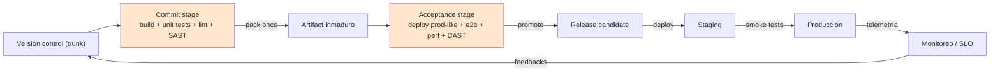
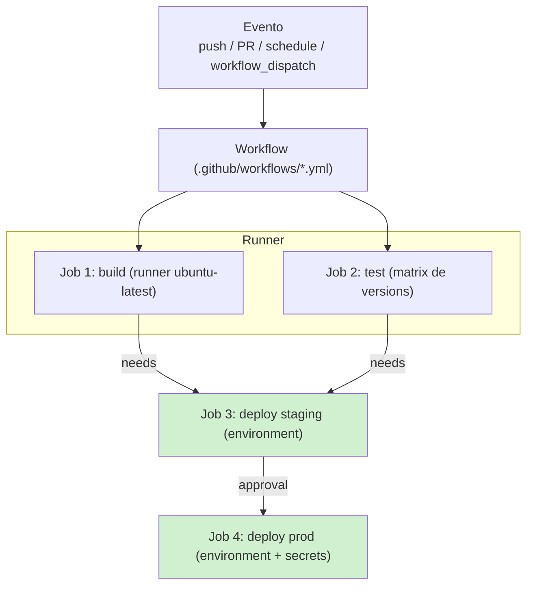
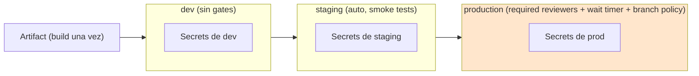
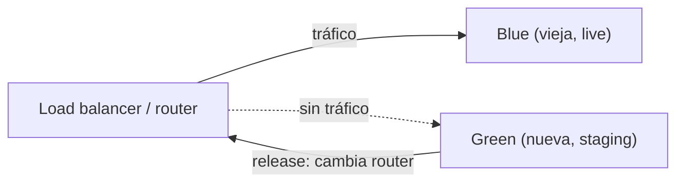
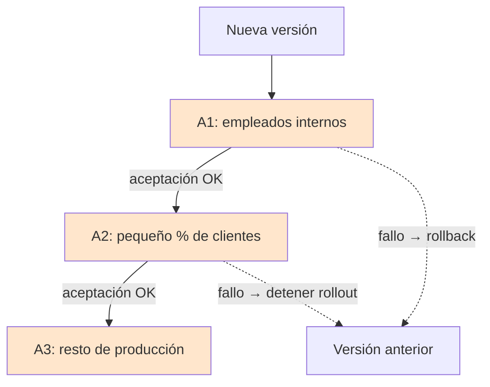
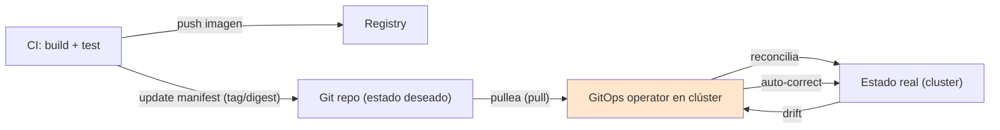

# Módulo 12 — CI/CD Moderno con GitHub Actions y Estrategias de Despliegue

> **Nivel:** Senior. Este módulo cubre la **Primera Vía** (El Camino) de las Tres Vías de DevOps: cómo automatizar y acelerar el flujo de código desde el commit hasta producción **de forma segura y de bajo riesgo**. El foco técnico es **GitHub Actions** (el CI/CD más usado del mundo) y las **estrategias de despliegue** (blue-green, canary, rolling, feature flags) que permiten que la parte más peligrosa del ciclo — el paso a producción — se convierta en algo rutinario, reversible y de bajo riesgo. La mentalidad senior que lo atraviesa: **desplegar y liberar son dos actividades distintas** (deployment ≠ release), y todo lo que no se automatiza se convierte en miedo y en menos frecuencia de despliegues (un espiral hacia abajo).
>
> **Conexiones:** aprovecha [Módulo 06](06-Infraestructura-como-Codigo.md) (IaC que aquí se *despliega*), [Módulo 07](07-Observabilidad.md) (la telemetría que aquí sirve de *quality gate* y de guía de rollback), [Módulo 08](08-Seguridad.md) (OIDC, secretos, supply chain que aquí se aplican al pipeline), [Módulo 10](10-Escalabilidad-y-Resiliencia.md) (smoke tests y health checks de despliegue), [Módulo 02](02-Microservicios-y-DDD.md) (despliegue de muchos servicios) y [Módulo 11](11-Patrones-de-Diseño.md) (Decorator/Proxy como base conceptual de los proxies de despliegue).

---

## Introducción

El objetivo de CI/CD no es "automatizar por automatizar": es hacer que **desplegar a producción sea un evento de bajo riesgo, a pedido y reversible**, para que la frecuencia de release sea una decisión de negocio y no una barrera técnica. Cuando los despliegues son manuales, dolorosos y temidos, se hacen cada vez menos seguido; y cuanto menos se despliegan, más grandes son los lotes y más peligroso es cada despliegue — el *downward spiral* que describe *The DevOps Handbook*.

> *"Because it is painful, we tend to do it less and less frequently, resulting in another self-reinforcing downward spiral. By deferring production deployments, we accumulate ever-larger differences between the code to be deployed and what's running in production, increasing the deployment batch size."* — *The DevOps Handbook*, cap. 12.

La investigación es inequívoca al respecto: los datos del **State of DevOps (DORA)** de los equipos *elite* muestran lead times de deployment de minutos/horas (vs meses en los de menor desempeño), despliegues a demanda, y una fuerte correlación entre *continuous delivery*, *trunk-based development* y el rendimiento organizacional.

La cita que define el espíritu del módulo (Humble, en *The DevOps Handbook*, cap. 12): **"Lo que importa no es la forma, sino los resultados: los despliegues deben ser eventos de bajo riesgo, push-button, que podamos realizar a demanda."**

**Bloques del módulo:**
1. **CI vs CD vs CDel:** qué se integra, qué se entrega y qué se despliega — y por qué la distinción *deployment vs release* cambia todo.
2. **GitHub Actions internals:** workflows, runners, jobs, steps, contextos, secretos, entornos, artefactos, acciones reutilizables.
3. **Estrategias de despliegue:** blue-green, canary (y *cluster immune system*), rolling, feature flags y dark launch — tomadas del cap. 12 del libro.
4. **GitOps, release automation, quality gates y seguridad del pipeline:** el CI/CD como *control* (no solo como velocidad).

---

## Conceptos

### Terminología que debes dominar

- **CI (Continuous Integration):** integrar el código de todos los desarrolladores en trunk al menos una vez al día, con tests automatizados que validen que el sistema sigue desplegable. Es la práctica que evita el *merge hell* y los lotes grandes.
- **CD (Continuous Delivery):** tener trunk siempre en estado desplegable y poder liberar a producción a demanda, con un push de botón, en horario laboral. Es el **prerrequisito** del Continuous Deployment.
- **CDel (Continuous Deployment):** cuando además de lo anterior, cada build bueno se despliega a producción automáticamente (típicamente ≥1/día/desarrollador o cada commit). Aplicable sobre todo a servicios web.
- **Deployment vs Release:** *deployment* = instalar una versión en un entorno; *release* = hacer una feature disponible para usuarios (o un segmento). **Desacoplar ambos** es el patrón central de los releases de bajo riesgo.
- **Deployment pipeline:** la implementación automatizada del flujo de cambio de producción — "una abstracción que provee feedback seguro y rápido sobre la desplegabilidad". Cada commit dispara: commit stage → acceptance stage → deploy/release.
- **Trunk-based development:** todos trabajan sobre `main` en lotes pequeños; ≤3 ramas activas; merge a trunk ≥1 vez/día; sin code freezes (datos DORA).
- **Batch size:** el tamaño de un lote de cambios desplegado; cuanto menor, menor el riesgo.
- **Quality gate:** una condición automatizada que debe cumplirse para que el pipeline continúe (coverage, tests, lint, security scan, smoke test, telemetría).
- **Artifact:** el paquete inmutable generado una sola vez en CI y promovido a través del pipeline (build once, deploy many).
- **Environment (GitHub):** un destino de despliegue con secretos, variables y *protection rules* (required reviewers, wait timer, branch policies).
- **Secret:** un valor sensible (API key, token, password) que GitHub cifra, oculta en logs y solo expone a jobs autorizados.
- **OIDC (OpenID Connect):** autenticación *keyless* entre GitHub Actions y un proveedor de nube (AWS/Azure/GCP) que elimina credenciales de larga duración.
- **Runner:** el agente que ejecuta los jobs (hosted, self-hosted, GitHub-hosted con arquitecturas variadas).
- **GitOps:** Git como única fuente de verdad del estado deseado; un operador en el clúster *pullea* y *reconcilia* (declarativo, versionado, pull, reconciliación continua).
- **Feature flag / toggle:** un switch en runtime que enciende/apaga una feature sin nuevo despliegue; base del *dark launch* y de rollback sin deploy.
- **Blue-green / Canary / Rolling:** patrones de release basados en entornos/infraestructura (sin cambios de código).
- **Rollback / Fix forward:** revertir el estado anterior (rollback) vs arreglar y desplegar de nuevo (fix forward); ambos guiados por telemetría.
- **DORA metrics:** Deployment Frequency, Lead Time for Changes, Change Failure Rate, MTTR — los 4 indicadores de rendimiento de entrega de software.

### Las Tres Vías (marco mental)

El CI/CD vive en la **Primera Vía** (flow), pero se apoya en la Segunda (feedback — telemetría como quality gate) y la Tercera (aprendizaje continuo). No es "solo tooling": es la materialización técnica de reducir el *lead time* del value stream.

### DORA: qué separa a los *elite*

| Métrica | Elite | Low |
|---|---|---|
| Deployment frequency | On-demand (múltiples/día) | Entre semanas y meses |
| Lead time for changes | < 1 día | 1–6 meses |
| Change failure rate | 0–15% | 46–60% |
| MTTR | < 1 hora | Entre 1 semana y 1 mes |

*Fuente: State of DevOps / Accelerate (Forsgren, Humble, Kim).*

---

## Arquitectura

### El deployment pipeline como espina dorsal

*Basado en el cap. 10 del libro ("The Deployment Pipeline", de Humble & Farley): cada commit dispara el commit stage; los paquetes se generan **una sola vez** y se promueven tal cual por todo el pipeline (build once, deploy many).*

**Reglas operativas del pipeline (según el libro):**
1. **Desplegar igual en todos los entornos** — si el deploy a prod es el mismo mecanismo que a dev/test, ya se ejecutó "cien veces antes".
2. **Smoke tests del despliegue** — conectar con BDs/colas/externos y correr una transacción de prueba; si falla, fallar el deploy.
3. **Entornos consistentes y sincronizados** — producción-like en toda la cadena (los ambientes de CSG International: "hicimos los ambientes no-producción tan similares a producción como fuera posible").

### GitHub Actions: el modelo de eventos → jobs

*Un workflow se activa por eventos, define jobs que corren en runners, con dependencias explícitas (`needs`), `matrix` para paralelizar, y entornos para separar secretos y aplicar protection rules.*

### Entornos y promoción (el "path" de la CD)

*Cada entorno aísla secretos y variables; producción impone protection rules. Esta es la implementación práctica de "deployment a demanda, promoción del mismo artifact".*

### CI vs CD vs CDel (el espectro)

| | CI | Continuous Delivery | Continuous Deployment |
|---|---|---|---|
| Integrar a trunk + tests | ✓ | ✓ | ✓ |
| Trunk siempre desplegable | ✓ | ✓ | ✓ |
| Release a demanda (botón) | ✗ | ✓ | ✓ |
| Deploy a prod automático | ✗ | ✗ | ✓ (cada build bueno) |
| Contexto ideal | Todos los equipos | Casi todos (incl. mobile, COTS, embedded) | Servicios web |
| Fuente | cap. 11 | cap. 12 | cap. 12 |

*"Continuous delivery is the prerequisite for continuous deployment just as continuous integration is a prerequisite for continuous delivery"* (Humble, cap. 12). Los equipos de élite eligen el modo según el riesgo: no todo requiere CDel.

---

## Internals

### Cómo funciona GitHub Actions por dentro

**Workflows (`YAML`):** un archivo en `.github/workflows/` que define *cuándo* (eventos/triggers), *qué* (jobs), *en dónde* (runners), *cómo* (steps/actions) y *con qué* (secrets, vars, env). Un evento crea un *workflow run*; cada run tiene un `run_id`, y cada job un `GITHUB_TOKEN` efímero con permisos **mínimos** (`permissions:` por defecto se endureció a `contents: read` en 2023).

**Triggers (eventos):**
- `push`, `pull_request` (con `types: [opened, synchronize, reopened]` y `paths-ignore` para monorepos).
- `schedule` (cron), `workflow_dispatch` (manual, con `inputs`), `repository_dispatch`.
- `workflow_call` (reusable workflows) y `workflow_run`.
- Eventos de GitHub como `deployment`, `release`, `issues` — para automa-gación más allá de CI.

**Contextos y expresiones:** `github`, `env`, `vars`, `secrets`, `steps`, `strategy`, `matrix`, `inputs`, `needs`, `job`. Expresiones con `${{ }}`, operadores, funciones (`contains`, `startsWith`, `fromJSON`, `format`), y condiciones con `if:`. Son el equivalente a "variables y control de flujo" del pipeline.

**Jobs y steps:**
- `needs:` define el DAG de dependencias entre jobs (paralelización explícita).
- `strategy.matrix` corre el mismo job con combinaciones (OS × versión de runtime) — el equivalente moderno del testing farm del HP LaserJet.
- `continue-on-error`, `timeout-minutes`, `retries` (vía acciones o `if`).
- `concurrency:` cancela runs duplicados (un solo deploy por ambiente; clave para no pisarse en despliegues).

**Artifacts vs Cache (confundir es un anti-patrón):**
- **Artifacts** (`upload-artifact` / `download-artifact`): persisten outputs de un run para otro job/run del mismo workflow (binarios, reports, coverage). Retención configurable.
- **Cache** (`actions/cache`): reutiliza dependencias (node_modules, ~/.cache) entre runs para **acelerar**, no para promocionar; sujeto a eviction. Nunca uses cache para lo que debe ser reproducible/auditable.
- **Regla senior:** el *artifact* del build es tu **single source of truth** para despliegue; el caché es solo optimización. GitHub endureció la seguridad del caché para *untrusted triggers* (2026: read-only cache para pull requests de forks).

### Runners

| Tipo | Cuándo | Notas |
|---|---|---|
| **GitHub-hosted** (`ubuntu-latest`, `windows-latest`, `macos-latest`) | Default | Mantenidos por GitHub, imágenes actualizadas, incluyen toolchains y **larger runners** (4–128 CPUs, más RAM) |
| **Self-hosted** | Necesidad de hardware/GPU/red propia, o compliance | Los corre tu infra; **responsabilidad de seguridad tuya** (los workflows maliciosos corren con tus credenciales) |
| **Ephemeral (auto-scaling)** | Escala elástica de self-hosted (action runner controller, escala cero) | Cada job en una máquina efímera; más seguro y barato que runners fijos |

**Selección de runner:** `runs-on:` con labels (`ubuntu-latest`, `self-hosted`, `linux`, `arm64`, o el label de tu *runner group*). Los *runner groups* controlan qué repos/orgs pueden usar qué runners (aislamiento de credenciales).

### Secrets: jerarquía y modelo de amenaza

- **Niveles:** organizacional → repositorio → environment. El de mayor precedencia en un job es el del **environment** al que apunta el job (y solo si ese job referencia el entorno).
- **Máscara en logs:** GitHub redacta valores conocidos (`::add-mask::`) — nunca "echo" de secretos ni logs con JSON sin limpiar.
- **OIDC (la regla de oro):** en vez de `AWS_ACCESS_KEY_ID` de larga duración como secret, usar `permissions: id-token: write` + `aws-actions/configure-aws-credentials` con `role-to-assume`. GitHub emite un token JWT firmado que AWS valida mediante un *trust policy* con `aud`, `sub` y `environment` específicos. **Keyless, sin rotación, mínima exposición.**
- **Modelo de amenaza senior:** los secrets solo llegan a jobs que referencian el environment y tras cumplir sus protection rules; usa **environment secrets** para prod (no repo secrets globales), nunca estructures secretos como datos sensibles parseables, y rota periódicamente.

### Environments y deployment protection rules

Un *environment* agrupa: **secrets**, **variables**, y **protection rules** (hasta 6 simultáneas):
1. **Required reviewers:** hasta 6 usuarios/equipos; basta uno para aprobar; *prevent self-review* opcional (evita que quien inició apruebe).
2. **Wait timer:** 1–43,200 min de retardo (ventana de enfriamiento/rollback).
3. **Deployment branches and tags:** restringe a qué branches/tags puede apuntar el deploy (`main`, `release/*`, `v*.*.*`).
4. **Custom deployment protection rules:** GitHub Apps que aprueban/rechazan por API/webhook (datadog, ServiceNow, SLO check — el equivalente moderno del *CAB* y de los *launch readiness reviews* de Google).

*Nota de plataforma: en repos privados, required reviewers y wait timer requieren plan Enterprise; branch/tag policies funcionan en todos. Verifica la documentación vigente al diseñar.*

**Vale la pena:** el job que apunta a un environment **no puede leer sus secretos hasta que las protection rules se cumplen** — el approval es un gate de secretos real, no solo de proceso.

### Cómo funciona la promoción de artifacts (build once)

El pipeline construye **una sola vez** en CI, etiqueta el artifact con SHA + metadata (`github.sha`, versión semver), y los jobs de staging/prod *descarguen ese mismo artifact* — nunca re-build. Esto elimina la clase entera de errores de "compiló distinto en cada entorno" (diferentes compiladores, flags, versiones de librerías) que describe el cap. 10. En despliegues de contenedores: la imagen se builda una vez, se **firma** (cosign), se escanea, y se promueve por tag digest inmutado.

### GitHub Actions como "engine" de los patrones del libro

El cap. 12 (deployments de bajo riesgo) pide: empaquetar una vez, *smoke tests* del deploy, registro automático de quién-corrió-qué-cuándo, y *push-button* con fast feedback. GitHub Actions da eso nativamente: `environment` con URL de deploy, el **Deployments API** (`gh api repos/{o}/{r}/deployments`) para historial/auditoría, status checks como *quality gates*, y el workflow como *audit log* versionado en Git (lo que *The DevOps Handbook* pide para auditors: evidencia generada automáticamente como parte del trabajo diario).

---

## Patrones

### Patrones de despliegue (estrategias de release)

*Fuente principal: cap. 12 del libro. Se dividen en **environment-based** (no requieren cambio de código) y **application-based** (requieren código: feature flags).*

**Patrón 1: Blue-Green.** Dos entornos de producción (blue y green); solo uno recibe tráfico. Se despliega en el inactivo, se testea sin interrumpir, y el release es *cambiar el router/symlink* para dirigir tráfico. **Rollback = volver a dirigir tráfico al anterior** (instantáneo, sin redeploy). Es simple y fácil de retrotraer. **Dificultad:** la base de datos compartida no soporta dos versiones — se resuelve con *bases de datos aditivas/deployable* (solo cambios aditivos; el app no asume versión de BD) o *blue/green DB* (dos BDs, switch con riesgo de pérdida de transacciones).

**Patrón 2: Canary.** Promover el release a entornos cada vez más grandes/críticos a medida que se confirma que funciona (deploy to next). El nombre viene de los canarios de los mineros: detectan el problema antes de que llegue a todos. El ejemplo de Facebook (fig. 12.6 del libro): **A1** = servidores solo para empleados internos → **A2** = pequeño % de clientes (tras criterios de aceptación) → **A3** = el resto. Si algo sale mal, se detiene el rollout.

**Patrón 3: Cluster Immune System (variante avanzada de canary).** Conecta el **monitoreo de producción con el proceso de release** y **automatiza el rollback** cuando las métricas de usuario se desvían fuera de un rango esperado (ej. la conversión cae por debajo de lo histórico). Protege de defectos difíciles de encontrar en tests (ej. un CSS que oculta un elemento) y acelera detección+respuesta. Es el patrón de *deployment automatizado guiado por telemetría* que prefigura lo que hoy hacen Argo Rollouts/Flagger con *analysis* (metric-driven progressive delivery).

**Patrón 4: Rolling.** Actualiza las instancias de a poco (n% a la vez, health check entre tandas). No requiere duplicar toda la infraestructura ni el doble de capacidad; pero el rollback es **más lento** (hay que volver a rodar en reversa) y durante la transición conviven versiones — hay que asegurar compatibilidad hacia atrás (sobre todo con BD). En Kubernetes es el *strategy* por defecto; en ECS, el rolling nativo; en EKS, gestionado por el deployment controller.

**Patrón 5: Feature Flags / Toggles.** El patrón *application-based*: el release se decide con un **switch en runtime**, no con un deploy. Permite: rollback instantáneo por flag (sin redeploy), *graceful degradation* bajo carga, lanzar features dependientes de servicios aún no listos, y **A/B testing**. En *The DevOps Handbook*: el *Gatekeeper* de Facebook — desplegar el código y mostrarlo a empleados → 1% → 5% → todos, solo cambiando configuración.

**Patrón 6: Dark Launch.** Variante de feature flag: **desplegar toda la funcionalidad a producción pero invisible**, y ejercitarla con tráfico de producción simulado (el cliente del navegador enviaba llamadas invisibles al backend de Chat). Carga de producción real, riesgo cero para el usuario, semanas antes del lanzamiento. *"The secret for going from zero to seventy million users overnight is to avoid doing it all in one fell swoop."* (Letuchy, Facebook Chat).

### Matriz de decisión de estrategia

| Estrategia | Costo infra | Rollback | Aplicable sin cambio de código | Mejor para |
|---|---|---|---|---|
| Blue-Green | Alto (2 ambientes) | Inmediato (switch) | ✓ | Servicios que requieren cero downtime y rollback instantáneo |
| Canary (+ immune system) | Medio (coexistencia + monitoreo) | Detener rollout / auto-rollback | ✓ | Cambios riesgosos que se validan con tráfico real gradual |
| Rolling | Bajo (misma capacidad) | Lento (re-roll) | ✓ | Default de bajo costo; tolera downtime parcial |
| Feature flags | Bajo (solo código + config) | Instantáneo (flag off) | ✗ (requiere código) | Release de features, A/B, experimentos, graceful degradation |
| Dark launch | Bajo (código oculto) | Instantáneo (flag off) | ✗ | Validar performance con carga real antes del lanzamiento |

### Patrones de rollback (cuando algo sale mal)

1. **Rollback de infraestructura (blue-green):** volver a dirigir tráfico al ambiente viejo — el más rápido y seguro.
2. **Rollback por feature flag:** apagar el flag (el más usado cuando hay toggles); no implica desplegar.
3. **Fix forward:** arreglar y desplegar de nuevo — seguro *si* hay tests automatizados, deploy rápido y telemetría suficiente (el caso Etsy: error corregido <10 min).
4. **Rollback en GitOps:** `git revert` / revertir el manifest en Git; el operador reconcilia automáticamente (rollback = cambiar el estado deseado en Git).
5. **Canary stop:** simplemente no continuar el rollout; los que ya lo recibieron se quedan (o se revierten si el immune system lo detecta).

**La regla del libro (cap. 16):** el deploy no está "done" hasta que la feature opera como diseñada en producción; se elige **rollback vs fix forward** según lo que diga la telemetría y el riesgo. *Optimize for MTTR, not MTBF.*

### Quality gates (más allá de los tests)

| Gate | Qué valida | Dónde en el pipeline |
|---|---|---|
| Lint / static analysis | Estilo, código muerto, bugs simples | commit stage |
| Unit tests + coverage | Comportamiento por unidad | commit stage |
| SAST (CodeQL, Semgrep) | Vulnerabilidades en el código | commit stage / PR |
| SCA / Dependency Review | Vulnerabilidades y licencias de dependencias (con diff del PR) | PR / commit |
| Secret scanning | Fugas de credenciales en código/comits | push / PR |
| Container scan + SBOM | Vulnerabilidades en imágenes + inventario de software | post-build |
| DAST | Vulnerabilidades en runtime | acceptance stage |
| Contract tests (consumer-driven) | Compatibilidad entre servicios | acceptance stage |
| Performance / load | SLOs bajo carga | acceptance stage |
| Smoke tests post-deploy | El sistema respira en el entorno | cada deploy |
| Telemetría / SLO analysis | Métricas de producción tras el release | canary/immune system |

*La idea del cap. 10 y 22: la seguridad y la calidad se integran en el pipeline (shift left), no se "inspeccionan al final". Twitter/Google ejecutaban pruebas de seguridad automatizadas como parte de la CI. Salesforce testaba destructivamente ("destructive testing") bajo carga creciente hasta romper.*

### Patrones de seguridad del pipeline (supply chain)

1. **OIDC keyless** en vez de credenciales estáticas (ver Internals).
2. **Least-privilege `GITHUB_TOKEN`:** `permissions:` explícito por job; no usar `GITHUB_TOKEN` cuando se puede usar un app token más acotado.
3. **Pin de acciones por SHA completo** (o SHA corto) y `dependabot` para actualizar acciones; evaluar acciones de terceros como código no confiable.
4. **`actions/attest-build-provenance` + cosign:** firmar builds (SLSA provenance) para que el deploy solo acepte imágenes firmadas — defensa contra *poisoned pipeline* y *dependency confusion*.
5. **Secret scanning y Dependabot alerts** activados; bloquear *force push* a `main` (branch protection) para proteger el pipeline como control.
6. **Environments para aislar credenciales de prod** + required reviewers (equivalente moderno al *separation of duty via code review* del cap. 23, que reemplaza al CAB tradicional).

### GitOps (patrones de despliegue pull-based)

**Los 4 principios OpenGitOps:** declarativo, versionado e inmutable, pull automático, reconciliación continua.

**Diferencia push vs pull:**
- **Push (CI clásico):** el pipeline empuja a producción con credenciales de cluster (`kubeconfig` en CI — mayor superficie de ataque; drift manual no detectado).
- **Pull (GitOps):** un operador **dentro del clúster** (ArgoCD/Flux) *pullea* el estado deseado desde Git y *reconcilia*; el CI no necesita acceso al clúster; **drift auto-corregido**; rollback = revert en Git; auditoría = historial de Git.

**Patrón 7: Promotion via PR.** La promoción a staging/prod es un **PR al repositorio GitOps** (con branch protection y reviewers): el CI actualiza el manifest con el nuevo tag; la revisión humana en prod = el approval de Git. En *The DevOps Handbook* esto es el equivalente moderno de los *standard changes* pre-aprobados de Salesforce (cambios infra por pipeline como *standard changes*).

**Patrón 8: App-of-apps (ArgoCD) / Kustomization (Flux).** Gestión jerárquica de muchos servicios desde una raíz.

**ArgoCD vs Flux:** ArgoCD = UI-first, multi-tenant con SSO/RBAC, App CRD, ideal para visibilidad; Flux = API-first/CRD-native, multi-source (Git/Helm/OCI), image automation, ideal para puristas de IaC y plataformas programables.

**Secretos en GitOps:** nunca secretos en claro — Sealed Secrets, SOPS, o External Secrets Operator (Vault/AWS Secrets Manager). **Commits firmados** en el repo GitOps (quien tenga write en ese repo puede disparar un deploy). **Permisos mínimos del operador** (scoped a namespaces, no cluster-admin).

### Release automation

- **Semantic Versioning (SemVer):** `MAJOR.MINOR.PATCH` + pre-release/build metadata; el tag define el *release candidate*.
- **Changelog automático** desde Conventional Commits (`fix:`, `feat:`, `BREAKING CHANGE:`).
- **Release-please / semantic-release:** generan el bump de versión + changelog + GitHub Release + tag en un solo job (a partir del historial de commits en `main`).
- **Release pipeline:** build+test+scan del tag → crear GitHub Release con artifacts → disparar deploy a staging → approval → prod.
- **Traceability:** cada deploy se enlaza a su commit, su PR y su ticket (el libro pide: evidencia de qué se ejecutó, en qué máquinas, quién lo autorizó — todo automáticamente registrado).

### Infrastructure pipelines (IaC + CI/CD)

- **Terraform/CloudFormation en CI:** `plan` en PRs (con comentario del diff), `apply` tras merge a `main` (o tras approval en prod).
- **OIDC para el provider** (roles por entorno: `terraform-staging`, `terraform-prod` con trust policy por `environment`).
- **Drift detection:** `terraform plan -detailed-exitcode` en un `schedule`/`workflow_dispatch`, o el *self-healing* de GitOps.
- **El pipeline de infra como *control*:** al tratar los cambios de infra por el mismo pipeline que el código (Salesforce: "cambios de infra por Puppet se trataban como *standard changes*"), se reduce drásticamente el CAB manual y se audita todo.

---

## Casos reales

1. **Etsy — Deployinator y self-service deploy (2014).** Cualquier ingeniero (¡y los perros de la oficina!) podían desplegar a producción con push-button; 25–50 deploys/día; tests en paralelo en cluster de Jenkins (7,000 tests de trunk en ~11 min); smoke + functional tests en "Princess" (un server de producción fuera de rotación). *Lección: los deploys self-service y rutinarios reducen el miedo y aumentan la confianza y la velocidad.*
2. **Facebook — daily push y dark launch de Chat (2008–2012).** Releases 2×/día con canary (A1→A2→A3) y feature flags (Gatekeeper); el dark launch de Chat ejercitó carga real invisible durante un año — "de cero a 70 millones sin hacerlo de una vez". *Lección: canary + feature flags + dark launch hacen que un lanzamiento gigante sea "sorprendentemente aburrido".*
3. **CSG International (2013–2016).** Duplicó la frecuencia de release (28 → 14 semanas) y **diariamente** desplegaba a dev/test (el "practice team"); producción: −91% incidentes, −80% MTTR, lead time de 14 días a 1. *Lección: hacer deployments todos los días a entornos prod-like encuentra y arregla problemas antes de producción.*
4. **HP LaserJet Firmware (2014).** Trunk-based development + testing farm (2,000 simuladores) con 400 desarrolladores en 3 países; de 2 releases/año a 10–15 builds/día; innovación de 5% a 40% del tiempo. *Lección: CI + trunk + tests automatizados escalan a cientos de devs.*
5. **Bazaarvoice (2012).** Falló la primera release biweekly (44 incidentes); con CI + trunk-based + tests automáticos, en 3 releases llegó a **0 incidentes**. *Lección: sin CI, más frecuencia de release = más caos; con CI, es un "non-event".*
6. **Google — GWS (2005) y presubmit.** "No changes without automated tests"; build continuo religioso; testing infrastructure automática que revierte cambios que rompen builds. *Lección: la calidad como control del pipeline (presubmit = el quality gate actual de GitHub).*
7. **Dixons Retail — blue-green para POS (2008).** Dos versiones del server central simultáneas; clientes POS nuevas desplegadas en inactivo semanas antes; cada gerente de tienda decidía cuándo liberar. *Lección: blue-green se aplica fuera de "web apps" también.*
8. **Salesforce (2013) — infra como standard changes.** Cambios de infra por Puppet tratados como *standard changes* pre-aprobados; deploy lead time de 6 días a 5 minutos; destructive testing. *Lección: automatizar el cambio de infra + evidencias del pipeline transforma el change management.*
9. **Capital One (2020) — pipeline como control regulatorio.** CI/CD permitió releases incrementales y **bloquear releases cuando no se cumplían controles** (regulatorios y de cyber-risk) en un banco; 25 equipos contribuyendo. *Lección: el pipeline puede hacer cumplir compliance (quality gate = control).*
10. **GitOps en producción (ArgoCD/Flux, 2024–2026).** Tras graduarse en CNCF, son el estándar para K8s: Git como única verdad, drift detection como feature de compliance, y progressive delivery (Argo Rollouts/Flagger con análisis de métricas). *Lección: el pipeline "push" deja lugar al operador "pull" como control más seguro y auditable.*

---

## Laboratorio

1. **CI mínimo (build once):** crea un workflow que en `push` a `main` y en PR corra lint + unit tests, haga build, y **suba el artifact** (`upload-artifact`) con nombre `build-${github.sha}`. Verifica que el job de deploy descarga ese mismo artifact (no re-build).
2. **Matrix + cache:** agrega `strategy.matrix` (ej. node 18/20/22) y `actions/cache` para dependencias. Mide el tiempo ahorrado. Discute: ¿por qué el cache NO es para promocionar?
3. **Entornos y protection rules:** crea `dev`, `staging`, `production`. Pon en `production`: required reviewers + wait timer (5 min) + branch policy (`main`, `release/*`). Confirma en la UI que el job se pausa y que los secretos de prod **no** se exponen hasta aprobar.
4. **OIDC keyless a AWS:** configura `permissions: id-token: write`, crea el role con trust policy (aud = repo + environment), y usa `configure-aws-credentials` para asumir el role. Verifica con `aws sts get-caller-identity`. **Nunca** uses access keys en secrets para esto.
5. **Blue-Green con un LB:** (local/cloud) despliega v1 y v2 detrás de un load balancer; haz el switch y el rollback cambiando el target group. Mide el downtime (~0).
6. **Canary con telemetría:** implementa un *cluster immune system* sencillo: despliega a un 5%, consulta una métrica (latencia p99/error rate), y **rechaza el rollout si se desvía** (script o step `if`). Documenta el criterio.
7. **Feature flag + dark launch:** agrega un flag a una feature nueva; despliégalo *off* (dark), ejercítalo con tráfico de prueba, y luego enciéndelo a un % y a todos. Practica el "rollback por flag".
8. **Quality gates completos:** agrega CodeQL (`github/codeql-action`), `actions/dependency-review-action` en PRs, y secret scanning. Haz que un job de deploy falle si algún gate falla (`needs` + condición).
9. **GitOps (ArgoCD o Flux):** levanta un clúster (kind/minikube), instala el operador, y declara una app desde un repo GitOps. Haz un cambio, observa el sync; crea un drift manual y observa el auto-reconcilio. Practica rollback con `git revert`.
10. **Release automation:** configura *release-please* (conventional commits) y observa cómo genera bump SemVer, changelog y GitHub Release; dispara el deploy a staging desde el release.

---

## Entrevistas

**1. "¿Cuál es la diferencia entre Continuous Integration, Continuous Delivery y Continuous Deployment? ¿Cuál usas y por qué?"**

**Orientación:** el candidato debe distinguir los tres niveles con precisión y, clave senior, saber que CD es prerequisito de CDel y que no todo requiere CDel. Debe mencionar la distinción *deployment vs release*.

**Respuesta de un senior:** CI es integrar el código de todos en trunk al menos diariamente con tests automatizados que confirman que el sistema sigue desplegable — es lo que evita el merge hell y los lotes grandes. Continuous Delivery es, además, mantener trunk siempre en estado desplegable y poder liberar a producción a demanda con un push de botón, en horario laboral; es el prerrequisito del siguiente. Continuous Deployment es cuando, además, cada build que pasa los tests se despliega a producción automáticamente. La clave que separa a un senior: **deployment y release son actividades distintas** — desplegar es instalar una versión en un entorno; liberar es hacer una feature visible para usuarios o un segmento. Desacoplarlos permite desplegar frecuente y de bajo riesgo mientras el *release* lo decide el negocio. No todo necesita CDel: para servicios web encaja, pero en mobile/embedded/COTS lo correcto suele ser Continuous Delivery con release a demanda. Los equipos elite de DORA eligen el modo según el riesgo que gestionan.

**2. "¿Cómo harías que un despliegue a producción sea de bajo riesgo?"**

**Orientación:** busca las ideas del cap. 12: pipeline automatizado, desplegar igual en todos los entornos, smoke tests, *deployment vs release*, y estrategias de release (blue-green/canary/flags). Debe conectar con telemetría.

**Respuesta de un senior:** primero, el pipeline: construir el artifact **una sola vez** y desplegarlo igual en todos los entornos, con smoke tests al desplegar que fallan el deploy si no se conecta a BDs/colas. Segundo, **desacoplar deployment de release**: desplegar frecuente sin que eso exponga features — con blue-green (dos ambientes, cambio de router) o canary (A1→A2→A3 con monitoreo), y feature flags para releases por feature. Tercero, **telemetría como gate**: el deploy no está *done* hasta que la feature opera como diseñada en producción; monitoreo activo durante el deploy, con criterio de rollback o fix forward. Es la combinación que hizo que Facebook/Etsy desplegaran decenas de veces al día sin miedo.

**3. "Explícame blue-green y canary. ¿Cuándo elegirías cada uno?"**

**Orientación:** el candidato debe explicar la mecánica, el rollback de cada uno, y el trade-off (costo de infra, complejidad de monitoreo). Fuerte si menciona el *cluster immune system* o el caso de la BD en blue-green.

**Respuesta de un senior:** **blue-green** usa dos ambientes de producción; uno live, el otro staging. Despliego en el inactivo, testeo, y el release es dirigir el tráfico al nuevo; el rollback es volver a dirigirlo — instantáneo. El problema es la **base de datos compartida**: dos versiones de la app contra la misma BD no toleran cambios de esquema; se resuelve con cambios **aditivos** en la BD (el app no asume versión) o dos BDs (con riesgo de perder transacciones al rollback). **Canary** promueve por entornos crecientes — primero empleados internos, luego un pequeño % de clientes, luego el resto — validando con telemetría en cada paso; y su variante *cluster immune system* conecta el monitoreo con el release para **auto-revertir** si las métricas se desvían. Elijo blue-green cuando necesito rollback instantáneo y tengo capacidad para dos ambientes; elijo canary cuando el cambio es riesgoso y quiero validarlo con tráfico real gradual y automatizar el rollback por métricas.

**4. "¿Cómo manejas la base de datos en un despliegue blue-green o canary?"**

**Orientación:** evalúa si el candidato conoce el problema clásico (dos versiones contra una BD) y las soluciones del cap. 12: cambios aditivos, deployable database, o blue/green DB con sus riesgos. Debe hablar de forward/backward compatibility.

**Respuesta de un senior:** el punto delicado es que dos versiones de la app conviven contra la misma BD, así que el esquema debe soportar ambas. La aproximación estándar es **hacer solo cambios aditivos** en la BD (nuevas columnas/tablas nullable o con defaults), y **no asumir en la app qué versión del esquema existe** — así la versión vieja sigue funcionando mientras la nueva usa los campos nuevos; es la práctica que permitió a IMVU hacer ~50 deploys/día. La alternativa de dos BDs (blue/green) resuelve el esquema pero introduce el riesgo de **perder transacciones** al rollback si no se migran manualmente. Y agrego: migraciones **versionadas** que corren como parte del pipeline (no handoffs a un DBA), con *expand-migrate-contract* o *parallel change* cuando el cambio es grande.

**5. "¿Qué son los feature flags y por qué son importantes en CD? ¿Qué riesgos tienen?"**

**Orientación:** el candidato debe explicar el desacople deploy/release, el rollback por flag, el dark launch, y — señal senior — los riesgos (flag debt, flags en runtime que no se prueban, stale flags) y las mitigaciones (tests con flags on/off, limpieza).

**Respuesta de un senior:** un feature flag es un switch en runtime que enciende o apaga una feature sin nuevo despliegue. Desacoplan *release* de *deploy*: puedo desplegar código que está *dark* y liberarlo a empleados → 1% → 5% → todos cambiando configuración, como hacía Facebook con Gatekeeper (Chat). Beneficios: rollback instantáneo por flag, graceful degradation bajo carga, y habilitan A/B testing y dark launch (ejercitar la feature con carga real invisible antes del lanzamiento). Riesgos: **flag debt** (flags viejos que nunca se limpian, que "mueren"), flags que no se prueban en ambos estados, y decisiones críticas escondidas tras flags. Mitigaciones: correr los tests de aceptación **con todos los flags encendidos**, reviews de flags (kills), y limpiarlos agresivamente cuando la feature está 100% liberada.

**6. "¿Cómo estructuras un pipeline de CI/CD en GitHub Actions para que sea seguro? (secretos, entornos, OIDC)"**

**Orientación:** busca: environments con protection rules, environment secrets (no repo secrets), OIDC keyless, least-privilege GITHUB_TOKEN, pinning de acciones. Conectar con el cap. 23 (separation of duty via code review, standard changes).

**Respuesta de un senior:** el pipeline es un *control*, no solo velocidad. Por seguridad: **OIDC keyless** para AWS/Azure/GCP — el job pide `id-token: write` y asume un role con trust policy limitado al repo y environment, eliminando credenciales estáticas; **entornos** para aislar secretos y variables por destino (dev/staging/prod), con secretos de prod solo en el environment de prod y **required reviewers + wait timer + branch policy** como gates (equivalentes modernos del *separation of duty via code review* y los *standard changes* del libro); **least-privilege `GITHUB_TOKEN`** con `permissions:` explícito; **pinning de acciones por SHA** y dependabot para actualizarlas; y firma de builds (SLSA provenance) para que el deploy solo acepte imágenes firmadas. La evidencia de cada deploy (quién, qué, cuándo, qué binario, qué SHA) queda en Git y en el Deployments API — lo que además sirve a auditores.

**7. "¿Qué es GitOps y en qué se diferencia del CI/CD 'push' tradicional?"**

**Orientación:** el candidato debe explicar los 4 principios, la diferencia push vs pull, y por qué GitOps es más seguro/auditable (el CI no necesita credenciales del clúster). Fuerte si menciona ArgoCD vs Flux, secretos y rollback por git revert.

**Respuesta de un senior:** GitOps aplica las prácticas de Git (versionado, review, auditabilidad) a las operaciones: **Git es la única fuente de verdad** del estado deseado, descrito **declarativamente** (YAML), y un **operador dentro del clúster** (ArgoCD o Flux) *pullea* ese estado y **reconcilia** continuamente — corrigiendo el drift automáticamente. La diferencia con el push tradicional: en push el CI necesita credenciales del clúster (kubeconfig en el pipeline, más superficie de ataque y drift manual); en pull el CI solo actualiza el manifest en Git (un PR con branch protection), y el operador se encarga de aplicarlo — rollback = `git revert`, auditoría = historial de Git, drift = feature de compliance. ArgoCD es UI-first, multi-tenant con SSO/RBAC; Flux es API-first y CRD-native con image automation. Los secretos no van en claro en el repo: Sealed Secrets, SOPS o External Secrets Operator. Lo combino con CI: CI construye y testea; GitOps despliega y mantiene.

**8. "¿Cuáles son los 'quality gates' que pondrías en un pipeline y por qué?"**

**Orientación:** debe mostrar el espectro completo (lint, unit, coverage, SAST, SCA, container scan, contract tests, smoke tests, telemetría/SLO analysis) y saber qué gate va en qué etapa, además de conectar con la idea de que la seguridad/calidad se integran (shift left).

**Respuesta de un senior:** los gates suben por el pipeline y cada uno responde a un riesgo distinto. En **commit stage**: lint y static analysis, unit tests con umbral de coverage, **SAST** (CodeQL/Semgrep), **SCA** (dependency review en el PR — vulnerabilidades y licencias de las dependencias nuevas), y secret scanning. Después del build: **container scan + SBOM** de la imagen. En **acceptance**: contract tests, DAST, perf/load contra SLOs. En cada **deploy**: smoke tests que fallan el deploy si el sistema no respira. Y tras el release, la pieza más senior: **telemetría/SLO analysis** — el *cluster immune system* conecta el monitoreo con el release y auto-revierte si las métricas de usuario se desvían. La idea del libro: calidad y seguridad se integran en el pipeline (como el presubmit de Google o el testing automatizado de seguridad de Twitter), no se "inspeccionan al final".

**9. "Acabas de hacer un deploy y algo se rompe en producción. ¿Qué haces? ¿Rollback o fix forward?"**

**Orientación:** el candidato debe tener un procedimiento claro y saber cuándo cada opción; conectar con telemetría, feature flags, blue-green y el "optimize for MTTR". No debe responder "siempre rollback" ni "siempre fix forward".

**Respuesta de un senior:** lo primero es decidir con la **telemetría** si la feature opera como diseñada; si no, aplico la opción más rápida y de menor riesgo disponible en el orden: (1) si hay **feature flag**, lo apago — sin redeploy, impacto inmediato; (2) si es **blue-green**, cambio el tráfico de vuelta al ambiente viejo — rollback instantáneo; (3) si fue canary, detengo el rollout (y si tengo *cluster immune system*, ya se auto-revirtió). El **fix forward** (arreglar y desplegar de nuevo) es seguro solo cuando tengo tests automatizados, deploy rápido y telemetría suficiente para confirmar el arreglo — como Etsy, que corregía un deploy roto en <10 minutos. La regla senior: *optimize for MTTR, not MTBF* — minimizo el tiempo de recuperación, y la elección rollback vs fix forward depende de la velocidad de cada uno y de la confianza que la telemetría me dé. Después, el proceso de aprendizaje (retro, blameless) para que no se repita.

**10. "¿Cómo aplicas CI/CD a la infraestructura (IaC)? ¿Y cómo encaja el change management regulatorio?"**

**Orientación:** evalúa si el candidato une IaC + pipeline (plan en PR, apply tras merge), OIDC por entorno, drift detection, y el *change management* del cap. 23 (standard changes, evidencia para auditores, telemetría como control). Conexión con M06 y M08.

**Respuesta de un senior:** la infraestructura como código se trata igual que el código de la app: el pipeline hace *plan* en el PR (comento el diff de Terraform en el PR), y *apply* tras el merge a `main` o tras un approval en prod. El provider se autentica con **OIDC** con roles por entorno (`terraform-staging` vs `terraform-prod` con trust policy acotada por environment). Y añado **drift detection** — un `plan` periódico con exit-code distinto, o el self-healing de GitOps. Sobre el change management: el cap. 23 del libro es claro — si el pipeline es confiable y los cambios son de bajo riesgo, se **recategorizan como *standard changes*** pre-aprobados (Salesforce: los cambios de infra por Puppet se trataban como standard, sin CAB); para los que sí requieren aprobación, el pipeline genera automáticamente el RFC con evidencia (manifests, test output, dry-run) y los *required reviewers* de GitHub son el reemplazo moderno del CAB. La auditoría se satisface con la evidencia automática del pipeline y la telemetría como control — no con screenshots.

---

## Checklist

- [ ] ¿Distingo con precisión CI, Continuous Delivery y Continuous Deployment, y sé cuándo NO usar CDel?
- [ ] ¿Entiendo la diferencia *deployment vs release* y la aplico (blue-green, canary, feature flags)?
- [ ] ¿Construyo el artifact una sola vez y lo promuevo (build once, deploy many)?
- [ ] ¿Despliego igual en todos los entornos y uso smoke tests en cada deploy?
- [ ] ¿Conozco las estrategias blue-green, canary (y cluster immune system), rolling, feature flags y dark launch con sus trade-offs y cuándo elegir cada una?
- [ ] ¿Sé manejar la base de datos en releases de bajo riesgo (cambios aditivos, deployable database, parallel change)?
- [ ] ¿Uso entornos con protection rules (required reviewers, wait timer, branch policy) y secretos por environment en GitHub Actions?
- [ ] ¿Autentico con OIDC keyless en vez de credenciales estáticas, con roles por entorno?
- [ ] ¿Aplico least-privilege GITHUB_TOKEN, pinning de acciones por SHA y firma de builds (SLSA)?
- [ ] ¿Tengo quality gates completos: lint, unit+coverage, SAST, SCA/dependency review, container scan, contract tests, smoke tests y análisis de SLO?
- [ ] ¿Tengo un procedimiento claro de rollback (flag off, blue-green switch, canary stop, git revert) y sé cuándo fix forward es seguro?
- [ ] ¿Conozco GitOps (declarativo, versionado, pull, reconciliación), ArgoCD vs Flux, secretos (Sealed/SOPS/External Secrets) y rollback por git revert?
- [ ] ¿Automatizo releases (SemVer, conventional commits, release-please/changelog) con trazabilidad deploy→commit→ticket?
- [ ] ¿Trato la infraestructura por el pipeline (plan en PR, apply tras merge, OIDC, drift detection) y entiendo el encaje con change management (standard changes)?
- [ ] ¿Conozco los datos DORA (DF, Lead Time, CFR, MTTR) y optimizo para MTTR?

---

## Referencias

- **Gene Kim, Jez Humble, Patrick Debois, John Willis, Nicole Forsgren — *The DevOps Handbook*, 2.ª ed. (2021)** (en disco) — caps. 9 (fundamentos del deployment pipeline), 10 (testing automatizado y el deployment pipeline), 11 (CI y trunk-based development), 12 (low-risk releases: blue-green, canary, cluster immune system, feature flags, dark launch; deployment vs release; continuous delivery vs deployment), 13 (arquitectura para releases de bajo riesgo), 16 (telemetría para desplegar seguro; optimize for MTTR), 22–23 (seguridad en el pipeline, change management, standard changes, separation of duty, evidencia para auditores).
- **Jez Humble & David Farley — *Continuous Delivery*** — origen del *deployment pipeline*, *build once deploy many*.
- **Forsgren, Humble, Kim — *Accelerate* / State of DevOps (DORA)** — las 4 métricas y la correlación de CD/trunk-based con rendimiento organizacional.
- **Gene Kim, Kevin Behr, George Spafford — *The Phoenix Project*** (en disco) — la narrativa de las Tres Vías y del value stream.
- **Gene Kim — *The Unicorn Project*** (en disco) — los *Five Ideals* (Locality & Simplicity, Focus/Flow/Joy, Improvement of Daily Work, Psychological Safety, Customer Focus) y el valor del self-service de despliegue.
- **Hunt & Thomas — *The Pragmatic Programmer*** (en disco) — *Tracer Bullets* (feedback temprano bajo condiciones reales) y *Test to Code*.
- **GitHub Docs — *Actions*** (workflows, runners, contexts, expressions, secrets, environments & deployment protection rules, OIDC, artifacts, reusable workflows) — documentación vigente; verificar límites de plan (protection rules en repos privados).
- **ArgoCD / Flux / OpenGitOps** — los 4 principios de GitOps; progressive delivery con Argo Rollouts/Flagger.
- **GitHub Actions Marketplace** — `actions/upload-artifact`, `actions/cache`, `github/codeql-action`, `actions/dependency-review-action`, `aws-actions/configure-aws-credentials`, `actions/attest-build-provenance`.
- **SLSA (Supply-chain Levels for Software Artifacts)** — provenance y firma de builds.
- [Módulo 06](06-Infraestructura-como-Codigo.md) (IaC que el pipeline despliega), [Módulo 07](07-Observabilidad.md) (telemetría como quality gate y guía de rollback), [Módulo 08](08-Seguridad.md) (OIDC, secretos, supply chain), [Módulo 10](10-Escalabilidad-y-Resiliencia.md), [Módulo 02](02-Microservicios-y-DDD.md), [Módulo 11](11-Patrones-de-Diseño.md).
