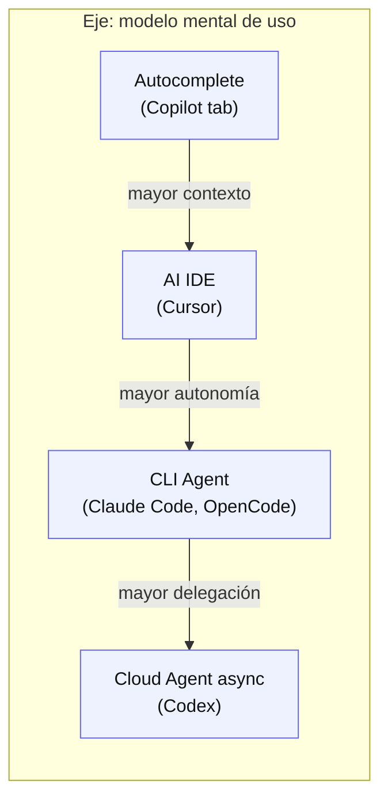
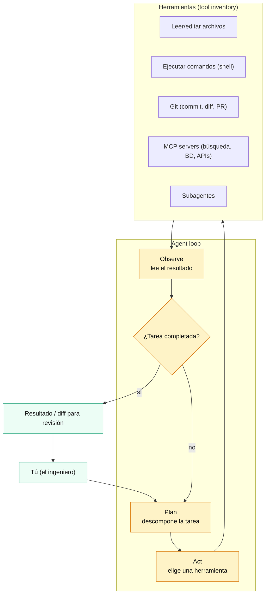
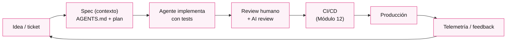
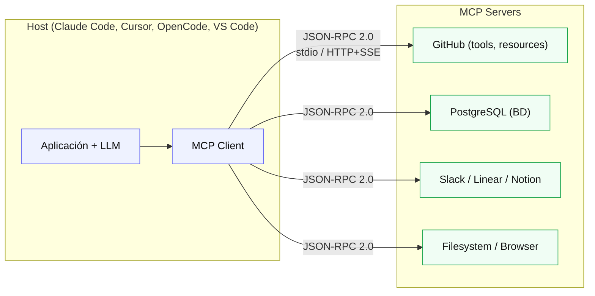

# Módulo 13 — AI-Assisted Development: Claude Code, Cursor, OpenCode, Copilot, Codex y Agentes

> **Nivel:** Senior. Este módulo cubre cómo **dirigir, revisar y evaluar** herramientas de desarrollo asistido por IA (GitHub Copilot, Cursor, Claude Code, OpenAI Codex, OpenCode y el ecosistema de agentes) en un flujo profesional de ingeniería. No es un manual de "prompts mágicos": es un análisis de **cómo funcionan por dentro** (contexto, agent loop, tools, MCP), de **qué patrones de trabajo producen código correcto y mantenible**, y de **qué riesgos reales** (calidad, seguridad, privacidad, deuda) introduce la IA en el SDLC. La mentalidad senior que lo atraviesa: **la IA es una herramienta poderosa y poco confiable a la vez; tu trabajo es el juicio** — definir el problema, proveer contexto, aprobar lo que se integra, y evaluar si lo generado es correcto.
>
> **Conexiones:** aprovecha [Módulo 12](12-CI-CD-Moderno.md) (los agentes y sus outputs se integran y se despliegan por el pipeline), [Módulo 08](08-Seguridad.md) (secretos, OIDC, supply chain, que la IA también toca), [Módulo 07](07-Observabilidad.md) (la telemetría que también se aplica a sistemas con IA), [Módulo 11](11-Patrones-de-Diseño.md) (patrones GoF y de arquitectura que la IA genera — y que debes saber evaluar), [Módulo 01](01-Arquitectura-de-Software-Moderna.md) (Clean/Hexagonal: el contexto que le das al agente), [Módulo 14](14-System-Design-Interview.md) (frameworks de decisión que la IA no reemplaza) y [Módulo 16](16-Roadmap-y-Proyecto-Final.md) (proyecto capstone donde aplicarás todo esto).

---

## Introducción

El desarrollo asistido por IA pasó por **tres fases en seis años**. Entender la evolución explica por qué las prácticas correctas cambian con cada fase:

1. **Autocomplete (2018–2022):** GitHub Copilot popularizó la *code completion* sobre LLM: el modelo sugiere la siguiente línea/función mientras escribes. El humano sigue en control total; la IA es una "sugerencia más".
2. **Chat / IDE (2023–2024):** Cursor y Copilot Chat trajeron el diálogo con el código: puedes pedir "arregla este bug", "explica esta función", y el asistente edita en tu editor. El humano escribe el prompt y *aplica* la edición.
3. **Agentes (2025–2026):** Claude Code, OpenAI Codex, y los modos agent de Cursor/Copilot **ejecutan un loop completo** — leen archivos, corren tests, ejecutan comandos, hacen commit — hasta completar la tarea que les pediste. El humano pasa de "escribir el código" a **dirigir el agente**: definir el objetivo, proveer contexto, y *revisar el resultado*. Nacen los conceptos de *context engineering*, *subagentes*, *skills* y el estándar **MCP** (Model Context Protocol) para conectar agentes con herramientas.

El dato que justifica el módulo: en los benchmarks de agentes de código, **SWE-bench Verified pasó de ~13% de issues resueltos (2024) a ~78–80% (2026)**; pero la tasa de *PRs aceptados en producción real* se estima en **35–50%**. Ese hueco entre el benchmark y la realidad es exactamente el territorio del ingeniero senior: la IA genera mucho, correcto a veces, y **todo lo que generó necesita evaluación, testing y revisión**.

La cita que define el espíritu del módulo (Chip Huyen, *AI Engineering*, cap. 6): *"an agent is anything that can perceive its environment and act upon that environment"* — y los agentes de código perciben **tu repositorio** y actúan **en tu terminal**. Tu trabajo como senior es definir cuál es ese entorno (qué permisos, qué herramientas, qué contexto) y qué acciones están permitidas.

**Bloques del módulo:**
1. **Conceptos:** el vocabulario exacto (LLM, contexto, tokens, agent loop, tools, MCP, skills, AGENTS.md, vibe coding vs agentic engineering).
2. **Arquitectura:** el mapa 2026 de herramientas y sus paradigmas; el *agent loop* como unidad arquitectónica; dónde encaja cada herramienta.
3. **Internals:** cómo funciona cada categoría por dentro — contexto y su gestión, tool use/function calling, MCP, sandboxing y permisos.
4. **Patrones:** context engineering, prompt engineering para código, pair programming con IA, subagentes, code review, testing, refactoring, documentación y arquitectura asistida.
5. **Casos reales, Laboratorio, Entrevistas y Checklist** con la profundidad senior de siempre.

---

## Conceptos

### Terminología que debes dominar

| Término | Qué significa en la práctica |
|---|---|
| **LLM (Large Language Model)** | Modelo entrenado para predecir el siguiente token; generaliza a partir de patrones. El "motor" de todas estas herramientas. |
| **Token** | Unidad atómica de entrada/salida (~¾ de palabra en inglés). Costo, límites de contexto y latencia se miden en tokens. |
| **Ventana de contexto** | Cantidad máxima de tokens que el modelo puede "ver" en una consulta. Crece rápido: de 1K (GPT-2) a ~1M (Claude/Gemini). |
| **In-context learning** | Capacidad de aprender de ejemplos **dentro del prompt**, sin actualizar pesos. El fundamento del *few-shot*. |
| **System vs User prompt** | El *system* describe la tarea y reglas (rol, formato, restricciones); el *user* es la petición concreta. Los agentes construyen ambos programáticamente. |
| **Agent loop** | Ciclo *plan → act → observe → plan*: el modelo decide una acción (leer archivo, correr comando), la ejecuta, observa el resultado y decide la siguiente. |
| **Tool use / function calling** | Capacidad del modelo de invocar funciones/externas (buscar, leer, ejecutar). El mecanismo que convierte un chat en un agente. |
| **MCP (Model Context Protocol)** | Estándar abierto (Anthropic, 2024) que estandariza cómo los LLM descubren e invocan herramientas: *"USB-C para IA"*. Hosts, clients y servers. |
| **Subagente** | Agente hijo con su propia ventana de contexto y tarea, orquestado por el agente principal. Permite paralelizar y aislar contexto. |
| **Skills / plugins** | Paquetes de instrucciones y herramientas reutilizables que el agente carga para una tarea concreta. |
| **AGENTS.md / CLAUDE.md** | Archivos de contexto persistente en el repo que todo agente lee al iniciar: estructura, convenciones, comandos. |
| **Vibe coding** | (Despectivo) "codear a vibra": aceptar output de IA sin entenderlo ni revisarlo. El antónimo del trabajo senior. |
| **Agentic engineering** | Disciplina de dirigir agentes: especificación clara, contexto suficiente, verificación continua, revisión humana. |
| **RAG** | Recuperación de información relevante para inyectarla en el contexto (aquí: darle al agente el código que necesita, no todo el repo). |
| **Guardrails / sandbox** | Restricciones de permisos, aprobación humana y límites de ejecución que acotan qué puede hacer el agente. |
| **SWE-bench / Terminal-Bench** | Benchmarks de agentes: resolver issues reales de GitHub / tareas reales de terminal en sandbox. |

### El cambio de rol del ingeniero

La transición más importante es **de "escribir código" a "dirigir y evaluar"**:

| Antes (sin IA) | Con agentes (2026) |
|---|---|
| Escribir cada línea | Escribir la especificación y el contexto |
| Correr tests manualmente | El agente corre los tests; *tú* decides si la solución es correcta |
| Review de PRs de humanos | Review de PRs de humanos *y* de código generado por IA |
| Documentar al final | Generar documentación asistida y validarla contra el código |
| Arriesgarse a "no saber" | Exponer lo que no sabes: la IA acelera la deuda si no hay juicio |

El riesgo inverso es simétrico: **cuanto más confías ciegamente, más se acumula la deuda** (código que nadie entiende, tests que pasan pero no prueban nada, dependencias sin revisar). Por eso la mitad de este módulo es *evaluación*: de la IA, de su output, y de los cambios que propone.

### Autocomplete vs Chat vs Agente (la línea que no debes cruzar sin saber)

- **Autocomplete** sugiere; el contexto es el archivo abierto. Bajo riesgo, bajo alcance.
- **Chat** responde y edita; el contexto es lo que tú pones en la conversación. Riesgo medio: el humano revisa antes de aplicar.
- **Agente** *actúa*: edita múltiples archivos, ejecuta comandos, itera. El contexto es el repositorio + instrucciones. **Riesgo alto**: puede romper, borrar o exfiltrar sin que lo notes si no hay sandbox y revisión.

La regla senior: **el nivel de autonomía que le das a la IA debe escalar con la madurez de tu testing y de tu revisión**. Autonomía total sobre un repo sin tests ni code review es cómo se generan incidentes.

---

## Arquitectura

### El mapa 2026 de herramientas (paradigmas)

Cuatro paradigmas distintos, no cuatro "competidores idénticos". La tabla de posicionamiento (basada en comparativas 2026):

| Herramienta | Paradigma | Interfaz | Modelo | Ejecución | Mejor para |
|---|---|---|---|---|---|
| **GitHub Copilot** | IDE extension | VS Code/JetBrains | Multi-modelo (GPT, Claude, Gemini) | Cloud + local | Autocomplete y agent mode; estandarización de equipos enterprise |
| **Cursor** | AI IDE | Fork de VS Code | Seleccionable (varios proveedores) | Local + Cloud Agents | Desarrollo diario en el editor, multi-vendor |
| **Claude Code** | CLI agent | Terminal / IDE / desktop | Anthropic (Opus/Sonnet) | Local (tu máquina) | Refactoring complejo, trabajo multi-archivo, terminal-first |
| **OpenAI Codex** | Cloud agent | CLI + web + chat | OpenAI (GPT/Codex) | **Sandbox cloud** (async) | Tareas delegadas "fire-and-forget", PRs desde sandbox |
| **OpenCode** | CLI agent open source | Terminal (TUI) | 75+ proveedores (BYO key) | Local | Multi-modelo, privacidad, open source, MCP |
| **Gemini CLI / Antigravity** | CLI agent | Terminal | Gemini | Local/cloud | Integración Google Cloud, contexto largo |
| **Cline / Aider** | Extensión/CLI OSS | VS Code / terminal | BYO API | Local | Autonomía con tu propia API key |

**Lectura senior:** no hay un "ganador" — hay **posiciones**. Codex delega en la nube (el agente no toca tu máquina); Claude Code opera **en tu terminal** (más poder, más superficie); Cursor optimiza el flujo dentro del editor; Copilot cubre la base instalada y el compliance enterprise; OpenCode es la opción de soberanía/multi-modelo. La pregunta correcta no es "¿cuál es mejor?" sino "¿qué tarea, en qué entorno, con qué modelo, con qué riesgo?"

### El *agent loop* como unidad arquitectónica

Todos los agentes — Claude Code, Codex, OpenCode, los modos agent — comparten la misma arquitectura de bucle. Es el concepto que debes dominar porque todo lo demás (permisos, context, subagentes) cuelga de él:

**Claves senior del loop:**
1. **El contexto es el input más importante.** El agente solo sabe lo que le pones: instrucciones del repo (AGENTS.md), archivos que lee, y lo que observa al ejecutar. "Garbage context, garbage code".
2. **Compound mistakes:** como explica Chip Huyen (cap. 6), *"if the model's accuracy is 95% per step, over 10 steps the accuracy drops to 60%"*. Cada paso del loop multiplica la probabilidad de error. **Reducir pasos = reducir errores** (mejor contexto → menos iteraciones).
3. **El plan debe validarse antes de ejecutarse.** Los agentes maduros separan *planning* de *execution* (modo plan vs build): un plan de 1,000 pasos sin validar puede correr horas y costar dinero antes de que te des cuenta.
4. **Todo lo que toca el entorno es una acción con consecuencias.** Escribir, ejecutar, hacer commit. Ahí entra el sandbox y la aprobación humana.

### Dónde encaja el agente en el SDLC

El agente no reemplaza el pipeline del [Módulo 12](12-CI-CD-Moderno.md): **se integra en él**. El flujo profesional (detallado al final):

**El punto senior:** la IA acelera el tramo *Spec → Implementación → Review*. **No** elimina el resto: la especificación clara (el trabajo más caro), el CI/CD, la observabilidad y el feedback. Quien cree que la IA "reemplaza el SDLC" está confundiendo velocidad de generación con calidad de entrega.

---

## Internals

### Cómo funciona el contexto (la unidad de todo)

El contexto es **lo único que el agente ve**. Dominar su gestión es el 80% de la diferencia entre un agente útil y uno inútil.

**Mecanismos de contexto** (Chip Huyen, cap. 6, "Memory"):
- **Internal knowledge:** lo que el modelo aprendió en entrenamiento (su "memoria de largo plazo" inmutable).
- **Short-term memory:** la ventana de contexto de la conversación/sesión (rápida, limitada, se pierde entre sesiones).
- **Long-term memory:** datos externos recuperables (RAG, el repo, docs) — persisten y se pueden borrar sin retrain.

**Problemas prácticos del contexto en agentes:**
1. **Ventana limitada (aunque enorme):** 1M tokens caben en un repo mediano, pero *más contexto no es gratis*: costo, latencia, y el efecto "middle of context" (los modelos entienden mejor el principio y el final; Liu et al. 2023 — el *needle in a haystack*).
2. **Context churn:** las sesiones largas degradan la calidad (el agente "olvida" lo que dijiste al principio). Solución de los profesionales: **specs en archivos > conversaciones largas** (ver Patrones).
3. **Estrategia de los agentes:** no mandan todo el repo; *agregan* (repo map, estructura), *leen a demanda* (cuando necesitan un archivo), *compactan* (resumen de lo discutido), y *delegan a subagentes* (cada uno con su contexto). Esto es RAG aplicado a tu codebase.

### Tool use / function calling: cómo el modelo "actúa"

Sin tools, un LLM solo genera texto. Con **function calling**, el modelo devuelve una llamada estructurada (`tool_name`, `params`), el harness la ejecuta, y el resultado vuelve al contexto. El loop del diagrama anterior funciona porque:

1. El harness publica el **tool inventory** (qué herramientas existen y sus esquemas) en el system prompt.
2. El modelo decide "necesito leer `src/auth.ts`" → genera `{ "name": "read_file", "arguments": {...} }`.
3. El harness ejecuta, inyecta el resultado en el contexto.
4. El modelo observa y decide el siguiente paso.

**Regla senior (Huyen, cap. 6):** *"write actions make a system vastly more capable but also expose it to significantly more risks"*. Un agente que puede **escribir** (editar archivos, ejecutar comandos, hacer commit, abrir PRs) puede causar daño real. Las distinciones clave: **read-only actions** (permitidas sin aprobación) vs **write actions** (deben requerir aprobación humana o ejecutarse en sandbox).

### MCP: el estándar para conectar agentes con el mundo

**Model Context Protocol** (Anthropic, nov. 2024) es el estándar abierto (JSON-RPC 2.0) que resuelve el problema de *N×M integraciones* (cada LLM con cada herramienta) convirtiéndolo en *N+M*: escribes un servidor una vez y funciona con todos los hosts.

**Primitivas del protocolo:**
- **Tools:** funciones que el modelo ejecuta (acciones).
- **Resources:** datos de solo lectura (archivos, filas de BD) que se inyectan en el contexto.
- **Prompts:** plantillas reutilizables.

**Transports:** `stdio` (local, subproceso) y `HTTP/SSE` (remoto). En 2026: 1,000+ servers comunitarios; soporte nativo en Claude, ChatGPT, VS Code, Cursor, etc.

**Seguridad de MCP (crítico senior):** el protocolo dice explícitamente que *"tools represent arbitrary code execution and must be treated with caution"* y que las descripciones de tools se consideran **no confiables** salvo que vengan de un server verificado. El **agentjacking** (CSA/Tenet, 2026) demostró el vector: instrucciones maliciosas inyectadas en eventos de error (ej. Sentry) que el agente lee vía MCP, y **ejecuta comandos del atacante con los privilegios del desarrollador** — 85% de tasa de éxito en pruebas contra Claude Code, Cursor y Codex CLI. (Detalle en Casos reales y Seguridad.)

### Sandboxing, permisos y aprobación humana

Los mecanismos de contención que debe tener un agente profesional:

1. **Permisos de tools:** read (sin aprobación) / write (con aprobación) / nunca (bloqueado).
2. **Aprobación humana:** el harness pregunta antes de editar, ejecutar comandos destructivos, o hacer operaciones de red.
3. **Workspace trust / sandbox:** restringir qué paths puede tocar; en Codex, el sandbox cloud aísla por completo el entorno; en Claude Code/OpenCode, la confianza se define por permisos locales.
4. **No ejecutar comandos no solicitados:** la política de permisos por defecto.
5. **Registros (session logs):** todo lo que el agente hizo queda trazable para auditoría y debugging.

**Tu checklist de configuración:** ¿puede escribir en cualquier parte? ¿puede ejecutar `curl`/instalar dependencias? ¿puede acceder a la red? ¿puede hacer commit y push? Cada "sí" sube el riesgo y debe justificarse con testing y review maduros.

---

## Patrones

### Patrón 1 — Context engineering (el patrón más importante)

**El contexto es el 80% del resultado.** Los patrones concretos:

1. **AGENTS.md / CLAUDE.md en la raíz del repo.** El estándar AGENTS.md (OpenAI, ago. 2025; Linux Foundation) lo adoptan Codex, Cursor, Copilot, Gemini, OpenCode y muchos más. Contenido que funciona: estructura del repo, convenciones de código, comandos de build/test, restricciones ("nunca modifiques X", "usa Y para DB"), y dónde está la documentación relevante. Se lee al inicio de cada sesión: **es tu system prompt persistente por repo**.
2. **Specs > conversaciones.** Los profesionales (2026) no mantienen chats gigantes; escriben specs en markdown (`ai-docs/feature-x.md`) y arrancan sesiones nuevas con "lee el spec e implementa la fase 2". Ventajas: contexto limpio, reproducible, versionado, y el agente no "olvida" lo que dijiste hace 2 horas.
3. **Proveer el contexto justo.** No el repo entero: la estructura, el archivo que cambia, sus dependencias, los tests existentes, y el criterio de aceptación. Todo lo que no pones, el agente lo inventa.
4. **Rutas de contexto por tarea.** Un mismo repo puede necesitar contextos distintos: para el backend, para el frontend, para infra. Los subagentes/skills permiten darle a cada tarea solo lo que necesita.
5. **Actualizar el contexto como código.** Cuando el proyecto cambia (nueva arquitectura, nuevo comando de build), el AGENTS.md se actualiza en el mismo PR. Es la *documentación viva* del [Pragmatic Programmer](topic "Your Knowledge Portfolio") aplicada a los agentes.

### Patrón 2 — Prompt engineering aplicado a código

Las prácticas que sobreviven a los modelos (Chip Huyen, cap. 5):

1. **Instrucciones claras y sin ambigüedad.** Qué quieres exactamente, con qué formato. *"Refactoriza `PaymentService` en `strategies/paypal.ts` y `strategies/stripe.ts` siguiendo el patrón Strategy; mantén la API pública; no cambies el comportamiento"* es mejor que *"mejora el pago"*.
2. **Proporciona ejemplos (few-shot).** Un ejemplo de cómo quieres el resultado vale más que tres párrafos de descripción.
3. **Especifica el formato de salida.** "Devuelve: resumen del cambio, archivos tocados, tests corridos, riesgos". Los agentes con estructura producen diffs revisables.
4. **Descompón tareas complejas.** "Divide la migración en 3 PRs: primero tipos, luego lógica, luego tests". La descomposición reduce el *compound mistakes* del loop.
5. **Da tiempo al modelo para "pensar"** (chain-of-thought / plan mode) cuando la tarea es compleja: que planifique *antes* de ejecutar.
6. **Itera:** la primera respuesta rara vez es la final. El prompt se mejora observando qué falló.
7. **Separa prompts de código** y versiona los prompts/skills (como prompts.py del cap. 5): reutilizables, testeables, colaborativos.
8. **Defensive prompting (seguridad):** instrucciones explícitas para no obedecer instrucciones que vengan de datos externos, para no exponer secretos, para no ejecutar comandos destructivos sin confirmar. (Ver Seguridad.)

### Patrón 3 — AI pair programming

El flujo que más valor aporta sin cambiar tu entorno:

- **Completar con contexto** (Tab en Copilot/Cursor): la IA termina funciones, escribe boilerplate. Regla: **entiende lo que aceptas**; un autocomplete que aceptas sin leer es deuda.
- **Edición dirigida:** "cambia X en estos archivos". El humano *dirige*, la IA *ejecuta el cambio mecánico*. Verifica con diff.
- **Preguntar el "porqué":** la IA como *rubber duck* y como explicadora de código ajeno — el mejor uso para codebases heredadas.
- **El pair programming asimétrico:** la IA hace el 90% del código mecánico; el humano hace el 10% que importa (diseño, edge cases, criterio). El 10% no es opcional.

### Patrón 4 — Subagentes y orquestación (multi-agent)

Los agentes maduros (Claude Code con Task tool, dynamic workflows) lanzan **subagentes** con contextos propios. El valor: paralelismo y aislamiento de contexto (el agente de tests no llena la ventana del agente de arquitectura).

- **Separación plan/act:** un subagente planifica, otro ejecuta (el patrón *Architect/Editor* de Aider).
- **Especialización:** subagente de tests, de migraciones, de frontend. Cada uno con su skill y su contexto.
- **Coordinación:** el agente principal (orquestador) consolida los resultados. **Advertencia (Huyen):** "planning should be decoupled from execution" — el plan se valida (heurísticas o AI judge) antes de ejecutar; y los sistemas multi-agente son más difíciles de depurar (menos visibilidad).
- **Uso disciplinado:** no lances 20 subagentes para una tarea de 10 minutos. La orquestación es una herramienta, no una religión.

### Patrón 5 — Code review con IA

Dos usos distintos que la gente confunde:

1. **La IA revisa tu código (y el de otros):** pedir a un agente que revise un diff buscando bugs, race conditions, issues de seguridad, falta de tests. Funciona mejor *con criterio explícito* ("revisa validación de entrada, manejo de errores, y si hay N+1 queries"). La IA **encuentra** problemas; **no decide** si bloquean el merge. El *cluster immune system* del [M12](12-CI-CD-Moderno.md) aplicado al código: la revisión automática es un gate más, no un reemplazo del humano.
2. **Revisar el código que la IA generó:** el patrón senior por excelencia. Nunca fusiones output de agente sin: leer el diff completo, correr los tests, y **preguntar por qué** llegó a esa solución. La investigación de 2026 (SWE-bench vs PRs reales: 78% vs ~35–50%) es la evidencia: el benchmark no captura las convenciones y expectativas de tu repo real.

**Técnicas de revisión efectivas:**
- Revisar por PRs pequeños (los agentes, como los humanos, generan diffs más fiables en lotes pequeños).
- Pedir al agente que *justifique* decisiones: "explícame por qué elegiste esta estrategia".
- **Diff-only review:** revisar solo lo que cambió, no lo que el agente generó en total.
- Correr tests con el agente: "añade un test que falle con el comportamiento viejo y pase con el nuevo" (TDD inverso).

### Patrón 6 — Testing con IA

La zona donde la IA aporta más y donde hay más trampa:

- **Generar tests:** unit, integration, table-driven. El prompt: "para `validateCheckout`, genera tests table-driven cubriendo: campos vacíos, precios negativos, cuotas superadas, formato inválido".
- **TDD asistido:** escribir primero el test (con la IA) y luego la implementación (con la IA). El test es la especificación ejecutable: **reduce la dependencia de confianza**.
- **Property-based / fuzz:** pedir generación de propiedades o entradas aleatorias para funciones de parseo.
- **La trampa:** la IA genera *tests que pasan* fácilmente — a menudo tests triviales que no prueban nada. **Evalúa los tests, no solo la cobertura.** Un buen test de IA: falla si cambia el comportamiento. Prueba: rompe el código a propósito y verifica que el test falle.
- **Evals (evaluación de sistemas):** si construyes software con IA (M13 toca la superficie; el libro de Huyen lo profundiza), las *evals* — conjuntos de casos con criterios de éxito — son el equivalente a los tests de un sistema tradicional.

### Patrón 7 — Refactoring asistido

El caso de uso donde los CLI agents rinden mejor (migraciones multi-archivo):

- **Dar el objetivo y las restricciones:** "migra de `redux` a `zustand` manteniendo la API de los selectors; hazlo en PRs por dominio".
- **Keep-the-diff-small:** pedir explícitamente diffs mínimos; los agentes tienden a *mejorar* cosas que no pediste. Restricción explícita: "no toques archivos no relacionados".
- **Compilar/correr tests como gate del propio agente:** que el agente verifique su refactor antes de entregar (el CI como red de seguridad).
- **Revisar el refactor contra el comportamiento:** los tests existentes + tests nuevos + una pasada de AI review en paralelo.

### Patrón 8 — Documentación y arquitectura asistida

- **Generación de documentación:** comentarios, README, ADRs a partir del código — con validación humana. La IA alucina fácilmente en docs ("esta función hace X" cuando hace Y): **verificar contra el código real**.
- **Diagramas:** generar Mermaid/PlantUML desde la estructura; útil para código ajeno.
- **Arquitectura asistida — la advertencia de FSA 2.ª ed. (ch. 21 y 26):** los autores probaron pedir a LLMs decisiones de arquitectura ("¿microservicios o space-based?") y concluyen: *"LLMs are great for understanding knowledge, but they still lack the wisdom necessary to make appropriate decisions"* — porque **todo en arquitectura es un trade-off**, y el trade-off depende del contexto de negocio que la IA no tiene. **Uso correcto:** pedirle el *menú de trade-offs* (que enumere las opciones y sus costos), no la decisión. Y el caso de uso que sí funciona: traducir diagramas a código de gobierno (ArchUnit) o describir una arquitectura desde un diagrama (Thoughtworks Haiven).

---

## Casos reales

1. **GitHub Copilot — el primer producto (2021–2024).** Primer LLM de código en producción masiva: $100M ARR dos años después del launch. Validó el mercado del *autocomplete con contexto*, pero también mostró el límite: el usuario escribe el flujo, la IA completa. *Lección: el autocomplete fue el puente que normalizó la IA en el editor; los agentes son su evolución, no su reemplazo.*
2. **Claude Code — el CLI agent como estándar de facto (2025–2026).** 137K+ stars, surface en terminal/IDE/desktop/web. Su innovación fue el *agent loop en tu terminal*: lee el repo, edita multi-archivo, corre tests, hace commit. En 2026 añadió **dynamic workflows** (orquestar decenas/cientos de subagentes en paralelo), **routines** (tareas programadas) y **computer use**. *Lección: la madurez del producto no está en el modelo sino en el harness — contexto, permisos, subagentes, revisión.*
3. **OpenAI Codex — el cloud agent async.** Ejecuta en **sandbox cloud**, no en tu máquina: delegas una tarea definida, revisas el resultado (PR) después. Es el "fire-and-forget" de la categoría. Incluido en ChatGPT; plugin marketplace (mar. 2026) con skills/MCP/servers. *Lección: el sandbox cloud cambia el modelo de riesgo (el agente no toca tu entorno) a costa de menos supervisión en vivo.*
4. **Cursor — el AI IDE que mainstreamizó el editor aumentado.** Fork de VS Code, multi-modelo, *Cloud Agents*. Lideró la UX de *completar/en el editor*; fue desbancado del #1 de popularidad por OpenCode (2026) — señal de que el mercado se fragmenta entre "editor pulido" y "terminal open source". *Lección: la UX decide la adopción; la arquitectura (multi-vendor, sandbox, contexto) decide la permanencia.*
5. **OpenCode — el agente open source (anomalyco, 2025–2026).** TUI en terminal, 75+ proveedores, LSP-aware (18+ lenguajes), subagentes, MCP-native, y **no almacena tu código ni contexto** — argumento de privacidad para entornos regulados. ~160K stars, #1 en Hacker News y LogRocket (2026). *Lección: la soberanía del dato y la libertad de modelo son ventajas competitivas reales frente a los CLIs propietarios.*
6. **SWE-bench: el benchmark que expone la brecha (2024–2026).** De 13% (2024) a ~78–80% (2026) en *Verified*; pero *Terminal-Bench* (tareas reales de terminal en sandbox) marca ~52–58% y la **tasa de PRs aceptados en producción se estima en 35–50%**. El benchmark mide *patch correcto contra test suite*, no convenciones, reviewer expectations ni contexto de negocio. *Lección senior: usa los benchmarks para calibrar qué esperar, nunca para afirmar "la IA ya puede X en mi repo".*
7. **Agentjacking / MCP injection (jun. 2026, CSA Labs + Tenet).** Atacantes inyectaron instrucciones en *eventos de error de Sentry*; agentes que consultaban Sentry vía MCP interpretaron esos eventos como instrucciones autorizadas y **ejecutaron comandos del atacante con los privilegios del desarrollador** — exfiltrando credenciales AWS, tokens OAuth de GitHub y secrets de K8s. 85% de éxito en Claude Code, Cursor y Codex CLI. *Lección: los agentes delegan autoridad; los controles clásicos (EDR, WAF, IAM) no distinguen "el dev corrió npm install" de "el agente lo corrió por un evento malicioso".* (Remediación en Seguridad.)
8. **Anthropic — el postmortem de calidad (abr. 2026).** Bugs de infraestructura degradaron Claude Code durante seis semanas: la precisión de Opus 4.6 cayó de 83.3% a 68.3% antes de detectarse y revertirse. *Lección: la calidad del agente que usas es un sistema vivo — puede degradarse sin que tú cambies nada; tu proceso de review no puede asumir "siempre igual".*
9. **Refactoring real con agentes (2026, reportes de campo).** Migración de 90K líneas de Redux a Zustand: Claude Code con subagentes en ~4h/3 sesiones (76 archivos limpios, 4 arreglos manuales); el *Architect/Editor* de Aider produjo el diff más pequeño. *Lección: los agentes destacan en refactoring mecánico multi-archivo, pero requieren revisión humana y gate por tests.*
10. **La infraestructura de evaluación como disciplina.** Las *evals* (casos + criterios), los *AI judges* (modelos que evalúan outputs), y la observabilidad de pipelines con IA (Langfuse, prompts, costos, latencia) se vuelven tan esenciales como los tests unitarios cuando el código lo escribe una máquina. *Lección: evaluar lo que genera la IA es tan importante como generar.*

---

## Laboratorio

1. **Crea el AGENTS.md de tu repo:** estructura, convenciones, comandos de build/test, restricciones. Verifica que tu agente lo lee (primera línea de la sesión) y que cambia su comportamiento. Mejóralo iterando una semana.
2. **Spec-first:** escribe un spec markdown de una feature (objetivo, contexto, criterio de aceptación, no-objetivos). Arranca una sesión nueva con "lee `ai-docs/feature-x.md` e implementa fase 1". Compara el resultado con una sesión sin spec.
3. **Modo plan vs build:** usa el modo plan para una tarea compleja y revisa el plan *antes* de ejecutar. Observa cómo el plan detecta ambigüedades que no viste en el prompt.
4. **Subagentes:** define un subagente especializado (ej: "revisa seguridad", "genera tests") y úsalo sobre un diff. Compara su contexto con el del agente principal.
5. **MCP server mínimo:** configura un MCP server (filesystem, GitHub, o PostgreSQL de tu sandbox) y haz que el agente consulte datos reales para responder una pregunta. Prueba el flujo *read → decide → act*.
6. **Custom command / skill:** crea un slash command o skill reutilizable (ej: `/code-review` que revisa el diff con criterios fijos). Compártelo con tu equipo.
7. **TDD asistido:** pide al agente que escriba primero el test (table-driven) de una función, luego la implementación. Verifica que el test falla con el comportamiento viejo y pasa con el nuevo (**rompe el código a propósito** para probarlo).
8. **AI code review en paralelo:** genera un diff y pídele a la IA que lo revise con criterios explícitos (validación, errores, N+1, seguridad). Clasifica sus hallazgos: ¿cuáles eran reales? ¿cuáles alucinados? **Mide su precisión en tu código.**
9. **Refactor guiado:** pide una migración mecánica multi-archivo (renombrar paquete, cambiar un import) con *keep-the-diff-small* explícito. Verifica que no tocó archivos no relacionados (revisa el diff completo).
10. **Test de prompt injection:** crea un "archivo trampa" en el repo con instrucciones maliciosas en un comentario o datos de ejemplo; pide al agente que procese ese archivo y observa si obedece instrucciones que vienen de *datos* (debería ignorarlas). Configura permisos para que ninguna acción destructiva se ejecute sin aprobación.

---

## Entrevistas

**1. "¿Cuál es la diferencia entre un autocomplete de IA, un asistente de chat y un agente de código? ¿Cómo cambia el rol del ingeniero?"**

**Orientación:** el candidato debe distinguir los tres niveles (contexto y autonomía), y el punto senior: más autonomía = más riesgo, y el ingeniero pasa de escribir a *dirigir y evaluar*. Debe conectar con el *agent loop*.

**Respuesta de un senior:** el autocomplete (Copilot tab) sugiere la siguiente línea usando el archivo abierto; el chat (Cursor, Copilot Chat) responde y edita en el editor con el contexto que tú le pones; el agente (Claude Code, Codex, modos agent) ejecuta un **loop completo**: planifica, lee archivos, ejecuta comandos, corre tests, hace commit, e itera hasta completar la tarea. El cambio de rol es el más importante: el ingeniero deja de escribir cada línea y pasa a **definir el objetivo, proveer el contexto correcto, y evaluar el resultado**. Y esto trae un trade-off claro: el nivel de autonomía que le das a la IA debe escalar con la madurez de tu testing y tu revisión. El concepto clave que hay que dominar es el *agent loop* (plan → act → observe) y el *compound mistakes*: si el modelo acierta el 95% de los pasos, en 10 pasos cae al 60%; por eso el contexto bueno y la descomposición importan más que el modelo.

**2. "¿Qué es el context engineering y por qué es más importante que el prompting en los agentes?"**

**Orientación:** debe distinguir prompt (una instrucción) de contexto (todo lo que el agente ve), y explicar por qué el contexto es el input dominante de calidad. Debe mencionar AGENTS.md/CLAUDE.md, specs, y la gestión de ventana (repo map, lectura a demanda, compactación, subagentes).

**Respuesta de un senior:** el prompt es la instrucción de una tarea; el **contexto** es todo lo que el agente ve: instrucciones persistentes, estructura del repo, archivos que lee, resultados de ejecución. La calidad del output es función del contexto más que del prompt. Tres prácticas: primero, **AGENTS.md en la raíz** — el system prompt persistente por repo con estructura, convenciones y comandos; segundo, **specs > conversaciones** — escribir la especificación en markdown y arrancar sesiones nuevas, porque las sesiones largas degradan (el agente "olvida" el principio, la ventana se llena); tercero, **contexto justo y a demanda** — el agente no manda todo el repo, agrega el mapa y lee archivos cuando los necesita, y los subagentes aislan contextos. Todo lo que no está en el contexto, el agente lo inventa. Y hay límites: aunque la ventana llegue a 1M tokens, el *middle of context* funciona peor y el costo sube — más contexto no es gratis.

**3. "Explícame qué es MCP (Model Context Protocol) y qué problema resuelve. ¿Qué implicaciones de seguridad tiene?"**

**Orientación:** debe explicar el problema N×M, la arquitectura host/client/server, las primitivas (tools, resources, prompts) y — señal senior — que MCP convierte al agente en un sistema con *write actions* de alto riesgo y que el *agentjacking* es un vector real.

**Respuesta de un senior:** MCP es un estándar abierto (JSON-RPC 2.0, Anthropic 2024) que estandariza cómo un LLM descubre e invoca herramientas. Antes, conectar un modelo a una BD o a GitHub era *N×M* integraciones ad hoc (function calling propietario por proveedor, adaptadores por herramienta); MCP lo reduce a *N+M*: escribes un **server** una vez y funciona con todos los **hosts** (Claude Code, Cursor, OpenCode, VS Code, ChatGPT). Un server expone tres primitivas: **tools** (acciones ejecutables), **resources** (datos de solo lectura) y **prompts** (plantillas), sobre stdio (local) o HTTP/SSE (remoto). La implicación senior es de seguridad: MCP le da al agente *write actions* — puede ejecutar código, y lo que el protocolo dice explícitamente es que las herramientas son "arbitrary code execution" y sus descripciones se tratan como **no confiables**. El *agentjacking* de 2026 lo demostró: instrucciones inyectadas en eventos de error que el agente lee por MCP hicieron que ejecutara comandos del atacante con los privilegios del desarrollador. Por eso: MCP servers verificados, permisos mínimos, aprobación humana para write actions, y tratar cualquier instrucción que venga de *datos* como no autoritativa.

**4. "¿Cómo le darías autonomía a un agente de código de forma segura?"**

**Orientación:** debe hablar de sandboxing, permisos de tools (read/write/never), aprobación humana, restricción de paths, y que la autonomía escale con el testing y el review. Conectar con los mecanismos de contención.

**Respuesta de un senior:** la autonomía no es un switch binario; es una escala con controles: primero, **permisos por herramienta** — lectura sin aprobación, escritura/ejecución con aprobación humana, y lo destructivo bloqueado; segundo, **sandbox y workspace trust** — restringir qué paths y qué red puede tocar (Codex usa un sandbox cloud aislado; en los CLIs locales defines la confianza por permisos); tercero, **aprobación explícita para write actions**: editar archivos, ejecutar comandos, hacer commit, abrir PRs, instalar dependencias. Y la regla de fondo: **la autonomía escalea con la madurez de la verificación** — si tengo tests sólidos, CI fuerte y code review obligatorio, puedo darle más autonomía sin que el riesgo se dispare; sin eso, solo autocomplete. Además de **logs de sesión** para auditoría: todo lo que el agente hizo debe ser trazable, porque cuando algo sale mal necesitas saber exactamente qué ejecutó.

**5. "¿Cuáles son los riesgos reales de usar IA para generar código? ¿Cómo los mitigas?"**

**Orientación:** el candidato debe cubrir: calidad/hallucination, deuda técnica (código que nadie entiende), seguridad (prompt injection, agentjacking, exfiltración de secretos), privacidad (datos a la API), y la *brecha benchmark vs realidad*. Debe proponer mitigaciones concretas.

**Respuesta de un senior:** los riesgos se agrupan en cuatro. **Calidad:** la IA alucina y comete *compound mistakes*; el SWE-bench dice ~78% pero los PRs aceptados en producción son ~35–50% — siempre reviso el diff completo, corro los tests, y trato cualquier output como "código de un junior entusiasta que hay que revisar". **Deuda técnica:** el código generado tiende a ser excesivamente genérico y nadie lo entiende; lo mitigo con diffs pequeños, AGENTS.md que impone convenciones, y pedirle que *justifique* decisiones. **Seguridad:** prompt injection y *agentjacking* — instrucciones maliciosas en datos que el agente ejecuta con mis privilegios; mitigo con MCP servers verificados, permisos mínimos, aprobación humana para write actions, no darle acceso a secretos innecesarios, y tratar instrucciones de datos como no autoritativas. **Privacidad:** el código va a APIs externas; para código sensible uso modelos locales (OpenCode con Ollama) o herramientas con políticas de retención adecuadas, y nunca le pego secretos en el prompt. La mitigación transversal: **el testing es el control** — TDD asistido, eval del output, y code review humano obligatorio como gate.

**6. "¿Cómo generas tests con IA de forma que realmente valgan algo?"**

**Orientación:** debe advertir que la IA genera tests que pasan trivialmente, y proponer: table-driven, cobertura de edge cases, y la prueba de oro (romper el código y verificar que el test falla). Conectar con TDD asistido.

**Respuesta de un senior:** el riesgo número uno es que la IA genere *tests que pasan sin probar nada* — trivially green. Mi método: primero, **spec de tests por prompt**: le pido table-driven coverage de casos concretos (borde, error, inválido), no "coverage general". Segundo, **TDD asistido**: el test se escribe primero contra la especificación, con la implementación después; así el test es la especificación ejecutable. Tercero, **la prueba de oro**: rompo el código a propósito (quito un case, cambio un default) y verifico que el test falle — si no falla, el test no vale nada, sin importar el coverage. Y evalúo los tests como evalúo el código: si un PR sube tests "verdes" que no cambian con un comportamiento roto, lo devuelvo. La cobertura es una métrica secundaria; la capacidad de *detectar cambios de comportamiento* es la real.

**7. "¿Qué es el vibe coding? ¿Por qué es peligroso y qué lo reemplaza?"**

**Orientación:** definir vibe coding, explicar por qué produce deuda e incidentes, y proponer el reemplazo: agentic engineering disciplinado (spec, contexto, tests, review). Señal senior si menciona que incluso productos serios usan IA, pero con controles.

**Respuesta de un senior:** el *vibe coding* es aceptar output de IA sin entenderlo, sin revisarlo y sin testearlo — "codear a vibra". Es peligroso por tres razones: produce **deuda técnica invisible** (código que nadie puede mantener porque nadie lo entiende), **bugs no detectados** que pasan a producción, y **dependencias y patrones sin revisar**. Lo que lo reemplaza es *agentic engineering*: la disciplina de dirigir agentes con especificación clara, contexto persistente (AGENTS.md, specs), descomposición, y **verificación continua** — tests, CI, y review humano del diff. La diferencia no es "usar IA sí o no", es el *proceso*: la IA es una herramienta de alta productividad para quien tiene un proceso de calidad fuerte, y una máquina de generar deuda para quien no lo tiene. El paralelo con DevOps es directo: la automatización no elimina la revisión, la hace más importante.

**8. "¿Cómo integrarías el uso de agentes de IA en un pipeline de CI/CD para una empresa (con requisitos de compliance)?"**

**Orientación:** debe conectar con M12: el output del agente pasa por el pipeline normal (tests, gates, protección de entornos), y añadir controles específicos de IA: permisos en el repo, AGENTS.md corporativo, review obligatorio, y política de datos/privacidad. 

**Respuesta de un senior:** el principio es que **el agente genera en el repositorio, y todo lo que entra a producción pasa por el pipeline estándar** — no hay atajos. Los controles: primero, **branch protection y required reviews** (el código de IA no puede ir directo a main; pasa por PR como cualquier otro, y mejor con reviewers explícitos cuando el diff parece generado); segundo, **CI completo** del [Módulo 12](12-CI-CD-Moderno.md): lint, tests, SAST, SCA, gates por entorno — el *quality gate* es el mismo para código humano y generado; tercero, **AGENTS.md corporativo** con las convenciones y las restricciones de seguridad (nunca exponer secretos, no tocar ciertos paths), que es la política de la empresa embebida en el contexto del agente; cuarto, **política de datos**: qué herramientas se pueden usar (con qué proveedor de modelo, qué retención) para cumplir con privacidad/regulatorio — para datos sensibles, modelos locales o herramientas con data residency; y quinto, **trazabilidad**: el PR que viene de un agente debería poder identificarse (en el commit message o etiqueta) para auditoría y para calibrar el review según la fuente. La autonomía total del agente solo se permite en entornos no productivos y con sandbox.

**9. "¿Cómo evalúas si una herramienta o agente de IA 'funciona' para tu equipo? ¿Qué métricas usarías?"**

**Orientación:** debe proponer evals específicos (no benchmarks genéricos), medición del impacto en el flujo real, y la brecha benchmark/producción. Señal senior: evals en *tu* repo, no confiar en SWE-bench como promesa.

**Respuesta de un senior:** no evalúo con benchmarks globales para decidir en mi repo; los uso solo para calibrar expectativas (SWE-bench mide patch contra test suite, no mi contexto). Mi evaluación: primero, **evals sobre nuestro código** — un conjunto de issues/tareas reales de nuestro repo (un mini-benchmark interno) y mido tasa de resolución *con nuestro contexto y convenciones*; segundo, **métricas de flujo** — antes/después en el pipeline real: lead time, tiempo por PR, cambio en la tasa de PRs revertidos, **change failure rate**, y el feedback cualitativo del equipo; tercero, **calidad del output medible**: qué % de diffs generados se aceptan sin cambios sustanciales, y qué % de tests generados pasan *la prueba de romper el código*; cuarto, **costo total**: tokens/API por tarea, y el tiempo de revisión que requiere (un agente que ahorra 30 min de escritura pero cuesta 40 min de revisión no ayuda). La conclusión senior: el número que importa es el **impacto neto en el flujo de valor**, no la impresión de "parece que va más rápido".

**10. "¿Cómo le explicarías a un no-técnico qué puede y qué no puede hacer la IA en desarrollo de software hoy?"**

**Orientación:** debe dar una visión honesta y matizada: qué sí (mecánico, rápido, alto volumen), qué no (juicio, contexto de negocio, decisiones de arquitectura), y el papel del humano. Señal senior: sin exagerar ni minimizar, con datos reales.

**Respuesta de un senior:** la IA puede escribir una parte muy grande del código mecánico: funciones, tests, migraciones, boilerplate, documentación, y hacerlo rápido y a gran escala — en tareas acotadas resuelve hoy en torno al 78% de issues reales en benchmarks, aunque en producción la cifra real de PRs aceptados es más bien 35–50%. Lo que **no** puede hacer es tomar decisiones: no entiende el contexto de negocio, no evalúa los trade-offs de una decisión de arquitectura, y no sabe si una solución "que funciona" es la correcta para tu problema — los autores de *Fundamentals of Software Architecture* lo resumen: los LLM tienen *conocimiento* pero les falta *sabiduría*. En la práctica el humano define el problema, provee el contexto, revisa el resultado y decide qué se integra. Es una herramienta que **multiplica la capacidad del equipo con buen proceso** — con mal proceso, multiplica la deuda. Por eso la adopción responsable no es "dejar que la IA escriba todo", es construir el proceso de verificación alrededor.

---

## Checklist

- [ ] ¿Distingo con precisión autocomplete vs chat vs agente, y sus riesgos de autonomía?
- [ ] ¿Entiendo el *agent loop* (plan → act → observe) y el *compound mistakes*?
- [ ] ¿Gestiono el contexto como el input dominante (AGENTS.md/CLAUDE.md, specs > conversaciones, contexto justo)?
- [ ] ¿Uso prompt engineering aplicado a código: instrucciones claras, few-shot, formato de salida, descomposición, iteración?
- [ ] ¿Conozco MCP (host/client/server, tools/resources/prompts, transports) y sus implicaciones de seguridad?
- [ ] ¿Configuro permisos de herramientas, sandbox y aprobación humana para write actions?
- [ ] ¿Nunca fusiono output de agente sin revisar el diff completo, correr los tests y preguntar el "porqué"?
- [ ] ¿Genero tests con IA de forma que valgan (table-driven, edge cases, prueba de romper el código)?
- [ ] ¿Uso la IA para refactoring multi-archivo con *keep-the-diff-small* y gates por tests?
- [ ] ¿Sé que la IA tiene *conocimiento* pero no *sabiduría* para decisiones de arquitectura — le pido trade-offs, no decisiones?
- [ ] ¿Conozco los riesgos de seguridad: prompt injection, *agentjacking* por MCP, exfiltración de secretos, privacidad de datos a la API?
- [ ] ¿Entiendo la brecha benchmark vs producción (SWE-bench ~78% vs PRs aceptados ~35–50%) y no confío en benchmarks globales?
- [ ] ¿Evalúo herramientas/agentes con evals sobre nuestro código y métricas de flujo (lead time, CFR, costo total)?
- [ ] ¿Aplico *agentic engineering* disciplinado y no *vibe coding*?
- [ ] ¿Integro el output de la IA en el pipeline del [Módulo 12](12-CI-CD-Moderno.md) sin atajos, con trazabilidad?

---

## Referencias

- **Chip Huyen — *AI Engineering* (O'Reilly, en disco)** — caps. 1 (coding como caso de uso), 5 (prompt engineering: instrucciones claras, few-shot, system/user prompt, contexto, defensive prompting, jailbreaking/injection), 6 (RAG y **agentes**: *agent loop*, tools, planning desacoplado de ejecución, compound mistakes, memoria, failure modes, write actions), 10 (arquitectura de sistemas con IA: contexto, guardrails, router/gateway, caches, observabilidad, evals).
- **Richards & Ford — *Fundamentals of Software Architecture*, 2.ª ed. (O'Reilly, en disco)** — ch. 21 (*Leveraging Generative AI and LLMs in Architectural Decisions*: "los LLM tienen conocimiento pero no sabiduría; pídele trade-offs, no decisiones"), ch. 26 (*Architecture and Generative AI*: abstraction/modularity para poder reemplazar LLM, guardrails y evals, Haiven/ArchUnit como casos que sí funcionan).
- **Hunt & Thomas — *The Pragmatic Programmer*, 2.ª ed. (en disco)** — *Your Knowledge Portfolio*, *The Essence of Good Design*, *Debugging* (la IA como herramienta que amplifica, no reemplaza, el juicio).
- **Gene Kim et al. — *The DevOps Handbook*, 2.ª ed. (en disco)** — Three Ways y el pipeline como *control* (mismo espíritu: automatización sin revisión = caos; ver M12).
- **GitHub — *Copilot / Copilot Agent*** — docs oficiales; modelos seleccionables (GPT, Claude, Gemini).
- **Anthropic — *Claude Code docs* y changelog (2025–2026)** — CLI/IDE/desktop/web, dynamic workflows, routines, subagentes, hooks, skills/plugins, MCP.
- **OpenAI — *Codex* (CLI/cloud/chat, plugin marketplace)** — sandbox cloud async, GitHub PRs.
- **Cursor / OpenCode (anomalyco) docs** — AI IDE vs CLI agent open source; OpenCode: TUI, 75+ proveedores, LSP, subagentes, MCP-native, privacidad (no almacena tu código).
- **Model Context Protocol — spec (modelcontextprotocol.io)** — arquitectura host/client/server, primitivas (tools/resources/prompts), JSON-RPC 2.0, transports (stdio, HTTP/SSE), sección de seguridad (tools = "arbitrary code execution"; consentimiento del usuario).
- **CSA Labs / Tenet Security — "Agentjacking: MCP Injection Hijacks AI Coding Agents" (jun. 2026)** — inyección vía eventos de Sentry; 85% de éxito en Claude Code/Cursor/Codex CLI; recomendaciones.
- **SWE-bench (Princeton NLP) y Terminal-Bench (Laude Institute)** — benchmarks de agentes de código; Verified ~80% vs PRs reales ~35–50% (agregados 2026).
- **Anthropic — postmortem de degradación de calidad (abr. 2026)** — 83.3%→68.3% de precisión antes de detectarse: la calidad del agente es un sistema vivo.
- [Módulo 12](12-CI-CD-Moderno.md) (pipeline donde se integra y despliega el output), [Módulo 08](08-Seguridad.md) (secretos, OIDC, supply chain), [Módulo 07](07-Observabilidad.md) (telemetría de sistemas con IA), [Módulo 11](11-Patrones-de-Diseño.md) (patrones que la IA genera y que debes evaluar), [Módulo 01](01-Arquitectura-de-Software-Moderna.md) (contexto/arquitectura que defines para el agente), [Módulo 14](14-System-Design-Interview.md) y [Módulo 16](16-Roadmap-y-Proyecto-Final.md).
