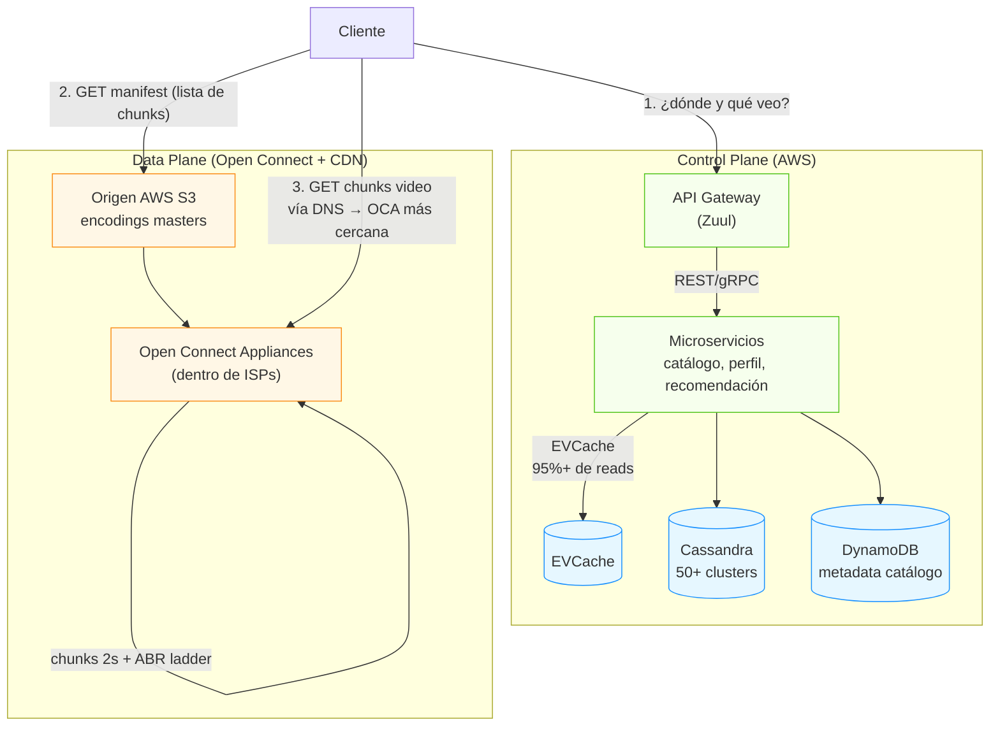
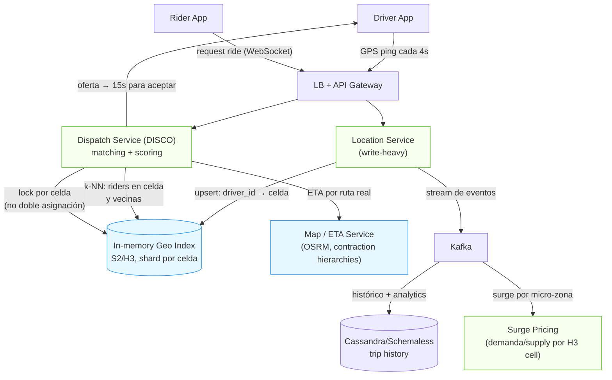
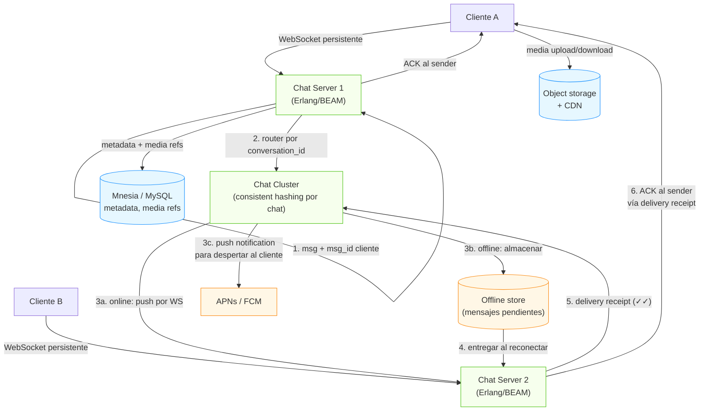
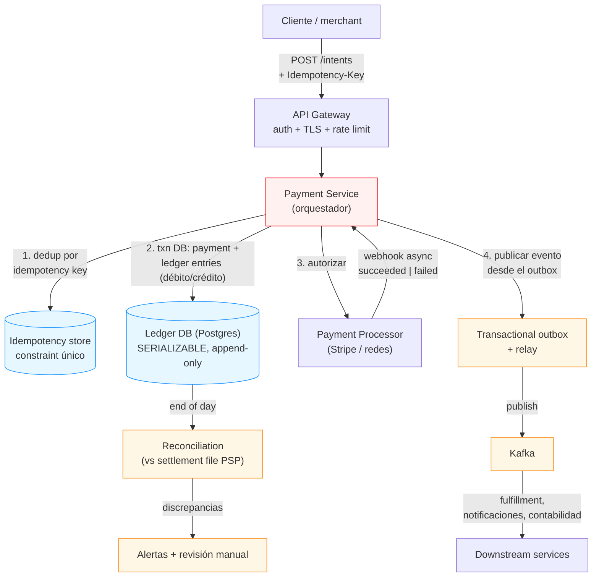
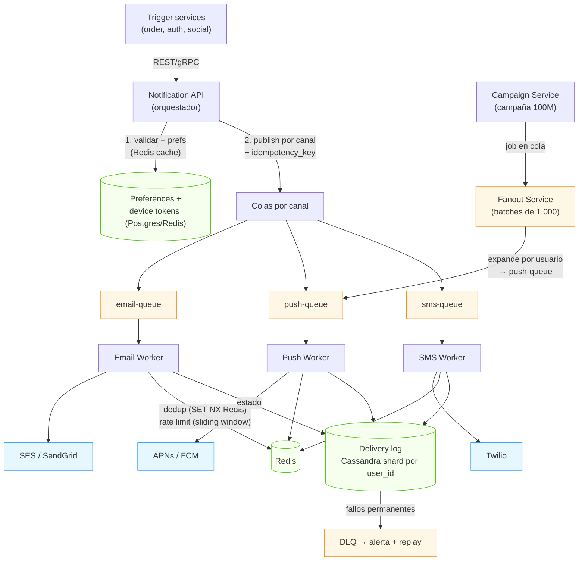

# Apéndice A — Módulo 14: Los 5 casos completos

> Este apéndice desarrolla los cinco casos anunciados en el [Módulo 14](14-System-Design-Interview.md) como **walkthroughs completos del framework de 4 pasos** (Clarify & scope → Data & API → High-level → Deep dive & stress test). Cada caso cierra con los **números clave** y los **trade-offs** que debes poder nombrar en voz alta. Se complementan con el caso trabajado de **Twitter/X** en el módulo principal.

---

## 1. Netflix (CDN, ABR, control vs data plane)

### Clarify & scope

- **FR:** streaming on-demand con reproducción instantánea; catálogo navegable/buscable; perfiles y watch history; recomendaciones; disponibilidad geográfica por licencias.
- **NFR:** start time < 2s; calidad adaptativa (< 5s de reacción); disponibilidad 99.9%+; durabilidad 11-nueves para el contenido; consistencia eventual para watch history.
- **Escala:** 283M subscribers; ~160-175M DAU; pico ~20M streams concurrentes (premieres); ~500M play-starts/día (~5.8K QPS, bursts 4-5×); 75.000M eventos de playback/día.
- **Out of scope:** live streaming, UGC, social.

### Estimación (lo que define TODO)

- 20M streams pico × ~4 Mbps promedio ≈ **73-80 Tbps edge egress**. Un 4K a 15-25 Mbps; HD ~5 Mbps.
- Almacenamiento: un 4K ≈ 15-20 GB; ~50+ variantes por título (codec×resolución×bitrate) → **decenas de petabytes** en S3.
- **Insight clave:** ~95-98% del tráfico lo sirve el CDN (Open Connect), solo ~2% llega al origen. La distribución de popularidad es **Zipf** → dimensiona los tiers de cache.

### High-level design: control plane vs data plane

- **Control plane:** servicios stateless sobre AWS (Zuul como gateway, Eureka service discovery, EVCache/Memcached para sesiones y reads). Recomendaciones precomputadas y cacheadas por perfil.
- **Data plane:** la entrega real de bytes. **Open Connect** (CDN propia, OCAs dentro de los ISPs) sirve ~95%+ del tráfico con distancia < 10 km; S3 como origen; **ABR** (Adaptive Bitrate) trocea el video en chunks de 2s a múltiples bitrates y el cliente elige según ancho de banda y buffer.
- **ABR:** cada título tiene 5-15 bitrates; un stream 4K genera miles de objetos cacheados. El cliente no pide "la película", pide un **manifest** (lista de chunks) y luego los chunks uno a uno.

### Deep dive: el crux

- **Cache miss storm / thundering herd:** cuando estrena una temporada, millones de dispositivos piden los mismos chunks; si el cache falla (cold start, eviction, partición), la estampida revienta el origen. Mitigaciones: **pre-warming predictivo** (empuja contenido popular a las OCAs antes del estreno), retry con **exponential backoff + jitter**, y **canary** (exponer el contenido a un subset para validar hit ratio antes del rollout completo).
- **Disponibilidad y chaos engineering:** microservicios aislados con circuit breakers (uno falla sin tumbar el resto); **Chaos Monkey** mata instancias en producción para entrenar la resiliencia. Inmutable infra + blue/green + canary analysis + rollbacks automáticos (Spinnaker).
- **Recomendaciones:** a 283M usuarios con features distintas por región/idioma. Batch/offline para el ranking y cache de la página personal; el 1% de mejora de precisión vale cientos de millones.
- **Cost reasoning (rubric 2026):** el costo dominante es **ancho de banda**. Palancas: mejorar la compresión (1% de compresión = millones de ahorro), subir el cache hit del CDN, y el algoritmo ABR del cliente (no pedir más de lo que la red permite).
- **Observabilidad:** eventos de playback (75.000M/día) → data platform para QA de calidad (QoE: rebuffering, start time) y ML. Métricas clave: start time p99, rebuffering ratio, cache hit ratio por OCA.

### Trade-offs para nombrar

- **CDN propia (Open Connect) vs CDN comercial:** control total y costo/bit inferior a cambio de operar infraestructura física en ISPs.
- **2s de chunk (ABR) vs chunks largos:** adaptabilidad fina y caché eficiente a cambio de más requests y complejidad de manifest.
- **EVCache (95%+ reads servidos) vs DB directa:** latencia y costo a cambio de consistencia eventual (metadata no crítica).

### Números clave

| Métrica | Valor |
|---|---|
| Subscribers | 283M en 190 países |
| Streams concurrentes (pico) | ~20M |
| Bandwidth edge (pico) | ~25-80 Tbps |
| % tráfico servido por CDN | ~95-98% |
| Eventos de playback/día | ~75.000M |
| Start time objetivo | < 2s |
| Durabilidad contenido | 11-nueves (S3) |

---

## 2. Uber (geospatial, dispatch, supply/demand)

### Clarify & scope

- **FR:** request de ride; matching rider-driver; tracking en vivo de ubicaciones; ETA; surge pricing; cancelaciones; historial; pagos.
- **NFR:** match < 3s; disponibilidad 99.99% (rides time-critical); un driver jamás asignado a dos riders (strong consistency en dispatch); ETA dentro de 2 min.
- **Escala:** ~25M viajes/día; 5M drivers activos (pico) reportando GPS cada 4s → **~1.25M updates/s**; 10.000+ ciudades.
- **Out of scope:** food delivery, cargo, mapas de detalle.

### Estimación

- GPS updates: 5M × 1 cada 4s = **1.25M writes/s** de ubicación (overwrite, dato viejo no importa).
- Reads (proximidad): por cada request de ride, k-NN sobre drivers cercanos → miles de QPS con búsqueda geoespacial.
- Volumen de viajes: 25M/día; cada viaje es una máquina de estados con ~8 transiciones que disparan eventos (pago, notificación, disponibilidad).

### High-level design

### Deep dive: el crux

- **Indexación geoespacial:** las bases de datos relacionales no hacen k-NN a 1.25M writes/s. Uber usa **H3/S2**: el mapa se divide en celdas hexagonales/curvas de Hilbert; **la celda es la shard key y el índice**. Buscar en la celda del rider + vecinas da los candidatos en O(1) por partición.
- **In-memory sobre DB:** la ubicación actual del driver vive en un índice in-memory (Redis/ringpop); los writes son overwrites. El históricos va a Cassandra/Schemaless por el camino frío. **Separación hot path vs cold path.**
- **Dispatch con garantía de unicidad:** matching ≠ simple k-NN. Se **scorean** los candidatos (distancia, tiempo esperando, fairness, tipo de vehículo) y el mejor recibe la oferta con **15s para aceptar** (si rechaza, el siguiente). Para que un driver no quede asignado a dos riders: **lock por celda / single-writer por zona** — strong consistency localizada, no global.
- **Consistencia por componente:** ubicación = eventual (GPS tiene ruido, no importa); dispatch = strong (no doble asignación); precios = eventual (surge recalculado cada 1-2 min).
- **Hot cells:** Times Square en Año Nuevo → una celda con demanda explosiva. Mitigación: replicar/shardenar la celda caliente aparte, sub-sharding por área.
- **Máquina de estados del viaje:** `requested → matched → arriving → started → completed | cancelled` (más `no_driver`). Cada transición dispara eventos: pago, notificación al rider, disponibilidad del driver, métricas.
- **Surge pricing:** dividir la ciudad en micro-zonas (H3 res 7); si demanda/supply > umbral → multiplicador (1.2×, 1.5×, 2.0×); recalcular cada 1-2 min; incentiva a drivers a moverse a la zona.

### Trade-offs para nombrar

- **In-memory geo index vs DB tradicional:** latencia y throughput del hot path a cambio de perder durabilidad (se reconstruye desde los GPS pings).
- **Strong consistency en dispatch vs global:** pagas coordinación solo donde importa (celda), no en todo el sistema.
- **S2/H3 vs Geohash:** S2/H3 dan mejor cobertura y vecindad uniforme; Geohash es más simple pero con peor forma de celdas.

### Números clave

| Métrica | Valor |
|---|---|
| Viajes/día | ~25M |
| Drivers activos (pico) | ~5M |
| GPS updates/s | ~1.25M |
| Tiempo de match | < 3s |
| Ventana de oferta al driver | 15s |
| Ciudades | 10.000+ |
| ETA | dentro de 2 min |

---

## 3. WhatsApp (Erlang, WebSocket, entrega con estado)

### Clarify & scope

- **FR:** chat 1:1 y grupal; entrega con confirmación (✓✓); presencia; multimedia; mensajes offline; E2E encryption; backups.
- **NFR:** latencia sub-second; alta disponibilidad (24/7); entrega at-least-once con deduplicación; orden por conversación; privacidad (E2E).
- **Escala:** 2.000M+ usuarios; **100.000M mensajes/día** (~1.2M/s); ~2M conexiones concurrentes por servidor; ~550 servidores / 11.000 cores en 2014.
- **Out of scope:** redes sociales públicas, video en vivo, encriptación server-side.

### High-level design: proceso por conexión

- **El runtime es la decisión:** **Erlang/BEAM** = actor model. Cada conexión es un **proceso liviano (~2KB)**, no un thread (~1MB); un servidor aguanta ~2M procesos. Filosofía **"let it crash" + supervisores**: si un proceso muere, el supervisor lo reinicia sin tumbar el nodo. Hot code swapping para desplegar sin cortar conexiones. FreeBSD por rendimiento de red.
- **Entrega con estado:** el mensaje no es fire-and-forget. El servidor (1) confirma al sender, (2) enruta por `conversation_id` (consistent hashing), (3) entrega al receptor si está online, o (3b) lo **almacena offline** y (3c) dispara un **push notification** para despertar el cliente, (4) lo entrega al reconectar, (5) devuelve delivery receipt.
- **Orden y deduplicación:** por conversación; el cliente envía un `msg_id`; si el servidor recibe el mismo id tras un reenvío, lo descarta (dedup). El orden se mantiene por secuencia por conversación.
- **Presencia:** estado online/offline con broadcast a los contactos relevantes (push, no polling).

### Deep dive: el crux

- **Escalar conexiones, no requests:** el problema no es QPS, es **concurrencia de conexiones persistentes**. Un thread por conexión no escala; un proceso BEAM por conexión sí (2M/servidor). El sharding de la capa de chat es por `conversation_id`, no por usuario — así una conversación aterriza en el mismo nodo y no hay broadcast distribuido por mensaje.
- **Entrega at-least-once + dedup:** en móvil las conexiones se caen; la garantía es *al menos una vez* y la deduplicación la resuelve el `msg_id` de cliente. **Nunca exactly-once** — no lo necesitas si dedupes.
- **E2E encryption (Signal Protocol):** los servidores enrutan payloads cifrados; el routing funciona sobre IDs de conversación y metadatos mínimos. Esto limita las features server-side (búsqueda, spam) — trade-off consciente por privacidad.
- **Offline store:** los mensajes para usuarios offline se persisten por conversación y se entregan al reconectar; el push notification es solo un "despertador" — no lleva el contenido (por E2E).
- **Hot key:** una conversación grupal enorme (10K+ miembros) concentra writes en un nodo; se mitiga con sharding del grupo o broadcast-async.
- **Observabilidad:** métricas clave — conexiones/servidor, latency de entrega p99, backlog del offline store, ratio de redelivery, tasa de push fallidos (tokens inválidos se marcan y dejan de usarse).

### Trade-offs para nombrar

- **Un solo lenguaje/stack (Erlang+FreeBSD) vs zoo de tecnologías:** simplicidad radical y eficiencia a cambio de expertise raro y ecosistema pequeño. Fue lo que permitió 900M usuarios con ~50 ingenieros.
- **E2E encryption vs features server-side:** privacidad a cambio de no poder leer/analizar/buscar contenido en el servidor.
- **At-least-once + dedup vs exactly-once:** pragmatismo; la dedup por id de cliente es mucho más barata que 2PC.

### Números clave

| Métrica | Valor |
|---|---|
| Usuarios | 2.000M+ |
| Mensajes/día | 100.000M+ (~1.2M/s) |
| Conexiones por servidor | ~2M |
| Memoria por proceso BEAM | ~2KB (vs ~1MB/thread) |
| Ingenieros (en adquisición) | ~50 |
| Servidores (2014) | ~550 / 11.000 cores |

---

## 4. Sistema de pagos (idempotency, ledger, reconciliación)

### Clarify & scope

- **FR:** crear un pago; procesar contra el PSP (Stripe/redes); refunds; webhooks de estado; conciliación diaria; payouts a merchants.
- **NFR:** **correctness-first**: nunca doble cargo; ledger cuadra (débitos = créditos); latencia p99 < 1s (sin 3DS); ACID en operaciones críticas; retención audit trail completa.
- **Escala:** ~5K cargos/s pico (Black Friday, 10× la media); 4-8 ledger entries por cargo; ledger ~1 TB/año a 100M txns/año.
- **Out of scope:** fraude ML, onboarding/KYC completo, múltiples métodos en v1.

### High-level design: correctness-first

### Deep dive: el crux

- **Idempotencia (no doble cargo):** toda request de cambio lleva una **Idempotency-Key**; el primer request procesa y guarda el resultado; los duplicados devuelven el resultado sin re-procesar. En la capa de datos: **constraint único `(order_id, status)`** y la transición del estado se protege con `SELECT FOR UPDATE` u optimistic locking (version column) para que dos requests concurrentes no pasen ambos de `PENDING → CHARGING`.
- **Double-entry ledger:** registro **append-only** e inmutable. Un cargo de $100 crea: débito `customer_receivable +100`, crédito `revenue +100`. Un refund: los asientos inversos. **Los balances se derivan sumando entries — nunca se almacenan como campo mutable** (evita race conditions y pérdida). Las correcciones se hacen con **asientos de reversión**, no editando. Esquema: `ledger_entry(ledger_entry_id, transaction_id, account_id, amount, currency, created_at, metadata)` con índice `(account_id, created_at)`.
- **Ledger no sharded:** el ledger casi **no se particiona** — un solo Postgres con **SERIALIZABLE** para operaciones críticas. Es el bottleneck aceptado: la correctitud pesa más que la escala. (A escala enorme se puede particionar por account con muchísimo cuidado.)
- **Coordinación sin transacciones distribuidas:** el flujo pago → fulfillment → contabilidad se coordina con **saga** (compensaciones) + **transactional outbox** (publicar el evento en la misma transacción DB que el cambio de estado, para no perder eventos en el dual-write). Nunca 2PC.
- **Webhooks y reconciliación:** el PSP responde async vía webhook; el webhook debe ser **idempotente** (replay-safe). Al final del día, **reconciliation** compara el ledger interno contra el *settlement file* del procesador; las discrepancias saltan a revisión manual. Es la prueba de que "tu vista de la realidad coincide con la del procesador".
- **PCI scope:** el número de tarjeta **nunca toca tu servidor** — se tokeniza en el cliente (Stripe.js/Element), tu backend solo guarda el token. Reduce drásticamente el alcance PCI-DSS.
- **Máquina de estados del pago:** `pending → requires_confirmation → processing → succeeded | failed | refunded | requires_action(3DS)`. Solo transiciones válidas; el estado es la fuente de verdad del flujo.
- **Observabilidad:** métricas — tasa de éxito del PSP, latencia p99 del intent, idempotency collisions (señal de retries mal), backlog del outbox, discrepancias de reconciliación (alarma).

### Trade-offs para nombrar

- **Correctness-first vs scale-first:** un solo Postgres SERIALIZABLE y sin sharding = bottleneck, pero prueba la correctitud; el costo de una doble carga es astronómicamente mayor que el de un poco más de latencia.
- **At-least-once + idempotencia vs exactly-once:** la idempotencia te da "at-least-once-but-practically-once" sin 2PC.
- **Saga/outbox vs 2PC:** coherencia eventual del flujo a cambio de no bloquear recursos con locks distribuidos.

### Números clave

| Métrica | Valor |
|---|---|
| Cargos/s pico (Black Friday) | ~5K (10× media) |
| Ledger entries por cargo | 4-8 (auth, capture, fee, payout) |
| Ledger writes/s pico | ~30K (append-only) |
| Crecimiento del ledger | ~1 TB/año (100M txns/año) |
| Latencia p99 del cargo | < 1s (sin 3DS) |
| Settlement batch | T+1 a T+3 (NACHA/SEPA) |

---

## 5. Sistema de notificaciones (fanout, canales, rate limits)

### Clarify & scope

- **FR:** enviar notificaciones por push (APNs/FCM), email, SMS e in-app; respetar preferencias por usuario-canal-tipo; tracking de estado; templates; campañas masivas; programación (quiet hours).
- **NFR:** push/SMS transaccionales < 5s; at-least-once con deduplicación; **aislamiento de fallos por canal** (un outage de email no afecta el push); rate limits por usuario.
- **Escala:** 1.000M notificaciones/día (~11.6K/s promedio); campaña de 100M en 1 hora (~27.7K/s pico); distribución: email 50%, push 35%, SMS 10%, in-app 5%.
- **Out of scope:** construir tu propio proveedor de push/email/SMS (usas APNs/FCM, SES/SendGrid, Twilio).

### High-level design: colas por canal

### Deep dive: el crux

- **Separar intake de delivery:** el orquestador valida, checa preferencias y **publica**; nunca llama sincrónicamente a Twilio. Las colas (Kafka/SQS) absorben los picos y desacoplan.
- **Una cola por canal:** email, push, SMS e in-app tienen retry semantics y throughput distintos. Un SMS lento no debe bloquear el email. Además **aisla fallos**: una caída de SendGrid no toca el push.
- **Two-stage fanout para campañas:** no loopees sobre 100M usuarios en el hot path. El Campaign Service publica **un job por segmento**; el **Fanout Service** pagina los users de 1.000 en 1.000 y publica por-usuario en la cola del canal. Prioridad: entregar primero a los activos (últimas 24h).
- **Deduplicación:** las colas garantizan at-least-once (un consumer que crashea redelivers). Dedup con **`SET NX` en Redis con la `idempotency_key`** (event_id + channel), TTL 24h. "At-least-once-but-practically-once."
- **Preferencias y rate limits:** preferencias por (usuario, canal, tipo) cacheadas en Redis, respetadas en el orquestador antes de encolar; **global unsubscribe = hard block**. Rate limit por usuario-canal con **sliding window en Redis** (máx 5 push/día, 2 emails/semana); **quiet hours** (buffer en delayed queue, no dropear); **agregación** ("3 personas te siguieron hoy").
- **Fallos y DLQ:** provider caído → retry con exponential backoff + jitter (3-5 intentos) → **DLQ** para revisión. Token inválido (FCM `NotRegistered`) → marcar y dejar de enviar (permanente ≠ reintentar). Estado del delivery: `queued → sent → delivered → opened → clicked | bounced | failed` — alimenta analytics y ML.
- **Observabilidad:** por canal: latency, tasa de fallo, backlog, rate de dedup; alarma de proveedor caído; tasa de bounce/opens para reputación del dominio email (¡un ISP que te marca spam mata la entregabilidad!).

### Trade-offs para nombrar

- **At-least-once + dedup vs exactly-once:** exact-once en notificaciones es carísimo (2PC/outbox) y no lo vale; la dedup en Redis es suficiente.
- **Separación de colas vs una sola:** más infraestructura a cambio de aislamiento de fallos y escalado independiente por canal.
- **Quiet hours con buffer vs dropear:** mejor UX (no molestar de noche) a cambio de latencia para no-críticas.

### Números clave

| Métrica | Valor |
|---|---|
| Notificaciones/día | 1.000M (~11.6K/s) |
| Campaña masiva | 100M en 1h (~27.7K/s) |
| Distribución | email 50% / push 35% / SMS 10% / in-app 5% |
| Batch de fanout | 1.000 users/job |
| Push transaccional | < 5s |
| TTL dedup en Redis | 24h |
| Retries | 3-5 con backoff+jitter → DLQ |

---

## Referencias

- **grokkingthesystemdesign.com, thecodeforge.io, geeksforgeeks.org — "Netflix System Design".** CDN/Open Connect, ABR, control vs data plane, EVCache, Zipf, cache miss storms, chaos engineering.
- **avijit.dev, techinterview.coach, chriszzhong.github.io — "System Design of Uber".** S2/H3, DISCO, dispatch con unicidad, surge, máquina de estados del viaje.
- **cometchat.com, singhajit.com, scalewithchintan.com, sysdesign.wiki — arquitectura WhatsApp.** Erlang/BEAM, proceso por conexión, entrega con estado, offline store, E2E.
- **techinterview.org, blog.rajpoot.dev, systemdesignsandbox.com, systeminternals.dev — "Design a Payment System (Stripe)".** Idempotency keys, doble entrada, webhooks, reconciliación, PCI, outbox/saga.
- **techinterview.org, learnixo.io, spacecomplexity.ai, systemdesignhandbook.com — "Design a Notification System".** Two-stage fanout, colas por canal, dedup, preferencias, rate limits, DLQ.
- **Kleppmann, M. — *Designing Data-Intensive Applications*.** Los fundamentos de cada deep dive (replicación, sharding, transacciones, outbox/CDC, stream processing).
