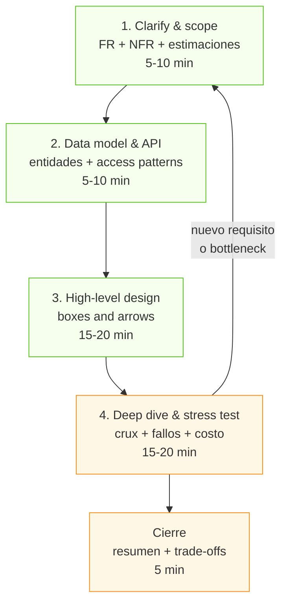
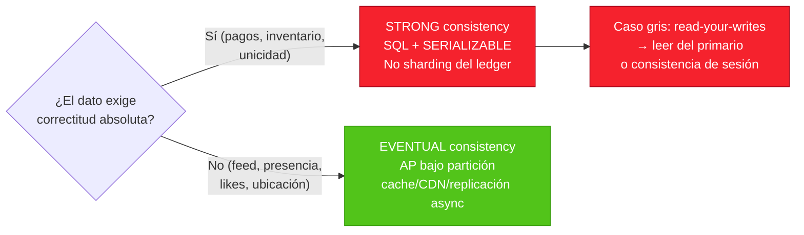
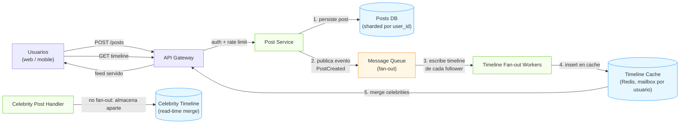

# Módulo 14 — System Design Interview: Piensa como Arquitecto

> **Nivel:** Senior. Este módulo es el **árbitro final** de la guía: unifica todo lo visto en los módulos previos en una **metodología repetible** para resolver entrevistas de diseño de sistemas y, sobre todo, para **diseñar software real**. La entrevista de diseño no evalúa si memorizaste arquitecturas: evalúa tu **proceso** bajo ambigüedad — cómo aclaras requisitos, cuantificas escala, descompones el problema, defiendes decisiones y nombras los trade-offs. Aquí aprenderás a **pensar como arquitecto**, a correr un **framework de 4 pasos** con presupuesto de tiempo, a hacer **estimaciones de back-of-the-envelope**, a modelar datos por *access patterns*, y aplicarás todo en un **caso completo trabajado (Twitter/X)** más cinco casos en el [Apéndice A](14-System-Design-Interview-Apendice-A.md).
>
> **Conexiones:** este módulo **aplica** la teoría de [Módulo 05](05-Bases-de-datos-distribuidas.md) (particionamiento, GSI/LSI), [Módulo 10](10-Escalabilidad-y-Resiliencia.md) (caching, sharding, replicación, circuit breakers), [Módulo 09](09-Diseño-de-APIs.md) (REST, idempotencia), [Módulo 03](03-Event-Driven-Architecture.md) (colas, outbox, saga), [Módulo 02](02-Microservicios-y-DDD.md) (límites de servicios) y [Módulo 01](01-Arquitectura-de-Software-Moderna.md) (pensar en capas). Se complementa con [Módulo 13](13-AI-Assisted-Development.md) (el juicio humano que la IA no reemplaza) y alimenta [Módulo 15](15-Preguntas-y-Ejercicios.md) y [Módulo 16](16-Roadmap-y-Proyecto-Final.md).

---

## Introducción

La entrevista de diseño de sistemas (System Design Interview) es el filtro donde se separa al ingeniero que "escribe bien código" del que **diseña sistemas**. No hay una respuesta correcta: el entrevistador evalúa tu **razonamiento, no tu memoria**. La diferencia entre un candidato mid y un senior no es el conocimiento — es **quién conduce** la conversación:

- **Mid-level:** llega a un diseño de alto nivel funcionando con ayudas, reconoce trade-offs básicos cuando se le pregunta, y necesita prompting.
- **Senior:** **conduce el deep dive solo**, cuantifica la escala, articula *Bad / Good / Great* para la parte difícil, nombra los modos de fallo y la asimetría read/write **sin que se lo pidan**.
- **Staff+:** lidera toda la conversación, trae multi-región, failover y costo **por iniciativa propia**, y razona efectos de segundo orden (hot keys, thundering herds, consistencia bajo partición).

### Qué cambió en la barra 2026

Los rubrics de las grandes empresas evolucionaron. Si preparas con material anterior a 2024, preparas para el rubric equivocado. Tres adiciones explícitas:

1. **Cost reasoning (razonamiento de costo).** Antes opcional, ahora es parte del rubric a nivel senior. Después de recorrer los modos de fallo, debes caminar el costo: *"A esta escala el costo dominante es X; si quisiera reducirlo a la mitad, la palanca que movería es Y"*. Netflix es el ejemplo extremo: una mejora del 1% en compresión de video ahorra millones en ancho de banda.
2. **Operational maturity (madurez operativa).** La **observabilidad es ahora un ciudadano de primera clase**. Si terminas un diseño de 45 minutos sin decir dónde van los logs, cómo se monitorea, cómo va a depurar el on-call, dejas puntos del rubric sobre la mesa. Diseñar sin monitoreo ya no es aceptable.
3. **AI-aware design (diseño consciente de IA).** Las preguntas clarificadoras de 2026 incluyen: *"¿Estamos sirviendo una feature LLM sobre esto? ¿Cuál es nuestro budget de latencia si hay un call a modelo en el hot path?"*. Señalar estas preguntas marca consciencia de la era actual.

### Por qué un framework

La entrevista se siente abierta, pero **sigue un guion**: aclara requisitos, estima escala, esboza API y datos, dibuja el diseño de alto nivel, haz deep dive en las 1-2 partes difíciles, y nombra los trade-offs. Correr ese loop convierte "diseña Instagram / un URL shortener / un rate limiter" en **los mismos movimientos con distintos detalles**. Un framework hace que el proceso sea repetible — y lo repetible es lo que sobrevive a los nervios de la entrevista.

**Bloques del módulo:**
1. **Conceptos:** cómo pensar como arquitecto, FR vs NFR, el framework de 4 pasos, estimaciones, y consistencia/escala como drivers de decisión.
2. **Arquitectura:** los building blocks y el diagrama de cajas; dónde vive el *crux* de cada categoría de problema.
3. **Internals:** matemática de estimación, modelado de datos por access patterns, diseño de APIs en entrevista, técnicas de deep dive y cost reasoning.
4. **Patrones:** el catálogo de patrones que resuelven los 80% de los casos (fan-out, materialized view, idempotency+ledger, geoespacial, CDN/ABR, WebSocket).
5. **Casos reales, Laboratorio, Entrevistas y Checklist** con la profundidad senior de siempre.

---

## Conceptos

### Cómo pensar como arquitecto

Antes del framework está la mentalidad. *Fundamentals of Software Architecture* (FSA) define los pilares del pensamiento arquitectónico, y son exactamente lo que mide la entrevista:

**Primera Ley de la Arquitectura de Software: "Todo en arquitectura es un trade-off".**
Si crees que descubriste algo que no es un trade-off, más probablemente aún no identificaste el trade-off. *Corolario 1:* no puedes hacer el análisis de trade-offs una sola vez. *Corolario 2:* no hay "One Big Trade-off Jamboree" — cada situación requiere re-evaluarlos. En la entrevista: cada vez que eliges una base de datos, un modelo de consistencia o una estrategia de cache, debes **nombrar qué ganas y qué pierdes**.

**Segunda Ley: "El *por qué* es más importante que el *cómo*".**
"Usamos Cassandra" sin explicar por qué es ruido. "Usamos Cassandra porque el acceso es por clave de partición, el modelo es eventualmente consistente y el write-heavy supera lo que Postgres aguanta en un solo primario" es señal de senior. Las decisiones se justifican por **requisitos**, no por lo que te gusta.

**Análisis sobre síntesis.**
El arquitecto analiza el problema antes de sintetizar la solución. Los candidatos que fallan dibujan boxes-and-arrows en el minuto 1; el senior pasa los primeros 5-10 minutos **descubriendo el problema** (requisitos, escala, restricciones) antes de tocar un componente.

**Amplitud sobre profundidad.**
*"Es más valioso para un arquitecto estar familiarizado con los pros y contras de 10 productos de caching que ser experto en uno solo"* (FSA). En la entrevista: conoce la tabla de decisiones entre SQL/NoSQL, entre Kafka/SQS/Pub-Sub, entre Redis/Memcached, entre API Gateway/mesh. No necesitas la profundidad interna de cada uno — necesitas saber **cuándo** usar cuál.

**Conocer el dominio del negocio.**
Difícil diseñar una arquitectura efectiva si no entiendes el problema de negocio. Las preguntas clarificadoras que haces al inicio son la prueba de que entiendes el dominio.

**Decidir con información incompleta.**
Los arquitectos toman decisiones importantes *a veces con información incompleta*. En la entrevista eso se traduce en: hacer supuestos explícitos, declararlos en voz alta, y seguir — en vez de quedarse paralizado pidiendo más datos.

### Requisitos funcionales y no funcionales

El 90% del resultado de la entrevista se decide en los primeros minutos. La primera pregunta que debes hacerte: **¿qué estamos construyendo exactamente?**

| Tipo | Qué cubre | Ejemplos en "diseña X" |
|---|---|---|
| **Funcionales (FR)** | Las *features*: qué hace el sistema. | Publicar un post; ver el feed; enviar un mensaje; cobrar un pago; buscar un driver. |
| **No funcionales (NFR)** | Las *cualidades*: cómo lo hace. | Escala (DAU, QPS), latencia (p50/p99), disponibilidad (99.9% vs 99.99%), consistencia, durabilidad, seguridad, costo. |
| **Fuera de alcance (out of scope)** | Lo que NO construyes hoy. | Live streaming (Netflix), recomendaciones en v1, apps móviles. |

Preguntas clarificadoras de alto valor (2026):
- **Escala:** ¿Cuántos DAU? ¿Cuál es el ratio read/write? (define TODO el diseño)
- **Latencia:** ¿Budget de p99? ¿Algo en el hot path (LLM call, búsqueda vectorial)?
- **Disponibilidad:** ¿99.9% o 99.99%? (define replicación y multi-región)
- **Retención de datos:** ¿Cuánto guardamos y por cuánto tiempo?
- **Consistencia:** ¿Quién tolera eventual? ¿Quién exige strong? (feed ≠ pagos)

> **Regla de oro:** *"El diseño correcto está determinado por los requisitos, no por lo que sabes bien o te parece interesante"*. Cada elección técnica se justifica contra un requisito nombrado.

### El framework de 4 pasos

La versión comprimida de los frameworks de 7 pasos, agrupada para que gastes menos tiempo narrando en qué paso estás:

```
Paso 1. Clarify & scope  (5-10 min)
   ├── FR: ¿qué features?
   ├── NFR: escala, latencia, disponibilidad, consistencia
   ├── Estimaciones de escala (QPS, storage, read/write ratio)
   └── Out of scope

Paso 2. Data model & API  (5-10 min)
   ├── Entidades core + access patterns PRIMERO
   ├── Elección de store (SQL vs NoSQL) basada en access patterns
   └── Los pocos endpoints que expone el sistema

Paso 3. High-level design  (15-20 min)
   ├── Boxes and arrows: clientes → servicios → storage
   ├── Empezar simple, añadir componentes SOLO si un requisito lo pide
   └── Comunicar el diseño y pedir feedback

Paso 4. Deep dive & stress test  (15-20 min)
   ├── Profundizar en las 1-2 partes difíciles (el crux)
   ├── Recorrer modos de fallo y cómo se recupera
   └── Cost reasoning + observabilidad + escalado futuro
```



**Presupuesto de tiempo (45 min):** ~5 min requisitos, ~5 min estimación, ~3 min API, ~4 min data model, ~8 min high-level, ~15 min deep dive, ~5 min trade-offs. **El deep dive es donde se gana la entrevista** — no quemes 25 minutos dibujando cajas que ya todos aceptaron.

Las dos reglas que importan:
1. **Nunca saltes a la solución.** Un nuevo requisito te regresa al inicio del loop.
2. **No sobre-ingeniería sin justificación.** No diseñes para 10 mil millones de usuarios cuando el entrevistador dijo 10 millones. Los caches, colas y microservicios solo entran si un requisito los exige.

### Estimaciones de back-of-the-envelope

El objetivo no es exactitud: es **basar el diseño en números concretos** y demostrar pensamiento cuantitativo. Los anclajes que debes memorizar:

- Hay ~**100.000 segundos en un día** (86.400 ≈ 10⁵). X requests/día ≈ X/10⁵ por segundo.
- **Factor de pico:** multiplica por 2-10× para picos.
- **Poderes de diez:** un orden de magnitud de error es aceptable en una entrevista.

Fórmulas core:
```
QPS promedio  = (DAU × acciones por usuario por día) / 86.400
QPS pico      = QPS promedio × factor de pico (2-10x)
Almacenamiento/día = (escrituras/día) × tamaño promedio por registro
Ancho de banda     = QPS pico × bytes por respuesta
Cache sizing       = lecturas QPS × bytes por entrada × TTL
```

Los números que importan en la mayoría de sistemas: **DAU**, **QPS (promedio y pico)**, **almacenamiento por día/año**, **ancho de banda**, y **tamaño de cache**. Siempre declara tus supuestos ("asumo 1KB por post, 200 followers promedio, ratio read:write 100:1").

### Consistencia, disponibilidad y escala como drivers

No repetimos la teoría (ver M05/M10); aquí está **cómo se usan en la entrevista** como palancas de decisión:

- **Ratio read/write** → determina si necesitas materialización (read-heavy: precomputar), fan-out (write-amplification aceptable), o escritura directa.
- **Consistencia fuerte vs eventual** → determina la topología de replicación y si puedes usar cache/CDN. *Regla rápida:* el feed puede ser eventual (2PC no), los pagos deben ser fuertemente consistentes (ledger, no eventual).
- **Disponibilidad objetivo** → determina si basta single-region (99.9%) o necesitas active-active multi-región (99.99%+).
- **Retención** → decide entre append-only logs (baratos) y storage de datos derivados (caros).
- **CAP/PACELC** → la decisión que divides entre "bajo partición" y "bajo normalidad": la mayoría de los sistemas eligen **AP en partición + EL (latency) en normalidad** — consistencia eventual durante fallos.

> La frase que debes poder decir con fluidez: *"Este componente elige disponibilidad sobre consistencia bajo partición porque es un feed (tolerante a eventual); este otro elige consistencia sobre disponibilidad porque es un ledger financiero (correctness-first)."*



---

## Arquitectura

### Los building blocks y el diagrama de cajas

En la entrevista no dibujas una solución de AWS completa: dibujas **los componentes que un requisito justifica**, añadiéndolos en orden de necesidad. El stack típico por capas:

```
┌─────────────────────────────────────────────┐
│  Clientes (web, mobile, API consumers)      │
└──────────────────┬──────────────────────────┘
┌──────────────────▼──────────────────────────┐
│  Edge: CDN (estáticos, video, cache global) │
└──────────────────┬──────────────────────────┘
┌──────────────────▼──────────────────────────┐
│  Load Balancer + API Gateway (auth,        │
│  rate limiting, routing, TLS termination)   │
└──────────────────┬──────────────────────────┘
┌──────────────────▼──────────────────────────┐
│  Servicios stateless (escalan horizontal)   │
│  + Cache de aplicación (Redis/Memcached)    │
└───────┬──────────────────────┬──────────────┘
┌───────▼─────────┐  ┌─────────▼──────────────┐
│  Colas (async,  │  │  Bases de datos        │
│  fan-out,       │  │  (SQL/NoSQL según      │
│  outbox)        │  │  access patterns)      │
└─────────────────┘  └─────────┬──────────────┘
                     ┌─────────▼──────────────┐
                     │  Blob/object storage   │
                     │  (media, backups)      │
                     └────────────────────────┘
```

**Cuándo añade cada componente (y solo entonces):**
- **Cache (Redis):** cuando un hot path lee el mismo dato muchas veces y el almacén es lento/caro. *Señal:* "esto se lee 100× más de lo que se escribe".
- **CDN:** cuando sirves estáticos o media a usuarios globales y la latencia importa. *Señal:* "los bytes son pesados o el origen es lejano".
- **Cola (Kafka/SQS):** cuando hay un pico de trabajo asíncrono, fan-out, o un acoplamiento que hay que romper. *Señal:* "una acción dispara miles de acciones derivadas" o "el proveedor es lento".
- **Particionamiento/shards:** cuando un solo nodo no aguanta los writes o los reads. *Señal:* "write QPS > 10K/s" o "storage > varios TB".
- **Blob storage (S3):** cuando hay archivos grandes/binarios. *Nunca* guardes videos en la base de datos.

### Cómo dibujar (y qué se evalúa)

- **Empieza simple:** cliente → servidor → base de datos. Luego añade capas *porque un número lo exige*.
- **Nombra cada caja y cada flecha:** qué protocolo (REST/gRPC/WebSocket), qué patrón (cache-aside, outbox), qué modelo de entrega (at-least-once).
- **Marca el hot path:** "este flujo es el 90% del tráfico" y asegúrate de que el diseño lo optimiza.
- **Marca el crux:** la parte donde el problema es realmente difícil (feed → fan-out; Uber → indexación geoespacial; pagos → idempotencia+ledger; Netflix → CDN/ABR). Es ahí donde gastas el tiempo del deep dive.

### Dónde vive el crux por categoría de problema

| Categoría | Problema representativo | El crux |
|---|---|---|
| Social/feed | Twitter, Instagram | **Fan-out** y materialización del timeline (push vs pull vs híbrido) |
| Media | Netflix, YouTube | **CDN** + ABR + control vs data plane |
| Marketplace en tiempo real | Uber, Lyft | **Indexación geoespacial** + dispatch con garantía de no doble asignación |
| Mensajería | WhatsApp, Slack | **WebSockets** + presencia + almacenamiento offline + orden de mensajes |
| Financiero | Stripe, PayPal | **Idempotencia + double-entry ledger + reconciliación** (correctness-first) |
| Notificaciones | Push/SMS/email | **Fanout en dos etapas** + colas por canal + rate limits + DLQ |
| Búsqueda | Elasticsearch | Inverted index + ranking + particionamiento |
| Proximidad | Yelp | Geohash/S2 + caching |

---

## Internals

### Matemática de estimación (cheat-sheet)

Anclajes de memoria para estimar sin calculadora (del framework 7 pasos de AlgoEngineer y fuentes 2026):

| Ancla | Valor | Uso |
|---|---|---|
| Segundos en un día | ~10⁵ (86.400) | QPS = reqs/día ÷ 10⁵ |
| Posts/tweets de X | ~500M/día (~5.8K/s, picos 150K/s) | referencia social |
| Mensajes de WhatsApp | ~100.000M/día (~1.2M/s) | referencia mensajería |
| GPS updates de Uber | ~1.25M/s (5M drivers cada 4s) | referencia geo real-time |
| Streams Netflix (pico) | 20M concurrentes (~25-40 Tbps edge) | referencia media |
| 1 Mbps ≈ 0.125 MB/s | 1M streams × 4 Mbps ≈ 4 Tbps | conversión bandwidth |
| Factor pico | 2-10× promedio | QPS pico |
| 1 post ≈ 1-2 KB | tweet + metadata | storage social |
| 1 hora 4K ≈ 15-20 GB | un título ≈ 50+ encodings | storage media |
| Ledger: 4-8 entries/cargo | auth, capture, fee, payout | storage financiero |

**Ejercicio completo (feed):** 100M DAU, cada uno lee feed 20×/día y postea 1×/día.
- QPS lecturas: 100M × 20 / 10⁵ ≈ **20.000/s** promedio, ~100K/s pico.
- QPS escrituras: 100M / 10⁵ ≈ **1.000/s** (ratio read:write ≈ 20:1... en realidad con 100M DAU y cada uno posteando 1/día, es 100M/86400 ≈ 1.150/s). Redondea a 1.000-1.200/s.
- Storage/día: 100M posts × 1.5 KB ≈ **150 GB/día** ≈ 55 TB/año (sin contar imágenes).
- Cache feed: 100M DAU × 20 lecturas × (feed ≈ 200 KB) — no cabe todo; cachea los feeds activos o usa materialización.

### Modelado de datos por access patterns

La regla: **primero las entidades y los access patterns, después la base de datos.** Elegir la base antes de saber cómo se lee es el error #4 de los candidatos.

1. **Entidades core:** usuario, post, follow (Twitter); conductor, rider, viaje (Uber); cuenta, transacción, ledger entry (pagos); usuario, conversación, mensaje (WhatsApp).
2. **Access patterns (cómo se lee/escribe):** "feed del usuario = posts de los que sigo, ordenados por timestamp"; "driver más cercano = k-nearest-neighbors geo"; "balance = suma de ledger entries del account_id".
3. **Elección de store:**
   - **SQL (Postgres/MySQL):** relaciones, joins, ACID, consistencia fuerte. Finanzas, pagos, pedidos. Escala con sharding por tenant/region.
   - **NoSQL KV (DynamoDB/Cassandra):** lookup por clave primaria, write-heavy, escala horizontal nativa. Perfiles, feed materializado, GPS location (último valor), sesiones.
   - **Document (Mongo):** documentos anidados, esquema flexible.
   - **In-memory (Redis):** cache, rate limiting, presencia, geospatial (GEORADIUS), leaderboard.
   - **Blob (S3):** archivos grandes; metadata aparte (ej. DynamoDB para índice de S3).
4. **Claves de partición (shard keys):** elige la clave que balancea el acceso. Uber: cell ID (geográfico); feed: user_id; pagos: account_id (¡el ledger casi no se particiona!); WhatsApp: chat_id.
5. **Hot keys:** los problemas de escalabilidad se esconden en la distribución sesgada (celebridad con 100M followers; un driver en Times Square). Nombra siempre el hot key y su mitigación (ver Patrones).

### Diseño de APIs en entrevista

No diseñes 20 endpoints: define los **5-8 que capturan el sistema** con su semántica clave:

```
POST   /posts                       { content, media_urls }        → id (201)
GET    /users/{id}/timeline         ?limit=100&cursor=...          → posts paginados
POST   /users/{id}/follows          { followee_id }
GET    /users/{id}/conversations    ?cursor=...
POST   /conversations/{id}/messages { content }
POST   /payments/intents            { amount, currency, idempotency_key }
GET    /payments/intents/{id}
```

Señales senior que debes dar en APIs:
- **Paginación por cursor** (no por offset — el offset salta/duplica cuando hay writes).
- **Idempotency keys** en POSTs que pueden reenviarse (pagos, creación de recursos).
- **Webhooks + polling** para resultados asíncronos (estado del pago, estado del viaje).
- **Versionado** cuando la API es pública.

### Técnicas de deep dive

El deep dive es donde se gana. Técnicas para atacar la parte difícil:

1. **Identificar el bottleneck:** sigue el hot path y encuentra el primer cuello (DB, ancho de banda, fan-out, hot key).
2. **Recorrer los modos de fallo:** "¿qué pasa si este nodo muere? ¿si esta cola se atasca? ¿si el proveedor externo se cae?" → retry con backoff+jitter, DLQ, circuit breaker (M10).
3. **Nombra la asimetría:** read-heavy vs write-heavy cambia todo. *"Este es un sistema read-heavy 100:1, así que materializo el feed."*
4. **Efectos de segundo orden:** thundering herd (millones de clientes re-intentando a la vez → jitter), hot keys, cache stampede (recalcular el feed bajo un miss masivo → single flight).
5. **Multi-región y failover:** RPO (datos que puedo perder) y RTO (tiempo de recuperación). Active-active vs active-passive. Data sovereignty (GDPR, licencias por región).
6. **Cost reasoning (rubric 2026):** *"El costo dominante es el ancho de banda del video; la palanca es mejorar la compresión y la tasa de cache hit del CDN."* *"El costo dominante es el ledger; no lo particiono, uso un solo Postgres con SERIALIZABLE."*
7. **Observabilidad (rubric 2026):** dónde van los logs, qué métricas clave (latencia p99 del feed, backlog de la cola, rate de cache miss), qué alarmas levanta el on-call.

---

## Patrones

### Catálogo de patrones de entrevista

Estos patrones resuelven ~80% de los casos. Para cada uno: **cuándo usarlo, la señal que debes decir en voz alta, y el trade-off**.

| Patrón | Cuándo | Señal en entrevista | Trade-off |
|---|---|---|---|
| **Fan-out (push)** | El post llega a los followers del autor; feed materializado por usuario | *"Escribo el post en el timeline de cada follower"* (mailbox) | Write amplification (1 post → N writes); celebridad = N enorme |
| **Fan-out híbrido** | Social/feed: separar celebridades del resto | *"Los posts de celebridades se mezclan en lectura; el resto va materializado"* | Complejidad de merge; celebridad aún cara |
| **Materialized view / timeline cache** | Read-heavy con join caro | *"Precomputo el resultado de la query para servir de cache"* | Los writes se vuelven más caros; eventualidad |
| **Two-stage fanout** | Campaña masiva (100M notificaciones) | *"Segmento en batches de 1.000 y los workers expanden por usuario"* | Latencia de campaña (minutos); nunca en el hot path |
| **Indexación geoespacial (S2/Geohash/H3)** | Proximidad / k-NN / dispatch | *"Particiono el mapa en celdas; la celda es la shard key y el índice"* | Hot cell (Times Square); fronteras de celda |
| **Idempotency + unique constraint** | Cualquier POST reenviable; pagos | *"Idempotency key + constraint único (order_id, status) contra doble cargo"* | Estado extra; overhead en cada request |
| **Double-entry ledger** | Financiero | *"Registro append-only con débito y crédito que suman cero; los balances se derivan, no se almacenan"* | No sharding; un solo Postgres = bottleneck (aceptado) |
| **Transactional outbox** | Publicar evento confiablemente tras un write DB | *"Escribo el evento en la misma transacción de la DB; un relay lo publica"* | Replay/duplicados (idempotencia aguas abajo) |
| **CDN + ABR** | Streaming/media | *"Chunks de 2s en múltiples bitrates; el cliente elige; 95%+ servido desde edge"* | Cache miss storm en premieres; costo de encodings |
| **WebSocket / SSE** | Real-time bidireccional / unidireccional | *"Conexión persistente; el servidor empuja"* | Estado de conexión (esticky LB); escala de conexiones |
| **Quota / rate limiting** | Notificaciones, APIs públicas | *"Sliding window en Redis por usuario-canal"* | Complejidad distribuida; falso positivo |

### Los 3 patrones que más veces definen un diseño senior

1. **Push vs pull (fan-out).** Todo el caso Twitter/X se reduce a esta decisión (ver Casos reales). Pregunta clave: *"¿el coste está en el writer (push) o en el reader (pull)?"* → con ratio 100:1 de reads, pagas en el write.
2. **Materialización vs consulta.** Los datos derivados (feeds, recomendaciones, balances) se pueden **calcular al leer** o **precomputar al escribir**. Materializar gana cuando el cálculo es caro y el ratio read/write es alto.
3. **Correctness-first vs scale-first.** Los sistemas financieros invierten la prioridad: primero la correctitud (ledger, SERIALIZABLE, sin sharding), después la escala. Decirlo explícitamente ("este es un sistema correctness-first") es la señal de mayor señal para entrevistas de fintech.

---

## Casos reales

### Caso trabajado: Twitter/X (el caso que ata todo)

Usamos el caso de DDIA (cap. 2, *Social Network Home Timelines*) con números modernos de X. Este es el **flujo completo** que debes correr en una entrevista:

**Paso 1 — Clarify & scope.**
- FR: publicar posts; seguir usuarios; leer home timeline (posts recientes de quienes sigo).
- NFR: los posts deben verse en ≤ 5 segundos; 10M usuarios online simultáneos; reads ≫ writes.
- Escala (DDIA): **500M posts/día (~5.800/s promedio, picos hasta 150.000/s)**; usuario promedio sigue 200 y tiene 200 followers; celebridades con >100M followers.
- Out of scope: ads, trending, DMs.

**Paso 2 — Data model & API.**
- Entidades: `users`, `posts`, `follows`. Access pattern principal: *"home timeline = posts de los que sigo, ordenados por timestamp, limit 1000"*.
- API: `POST /posts`, `GET /users/{id}/timeline?cursor=`, `POST /users/{id}/follows`.

**Paso 3 — High-level design.**
- Opción naive (pull): repetir la query cada 5s mientras está online. Con 10M online → **2M queries/s**, cada una hace 200 lookups (following) → **400M lookups/s**. Inviable.
- Opción materializada (push): al hacer un post, insertarlo en el timeline de cada follower (mailbox). **5.800 posts/s × 200 followers ≈ 1M writes/s** — mucho, pero manejable con colas + escrituras batch. Sirve el feed desde cache.

**Paso 4 — Deep dive (el crux).**
- **Hot keys / celebridades:** un post de un usuario con 100M followers → 100M inserts. *Solución clásica:* no escribir el post de la celebridad en cada timeline; almacenarlo aparte y **mergearlo en lectura** con el timeline materializado. Costo de lectura extra para todos, pero evita el write explosion.
- **Usuarios que siguen demasiadas cuentas:** su timeline se escribe muchísimo pero no lo leen todo → permitir **dropear** algunos writes (mostrar una muestra).
- **Picos:** cuando la tasa de posts espiga, **encolar** las entregas del timeline y aceptar que el post tarde un poco más en llegar (los feeds se sirven de cache, no se degradan).
- **Consistencia:** el feed es eventualmente consistente — aceptable. No necesitas 2PC.
- **Failover/observabilidad:** si la cola de fan-out se atasca, el backlog crece → alarma; los feeds siguen sirviéndose desde cache. Métricas: backlog de la cola, latencia de entrega del post (p99), hit ratio de la cache de timelines.

**Trade-offs que debes nombrar:**
- *Push* (writes caros, reads baratos) vs *pull* (reads caros, writes baratos) → con ratio 100:1, pagas en el write.
- *Timeline materializado* (read fast, write slow) vs *query en vivo* (simple, lento) → materializas porque el cálculo es caro.
- *Merge de celebridades en lectura* (lectura un poco más cara para todos) vs *write explosion* (inviable).



### Tabla-resumen de los otros 5 casos

| Caso | El crux | Números clave | Patrones usados |
|---|---|---|---|
| **Netflix** | Entregar video global sin buffering | 283M subs, 20M streams pico, 25-40 Tbps edge, 98% cache hit | CDN+ABR, control/data plane, EVCache, chaos engineering, Zipf |
| **Uber** | Matching real-time de supply/demand | 25M viajes/día, 1.25M GPS/s, match < 3s | S2/H3 geoespacial, WebSocket, máquina de estados, surge |
| **WhatsApp** | Mensajería real-time a 2.000M usuarios | 100.000M msg/día, 2M conexiones/servidor | Erlang/BEAM, WebSocket, presencia, almacenamiento offline, E2E |
| **Pagos** | Correctness-first: nunca doble cargo | 5K cargos/s pico, ledger 4-8 entries/cargo, ~1 TB/año | Idempotency, double-entry ledger, webhooks, reconciliación, outbox |
| **Notificaciones** | Fanout masivo + aislamiento de canales | 1.000M notif/día (~11.6K/s), campaña 100M en 1h | Two-stage fanout, colas por canal, rate limit, DLQ, dedup |

Cada uno está desarrollado como walkthrough completo del framework en el **[Apéndice A](14-System-Design-Interview-Apendice-A.md)**.

---

## Laboratorio

### Drill 1 — Estimación en 2 minutos (hazlo sin calculadora)

Para cada escenario, calcula QPS promedio/pico, storage/día, y cache sizing. Declara tus supuestos en voz alta.

1. **URL shortener:** 100M URLs nuevas/mes, ratio read:write 100:1. ¿QPS de redirecciones?
2. **Instagram:** 100M DAU, cada uno sube 2 fotos/día (~500 KB c/u) y ve 100 fotos. ¿Storage y bandwidth?
3. **Chat:** 500M DAU, 50 mensajes/día (~200 bytes c/u). ¿Almacenamiento/año?
4. **Pagos:** 10M transacciones/día, 6 ledger entries por txn (~100 bytes). ¿Writes/s y tamaño del ledger/año?
5. **Video:** 1M usuarios simultáneos a 4 Mbps. ¿Ancho de banda total?

### Drill 2 — Mock interview de 45 minutos

Protocolo para practicar con cronómetro (o contra una IA de mock):

1. **0-5 min:** aclara requisitos. Escribe FR, NFR y out of scope en una lista.
2. **5-10 min:** estima QPS, storage, bandwidth. Di los números en voz alta.
3. **10-20 min:** data model (entidades + access patterns) y API (5-8 endpoints).
4. **20-35 min:** high-level design + deep dive en el crux. Nombra 3 modos de fallo.
5. **35-40 min:** trade-offs + cost reasoning + observabilidad.
6. **40-45 min:** resumen de decisiones y siguientes pasos de escala.

**Regla de oro de la práctica:** repetir el mismo diseño 48 horas después e identificar debilidades vale más que pasar superficial por 30 diseños. 10-15 problemas bien practicados con profundidad superan a 30 vistos en superficie.

### Drill 3 — Crux por categoría

Sin diseñar el sistema completo, para cada caso nombra: (a) el crux, (b) el patrón que lo resuelve, (c) el hot key más probable, (d) un modo de fallo.
- Feed de Instagram, búsqueda de Yelp, video en vivo, carrito de compras, rate limiter global, sistema de mensajes con 100K usuarios en un grupo.

---

## Entrevistas

**1. ¿Cómo empiezas una entrevista de diseño de sistemas y qué evalúa el entrevistador?**

**Orientación:** La pregunta pide el *proceso*, no la arquitectura. El senior nombra los 4 pasos, da los presupuestos de tiempo y explica qué se evalúa: manejo de ambigüedad, razonamiento cuantitativo, defensa de decisiones, comunicación y saber cuándo parar (no sobre-ingeniería).

**Respuesta de un senior:** "No dibujo hasta el minuto 10. Empiezo aclarando el alcance: requisitos funcionales, no funcionales (escala, latencia, disponibilidad, consistencia) y out of scope. Luego estimo QPS y storage con back-of-the-envelope — con 10⁵ segundos por día. Defino entidades y access patterns antes de elegir base de datos. Esbozo el high-level en cajas y flechas simples, y gasto el grueso del tiempo en el deep dive del crux, recorriendo modos de fallo. Cierro con trade-offs, costo y observabilidad. Lo que se evalúa no es la respuesta: es que mi proceso sea repetible y mis decisiones estén justificadas por requisitos. En nivel senior se espera que conduzca el deep dive yo mismo y que traiga multi-región y costo sin que me lo pidan."

**2. "Diseña Twitter/X." ¿Cuál es tu primer paso y cuál es el crux?**

**Orientación:** Busca que el candidato no se lance a dibujar y que identifique el crux (fan-out del timeline). El senior aclara escala y ratio read/write, y luego conduce la decisión push vs pull.

**Respuesta de un senior:** "Primer paso: aclarar alcance y escala. Asumo 500M posts/día, usuario promedio con 200 followers, ratio read:write muy alto (100:1). Con eso, el crux es claro: el home timeline. La opción naive —consultar los posts de mis 200 follows en cada lectura— resulta en cientos de millones de lookups por segundo: inviable. La solución es materializar el timeline: al publicar, escribo el post en el timeline (mailbox) de cada follower, lo que cuesta ~1M writes/s con fan-out 200, y sirvo el feed desde Redis. El trade-off es write-amplification: pagamos en el write porque el read es 100× más frecuente. Y las celebridades son el hot key: un post de 100M followers no se fan-outea, se almacena aparte y se mergea en lectura."

**3. ¿Cuándo eliges SQL y cuándo NoSQL, y cómo lo justificas?**

**Orientación:** El senior no responde "SQL para transacciones" a secas: ata la elección a los access patterns y al modelo de consistencia. Menciona el error de elegir la base antes que el patrón de acceso.

**Respuesta de un senior:** "Primero defino los access patterns: cómo se lee y escribe cada entidad. SQL (Postgres/MySQL) cuando hay relaciones y joins, ACID y consistencia fuerte — pagos, pedidos, inventario. NoSQL de tipo clave-valor (DynamoDB/Cassandra) cuando el acceso es por clave primaria, write-heavy y necesito escala horizontal nativa — perfiles, feed materializado, última ubicación GPS. In-memory (Redis) para cache, rate limiting y geoespacial. La regla: si el patrón de acceso es un lookup por clave → NoSQL; si es una query relacional con joins → SQL. Y los sistemas correctness-first, como el ledger financiero, casi nunca se particionan: acepto un solo Postgres fuerte antes que eventualidad."

**4. Explica fan-out push vs pull. ¿Cuándo uno u otro?**

**Orientación:** Quiere que se nombre la asimetría writer/reader y el hot key (celebridad). El senior da el caso Twitter y extiende a notificaciones y mensajería.

**Respuesta de un senior:** "Es la decisión de dónde pagas el costo. Pull: el reader consulta al leer (simple, pero caro con ratio read:write alto — 2M queries/s en Twitter). Push: al escribir, el sistema entrega el dato a todos los interesados (writes caros, reads triviales). Con un ratio 100:1, pagas en el write. La variante híbrida resuelve el hot key: las cuentas con millones de followers no se fanoutean (sería escribir el post en 100M timelines), se almacenan aparte y se mergean al leer. En notificaciones el mismo patrón es el two-stage fanout: una campaña a 100M usuarios se segmenta en batches de 1.000 y los workers expanden por usuario. El push asume write-amplification; si el fan-out es explosivo, la escritura se encola y se acepta eventualidad."

**5. Diseña un sistema de pagos. ¿Cuáles son las 3 garantías no negociables?**

**Orientación:** Pregunta fintech clásica. El senior lidera con correctitud: idempotencia, ledger y reconciliación. Menciona el estado de la transacción.

**Respuesta de un senior:** "Primero, es un sistema correctness-first: no-doble-cargo es la restricción número uno. Las tres garantías: (1) **Idempotencia** — toda request de cambio lleva una idempotency key y hay un constraint único (order_id, status) que impide cargar dos veces aunque lleguen retries concurrentes. (2) **Double-entry ledger** — registro append-only donde cada transacción escribe un débito y un crédito que suman cero; los balances se derivan de la suma, nunca se almacenan como campo mutable; las correcciones se hacen con asientos de reversión, no editando. (3) **Reconciliación** — al final del día, el ledger interno debe cuadrar contra el reporte del procesador (settlement file); las discrepancias saltan a revisión manual. Sobre eso, la coordinación entre servicios se hace con saga + transactional outbox, no con transacciones distribuidas. El ledger no se particiona: un solo Postgres con SERIALIZABLE para las operaciones críticas."

**6. ¿Cómo decides entre consistencia fuerte y eventual en un diseño?**

**Orientación:** Quiere la tabla de decisión por tipo de componente y el uso de CAP/PACELC. El senior diferencia feed vs finanzas y menciona el caso del "read your own writes".

**Respuesta de un senior:** "Es una decisión por componente, no global. Regla: los datos de correctitud (pagos, inventario, balances, unicidad) exigen strong consistency — en partición elijo consistencia sobre disponibilidad, y en normalidad pago latencia (P in CAP, EL en PACELC). Los datos sociales (feed, presencia, likes) toleran eventual consistency — en partición elijo disponibilidad (AP), y en normalidad priorizo latencia. Hay un caso gris importante: el 'read your own writes' — si un usuario postea y su feed no lo muestra al refrescar, se rompe la confianza. Se resuelve con lecturas desde el primario (leer lo que uno escribió) o con consistencia a nivel de sesión, sin pagar strong consistency global. La señal senior es nombrar este caso gris sin que lo pregunten."

**7. "Diseña Uber." ¿Qué hace el sistema de matching y por qué no usas una base de datos normal?**

**Orientación:** El crux es la indexación geoespacial y la garantía de no doble asignación. El senior nombra S2/Geohash/H3, el hot cell y la separación de caminos calientes/fríos.

**Respuesta de un senior:** "El crux es el matching: millones de drivers reportan GPS cada 4 segundos (~1.25M updates/s) y cada rider espera un match en <3 segundos. Una base de datos relacional no hace k-nearest-neighbors rápido a esa escala. Uso indexación geoespacial: divido el mapa en celdas (S2/H3/Geohash), la celda es la shard key y el índice; busco en la celda del rider y las vecinas. El estado actual del driver (última ubicación) vive en un índice in-memory — los writes son overwrites, el dato viejo no importa. Pero el dispatch requiere strong consistency: un driver NO puede asignarse a dos riders → lock por zona o single-writer por celda. La oferta se ordena por ETA (ruta real, no línea recta) y el driver tiene 15s para aceptar. El viaje es una máquina de estados (requested → matched → started → completed/cancelled) que dispara eventos: pagos, notificaciones, disponibilidad del driver. Los hot cells (Times Square en Año Nuevo) se manejan con replicación extra de esa celda."

**8. "Diseña WhatsApp." ¿Qué lo hace distinto a un sistema web normal?**

**Orientación:** El senior identifica el real-time masivo: conexiones persistentes, mensajería, orden, almacenamiento offline y el porqué de la elección del stack (Erlang).

**Respuesta de un senior:** "WhatsApp es un sistema de conexiones persistentes, no de request/response. Lo distinto: (1) **Real-time**: WebSockets por los que el servidor empuja; no hay polling. (2) **Escala de conexiones**: ~2M conexiones por servidor — el stack es un runtime de actor model (Erlang/BEAM) donde cada conexión es un proceso liviano (~2KB), no un thread (~1MB); 'let it crash' + supervisores dan disponibilidad sin reiniciar todo. (3) **Entrega con estado**: el mensaje pasa por ACKs — el servidor confirma al sender, entrega al receptor online o lo **almacena offline** y lo entrega al reconectar, además de disparar un push notification. (4) **Orden y deduplicación**: por conversación, con IDs de cliente para detectar duplicados tras reenvíos. (5) **E2E encryption**: los servidores nunca ven el contenido; el routing funciona sobre IDs de conversación encriptados. El trade-off central: simplicidad de un solo idioma/stack (Erlang+FreeBSD) en lugar de un zoo de tecnologías, que es lo que les permitió 900M usuarios con ~50 ingenieros."

**9. En el deep dive, ¿qué te distingue como senior cuando el entrevistador te pregunta "¿y si esto se cae?"**

**Orientación:** Quiere resiliencia + observabilidad + costo. El senior recorre modos de fallo con backoff/DLQ/circuit breaker, nombra métricas y cierra con cost reasoning (rubric 2026).

**Respuesta de un senior:** "Recorro el hot path y, por cada dependencia, el modo de fallo y la respuesta. Si cae un nodo → replicación y failover (RPO/RTO). Si cae un proveedor externo → retry con backoff exponencial + jitter, circuit breaker, y DLQ después de N intentos; nunca dejo que el proveedor caído bloquee el resto (colas por canal aíslan un outage de email del push). Si cae la cola → el backlog crece pero no se pierde nada porque la cola es el buffer; alarma por backlog. Y nombro el thundering herd: si millones de clientes reintentan a la vez, el backoff con jitter es obligatorio. En observabilidad, cada componente tiene su métrica: p99 del feed, backlog de la cola, cache hit ratio. Para cerrar, cost reasoning: 'el costo dominante aquí es X; si quisiera reducirlo a la mitad, la palanca es Y' — por ejemplo en streaming, mejorar la compresión y el cache hit del CDN."

**10. Después de cerrar el diseño, ¿qué haces en los últimos 5 minutos?**

**Orientación:** El cierre con resume + siguientes pasos de escala + trade-offs es señal de senior. Mencionar observabilidad y multi-región como pendiente.

**Respuesta de un senior:** "Resumo las decisiones en 3-4 líneas: qué construí, por qué el crux se resolvió así, y los trade-offs aceptados. Luego señalo los siguientes pasos: dónde escalar (qué componente llega primero a su límite y la palanca), multi-región y failover si no lo cubrimos, observabilidad (métricas clave y alarmas del on-call), y qué features futuras cambian el diseño (por ejemplo, añadir ads cambia el fan-out del feed). No pido permiso para cerrar: conduzco el cierre como conduje el deep dive. El cierre ordenado es la última señal de que el proceso es mío, no del entrevistador."

---

## Checklist

- [ ] Sé las dos leyes de la arquitectura y las uso: *todo es un trade-off* y *el porqué importa más que el cómo*.
- [ ] Corro el framework de 4 pasos con presupuesto de tiempo; no salto a dibujar antes del minuto 10.
- [ ] Aclaro FR, NFR y out of scope antes de tocar un componente.
- [ ] Estimo QPS (promedio y pico), storage, bandwidth y cache con back-of-the-envelope; declaro supuestos.
- [ ] Modelo datos por **access patterns primero**, base de datos después.
- [ ] Defino la API mínima (5-8 endpoints) con paginación por cursor e idempotency donde aplique.
- [ ] Identifico el **crux** del problema y gasto el deep dive ahí.
- [ ] Nombro el hot key y su mitigación (celebridad, hot cell, hot partition).
- [ ] Recorro modos de fallo con retry+backoff+jitter, DLQ y circuit breaker.
- [ ] Nombró el ratio read/write y su impacto (fan-out push vs pull).
- [ ] Separo componentes por modelo de consistencia (correctness-first vs eventual).
- [ ] Incluyo **observabilidad** (métricas y alarmas) en el diseño, no como afterthought.
- [ ] Hago **cost reasoning**: costo dominante y la palanca para reducirlo.
- [ ] Cierro con resumen de decisiones, siguientes pasos de escala y multi-región.
- [ ] Evito sobre-ingeniería: cada caja añadida tiene un requisito que la justifica.

---

## Referencias

- **Kleppmann, M. — *Designing Data-Intensive Applications* (DDIA), cap. 2.** El caso "Social Network Home Timelines" (materialización, fan-out, celebridades) y los capítulos de replicación/sharding/consistencia que sostienen cada deep dive.
- **Richards, M. y Ford, N. — *Fundamentals of Software Architecture*, 2nd ed., cap. 1.** El "pensar como arquitecto": primera y segunda ley, análisis sobre síntesis, amplitud sobre profundidad, conocer el dominio.
- **Xu, A. — *System Design Interview — An Insider's Guide* (Grokking the System Design Interview).** El framework paso a paso y los casos clásicos.
- **ByteByteGo — "A Framework For System Design Interviews".** La estructura del deep dive dirigido por el entrevistador.
- **DesignGurus — "System Design Interview Guide 2026".** El rubric 2026: cost reasoning, observabilidad, preguntas AI-aware; la compresión a 4 pasos.
- **TechScreen — "How to Ace a System Design Interview: The Complete 2026 Framework".** Estimación como mandatorio a nivel FAANG; blanco vs diagramming tools.
- **AlgoEngineer — "The System Design Interview Framework (2026)".** La tabla de tiempo de los 7 pasos y el cheat-sheet de estimación (10⁵ segundos/día, factor de pico).
- **techinterview.org — "Design a Payment System (Stripe)", "Design a Notification System".** Casos financiero y de notificaciones con idempotencia, ledger, reconciliación y fanout por canal.
- **systemdesignhandbook.com, spacecomplexity.ai, learnixo.io** — Walkthroughs de notificaciones (colas por canal, dos-etapas, DLQ, preferencias) y WhatsApp.
- **avijit.dev, techinterview.coach — "System Design of Uber".** Geospatial indexing (S2/H3), dispatch, surge, máquina de estados del viaje, números de escala.
- **grokkingthesystemdesign.com, thecodeforge.io, geeksforgeeks.org — "Netflix System Design".** CDN/Open Connect, ABR, control vs data plane, EVCache, Zipf, cache miss storms.
- **cometchat.com, singhajit.com, scalewithchintan.com — arquitectura WhatsApp.** Erlang/BEAM, FreeBSD, proceso por conexión, almacenamiento offline, 900M usuarios con 50 ingenieros.
