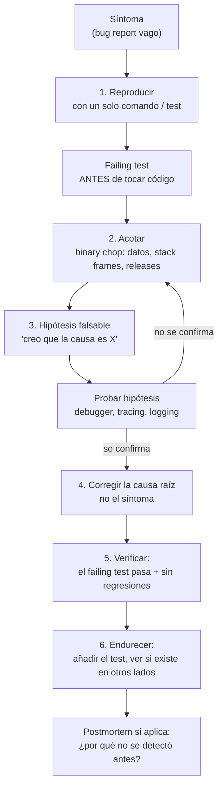

# Apéndice A — Módulo 15: Ejercicios prácticos, de debugging y de diseño

> Este apéndice convierte el [banco de preguntas](15-Preguntas-y-Ejercicios.md) en **práctica con las manos**. El banco entrena el *razonamiento verbal*; estos ejercicios entrenan lo que un senior hace cuando se sienta a trabajar: escribir código bajo restricciones (prácticos), cazar bugs reales con un proceso (debugging) y tomar decisiones de diseño de bajo nivel con trade-offs (diseño). Cada ejercicio trae un **enunciado tipo entrevista**, una **solución de referencia** y, donde aplica, los **errores que eliminan candidatos** en una ronda real.

> **Cómo usarlo:** haz el ejercicio **solo y con cronómetro** antes de leer la solución. En la ronda de debugging, no leas la pista: reproduce el bug, acótalo, formula la hipótesis, prueba la corrección y verifícalo — el proceso es la evaluación, no la respuesta.

---

## Parte 1 — Ejercicios prácticos

> Ejercicios cortos de implementación (30–60 min cada uno). Se resuelven en Node.js/TypeScript o Python, en un script autocontenido o un mini-proyecto. El criterio senior no es que "compile": es que **manejes los casos límite, la concurrencia y la observabilidad**, y que **hables de lo que harías distinto en producción**.

### 1.1 Rate limiter (token bucket)

**Enunciado:** implementa un rate limiter por *token bucket* para una API de autenticación: cada usuario (por `userId`) tiene 10 requests/minuto con refill de 10 tokens por minuto, y un burst máximo de 30. Expón `allow(userId): boolean`. Debe ser seguro ante concurrencia.

**Solución de referencia:**

```typescript
class TokenBucket {
  private tokens: number;
  private lastRefill: number;

  constructor(private capacity: number, private refillPerSecond: number) {
    this.tokens = capacity;
    this.lastRefill = Date.now();
  }

  allow(): boolean {
    const now = Date.now();
    const elapsed = (now - this.lastRefill) / 1000;
    this.tokens = Math.min(this.capacity, this.tokens + elapsed * this.refillPerSecond);
    this.lastRefill = now;
    if (this.tokens >= 1) {
      this.tokens -= 1;
      return true;
    }
    return false;
  }
}

const buckets = new Map<string, TokenBucket>();
const lock = (() => {
  let p = Promise.resolve();
  return (fn: () => void) => {
    p = p.then(() => { fn(); });
    return p;
  };
})();

export function allow(userId: string): Promise<boolean> {
  return lock(() => {
    if (!buckets.has(userId)) {
      buckets.set(userId, new TokenBucket(30, 10 / 60));
    }
    return buckets.get(userId)!.allow();
  });
}
```

**Lo que el senior añade en voz alta:**

- **Memoria:** un `Map` por usuario crece sin límite → LRU/TTL para expulsar usuarios inactivos.
- **Multi-nodo:** este limiter es por-instancia; para un límite global se usa Redis con `INCR` + `EXPIRE` (fixed window) o scripting Lua (sliding window/token bucket atómico).
- **Respuesta HTTP:** `429 Too Many Requests` con headers `Retry-After`, `X-RateLimit-Limit`, `X-RateLimit-Remaining`.
- **Error común:** refillear por *requests* en vez de por *tiempo* (un bucket que solo se recarga cuando hay tráfico está roto).

### 1.2 Idempotency key para pagos

**Enunciado:** una API `POST /payments` puede recibir la misma petición duplicada (retry del cliente, doble click, red). Implementa una capa de idempotencia que garantice **procesar exactamente una vez** para una misma `Idempotency-Key`. El procesamiento tarda y puede fallar a mitad.

**Solución de referencia (patrón: clave única + estado + transacción):**

```sql
-- Tabla de idempotencia (DynamoDB o Postgres con la misma idea)
CREATE TABLE idempotency (
  key        TEXT PRIMARY KEY,           -- la Idempotency-Key del cliente
  user_id    TEXT NOT NULL,
  status     TEXT NOT NULL,              -- 'pending' | 'processing' | 'completed'
  request    JSONB NOT NULL,             -- huella de la request
  response   JSONB,                      -- resultado final cacheado
  created_at TIMESTAMPTZ NOT NULL DEFAULT now(),
  expires_at TIMESTAMPTZ NOT NULL        -- ventana de idempotencia (24h)
);
```

```typescript
async function processPayment(req: PaymentRequest): Promise<PaymentResponse> {
  // 1. Insert con la key como PK: si existe, es duplicado.
  try {
    await db.insert({
      key: req.idempotencyKey, userId: req.userId,
      status: 'processing', request: req.body,
    });
  } catch (e) {
    if (isUniqueViolation(e)) {
      const existing = await db.get(req.idempotencyKey);
      // 2. Duplicado: devolver el resultado previo o el estado.
      if (existing.status === 'completed') return existing.response;
      if (existing.status === 'processing') throw new Retryable('still processing');
    }
    throw e;
  }
  // 3. Procesar FUERA de la reserva, pero la actualización final es atómica.
  const response = await paymentProvider.charge(req);
  await db.update(req.idempotencyKey, { status: 'completed', response });
  return response;
}
```

**Lo que el senior añade en voz alta:**

- La clave primaria única es la barrera real contra duplicados en concurrencia (dos requests simultáneas → una gana el insert).
- La respuesta correcta para "está procesando" es `409 Conflict` o reintentable, **nunca** procesar de nuevo.
- **Fallos del proceso a mitad:** si el provider cobra pero la app muere antes del `completed`, el rebalanceo necesita *reconciliación* (consultar al provider) — por eso "exactamente una vez" en la práctica es *at-least-once + dedupe en el receptor*.
- **Expiración:** la ventana (24h típica) protege de claves reutilizadas y acota la tabla.

### 1.3 Consumidor de eventos con deduplicación y DLQ

**Enunciado:** implementa un consumidor de SQS/Kafka que procesa eventos `order.created`. Debe ser **at-least-once** (los eventos pueden reentregarse), debe **deduplicar**, procesar con **retry con backoff**, y mandar a **DLQ** lo que falle de forma permanente. Muestra el esquema del handler.

**Solución de referencia:**

```typescript
const PROCESSED: Map<string, number> = new Map(); // en producción: DynamoDB/Redis con TTL

async function handle(event: OrderCreatedEvent): Promise<void> {
  // 1. Dedupe: si ya lo vimos con esta version/event_id, no reprocesamos.
  const dedupeKey = `${event.orderId}:${event.version}`;
  if (await wasProcessed(dedupeKey)) return; // ack silencioso

  try {
    await orderService.apply(event);
    await markProcessed(dedupeKey);           // SOLO tras aplicar
  } catch (err) {
    if (isRetryable(err)) {
      throw err;                              // SQS redeliver con backoff natural
    }
    await dqlSend(event, err);                // fallo permanente → DLQ
  }
}

// Retry con backoff exponencial + jitter (client HTTP)
async function callWithRetry<T>(fn: () => Promise<T>, max = 4): Promise<T> {
  let delay = 100;
  for (let attempt = 1; ; attempt++) {
    try {
      return await fn();
    } catch (err) {
      if (attempt >= max || !isRetryable(err)) throw err;
      await sleep(delay + Math.random() * delay); // backoff + jitter
      delay *= 2;
    }
  }
}
```

**Lo que el senior añade en voz alta:**

- **Dedupe y efecto van juntos:** marcar como procesado *antes* de aplicar el efecto rompe la garantía (si el proceso muere entre ambos, pierdes el evento).
- **Idempotencia por versionado:** `order.version` evita que un evento viejo reentregado tarde sobrescriba un estado más nuevo.
- **DLQ = observabilidad:** alertar cuando la DLQ crece; el postmortem empieza con "¿por qué llegó aquí y no se corrigió en el código?".
- **Backoff:** SQS ya redelivers con su propia visibilidad; no añadir otro backoff encima a ciegas (doble retry = latencia multiplicada).

### 1.4 Cache-aside con stampede protection

**Enunciado:** implementa lectura de un valor caro (perfil de usuario) con patrón cache-aside: si hay cache, devuélvelo; si no, cómputalo, guarda y devuelve. Protege contra **cache stampede** (N requests simultáneas que recalcularon porque el TTL expiró) y contra **penetration** (keys inexistentes que no se cachean).

**Solución de referencia (doble-check + lock + negativo corto):**

```typescript
async function getProfile(userId: string): Promise<Profile> {
  const cached = await redis.get(`profile:${userId}`);
  if (cached !== null) return JSON.parse(cached);

  // Stampede: un solo proceso recalcula; el resto espera (o repite lectura).
  const lock = await redis.set(`lock:profile:${userId}`, '1', 'EX', 3, 'NX');
  if (lock) {
    try {
      const value = await expensiveLoad(userId);
      await redis.set(`profile:${userId}`, JSON.stringify(value), 'EX', 300);
      return value;
    } finally {
      await redis.del(`lock:profile:${userId}`);
    }
  }
  // Lost the lock: spin con timeout corto → vuelve a leer cache.
  await sleep(20 + Math.random() * 40);
  return getProfile(userId);
}
```

**Lo que el senior añade en voz alta:**

- **Stampede:** el lock `NX` con TTL corto es suficiente en la mayoría de los casos; alternativas: *jitter en el TTL* (expirar en ventanas aleatorias), *dog-pile* (recalcular y servir el valor viejo).
- **Penetration:** un perfil que no existe recibe un **valor negativo corto** (`-1`, TTL 60s) para que el atacante no fuerce el recalculo de cada request contra el origen.
- **Breakdown (avalancha):** cientos de keys expiran a la vez → *expiration randomization* (`TTL base + rand(0..300)`).
- **Consistencia:** cache-aside es eventualmente consistente por diseño; si la escritura borra el cache antes del commit real, hay *race* → preferir borrar *después* de la escritura o usar write-through con doble-borrado.

### 1.5 Cursor pagination en una API

**Enunciado:** diseña el endpoint `GET /orders?limit=20&cursor=...` para una tabla de millones de pedidos ordenados por `(created_at, id)`. El problema: el offset pagination se degrada (OFFSET 1.000.000 escanea y descarta), y la lista cambia entre páginas. Escribe el SQL y el cursor.

**Solución de referencia:**

```sql
-- cursor = base64(customer_id_epoch_ms / order_id) de la última fila vista
SELECT id, customer_id, created_at, total
FROM orders
WHERE (created_at, id) > ($1, $2)          -- columnas del cursor
ORDER BY created_at ASC, id ASC
LIMIT 21;                                   -- 20 + 1 para saber si hay más

-- Siguiente cursor = (created_at, id) de la fila 20
-- Si trajo 21 filas → has_next_page = true, next_cursor = base64(fila 20)
```

```typescript
type Cursor = { createdAt: string; id: string };

function encodeCursor(c: Cursor): string {
  return Buffer.from(JSON.stringify(c)).toString('base64url');
}
function decodeCursor(s: string): Cursor {
  return JSON.parse(Buffer.from(s, 'base64url').toString());
}
```

**Lo que el senior añade en voz alta:**

- El predicado `(created_at, id) > (...)` es **keyset pagination**: usa el índice compuesto y cada página cuesta O(página), no O(offset total).
- El `id` en el ORDER BY y en el cursor es **desempate determinista** para `created_at` duplicados (dos pedidos en el mismo ms).
- **Cambios entre páginas:** una fila nueva insertada puede saltarse o duplicarse en el límite de página → es el trade-off aceptado del keyset (no hay "página 3 estable" si llegan datos nuevos).
- **Mala señal en entrevista:** responder solo "uso `LIMIT/OFFSET`" sin mencionar la degradación con tablas grandes.

### 1.6 Circuit breaker

**Enunciado:** implementa un circuit breaker alrededor de una llamada HTTP a un servicio externo: pasa (closed), abre tras `n` fallos consecutivos en `m` segundos, y prueba recuperación con un *half-open* que deja pasar una request de prueba. Expón métricas.

**Solución de referencia:**

```typescript
class CircuitBreaker {
  private failures = 0;
  private state: 'closed' | 'open' | 'half-open' = 'closed';
  private openedAt = 0;

  constructor(
    private threshold = 5,
    private resetMs = 30_000,
  ) {}

  async call<T>(fn: () => Promise<T>): Promise<T> {
    if (this.state === 'open') {
      if (Date.now() - this.openedAt >= this.resetMs) {
        this.state = 'half-open'; // dejar pasar una request de prueba
      } else {
        throw new CircuitOpenError();
      }
    }
    try {
      const result = await fn();
      if (this.state === 'half-open') {
        this.state = 'closed';     // la prueba pasó → cerrar
        this.failures = 0;
      }
      return result;
    } catch (err) {
      this.failures += 1;
      if (this.state === 'half-open' || this.failures >= this.threshold) {
        this.state = 'open';
        this.openedAt = Date.now();
      }
      throw err;
    }
  }
}
```

**Lo que el senior añade en voz alta:**

- **Fallo = timeout también:** un timeout es un fallo; sin circuit breaker, esperar 30s × N requests sátura la cola de hilos (puede tirar el servicio local por thread starvation).
- **Half-open con jitter:** varios procesos abriendo a la vez re-probando en el mismo momento = mini-estampida → jitter en el `resetMs`.
- **Metrics obligatorias:** `state` (gauge), `requests_total`, `failures_total`, `opened_total` — el dashboard del breaker es parte de la demo.
- **Matiz senior:** el breaker falla *rápido*, pero la estrategia de degradación (servir cache, respuesta parcial, fallback) la decide el *caller*, no el breaker.

### 1.7 Refactor de un monolito con deuda técnica

**Enunciado:** te dan un `UserService` de 800 líneas con: conexión a DB dentro del handler, lógica de negocio mezclada con serialización HTTP, y un `try/catch` que devuelve 500 para todo. Muéstrame cómo lo refactorizas **en pasos pequeños y desplegables**, sin reescribir todo de golpe.

**Solución de referencia (estrangler pattern a nivel de código):**

```typescript
// Paso 1: separar la capa HTTP de la lógica (sin cambiar comportamiento).
// Antes: handler hace TODO. Después:
export class UserController {
  constructor(private users: UserService) {}

  async get(req: Request, res: Response) {
    try {
      const user = await this.users.find(req.params.id);
      if (!user) return res.status(404).json({ error: 'not_found' });
      return res.json(user);
    } catch (err) {
      // Paso 3: errores mapeados por tipo, no catch-all genérico.
      return res.status(mapError(err)).json({ error: toErrorBody(err) });
    }
  }
}

export class UserService {
  constructor(private repo: UserRepository) {}

  async find(id: string): Promise<User | null> {
    return this.repo.findById(id); // paso 2: la DB sale del handler
  }
}
```

**Lo que el senior añade en voz alta:**

- **Estrangler en código:** cada refactor es un *slice* con comportamiento idéntico; nunca "todo a la vez".
- **Orden:** primero mover la I/O (DB) fuera del handler, luego los errores por tipo, luego la lógica de negocio a su propio dominio. Cada paso = 1 PR pequeño y desplegable.
- **Test como red de seguridad:** sin tests de contrato antes del refactor, cualquier cambio es adivinar.
- **Señal senior:** el candidato describe *el plan de fases* y qué métrica (reducción de líneas del handler, cobertura) mide el éxito — no "yo lo hubiera escrito bien desde el inicio".

### 1.8 Feature flag con rollout por porcentaje

**Enunciado:** implementa un servidor de feature flags que devuelva si `checkout-v2` está activo para un usuario dado, con **rollout gradual por porcentaje determinista** (el mismo usuario siempre ve el mismo resultado) y kill-switch instantáneo.

**Solución de referencia (hash consistente por usuario):**

```typescript
type Flag = { name: string; rollout: number; enabled: boolean };

function isEnabled(flag: Flag, userId: string): boolean {
  if (!flag.enabled) return false;                    // kill-switch
  if (flag.rollout >= 100) return true;               // 100%
  const h = crc32(`${flag.name}:${userId}`) % 100;    // determinista
  return h < flag.rollout;
}

// GET /flags/checkout-v2?userId=123 → { enabled: true, reason: 'rollout' }
```

**Lo que el senior añade en voz alta:**

- **Determinismo por hash de (flag, user):** el mismo usuario no "parpadea" entre páginas (sin esto, usar `Math.random()` rompe consistencia UX y A/B).
- **Config versionada y auditable:** el cambio de rollout es un deploy declarado (GitOps), no un edit en consola.
- **Sticky + control de riesgo:** con un flag puedes hacer canary de código sin canary de infraestructura; la *feature flag* y el *deploy* se desacoplan.
- **Matiz senior:** el hash determinista es la base de *split testing* y de *gradual ramp*; mencionar el salto de "porcentaje" a "segmento" (p. ej. usuarios con cuenta de empresa primero).

### 1.9 Implementación de un DLQ processor con reproceso manual

**Enunciado:** el evento `payment.failed.notify` está cayendo a la DLQ. Escribe el script de *replay* que: (1) inspecciona el motivo del fallo, (2) re-encola lo reintentable con prioridad, (3) archiva lo que requiere intervención humana. Justifica el orden.

**Solución de referencia:**

```typescript
async function replayDlq(): Promise<void> {
  const messages = await dlq.receive({ batchSize: 50 });

  for (const msg of messages) {
    const { error } = JSON.parse(msg.body);

    if (isTransient(error)) {
      await mainQueue.send(msg.body, { delaySeconds: 60 });  // reintentar luego
      await dlq.ack(msg);                                     // ack tras re-encolar
    } else if (isSchemaError(error)) {
      await archiveTable.put({ ...msg, reviewedBy: null });   // humano lo revisa
      await dlq.ack(msg);
    } else {
      await deadletter.park(msg); // requiere decisión: no tocar automáticamente
    }
  }
  // Alertar con métricas: replayed=_, archived=_, parked=_
}
```

**Lo que el senior añade en voz alta:**

- **Regla de oro:** la DLQ se reprocesa con *clasificación* — nunca re-encolar todo a ciegas (re-encolar un error de esquema solo lo devolverá a la DLQ).
- **Clasificación por tipo de fallo:** transitorio (timeout, 503) → reintentar; permanente (400, schema) → archivar y alertar; desconocido → aparcar para humano.
- **El motivo del fallo es un campo de observabilidad:** sin `error` estructurado en el mensaje, el replay es adivinar.
- **Matiz senior:** el replay no es el fin — la pregunta real es *¿por qué sigue llegando aquí?*; si la tasa de DLQ no baja, el fix es del productor o del schema.

### 1.10 Test de una migración de datos con backfill

**Enunciado:** vas a backfillear 50M de filas añadiendo `country` a una tabla de `users` (derivado de la columna `locale`). La tabla tiene millones de writes/s en producción. Escribe el plan: estrategia, chunking, reintentos, validación.

**Solución de referencia (batch pequeño + reanudable + verify):**

```sql
-- Chunk por rango de PK, sin bloquear: WHERE id BETWEEN ... AND ... LIMIT
-- Postgres: usar cursor keyset (id > last_id) en vez de OFFSET.

-- 1) Migrar en chunks de 1.000-5.000 filas, con SLEEP entre batches.
-- 2) Reanudable: guardar last_id procesado (tabla migration_state).
-- 3) Idempotente: UPDATE solo si country IS NULL (reintentar sin duplicar efecto).
-- 4) Validación: comparar recuentos y muestras antes/después:
--    SELECT count(*) FILTER (WHERE country IS NULL) FROM users;  -- → 0 al final
-- 5) Estimación de tiempo: 50M / 5K por batch ≈ 10K batches; a 10/s ≈ 17 min.
```

**Lo que el senior añade en voz alta:**

- **Nunca un `UPDATE users SET ...` masivo:** bloquea la tabla, genera WAL gigante y un rollback lento. Batches con `id > last` son reanudables y no bloquean lecturas.
- **Idempotencia del UPDATE** (solo filas con `country IS NULL`) permite reintentar tras un crash.
- **Estado de progreso persistido + métricas:** si el job muere a la mitad, se retoma donde iba, no desde cero.
- **Validación antes de declarar éxito:** counts, checksum y muestras aleatorias; y en paralelo, *canary*: activar el código que lee `country` solo tras validar el backfill.

---

## Parte 2 — Ejercicios de debugging

> Rondas de debugging: te dan un **síntoma**, el **código** y a veces **logs**. Evalúan el *proceso* (reproduce → acota → hipótesis → corrige → verifica), no la respuesta. Cada bug de abajo es de los que eliminan candidatos si se resuelven "a ojo": el senior **reproduce primero, formula una hipótesis falsable y verifica con un test**.

### El proceso de debugging (diagrama de referencia)



**Principios del diagrama (Pragmatic Programmer + ShadeCoder 2026):**

- **Reproduce antes de tocar nada:** "el mejor bug es el reproducible con un solo comando". Un bug que no reproduces no sabrás nunca si quedó arreglado (Tip 31: *Failing Test Before Fixing Code*).
- **Acota con binary chop:** mitad del stack, mitad del dataset, mitad de las releases. 64 frames de stack se resuelven en ≤ 6 chops.
- **Hipótesis falsable + prueba:** *Don't Assume It — Prove It* (Tip 34). Si la hipótesis no se confirma con evidencia, vuelve a acotar — no edites "a ver".
- **Corrige la causa raíz, no el síntoma:** el fallo suele estar a varios pasos de lo que observas; arreglar el síntoma garantiza el bug hermano.
- **Verifica y endurece:** el failing test pasa, buscas la misma condición en otros lados y preguntas *¿por qué no se detectó antes?*.
- **Los errores que eliminan candidatos (MockIF):** editar sin entender, depurar en silencio, arreglar el síntoma, no verificar la corrección.

---

### 2.1 Race condition en inventario

**Síntoma:** en un e-commerce, dos pedidos simultáneos del último artículo en stock: ambos pasan la validación de stock y el segundo sobrevende (stock queda en -1). Ocurre "a veces", solo bajo carga. Te dan este handler:

```javascript
// handlers/checkout.js
async function checkout(req, res) {
  const { productId, quantity } = req.body;
  const product = await db.one('SELECT * FROM products WHERE id = $1', [productId]);
  if (product.stock < quantity) {
    return res.status(409).json({ error: 'out_of_stock' });
  }
  await db.none('INSERT INTO orders (product_id, quantity) VALUES ($1, $2)', [productId, quantity]);
  await db.none('UPDATE products SET stock = stock - $1 WHERE id = $2', [quantity, productId]);
  return res.json({ ok: true });
}
```

**Proceso del senior:**

1. **Reproducir:** test concurrente con dos requests → se afirma el fallo intermitente. (No se puede reproducir "a ojo"; bajo carga es una *race*.)
2. **Acotar:** el read (`SELECT stock`) y el write (`UPDATE`) no son atómicos entre sí; dos transacciones leen `stock=1` a la vez.
3. **Hipótesis:** la validación y el decremento no están en la misma transacción atómica → condición de carrera TOCTOU (time-of-check to time-of-use).
4. **Corrección (causa raíz):**

```javascript
async function checkout(req, res) {
  const { productId, quantity } = req.body;
  // Condición y efecto en una sola operación atómica.
  const updated = await db.one(
    `UPDATE products
        SET stock = stock - $1
      WHERE id = $2 AND stock >= $1
      RETURNING stock`,
    [quantity, productId]
  );
  if (!updated) {
    return res.status(409).json({ error: 'out_of_stock' });
  }
  await db.none('INSERT INTO orders (product_id, quantity) VALUES ($1, $2)', [productId, quantity]);
  return res.json({ ok: true });
}
```

5. **Verificar:** el test de concurrencia pasa; además añadir `SERIALIZABLE`/lock si el negocio requiere garantías sobre series.
6. **Endurecer:** mismo patrón TOCTOU en otros handlers (promos, cupones); el *error que elimina candidatos* aquí es proponer "agregar un `setTimeout`" o "un `lock` global" sin entender la atomicidad SQL.

### 2.2 N+1 en el feed de pedidos

**Síntoma:** `GET /users/:id/orders` devuelve 200 pedidos pero tarda 4,5 s y la CPU de la DB va al 100%. Solo pasa con usuarios con muchos pedidos. Te dan el código:

```javascript
// services/orderService.js
async function getOrders(userId) {
  const orders = await db.any('SELECT * FROM orders WHERE user_id = $1 ORDER BY created_at DESC LIMIT 200', [userId]);
  return Promise.all(orders.map(async (order) => {
    const items = await db.any('SELECT * FROM order_items WHERE order_id = $1', [order.id]);
    order.items = items;
    return order;
  }));
}
```

**Proceso del senior:**

1. **Reproducir:** test con 200 pedidos → se mide ~200+1 queries (el clásico N+1). Con `EXPLAIN` se ven 200 queries idénticas.
2. **Acotar:** el problema no es la query de pedidos (usa índice por `user_id`); es el *loop* de 200 queries de items.
3. **Hipótesis:** N+1: una query por pedido en vez de una sola por lote.
4. **Corrección (causa raíz):**

```javascript
async function getOrders(userId) {
  const orders = await db.any('SELECT * FROM orders WHERE user_id = $1 ORDER BY created_at DESC LIMIT 200', [userId]);
  const ids = orders.map((o) => o.id);
  const items = await db.any('SELECT * FROM order_items WHERE order_id = ANY($1)', [ids]);
  const byOrder = groupBy(items, (i) => i.order_id);
  return orders.map((order) => ({ ...order, items: byOrder.get(order.id) ?? [] }));
}
```

5. **Verificar:** el endpoint baja de 4,5 s a < 100 ms; se añade un test que afirme "una sola query para los items".
6. **Endurecer:** revisar otros loops con queries por fila; hablar de `JOIN` vs dos queries + agrupación (a veces el JOIN es peor por la multiplicación de filas). *Señal senior:* el candidato mide con `EXPLAIN`/query log, no adivina.

### 2.3 Deadlock entre dos transacciones

**Síntoma:** los pagos fallan de forma intermitente con `SQLSTATE 40P01 (deadlock detected)`. Sube los fines de semana. Ocurre al transferir entre dos cuentas. Te dan el código:

```python
# transfers.py
def transfer(from_id, to_id, amount):
    with db.transaction():
        a = db.one("SELECT * FROM accounts WHERE id = %s", [from_id])
        b = db.one("SELECT * FROM accounts WHERE id = %s", [to_id])
        if a.balance < amount:
            raise InsufficientFunds()
        db.run("UPDATE accounts SET balance = balance - %s WHERE id = %s", [amount, from_id])
        db.run("UPDATE accounts SET balance = balance + %s WHERE id = %s", [amount, to_id])
```

**Proceso del senior:**

1. **Reproducir:** dos transferencias cruzadas en paralelo (`A→B` y `B→A`) → deadlock reproducible en pocas iteraciones.
2. **Acotar:** los dos UPDATEs adquieren locks de fila en orden *distinto* según quién es `from`/`to` → espera circular.
3. **Hipótesis:** orden de bloqueo inconsistente; las transacciones bloquean `A` y luego `B` (o al revés) y se esperan mutuamente.
4. **Corrección (causa raíz): ordenar las cuentas antes de operar:**

```python
def transfer(from_id, to_id, amount):
    # Locks en orden canónico (id menor primero) → nunca hay espera circular.
    first, second = sorted([from_id, to_id])
    with db.transaction():
        a = db.one("SELECT * FROM accounts WHERE id = %s FOR UPDATE", [first])
        b = db.one("SELECT * FROM accounts WHERE id = %s FOR UPDATE", [second])
        # ... validación y updates usando from_id/to_id
```

5. **Verificar:** el test de transferencias cruzadas pasa sin 40P01; el logging de locks ya no muestra esperas circulares.
6. **Endurecer:** retry acotado del deadlock (Postgres aborta una víctima; reintentar la transacción es legítimo), y alertar la tasa de deadlocks. *Señal senior:* reconoce que el deadlock es de *orden de locks*, no un problema de "la base se traba".

### 2.4 Memory leak en el worker de eventos

**Síntoma:** un worker de eventos en Node.js sube su RSS de 200 MB a 4 GB en 48 horas y se reinicia por OOM cada noche. Los eventos se procesan bien. Te dan el código:

```javascript
// worker.js
const registry = new Map(); // caché de clientes por tenant

async function handleEvent(event) {
  const client = registry.get(event.tenantId);
  if (!client) {
    const c = new TenantClient(event.tenantId); // abre conexiones
    registry.set(event.tenantId, c);
  }
  return registry.get(event.tenantId).process(event);
}
```

**Proceso del senior:**

1. **Reproducir:** cargar el worker con eventos de miles de tenantIds distintos → RSS crece monótonamente.
2. **Acotar:** el heap crece y nunca se recupera; `--inspect` con heap snapshot muestra que `registry` crece sin límite (un `Map` por cada tenant único visto).
3. **Hipótesis:** el `registry` (caché de conexiones) nunca expulsa entradas → crece con la cardinalidad de tenants, no con la concurrencia real.
4. **Corrección (causa raíz):** acotar el caché con LRU/TTL:

```javascript
import LRU from 'lru-cache';
const registry = new LRU({ max: 500, ttl: 1000 * 60 * 60 }); // 500 tenants, 1h

async function handleEvent(event) {
  let client = registry.get(event.tenantId);
  if (!client) {
    client = new TenantClient(event.tenantId);
    registry.set(event.tenantId, client);
  }
  return client.process(event);
}
```

5. **Verificar:** el test de carga estabiliza el RSS; se afirma que las entradas viejas se cierran/expulsan.
6. **Endurecer:** métricas de tamaño del caché y tasa de expulsión; revisar otros `Map` "para siempre" (sesiones, websockets). *Señal senior:* distingue *leak de memoria* (referencia que no se libera) de *fragmentación*; y menciona heap snapshots como herramienta, no "reinicié y siguió".

### 2.5 Timeout masivo y sáturación de threads

**Síntoma:** una API de pago tiene timeouts masivos cada vez que el proveedor externo se degrada. Los p95 suben de 200 ms a 30 s y otros endpoints (que no tocan el proveedor) también se vuelven lentos. Te dan el código:

```python
# http_client.py
TIMEOUT = 30  # segundos

def charge(card, amount):
    # sin timeout propio, sin límite de concurrencia, sin breaker
    return requests.post(PROVIDER_URL, json={...}, timeout=TIMEOUT)
```

**Proceso del senior:**

1. **Reproducir:** simular el provider lento (mock que duerme 30 s) con carga → se satura el pool de threads del framework; los endpoints no relacionados se encolan.
2. **Acotar:** la latencia de los endpoints "sanos" sube aunque no llaman al proveedor → el pool de hilos/workers está bloqueado esperando los timeouts.
3. **Hipótesis:** *thread starvation*: sin límite de concurrencia ni timeout corto, cada request al proveedor ocupa un thread 30 s; cuando el pool se agota, todo se encola.
4. **Corrección (causa raíz): timeout corto + semáforo/concurrency limit + circuit breaker + fast-fail:**

```python
import threading
semaphore = threading.BoundedSemaphore(20)   # máx. 20 llamadas simultáneas al provider

def charge(card, amount):
    if not semaphore.acquire(blocking=False):
        raise ProviderUnavailable("no capacity")   # fast-fail, no encolar 30 s
    try:
        return requests.post(PROVIDER_URL, json={...}, timeout=2.0)  # 2 s, no 30
    finally:
        semaphore.release()
```

5. **Verificar:** test de carga con provider lento → los endpoints sanos mantienen p95; los fallos del provider son rápidos (2 s) y se degradan con mensaje claro.
6. **Endurecer:** el breaker entra cuando el provider falla; alertar p95 del pool de threads; y el patrón *bulkhead* (separar el pool del pago del pool general). *Señal senior:* identifica que el síntoma (lentitud en todo) no está en el código que toca el proveedor — es un problema de *capacidad de concurrencia*.

### 2.6 Off-by-one en la paginación del reporte

**Síntoma:** el reporte mensual "facturado" salta una transacción que sí está en la DB y, en otro cliente, repite una fila. El bug aparece solo en rangos con fecha límite de mes. Te dan el código:

```python
# reports.py
def monthly_invoice(start, end):
    rows = db.all(
        "SELECT * FROM transactions WHERE created_at >= %s AND created_at <= %s",
        [start, end],
    )
    return sum(r.amount for r in rows)
```

**Proceso del senior:**

1. **Reproducir:** transacciones con `created_at` exactamente en `end` (23:59:59.999... o en el límite del mes) → se incluyen o se excluyen de forma inconsistente.
2. **Acotar:** comparando el rango de fechas con los timestamps de las filas en los bordes: el `<=` incluye el límite, pero `end` suele ser `YYYY-MM-01 00:00:00` *del mes siguiente* → filas del primer instante se duplican o saltan.
3. **Hipótesis:** off-by-one en los *bordes del rango* por comparación de timestamps (zona horaria + precisión de ms) — la fila de `end` cae fuera según cómo se construya `end`.
4. **Corrección (causa raíz): rango semiabierto [start, end):**

```python
def monthly_invoice(year, month):
    start = datetime(year, month, 1, tzinfo=UTC)
    end = datetime(year, month + 1, 1, tzinfo=UTC) if month < 12 else datetime(year + 1, 1, 1, tzinfo=UTC)
    rows = db.all(
        "SELECT * FROM transactions WHERE created_at >= %s AND created_at < %s",
        [start, end],
    )
    return sum(r.amount for r in rows)
```

5. **Verificar:** tests con timestamps en el límite (inicio del mes, fin del mes, con ms) pasan; el total coincide con un recuento manual.
6. **Endurecer:** regla de oro *half-open intervals* `[start, end)` para rangos de fechas, y tests que cubran los bordes (no solo el medio). *Señal senior:* sospecha de los bordes apenas ve el síntoma "salta una fila / repite una fila" — es la firma clásica de off-by-one en rangos.

---

## Parte 3 — Ejercicios de diseño (bajo nivel)

> Diseños de *componentes*, no de *sistemas enteros*: el alcance es un servicio o mecanismo, con sus API, estructura de datos, trade-offs y puntos de stress test. Son el tipo de pregunta que sigue a un system design de M14 o que abre una *debugging round*: *"diseña el rate limiter y luego te lo rompo"*.

### 3.1 Diseña un rate limiter distribuido

- **Requisitos:** límite global por usuario (no por instancia); tolerante a fallos del limiter; overhead < 1 ms.
- **API:** `allow(userId, action): boolean` en el hot path.
- **Stress test del entrevistador:** "ahora dos instancias piden a la vez — ¿cómo garantizas el límite global?"; "¿y si Redis se cae?".

**Solución de referencia:**

| Decisión | Opción | Trade-off |
|---|---|---|
| Almacenamiento | Redis: `INCR key EXPIRE` (fixed window) | simple; picos en el borde de ventana |
| Alternativa | Script Lua: sliding window / token bucket atómico | más preciso, más complejo |
| Fallo de Redis | Fail-open (dejar pasar) | degrada el SLO de rate limiting, no bloquea el negocio |
| Fallo de Redis | Fail-closed | seguro pero puede bloquear usuarios por un fallo del limiter |
| Cliente | Librería con caché local best-effort + sync a Redis | latencia < 1 ms, con riesgo de imprecisión momentánea |
| Almacenamiento por borde | dos ventanas (actual + anterior) en un key | sin race entre `INCR` y `EXPIRE` |

**Lo que el senior defiende en voz alta:** "Límite global con `INCR`+`EXPIRE` en Redis: cada request hace un `INCR user:123:checkout` con TTL de la ventana; si el valor supera el límite → 429. Para el caso multi-instancia Redis es la única fuente de verdad. Ante un fallo de Redis, **fail-open con degradación** (cache local por instancia con presupuesto conservador) para no tumbar el checkout. El stress test que espero: *¿qué pasa si Redis está caído y hay un pico?* — mi respuesta es fast-fail controlado y un fallback al token bucket local, documentando la ventana de imprecisión."

### 3.2 Diseña un job scheduler (cola de tareas diferidas)

- **Requisitos:** encolar tarea con `run_at` (diferir hasta X), prioridades, retry con backoff, no perder trabajos ante crashes, escalar workers.
- **API:** `schedule(task, runAt)`, `workers` suscritos a la cola.
- **Stress test:** "el worker muere a mitad — ¿dónde queda el job?"; "hay 1M de jobs atrasados — ¿cómo evitas el thundering herd al reanudarlos?"

**Solución de referencia:**

| Decisión | Opción | Trade-off |
|---|---|---|
| Diferido | SQS delay + `ApproximateFirstReceiveTimestamp` o cola "due" (tabla con índice por `run_at`) | SQS delay (máx 15 min) no sirve para horas → tabla due + poller |
| Reserva | Lease/visibility timeout: el job se marca "in-flight" con TTL | si el worker muere, el job vuelve a la cola (at-least-once) |
| Reintentos | DLQ + backoff explícito (re-encolar con delay) | control fino vs complejidad |
| Prioridad | Dos colas (high/low) + workers dedicados | simple; evitar una sola cola ordenada |
| Escala | Poller barre la tabla due en batches, desbloquea jobs a la cola principal | batch grande + reanudación → estampida → batch acotado + jitter |

**Lo que el senior defiende en voz alta:** "El job tiene un *lease*: lo marco in-flight con un TTL; si el worker muere, el lease expira y vuelve a la cola. Para el diferido largo, no uso SQS delay (máximo 15 min): una tabla `jobs_due` indexada por `run_at`, un poller que mueve los jobs vencidos a la cola real en batches. El stress test del 1M atrasado se mitiga con **batches acotados y jitter** en el poller para no estampar la DB al reanudar; y la garantía es at-least-once + idempotencia del job, nunca exactly-once."

### 3.3 Diseña un caché LRU con expiración

- **Requisitos:** `get(key)`, `put(key, value, ttl)`; evictar lo menos usado recientemente; O(1); memoria acotada.
- **Stress test:** "¿cómo evictas cuando todo expira a la vez?"; "¿qué pasa con 10.000 keys que expiran en el mismo segundo?"

**Solución de referencia:**

| Decisión | Opción | Trade-off |
|---|---|---|
| Estructura | HashMap + doubly-linked list (LRU clásico) | get/put/evict O(1) |
| Expiración | Lazy (borrar al leer) + periodic sweep (sampling de buckets) | evita el timer por key; sampling no garantiza borrado inmediato |
| TTL | Buckets por ventana (p. ej. 1000 buckets de 100 ms) | evita el *spike* de expiración simultánea |
| Overflow | Cap por tamaño (max entries) con evict LRU | garantiza memoria acotada |
| Evitando stampede | En caché distribuida: lock/dog-pile | ver ejercicio 1.4 |

**Lo que el senior defiende en voz alta:** "Mapa + lista doblemente enlazada: cada get mueve el nodo a la cabeza, el evict quita la cola — O(1) real. Para TTL, **lazy eviction + sampling**: borro al leer si está vencido, y un sweep periódico muestrea buckets en vez de barrer todo — así el 'todo expira a la vez' se reparte en ventanas de tiempo. El punto que casi nadie cubre: la expiración debe estar **distribuida en el tiempo**, no por-key, o el sweep genera un micro-spike de CPU."

### 3.4 Diseña retries con backoff y jitter

- **Requisitos:** llamada a un tercero con fallos transitorios; límite de intentos; no amplificar el fallo (no estampar al tercero); observabilidad del retry.
- **Stress test:** "el tercero está caído y 100 servicios lo llaman — ¿cómo evitas que tu retry empeore la caída?"

**Solución de referencia:**

| Decisión | Opción | Trade-off |
|---|---|---|
| Backoff | Exponencial: 100 ms → 200 → 400 → 800 → 1.6 s | balancea latencia vs recuperación |
| Jitter | Full jitter: `rand(0, delay)` en cada intento | desincroniza miles de clientes (evita sincronía) |
| Techo | Max attempts (p. ej. 5) y/o max total time | no retry infinito |
| Idempotencia | Retry solo de operaciones idempotentes o con idempotency key | evita efectos duplicados |
| Fallo | Circuit breaker + DLQ cuando es permanente | no reintentar lo que nunca va a pasar |

**Lo que el senior defiende en voz alta:** "Exponential backoff **con full jitter**: sin jitter, 100 servicios que fallan a la vez reintentan al mismo segundo y estampan al tercero — el jitter es lo que rompe la sincronía. Techos claros: máximo 5 intentos y una ventana total; nunca retry infinito. Y lo importante: **retry ≠ idempotencia** — reintento solo lo idempotente o con idempotency key; si el fallo es permanente (400, schema), no reintento, mando a DLQ. El stress test de 'tercero caído' se resuelve con el breaker, no con más intentos."

### 3.5 Diseña el mecanismo outbox + saga (compensación)

- **Requisitos:** un pedido escribe en DB y debe *garantizar* que el evento `order.created` llegue al bus, sin doble envio si la app crashea entre ambos. En el fallo posterior de un paso de la saga, disparar la compensación.
- **Stress test:** "escribes el evento y la app muere antes del commit — ¿cómo lo recuperas?"; "dos pasos de la saga fallan a la vez — ¿cuántas compensaciones?"

**Solución de referencia:**

| Decisión | Opción | Trade-off |
|---|---|---|
| Garantía de entrega | **Transactional outbox**: insertar pedido + evento en la misma transacción, un relay publica del outbox al bus | una sola transacción = pedido y evento o ninguno |
| Doble envío | `event_id` en el mensaje + dedupe del consumidor | at-least-once + dedupe, no exactly-once |
| Publicación | Relay (poller o CDC/debezium) con batches | poller simple; CDC más baja latencia |
| Saga | Orquestador (state machine) o coreografía (eventos); cada paso con su compensación | orquestada = más control, acopla; coreografía = desacoplada, más difícil de trazar |
| Compensación | Lado B por paso: `cancel-payment`, `restock-inventory`, idempotentes | la misma compensación puede reintentarse |

**Lo que el senior defiende en voz alta:** "El pedido y el evento se insertan **en la misma transacción** (outbox): así el 'escribí el evento y crasheé' no existe — o están ambos o ninguno. Un relay lee el outbox y publica con `event_id`; el consumidor deduplica, así la garantía es at-least-once + dedupe. Para la saga, prefiero **orquestación** cuando el flujo es largo y necesito trazabilidad: cada paso registra su estado y su compensación idempotente; si fallan dos pasos a la vez, la compensación corre por cada paso *committed*, y como son idempotentes, reintentar no duplica."

### 3.6 Diseña un webhook delivery service

- **Requisitos:** enviar `order.paid` a clientes externos (URLs), con reintentos, firma, ordering por cliente, y no perder eventos. Algunos clientes están siempre caídos.
- **API:** registrar endpoint (`POST /webhooks/subscribe`), entregar con firma HMAC.
- **Stress test:** "un cliente tarda siempre 30 s — ¿cómo lo aíslas?"; "el webhook de un cliente tira tu sistema — ¿cómo lo proteges?"

**Solución de referencia:**

| Decisión | Opción | Trade-off |
|---|---|---|
| Cola | Cola **por cliente** (sharded) + processing por cliente | un cliente lento no bloquea a otros |
| Entrega | Retry exponencial + jitter, con ventana por cliente | protege al receptor y al sistema |
| Firma | HMAC del body con secret del cliente (estándar de Stripe/GitHub) | el receptor verifica integridad y origen |
| Problema de orden | Cola FIFO por cliente + dedupe por `event_id` | garantiza orden sin perdida |
| Cliente caído | Límite de intentos → *disabled* del endpoint + alerta | no gastar recursos infinitos en un muerto |

**Lo que el senior defiende en voz alta:** "Shard por cliente: cada webhook va a la cola de su cliente, así uno lento no encola al resto (bulkhead). Entrega con retry exponencial y un tope por evento (p. ej. 10 intentos en 3 días) — pasado el tope, marca el endpoint *disabled* y alerta; nunca reintento infinito a un cliente caído. Firma HMAC por secret de cliente y `event_id` para dedupe. El stress test de 'un cliente tira tu sistema' se responde con el sharding + timeouts + breaker por cliente: su lentitud es un problema de *ese* cliente, no del tuyo."

---

## Errores que eliminan candidatos (resumen)

| Error | Por qué elimina |
|---|---|
| Depurar en silencio | No se puede evaluar el proceso; el senior verbaliza reproduce→acota→hipótesis→prueba |
| Arreglar el síntoma sin causa raíz | El bug hermano aparece mañana; no hay *failing test* que lo impida |
| No reproducir antes de editar | No sabes si quedó arreglado; estás "a ver" |
| Proponer `lock`/`setTimeout`/`sleep` mágico en race conditions | No entiende la atomicidad real del sistema (SQL, leases) |
| No verificar con una prueba tras el fix | El fix es una opinión, no un hecho |
| Culpar al framework/OS primero | *"select" isn't broken*: asume que tu código llama mal antes que el sistema esté roto |
| No distinguir retry de idempotencia | Retry sin idempotencia = efectos duplicados en producción |

## Referencias

- **Hunt, A. y Thomas, D. — *The Pragmatic Programmer*, cap. Debugging.** Los Tips 29–34 que estructuran la Parte 2: *Fix the Problem, Not the Blame*, *Don't Panic*, *Failing Test Before Fixing Code*, *Read the Damn Error Message*, *"select" Isn't Broken*, *Don't Assume It — Prove It*; más la *binary chop*, tracing/logging y el debugging checklist.
- **ShadeCoder — "Debugging Round Interview Questions (2026)".** Los tres tipos de debugging round y el proceso reproduce→narrow→hypothesis→fix→verify del diagrama.
- **MockIF — "Debugging Interview Questions".** Qué se puntúa en una ronda de debugging y los fallos comunes que eliminan candidatos.
- **KORE1 — "Backend Engineer Interview Questions 2026 (by Level)".** La dimensión *debugging under ambiguity* del rubric y la calibración por nivel que justifica estos ejercicios.
- Módulos 01–14 de esta guía: los ejercicios prácticos (Parte 1) y de diseño (Parte 3) aplican sus patrones — cache-aside y stampede (M10), outbox y saga (M03), idempotencia (M09), DLQ (M03/M10), feature flags y canary (M12), transacciones y aislamiento (M05).
