# Apéndice A — Módulo 16: Laboratorios integradores + ingeniería agencial

> El roadmap de estudio del [Módulo 16](16-Roadmap-y-Proyecto-Final.md) está pensado para completarse paso a paso; estos laboratorios son los **ejercicios con las manos** que ponen a prueba que integras conceptos de varios módulos a la vez. Cada uno se completa en 2–4 h y produce un *artefacto comprobado* (un test, un dashboard, un pipeline). El último es el **laboratorio de ingeniería agencial**: cómo usar agentes de IA sin convertirte en *vibe coder*.

> **Cómo usarlo:** haz el laboratorio *antes* de leer la solución de referencia; compara tu enfoque con el del senior. Al final hay una tabla de *checklist de entrega* por laboratorio.

---

## Laboratorio integrador 1 — Hot path de creación de pedidos (idempotencia + ledger + TOCTOU)

> **Módulos integrados:** M02 (Aggregate), M05 (transacciones, isolation), M09 (idempotency key), M14 (double-entry ledger), M15 (race conditions).

**Escenario:** implementas `POST /orders` para una tienda con stock crítico. El endpoint debe: (1) ser idempotente por cliente, (2) reservar stock atómicamente (sin dejar negativo), y (3) emitir el evento `OrderCreated` sin dual write.

### Enunciado

```typescript
// Stack sugerido: Node.js + TypeScript + PostgreSQL (testcontainers)
interface CreateOrderRequest {
  idempotencyKey: string;        // del cliente
  customerId: string;
  items: Array<{ sku: string; quantity: number }>;
}

POST /orders
  Idempotency-Key: <idempotencyKey>
  body: { customerId, items }
→ 201 Created { orderId }  (o 409 si stock insuficiente, o 2xx si ya existía)
```

**Requisitos de corrección:**

- `idempotency_key` es PK de una tabla `order_idempotency` (insert único como barrera de concurrencia).
- La reserva de stock y el `INSERT` del pedido están en la **misma transacción**; la validación de stock usa `UPDATE products SET stock = stock - q WHERE id = x AND stock >= q` (no un SELECT + UPDATE).
- El evento `OrderCreated` se escribe a la tabla `outbox` en esa misma transacción (no se publica directamente a SQS).
- El endpoint **nunca** cobra doble, **nunca** sobrevende, y **nunca** duplica el pedido por un retry del cliente.

### Solución de referencia (esqueleto)

```typescript
// src/domain/order.ts — el Aggregate (lógica pura, sin I/O)
export class OrderAggregate {
  static create(req: CreateOrderRequest, availableStock: Record<string, number>): Order {
    const total = sumItems(req.items);
    for (const item of req.items) {
      if ((availableStock[item.sku] ?? 0) < item.quantity) {
        throw new OutOfStock(item.sku);  // invariante del dominio
      }
    }
    return new Order({ id: newOrderId(), customerId: req.customerId, items: req.items, total });
  }
}

// src/api/orders.ts — el handler (orquesta, no decide)
export async function createOrder(req: Request): Promise<Response> {
  const key = req.header('Idempotency-Key');
  if (!key) return new Response('Idempotency-Key required', { status: 400 });

  const body = await req.json() as CreateOrderRequest;

  await db.tx(async (tx) => {                 // 1 sola transacción
    // dedupe: PK única = idempotency_key
    const existing = await tx.query(
      'INSERT INTO order_idempotency (idempotency_key, customer_id) VALUES ($1, $2) ' +
      'ON CONFLICT DO NOTHING RETURNING *',
      [key, body.customerId]
    );
    if (existing) {
      // ya se procesó: devolver el orderId previo (idempotencia real)
      const prior = await tx.query('SELECT order_id FROM order_idempotency WHERE idempotency_key = $1', [key]);
      throw new AlreadyProcessed(prior.order_id);
    }

    // reserva de stock ATÓMICA (no SELECT + UPDATE)
    for (const item of body.items) {
      const updated = await tx.query(
        'UPDATE products SET stock = stock - $1 WHERE sku = $2 AND stock >= $1 RETURNING stock',
        [item.quantity, item.sku]
      );
      if (!updated) throw new OutOfStock(item.sku);   // rollback automático del tx
    }

    // crear el pedido
    const order = OrderAggregate.create(body, /* stock ya reservado */);
    await tx.query('INSERT INTO orders ... VALUES ...', [order.id, ...]);

    // escribir el evento al OUTBOX (misma transacción)
    await tx.query(
      'INSERT INTO outbox (event_id, event_type, payload, aggregate_id) VALUES ($1, $2, $3, $4)',
      [uuid(), 'OrderCreated', JSON.stringify(order.toJSON()), order.id]
    );
  });
  return new Response(JSON.stringify({ orderId: order.id }), { status: 201 });
}
```

### Errores que este laboratorio atrapa

| Error del candidato | Por qué falla | Corrección senior |
|---|---|---|
| "valido el stock con un SELECT, luego hago UPDATE" | race condition (TOCTOU) → sobrevende | `UPDATE ... WHERE stock >= qty RETURNING` atómico |
| reintento la publicación a SQS si falla | dual write → evento perdido o duplicado | outbox en la misma tx; el relay publica después |
| el idempotency store guarda el resultado *después* | crasheo en medio → doble cobro | PK única + `ON CONFLICT DO NOTHING` *antes* de cualquier efecto |
| "uso un mutex global en memoria" | no es atómico con la DB, no sobrevive a restart | atomicidad a nivel DB con la constraint/PK |

### Prueba de regresión (obligatoria)

```typescript
test('concurrent checkout of last item → exactly one wins', async ({ db }) => {
  await db.insertProduct({ sku: 'SKU-1', stock: 1 });   // ¡solo 1 en stock!
  const key = () => `test:${uuid()}`;
  // 10 clientes concurrentes, mismo Idempotency-Key distinto por cliente, mismo SKU
  const results = await Promise.all(
    [...Array(10)].map(async () =>
      fetch(postOrder({ idempotencyKey: key(), items: [{ sku: 'SKU-1', quantity: 1 }] }))
        .then(r => r.status)
    )
  );
  const created = results.filter(s => s === 201).length;
  const conflicted = results.filter(s => s === 409).length;
  expect(created).toBe(1);          // exactamente UNO
  expect(conflicted).toBe(9);       // el resto: stock agotado
});
```

---

## Laboratorio integrador 2 — Observabilidad real (no decorativa)

> **Módulos integrados:** M04 (Lambda/Fargate, cost reasoning), M07 (OpenTelemetry, RED/SLO, alerting), M14 (latency budget), M15 (N+1, monitoring).

**Escenario:** instrumentas el capstone para que **una regresión aparezca en el dashboard antes que en las quejas**. No basta con "hay métricas": hay que medir el *negocio*.

### Enunciado

Configura OpenTelemetry en tu `order service` y en el `fulfillment worker`, y define:

- Un **SLO de negocio**: `checkout latency p95 < 300 ms` y `payment success rate > 99.5%` (por encima de cualquier `CPU al 100%`).
- Una **alerta de error budget**: dispara cuando el error budget se agota al 80% (no a la 100%).
- Un **dashboard RED** (Rate, Errors, Duration) por endpoint, con desglose por tenant.
- Una traza de extremo a extremo: el `trace_id` viaja del cliente → `POST /orders` → SQS → fulfillment worker → proveedor de pago.

```mermaid
flowchart LR
  classDef svc fill:#e6f7ff,stroke:#1890ff,stroke-width:1px
  classDef ext fill:#fff7e6,stroke:#fa8c16,stroke-width:1px
  classDef queue fill:#f6ffed,stroke:#52c41a,stroke-width:1px

  C["Cliente (browser/móvil)"] -->|"traceparent header"| API["Order Service<br/>POST /orders"]
  API -->|"outbox (en tx) + trace_id"| OUT[("Outbox table")]
  OUT -->|"publish con trace_id en payload"| SQS["SQS Queue<br/>(trace_id en mensaje)"]
  SQS --> W["Fulfillment Worker<br/>(propaga ctx)"]
  W -->|"Payment Provider<br/>(trace_id en headers)"| PP["Proveedor de pago"]
  class API,OUT,W svc
  class C,PP ext
  class SQS queue
  style OUT fill:#e6f7ff
```



**Importante:** SQS no propaga `trace_id` por sí solo — debes meterlo dentro del `message body` (o en `MessageSystemAttribute`) y el worker lo reextrae para retomar la traza. Sin eso, el `POST /orders` y el payment del worker son trazas *desconectadas*.

### Solución de referencia (configuración)

**1. Colector OTel (docker-compose o Helm):**

```yaml
# otel-collector.yaml
receivers:
  otlp:
    protocols:
      grpc:
      http:
exporters:
  debug:
  prometheus:
    endpoint: "0.0.0.0:9464"
  otlphttp:
    endpoint: "${ENV_OTEL_ENDPOINT}"
processors:
  batch:
  spanmetrics:          # genera métricas de latencia por span
service:
  pipelines:
    traces:
      receivers: [otlp]
      processors: [batch, spanmetrics]
      exporters: [debug, otlphttp]
    metrics:
      receivers: [otlp, prometheus]
      exporters: [prometheus]
```

**2. En el código (Node.js):**

```typescript
import { trace } from '@opentelemetry/api';
const tracer = trace.getTracer('order-service');

export async function createOrder(req: Request) {
  const span = tracer.startSpan('createOrder', {
    attributes: { 'http.route': '/orders', 'customer.id': req.body.customerId },
  });
  try {
    // ... lógica ...
    span.setAttribute('order.id', order.id);
    return new Response(...);
  } catch (err) {
    span.recordException(err);
    throw err;
  } finally {
    span.end();
  }
}
```

**3. SLO + alerta (Prometheus/Alertmanager):**

```promql
# Error budget: % de requests dentro del SLO de latency (< 300ms)
1 - (
  count_over_time(checkout_duration_bucket{le="0.3"}[1d])
  /
  count_over_time(checkout_duration_count[1d])
)
```

```yaml
# Alertmanager: alerta cuando el error budget se consume > 80%
- alert: CheckoutLatencySLO
  expr: (1 - checkout_slo_ratio) > 0.80
  for: 5m
  labels: severity: page
```

### Qué evalúa esto (y por qué importa)

- **No todo lo que se mide es observabilidad.** Métricas de infra (CPU, memoria) te dicen *que* algo falla; el SLO de negocio te dice *por cuánto*.
- **El error budget es la regla de oro:** si el 80% del budget se agota en 2 h, el SLO está en riesgo; si no alertas hasta el 100%, ya fracasaste en silencio.
- **La traza completa** permite seguir el request a través de servicios asíncronos (SQS no propaga `trace_id` por defecto — hay que meterlo en el mensaje). Un senior verifica que el `trace_id` del webhook del proveedor de pago encaje en la traza del pedido.

### Errores que este laboratorio atrapa

| Error del candidato | Por qué falla | Corrección senior |
|---|---|---|
| "alerto CPU al 100%" | no es un SLI de negocio; no impide el incidente | SLO de latencia y tasa de éxito de negocio |
| no propaga `trace_id` por la cola | el worker es un hueco de observabilidad | meter `trace_id` en el payload; `baggage` para atributos |
| poner el SLO al 100% | alertas de falsos positivos constantes | usar el error budget (80%) como umbral |
| métricas de infra sin contexto | no sabes si el negocio está bien | RED por endpoint + desglose por tenant |

---

## Laboratorio integrador 3 — CI/CD con canary + feature flag + migración

> **Módulos integrados:** M01 (contract testing, fitness functions), M05 (migraciones), M12 (canary, feature flags, OIDC), M14 (rollback).

**Escenario:** das de alta un nuevo campo `customer_country` en `POST /orders` (para segmentar analytics). El cambio debe: (1) desplegarse sin downtime, (2) poder hacer rollback sin tocar datos, y (3) hacerse visible por feature flag.

### Enunciado

1. Escribe el **pipeline CI/CD** (GitHub Actions) con: build, quality gates (lint/typecheck/test/SAST), OIDC keyless a AWS, canary con telemetría, y promoción automática o rollback.
2. Implementa el **feature flag** `track_customer_country` con rollout determinista por hash `(flag, customer_id)`.
3. Implementa la **migración expand/contract** de la columna `customer_country` (sin downtime ni bloquear la tabla).

### Solución de referencia

**1. Pipeline (canary + OIDC):**

```yaml
# .github/workflows/deploy.yml
on: push: branches: [main]
jobs:
  build:
    runs-on: ubuntu-latest
    permissions: { id-token: write, contents: read }
    steps:
      - uses: actions/checkout@v4
      - uses: aws-actions/configure-aws-credentials@v4
        with:
          role-to-assume: arn:aws:iam::${{ vars.AWS_ACCOUNT }}:role/ci-deploy
          aws-region: us-east-1
      - run: npm ci && npm run lint && npm run test
      - run: npx cdk synth
      - run: npx cdk deploy --require-approval never   # canary: 10% → evalúa → 100%
      # telemetría: Step Functions / CloudWatch metric → promote o rollback automático
```

**2. Feature flag (hash determinista):**

```typescript
// src/flags.ts
export function isFlagEnabled(flag: string, customerId: string, rollout = 0): boolean {
  if (rollout >= 100) return true;
  const h = crc32(`${flag}:${customerId}`) % 100;   // determinista
  return h < rollout;
}
// en el handler:
if (isFlagEnabled('track_customer_country', order.customerId, 10)) {
  payload.country = order.customerCountry;  // rollout al 10%
}
```

**3. Migración expand/contract:**

```sql
-- Fase 1 (expand): nullable, código nuevo escribe, código viejo ignora
ALTER TABLE orders ADD COLUMN customer_country TEXT;        -- rápido, no bloquea
-- código nuevo: escribe customer_country; código viejo: no la toca

-- Fase 2 (migrar datos existentes en background, en batches):
-- (script en app: UPDATE orders SET customer_country = ... WHERE id > last AND customer_country IS NULL LIMIT 1000)

-- Fase 3 (contract): una vez que el código viejo está fuera,
--   aplicar constraint o cleanup. NUNCA en Fase 1.
```

### Errores que este laboratorio atrapa

| Error del candidato | Por qué falla | Corrección senior |
|---|---|---|
| "migro con un UPDATE gigante" | bloquea la tabla + WAL infinito | batches de 1000 con `WHERE id > last`, reanudables |
| migración en el mismo deploy que la feature | rollback rompe porque la BD cambió | desacoplar deploy de release; migración es aditiva |
| feature flag con `Math.random()` | el mismo usuario "parpadea" entre versiones | hash determinista `(flag, user_id)` |
| rollout sin telemetría | no sabes si el 10% se rompe | métricas del flag *antes* del 100% |

---

## Laboratorio de ingeniería agencial

> **Módulos integrados:** M13 (AI-assisted development, context engineering, agentic loops), M15 (el juicio humano que la IA no reemplaza).

**Escenario:** usas un agente de código (Claude Code, Cursor, Codex) para escribir tests de regresión para el `POST /orders` del Laboratorio 1, **sin convertirte en vibe coder**. El objetivo no es "ahorrar trabajo", es *multiplicar* tu juicio de testing.

### Enunciado

Dada tu solución del Laboratorio 1, elige **un cinco de estos tests** y genera el código solo con instrucciones a un agente. Restricción: tú escribes el *spec* y revisas el *diff*, no aceptas a ciegas.

1. Test de regresión: `DELETE /orders/{id}` no debe dejar el `OrderCreated` sin evento de compensación.
2. Property test: "para cualquier secuencia de N checkouts concurrentes del mismo stock, `Σ reservas ≤ stock_inicial`".
3. Test de concurrencia: doble click del cliente con la misma key → 200, no 500 ni doble efecto.
4. Test de migración: el backfill de `customer_country` es idempotente (reintento no duplica datos).
5. Test de observability: el `trace_id` del request HTTP viaja al payload del outbox.
6. Test de seguridad: un JWT expirado o mal firmado → 401 en todos los endpoints; el scope `orders:read` no puede escribir.
7. (Opcional) Test de resiliencia: el provider de pago cae → el circuit breaker abre en < 2 s y la DLQ se llena, no el pool de hilos.

### Tu flujo (el que un senior sigue, no el "genera y acepta")

**Paso 1 — Especifica, no pidas.** El *prompt* a tu agente debe incluir el contrato y los supuestos, no solo "escribe tests". Ejemplo de spec markdown:

```markdown
# Test: idempotent POST /orders (regression)
## Contexto
- Endpoint: POST /orders con Idempotency-Key
- Sistema: OrderAggregate + Transaction (ver src/domain/order.ts)
- Garantía bajo prueba: para un mismo Idempotency-Key, repetir la petición
  3 veces debe producir exactamente 1 pedido y 1 evento OrderCreated.
## Setup
- testcontainer de Postgres con tablas: orders, order_idempotency, outbox
- fixture: customer_id = "C1", items = [{sku: "SKU-X", quantity: 1}]
## Assertions
1) status 201 la primera vez, 200 (no 500) las repeticiones
2) orders.customer_id = C1 aparece 1 sola vez
3) outbox.event_type = OrderCreated aparece 1 sola vez
4) trace_id del request HTTP está en outbox.payload (para lab 3)
## Anti-cases
- NO aceptar tests que solo checkeen status 200 sin validar efectos colaterales
- NO aceptar un test que haga 1000 inserts sin asserts de unicidad
```

**Paso 2 — Genera, pero con límites.** Ejecuta al agente con: `--plan` (o equivalente) para que **proponga primero el plan de tests**; tú validas el plan antes de que escriba. Esto fuerza a la IA a razonar antes de producir.

**Paso 3 — Revisa con AI-aware.** No aceptes diff a ciegas. Pregúntale al agente: *"este bloque de concurrencia — ¿cómo garantizas que la condición de carrera se reproduce de verdad?"* La IA no sabe si tu test reproduce; tú sí. Usa la IA para **mejorar tu revisión** (p. ej. "una property test con fast-check debería usar `fc.record` para shrink"), no para **sustituir tu juicio**.

**Paso 4 — Ejecuta y endurece.** Corre los tests; si uno falla sospechoso, **no lo arregles directamente**: reproducilo, formula la hipótesis (M15 semana 8), y si el test estaba mal, *el test también es un bug*. Añade al quality gate: "test flaky → revisión, no re-push".

### Errores de ingeniería agencial (y cómo un senior los evita)

| Error (vibe coding) | Consecuencia | Práctica senior |
|---|---|---|
| "el prompt no incluye el spec" | tests que no prueban el contrato real | spec markdown como source-of-truth |
| aceptar el diff sin entender | deuda técnica invisible; bugs de testing | revisar + preguntar + validar con ejecución |
| no validar el plan primero | muchos diff churn; tests mal enfocados | exigir `--plan` antes de generar |
| no añadir los tests fallidos como regresión | el bug vuelve | failing test antes de fix (Tip 31) |
| confiar en la IA para la concurrencia | race conditions "que pasan" | property tests + test de estrés real |

> **El criterio no negociable:** el código generado por IA **pasa por el mismo quality gate** (lint, test, review) que el escrito a mano. Si la gate es laxa para la IA, la calidad es laxa en general. La IA acelera la *escritura*; la calidad la define tu spec y tu revisión.

---

## Checklist de entrega por laboratorio

| Laboratorio | Artefacto | Test clave | Señal de "no vibe coding" |
|---|---|---|---|
| Lab 1 (hot path) | `POST /orders` idempotent + outbox | `concurrent checkout → exactly one wins` | el test reproduce la race; no usas mock de DB |
| Lab 2 (observabilidad) | SLO + trace end-to-end | `trace_id viaja HTTP → SQS → worker` | la alerta es de negocio, no de infra |
| Lab 3 (CI/CD) | canary + flag + migración | `misma key → 200, no doble efecto` | migración es aditiva; flag hash determinista |
| Lab agencial | tests de regresión generados | property test `Σ reservas ≤ stock` | spec markdown + `--plan` antes de generar |

### Cómo saber que los laboratorios están bien hechos

- **Lab 1:** el test de concurrencia falla *sin* tu fix y pasa *con* él; el `ON CONFLICT` garantiza la idempotencia a nivel DB.
- **Lab 2:** un *rollback* simulado de latencia (aumentas el `await` artificialmente) dispara la alerta de error budget en < 5 min.
- **Lab 3:** el canary se detiene solo si el SLO se rompe (no falta de tests); el backfill reanuda después de un crash.
- **Lab agencial:** un 20% de los tests que propuso la IA fallan o no prueban el contrato → los rechazaste con justificación. Si no rechazaste nada, no estuviste revisando.

> **Última regla del capstone:** al final, tu `docs/postmortems/` contiene **el postmortem del incidente simulado** (semana 8) y **el postmortem de un error de la IA** (semana 9). Si no tienes ninguno, no terminaste de aprender a revisar.

---

## Referencias

- **Hunt, A. y Thomas, D. — *The Pragmatic Programmer*, cap. Debugging.** *Failing Test Before Fixing Code* (Tip 31) y *Don't Assume It — Prove It* (Tip 34) se aplican al postmortem del laboratorio y a la revisión de diffs de IA.
- **Kleppmann, M. — *Designing Data-Intensive Applications*.** Isolation (TOCTOU, snapshot isolation), particionamiento y el doble-write problem que el outbox resuelve.
- **OpenTelemetry docs — "Signals and the Signal Pipeline".** Propagación de `trace_id` a través de SQS (inserción en el message body).
- **AWS — Well-Architected Framework, pillar Reliability.** Canary, rollback y error budgets como práctica recomendada.
- **KORE1 — "Backend Engineer Interview Questions 2026".** El rubric de *debugging under ambiguity* y *operational judgment* que estos laboratorios entrenan.
- Módulos 01–15 de esta guía y sus apéndices: son el material de referencia de cada solución de los laboratorios.
